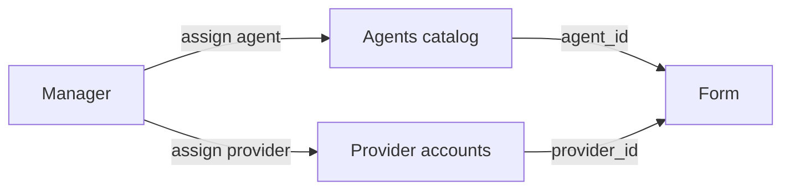

# Провайдер исполнения и агентский договор

Три запроса — три отдельных дефекта. Платёжный агент (`agent_id`, каталог «For test» / «Test») и провайдер исполнения (`provider_id`, кабинет провайдера) — разные сущности. Назначение провайдера не меняет статус: заявка остаётся в `payment_received`, поэтому кнопка снова выглядит как «выбрать второй раз».

## 1. Список провайдеров исполнения

Сейчас модалка в [vdp/fe/src/components/ved/ActionPanel.tsx](vdp/fe/src/components/ved/ActionPanel.tsx) берёт `users` из `GET /api/v1/admin/account`. Этот список только у root ([vdp/core/internal/service/account.go](vdp/core/internal/service/account.go)). У менеджера запрос пустой, и UI падает в `APP_SEED_ACCOUNTS` — остаётся «Provider Seed». Каталог `/providers` показывает агентов из `GET /api/v1/agents`; эти id для `POST /api/v1/forms/{id}/provider` невалидны ([vdp/core/internal/service/form_payment_assign.go](vdp/core/internal/service/form_payment_assign.go) требует учётку `provider` / `senior_provider`).

- Новый read-эндпоинт только для manager и root: активные учётки исполнения, поля `id` и отображаемое имя. Без email, телефона, паспорта и прочих ПДн.
- ActionPanel и подпись «Провайдер» на карточке ([vdp/fe/src/components/ved/pages/form-detail-page.tsx](vdp/fe/src/components/ved/pages/form-detail-page.tsx), сейчас `providerName` = сырой uuid в [vdp/fe/src/lib/api/mappers.ts](vdp/fe/src/lib/api/mappers.ts)) берут этот список.
- Сид в app-режиме не подставлять. Пустой список — текст «нет активных провайдеров», кнопка подтверждения недоступна.
- Подпись каталога агентов отделить от «провайдера исполнения», чтобы «For test» не читался как тот же список.

## 2. Не спрашивать назначение второй раз

Матрица в [vdp/fe/src/lib/ved/actions.ts](vdp/fe/src/lib/ved/actions.ts) всегда показывает `mgr_assign_provider` на `payment_received`. Скрывается только «Запустить исполнение», если `providerId` пуст ([vdp/fe/src/lib/ved/manager-payment.ts](vdp/fe/src/lib/ved/manager-payment.ts)).

- Хелпер: при заполненном `providerId` убрать `mgr_assign_provider` с карточки и из очереди действий.
- На карточке показать имя уже назначенного провайдера.
- Повторное назначение в эту волну не добавлять. Смена провайдера — отдельное действие позже, не тихий повтор той же кнопки.

## 3. Агентский договор один раз на организацию

Повторное использование уже есть: принятый договор организации в `contracts`, ветка `ResolveContractBranch` в [vdp/core/internal/service/contract.go](vdp/core/internal/service/contract.go) переводит следующую заявку в `signing_order`. Карточка прячет загрузку через [vdp/fe/src/lib/ved/agency-contract-ux.ts](vdp/fe/src/lib/ved/agency-contract-ux.ts).

Дыра: загрузка клиента кладёт файл только в документы заявки. Если у формы нет `contract_id`, подтверждение менеджера в [vdp/fe/src/lib/ved/manager-contract.ts](vdp/fe/src/lib/ved/manager-contract.ts) сразу шлёт поручение и не создаёт принятый договор организации. Вторая заявка той же организации снова просит договор.

- При подтверждении первой сделки без `contract_id` создать принятый агентский договор организации из уже загруженного файла и связать его с заявкой, затем поручение.
- `user_upload_contract` отклонять политикой, если у организации уже есть принятый агентский или субагентский договор.
- Тот же фильтр, что на карточке, применить к очередям и «нужно действие», не только к ActionPanel.
- Возврат на исправление (`contract_waiting_correction`) по-прежнему просит файл, даже если старый договор организации accepted.

## Слои

- UI: модалка назначения, подпись на карточке, очередь, копирайт каталога агентов.
- FE: `ActionPanel`, `manager-payment`, `agency-contract-ux`, `manager-contract`, `platform-store`, маппер имени.
- Домен: запрет повторной загрузки договора; создание принятого договора при первом подтверждении. Статусы и матрица ролей не переписываются.
- API: узкий список провайдеров исполнения; существующий `POST …/provider` без смены контракта id.
- Unit: Go (список, AuthZ чужой роли, отказ повторной загрузки, создание договора при confirm) и FE (скрытие CTA, пустой список без сида, план confirm без `contract_id`).
- E2E: после назначения кнопка скрыта и в списке не сид; вторая заявка той же организации не показывает «Загрузить агентский договор». Жест filechooser не ослаблять.
- Локальный repro: карточка менеджера на localhost, две заявки одной организации.

## Сверка с rules

Обязательны: `планирование-сверка-с-rules`, `use-cases`, `безопасность-ролей-и-данных` (AuthZ на сервисе, провайдер без ПДн клиента, список без почты), `границы-и-контексты` (агент ≠ провайдер), `ui-web-практики` и `ux-*` (один primary, следующий шаг, не два одинаковых выбора), `fe-interaction-contracts` и `playwright-e2e` если трогаем загрузку договора, `go-testing`, `тесты-архитектуры`, `честность-готовности`, `vdp-ci-local-gate`.

Вне scope: смена статусной машины, переназначение провайдера, ML, serverless, документация, Telegram-отбивка, `compose-fe-refresh` (зависимости фронта не меняются).

## DoD

1. `make -C vdp check-env-parity` до прогонов.
2. Unit Go и FE по пунктам выше зелёные.
3. Целевой gate: `make -C vdp ci-pr-pilot` — затронуты ActionPanel, form-payment и `vdp/fe/e2e/**`. `ci-pr` без pilot не считать паритетом.
4. Живой repro на localhost: менеджер видит реальных провайдеров, после назначения кнопки нет, вторая заявка организации не просит агентский договор.
