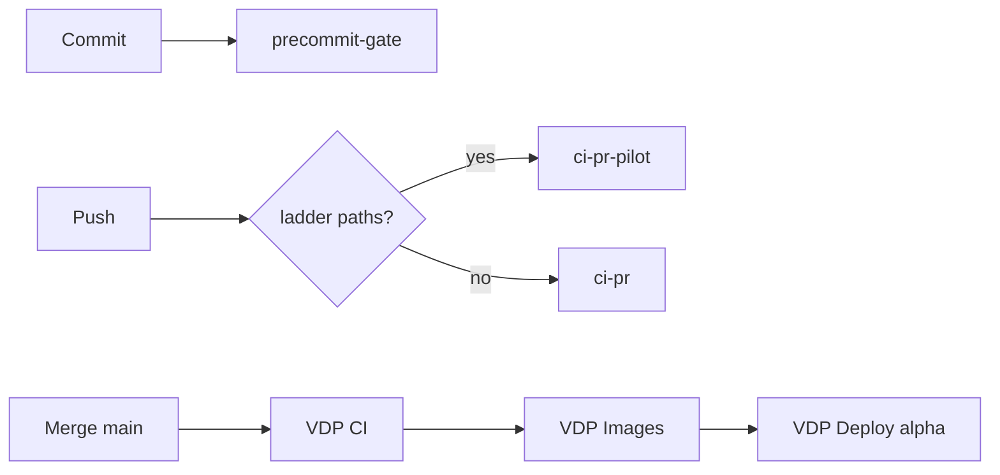

# Выравнивание Local QG + hooks и свежий alpha

## Контекст

После merge PR #39 (`b088784`) на GitHub: **VDP CI** и **VDP Images** красные, **VDP Deploy** skip → alpha на старом FE (`name@company.com`), хотя в `main` уже `ваша @ почта` ([`vdp/fe/src/routes/login.tsx`](vdp/fe/src/routes/login.tsx)).

Local QG и хуки сейчас **не врут**, но **не выровнены по смыслу с GitHub**:
- Commit / [`.githooks/pre-commit`](.githooks/pre-commit) → только `precommit-gate`
- Push / [`.githooks/pre-push`](.githooks/pre-push) → только TG notify, **без gate**
- Local QG «Лестница» → `ci-pr-pilot`, но **не связана с Push**

## Решение (зафиксировано)

- **pre-commit** — без расширения (короткий слой).
- **pre-push** — **жёсткий блок**: тот же path-filter, что [`detect-pilot-matrix` в `vdp-ci.yml`](.github/workflows/vdp-ci.yml) → `make ci-pr-pilot`, иначе `make ci-pr`. Аварийный обход только `SKIP_PREPUSH_GATE=1` (явно в копирайте Local QG и комментарии хука).
- **Local QG** — копирайт/кнопки совпадают с хуками; новый блок «До alpha» = **диагностика** (статус Actions + живая проверка login на alpha), **не** тихий auto-deploy из canvas.
- **Свежий билд alpha** — волна 0 (починить CI → зелёные Images/Deploy или ручной promote), до доработок QG-кода.

## Rules (сверка)

**Обязательны:** `планирование-сверка-с-rules`, `vdp-ci-local-gate`, `честность-готовности`, `mgmt-tg-notify`, `базовые-правила-инструмента`, `правила-построения`.

**Вне scope этой работы:** продуктовые фичи заявок/API-contract, ML, k8s, усиление gamma/beta policy, `compose-fe-refresh` без явного «да».

**Gate/DoD:** `make check-env-parity` → unit/скрипты хуков → `make test-cd-scripts` (контракты CD) → после правок canvas/hooks — `make precommit-gate`; утверждение «alpha свежий» только после живого repro login; «CI ok» для QG-волны — минимум `make ci-pr-fast` (+ `ci-pr` если трогали e2e-триггеры; hooks сами по себе не требуют pilot).

---

## Волна 0 — свежий билд на alpha (сначала)

1. Открыть failed job **VDP CI #111** (merge `b088784`), зафиксировать падающий шаг.
2. Починить причину в коде/конфиге (тот же SHA или follow-up commit в `d2` → PR → `main`).
3. Дождаться зелёных **VDP CI → VDP Images → VDP Deploy** на `main` (alpha `on_ready`). Если Images зелёный, а Deploy skip/fail — ручной **VDP Deploy** / `make deploy-alpha` с pin.
4. **DoD alpha:** живой браузер `https://alpha.vedy.io/login` → placeholder `ваша @ почта`; при закрытии волны — `notify-mgmt` (kind `promote`/`done` без IDE-жаргона).

Без зелёного CI свежий alpha **невозможен** — это не баг Local QG.

---

## Волна 1 — выровнять hooks + Local QG

### Слои

| Слой | Изменения |
|---|---|
| Hooks | [`.githooks/pre-push`](.githooks/pre-push): вызов нового скрипта gate; TG notify оставить после успешного gate (или в конце при зелёном) |
| Scripts | Новый [`vdp/scripts/prepush-gate.sh`](vdp/scripts/prepush-gate.sh): diff vs `@{upstream}` / `origin/main`, regex как в CI, выбор `ci-pr-pilot` / `ci-pr`; `SKIP_PREPUSH_GATE=1` → warn + exit 0 |
| Makefile | Цель `prepush-gate`; `install-git-hooks` chmod + echo про pre-push |
| Local QG UI | [`local-qg.canvas.tsx`](local-qg.canvas.tsx): Callout — Commit = короткий, **Push = gate**; секция «Перед Push» с кнопками, зеркалящими хук; новая секция «До alpha» — prompt: `gh` статусы CI/Images/Deploy на `main` + curl/браузер alpha login; честно писать, что Deploy не локальный make без secrets |
| Tests | Расширить [`vdp/scripts/test-cd-scripts.sh`](vdp/scripts/test-cd-scripts.sh): наличие prepush-gate, hooksPath docs, regex-паритет с `vdp-ci.yml` (или общий файл списка путей, один источник) |
| Docs | Коротко в development how-to / комментарии canvas — **не** ops rich-markdown; при необходимости одна строка в существующем local-qg/deploy secrets note |

### Паритет path-filter (MUST)

Не дублировать regex в трёх местах руками навсегда: вынести список/паттерн в один файл (например `vdp/scripts/pilot-matrix-paths.grep` или маленький helper), который читают и CI job, и `prepush-gate.sh`. Обновить [`vdp-ci.yml`](.github/workflows/vdp-ci.yml) `detect-pilot-matrix` на этот источник.

### DoD волны 1

- Push без `SKIP_…` гоняет `ci-pr` или `ci-pr-pilot` по путям.
- Local QG копирайт совпадает с хуками; кнопка «До alpha» объясняет красный CI/skip Deploy простым языком.
- `make test-cd-scripts` зелёный; `make check-env-parity` + `precommit-gate` зелёные.
- Не утверждать «полная гарантия до alpha» — только «паритет PR-gate на push» + «диагностика цепочки до alpha».

---

## Вне scope / потом

Доработки продукта (api_contract и т.д.) — **после** закрытия волн 0–1.

## Порядок исполнения

1. Волна 0 (CI → Images → Deploy → repro alpha).
2. Волна 1 (shared path-filter → prepush-gate → hooks → Local QG → test-cd-scripts).
3. Только затем — другие фичи.
