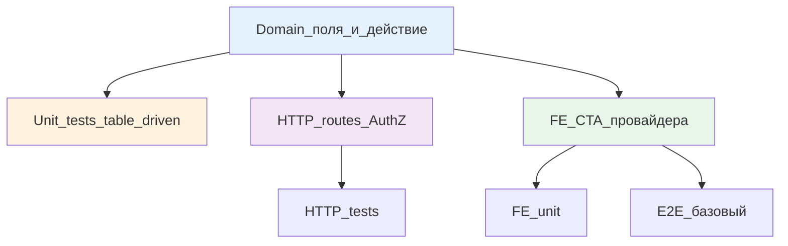

# Этап 1: Факт возврата у менеджера

## Цель

Провайдер после исполнения платежа нажимает «Сообщить о возврате» (сумма обязательна, причина опционально) → заявка попадает к менеджеру с фактом и суммой. Три решения менеджера (уточнить / вернуть клиенту / повторить) ещё **не реализованы** — мёртвых кнопок нет.

## Контекст

После этапа 0 зафиксирована граница: новый контур не смешивается с пилотным refund (Phase 7). Префиксы действий `prov_return_*`, `mgr_return_*`, `client_return_*`. Поля `FundsHeld`/`FundsRefunded` не переиспользуем.

Текущие статусы импорта, где возможен вход:
- `payment_sent` (провайдер исполнил, приложил платёжку)
- `report_waiting`, `report_accepted` (отчёт)
- `completed` (акт подписан)
- Другие статусы после исполнения — проверить в [`vdp/core/internal/domain/formpayment/transitions.go`](vdp/core/internal/domain/formpayment/transitions.go)

**Не входят:** `payment_processing` (ещё не исполнил), `draft`, `form_waiting_*`, экспорт.

## Сверка с rules

Обязательны:
- [`планирование-сверка-с-rules`](.cursor/rules/планирование-сверка-с-rules.mdc): слои (domain, unit, HTTP, FE, E2E) с первой версии; QG в DoD
- [`use-cases`](.cursor/rules/use-cases.mdc): один use case = `prov_return_report`
- [`чистая-архитектура`](.cursor/rules/чистая-архитектура.mdc): политика в домене, UI проекция
- [`solid`](.cursor/rules/solid.mdc): одна причина менять; ISP — провайдер без ПДн клиента
- [`безопасность-ролей-и-данных`](.cursor/rules/безопасность-ролей-и-данных.mdc): AuthZ на сервисе; провайдер не видит ПДн клиента
- [`интеграция-и-события`](.cursor/rules/интеграция-и-события.mdc): идемпотентность повтора; статус в домене
- [`границы-и-контексты`](.cursor/rules/границы-и-контексты.mdc): новые поля, не пилотный refund
- [`тесты-архитектуры`](.cursor/rules/тесты-архитектуры.mdc): пирамида — unit много, E2E узкий
- [`go-testing`](.cursor/rules/go-testing.mdc): table-driven unit
- [`честность-готовности`](.cursor/rules/честность-готовности.mdc): не «100% готово» без зелёного gate
- [`vdp-ci-local-gate`](.cursor/rules/vdp-ci-local-gate.mdc): `ci-pr-pilot`, не `ci-pr`
- [`алгоритмы-и-сложность`](.cursor/rules/алгоритмы-и-сложность.mdc): сумма и валюта string/decimal, не float

Вне scope: экспорт, казначей, ML, FaaS, новая заявка, три решения менеджера (этапы 2-4).

## Слои



### Domain

Файл: [`vdp/core/internal/domain/formpayment/`](vdp/core/internal/domain/formpayment/) (новый файл, не `refund.go`).

**Поля на `Form`:**
```go
// ReturnEpisode tracks provider-initiated return after execution (§новый контур).
type ReturnEpisode struct {
    Active           bool      `json:"active,omitempty"`
    ReportedAmount   string    `json:"reported_amount,omitempty"`   // неизменяемая
    ReportedCurrency string    `json:"reported_currency,omitempty"` // неизменяемая
    Reason           string    `json:"reason,omitempty"`
    ReportedBy       string    `json:"reported_by,omitempty"`       // provider user_id
    ReportedAt       time.Time `json:"reported_at,omitempty"`
    // Поля для этапов 2-4 добавятся позже
}
```

**Действие:**
- Имя: `ActionProvReturnReport` (или `prov_return_report`)
- Вход: `Status` после исполнения (`payment_sent`, `report_*`, `completed`)
- Guard:
  - `Direction == DirectionImport`
  - `ReturnEpisode.Active == false` (второй старт — отказ)
  - Провайдер назначен (`Provider != nil`, `form.ProviderID == actor.OrgID`)
  - Платёжка провайдера уже есть (проверка на `ProviderPaymentFileID` или статус после `payment_sent`)
- Переход: `Status → return_reported` (или остаётся прежним + флаг `ReturnEpisode.Active = true`)
- Идемпотентность: повтор с теми же `amount`, `currency` → нет второго эпизода

**Validation:**
```go
func (f Form) ValidateReturnReport(amount, currency string, actorRole Role, actorOrgID string) error {
    if f.Direction != DirectionImport {
        return ErrExportNotSupported
    }
    if f.ReturnEpisode.Active {
        return ErrReturnAlreadyActive
    }
    if actorRole != RoleProvider || f.ProviderID != actorOrgID {
        return ErrNotAssignedProvider
    }
    if f.Status не в {payment_sent, report_*, completed} {
        return ErrReturnNotYetExecuted
    }
    if amount == "" {
        return ErrAmountRequired
    }
    // currency, если пусто, берём из f.Currency
    return nil
}
```

**Transitions:**
Добавить в [`transitions.go`](vdp/core/internal/domain/formpayment/transitions.go):
```go
// После payment_sent / report_accepted / completed можно в return_reported (или флаг Active)
```

### Unit tests

Файл: `vdp/core/internal/domain/formpayment/return_episode_test.go`

Table-driven:
```go
func TestProvReturnReport(t *testing.T) {
    tests := []struct{
        name string
        form Form
        actor Actor
        amount, currency, reason string
        wantErr bool
        errCode string
    }{
        {"happy path import payment_sent", Form{...}, Actor{...}, "1000", "USD", "chargeback", false, ""},
        {"export denied", Form{Direction: DirectionExport, Status: StatusPaymentSent}, ..., true, "export_not_supported"},
        {"before execution denied", Form{Status: StatusPaymentProcessing}, ..., true, "not_yet_executed"},
        {"second active denied", Form{ReturnEpisode: ReturnEpisode{Active: true}}, ..., true, "already_active"},
        {"not assigned provider", Form{ProviderID: "other"}, Actor{OrgID: "myprov"}, ..., true, "not_assigned"},
        {"idempotent repeat same amount", ..., // тот же эпизод, не второй
    }
    // ...
}
```

Покрытие:
- До исполнения → отказ
- Экспорт → отказ
- Второй активный → отказ
- Чужой провайдер → 403
- Идемпотентный повтор (те же параметры) → один эпизод

### HTTP

Routes: [`vdp/core/internal/transport/http/`](vdp/core/internal/transport/http/)

**Endpoint:**
```
POST /api/v1/forms/:id/return/report
Body: { "amount": "1000.00", "currency": "USD", "reason": "chargeback" }
Role: Provider
```

**Handler:**
```go
func (h *Handler) ProvReturnReport(c *gin.Context) {
    formID := c.Param("id")
    var req struct {
        Amount   string `json:"amount" binding:"required"`
        Currency string `json:"currency"`
        Reason   string `json:"reason"`
    }
    // bind, load form, ValidateReturnReport, apply action, save
    // return 200 + updated form (без ПДн клиента для провайдера)
}
```

**AuthZ:**
- `RequireProvider` middleware
- Сверка `form.ProviderID == actor.OrgID`

### HTTP tests

Файл: `vdp/core/internal/transport/http/r8_return_test.go` (или продолжить нумерацию)

```go
func TestProvReturnReport_AuthZ(t *testing.T) {
    // user → 403
    // manager → 403
    // provider not assigned → 403
    // provider assigned → 200
}

func TestProvReturnReport_Guards(t *testing.T) {
    // export → 409
    // draft → 409
    // second active → 409
}
```

### FE

Провайдер: [`vdp/fe/src/components/ved/`](vdp/fe/src/components/ved/)

**CTA провайдера:**
Компонент `ProviderReturnReportPanel.tsx` или добавить в существующий `ActionPanel`:
- Видимость: роль `provider`, статус после `payment_sent`, `!returnEpisode?.active`
- Форма: поле Amount (обязательно, number input), Currency (автозаполнение из формы, можно сменить), Reason (опционально, textarea)
- Primary CTA: «Сообщить о возврате»
- Валидация: amount > 0; без суммы кнопка disabled

**Блок факта у менеджера:**
Компонент `ManagerReturnFactPanel.tsx`:
- Видимость: роль `manager`, `returnEpisode?.active === true`
- Показать: сумма, валюта, причина (если есть), кто и когда сообщил
- **Без кнопок** «Уточнить / Вернуть клиенту / Повторить» (этапы 2-4)
- Копирайт: «Провайдер сообщил о возврате средств. Выберите действие.» (но действий пока нет — placeholder «Ожидает реализации этапов 2-4»)

**API:**
Файл: `vdp/fe/src/lib/api/return.ts`
```ts
export async function provReturnReport(formId: string, data: { amount: string; currency: string; reason?: string }) {
  return apiClient.post(`/forms/${formId}/return/report`, data);
}
```

**Store:**
Файл: `vdp/fe/src/lib/ved/platform-store.ts`
```ts
provReturnReport: async (formId: string, data: ...) => {
  const result = await provReturnReport(formId, data);
  // refresh form
}
```

### FE unit

Файл: `vdp/fe/src/lib/ved/provider-return.test.ts`

```ts
describe('Provider return report', () => {
  it('shows CTA when provider, after execution, not active', () => {
    // role=provider, status=payment_sent, returnEpisode.active=false
    // expect button visible
  });
  it('hides CTA when already active', () => {
    // returnEpisode.active=true
    // expect button hidden
  });
  it('manager sees fact without decision buttons', () => {
    // role=manager, returnEpisode.active=true
    // expect fact panel visible, no clarify/return/repeat buttons
  });
});
```

### E2E

Файл: `vdp/fe/e2e/return-episode-basic.spec.ts` (или добавить в pilot-matrix)

```ts
test('provider reports return → manager sees fact', async ({ page, login }) => {
  // seed: форма payment_sent, провайдер назначен
  await login('provider');
  await page.goto('/forms/:id');
  await page.getByRole('button', { name: /сообщить о возврате/i }).click();
  await page.getByLabel(/сумма/i).fill('1000');
  await page.getByRole('button', { name: /отправить/i }).click();
  
  await login('manager');
  await page.goto('/forms/:id');
  await expect(page.getByText(/провайдер сообщил/i)).toBeVisible();
  await expect(page.getByText('1000')).toBeVisible();
  // три кнопки решения не проверяем (этапы 2-4)
});
```

Жест файла на этом этапе не нужен.

## Регресс

**Обязательно зелёный:**
- [`vdp/fe/e2e/pilot-matrix-refund.spec.ts`](vdp/fe/e2e/pilot-matrix-refund.spec.ts) (пилотный refund удержанных средств)
- Другие pilot-matrix specs

Новый код не должен ломать Phase 7.

## DoD

1. **Domain:**
   - Поля `ReturnEpisode` на `Form`
   - Действие `prov_return_report` с guards (экспорт, второй активный, до исполнения)
   - Идемпотентность повтора

2. **Unit:**
   - Table-driven тесты на отказы (экспорт, до исполнения, второй активный, чужой провайдер)
   - Идемпотентный повтор → один эпизод
   - Покрытие ≥80% нового кода

3. **HTTP:**
   - `POST /forms/:id/return/report` с AuthZ
   - HTTP тесты на 403 (user, manager, not assigned provider)
   - HTTP тесты на 409 (export, draft, second active)

4. **FE:**
   - Провайдер: CTA «Сообщить о возврате» (видимость, форма, validation)
   - Менеджер: блок факта (сумма, причина, кто/когда), **без трёх кнопок**
   - FE unit: провайдер видит / не видит; менеджер видит факт без кнопок

5. **E2E:**
   - Базовый сценарий: провайдер сообщает → менеджер видит сумму
   - Не дублировать все unit-кейсы в браузере

6. **Gate:**
   - Из `vdp/`: `make check-env-parity` (первым)
   - Затем `make ci-pr-pilot` зелёный
   - Не утверждать готовность при красном gate
   - `pilot-matrix-refund.spec.ts` регресс зелёный

7. **Не заявлять:**
   - Три решения менеджера (этапы 2-4)
   - Сквозные маршруты (этап 5)
   - `release-gate`

## Следующие этапы

После закрытия этапа 1:
- **Этап 2:** Уточнить у клиента (промежуточный круг)
- **Этап 3:** Вернуть клиенту (курс → письмо → рубли)
- **Этап 4:** Повторить платёж (комментарий → новое исполнение)

Этапы 2-4 строго последовательны (общие поля на заявке).
