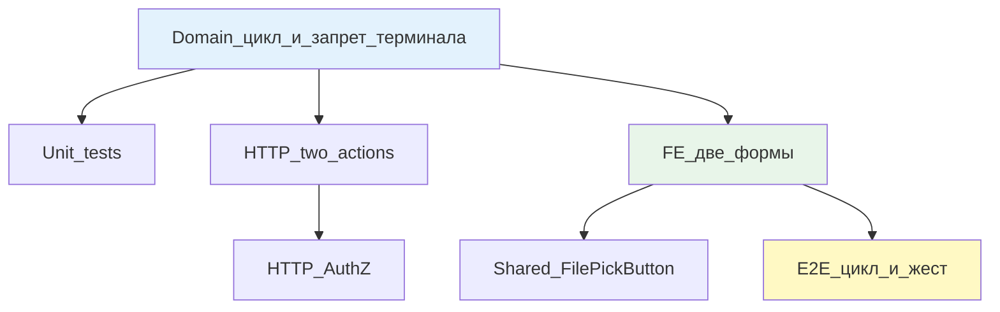

# Этап 2: Уточнить у клиента

## Цель

Менеджер выбирает «Уточнить у клиента» (текст обязателен, документ опционально) → клиент отвечает (текст обязателен, документ опционально) → заявка возвращается менеджеру в **ту же точку решения**. Эпизод не закрывается. Три финальные ветки (вернуть клиенту / повторить платёж) остаются доступны после ответа.

## Контекст

После этапа 1: провайдер сообщил факт → менеджер видит сумму. Три решения менеджера ещё не реализованы. Этап 2 добавляет **промежуточный круг**, не терминал.

Уточнение — **не** самостоятельная ветка завершения. Это способ получить от клиента дополнительную информацию до того, как менеджер выберет финальное решение (вернуть или повторить).

## Сверка с rules

Обязательны:
- [`планирование-сверка-с-rules`](.cursor/rules/планирование-сверка-с-rules.mdc): слои + QG
- [`use-cases`](.cursor/rules/use-cases.mdc): два use case (менеджер спросил, клиент ответил)
- [`чистая-архитектура`](.cursor/rules/чистая-архитектура.mdc): цикл в домене
- [`solid`](.cursor/rules/solid.mdc): клиент не выбирает ветку = ISP
- [`безопасность-ролей-и-данных`](.cursor/rules/безопасность-ролей-и-данных.mdc): AuthZ, провайдер не видит переписку
- [`интеграция-и-события`](.cursor/rules/интеграция-и-события.mdc): статус в домене
- [`границы-и-контексты`](.cursor/rules/границы-и-контексты.mdc): поля уточнения на ReturnEpisode
- [`тесты-архитектуры`](.cursor/rules/тесты-архитектуры.mdc): unit + узкий E2E
- [`go-testing`](.cursor/rules/go-testing.mdc): table-driven
- [`честность-готовности`](.cursor/rules/честность-готовности.mdc): не готово без gate
- [`vdp-ci-local-gate`](.cursor/rules/vdp-ci-local-gate.mdc): `ci-pr-pilot`
- [`ui-web-практики`](.cursor/rules/ui-web-практики.mdc): форма с лейблами
- [`ux-формы-навигация-онбординг`](.cursor/rules/ux-формы-навигация-онбординг.mdc): Postel, ошибки ясные
- [`fe-interaction-contracts`](.cursor/rules/fe-interaction-contracts.mdc): файлы через `FilePickButton`
- [`playwright-e2e`](.cursor/rules/playwright-e2e.mdc): жест `filechooser`

Вне scope: три финальные ветки (этапы 3-4), казначей, провайдер в этом круге, экспорт.

## Слои



### Domain

Расширить `ReturnEpisode` в [`vdp/core/internal/domain/formpayment/`](vdp/core/internal/domain/formpayment/):

```go
type ReturnEpisode struct {
    Active           bool
    ReportedAmount   string
    ReportedCurrency string
    Reason           string
    ReportedBy       string
    ReportedAt       time.Time
    
    // Clarify fields
    ClarifyQuestion    string    `json:"clarify_question,omitempty"`
    ClarifyFileID      string    `json:"clarify_file_id,omitempty"`
    ClarifyAskedAt     time.Time `json:"clarify_asked_at,omitempty"`
    ClarifyAskedBy     string    `json:"clarify_asked_by,omitempty"`
    
    ClarifyAnswer      string    `json:"clarify_answer,omitempty"`
    ClarifyAnswerFileID string   `json:"clarify_answer_file_id,omitempty"`
    ClarifyAnsweredAt  time.Time `json:"clarify_answered_at,omitempty"`
    ClarifyAnsweredBy  string    `json:"clarify_answered_by,omitempty"`
    
    // Счётчик кругов (опционально, для истории)
    ClarifyCycleCount  int       `json:"clarify_cycle_count,omitempty"`
}
```

**Действия:**

1. `mgr_return_clarify` (менеджер):
   - Вход: `returnEpisode.Active == true`, менеджер в точке решения
   - Guard: текст вопроса не пустой
   - Эффект: записать вопрос, файл (если есть), timestamp, actorID → статус `mgr_return_awaiting_client_clarify`
   - Счётчик кругов +1

2. `client_return_clarify_reply` (клиент):
   - Вход: статус `mgr_return_awaiting_client_clarify`
   - Guard: текст ответа не пустой
   - Эффект: записать ответ, файл (если есть), timestamp, actorID → статус `mgr_return_decision` (снова менеджер выбирает)
   - **Не закрывает эпизод:** `Active` остаётся `true`

**Guard запрета терминала:**
Попытка закрыть эпизод из `mgr_return_awaiting_client_clarify` без перехода в финальные ветки → отказ `ErrClarifyNotTerminal`.

**Идемпотентность:**
Повтор команды уточнения с теми же параметрами → обновить timestamp, не создать второй круг.

### Unit tests

Файл: `vdp/core/internal/domain/formpayment/return_clarify_test.go`

```go
func TestMgrReturnClarify(t *testing.T) {
    tests := []struct{
        name string
        form Form
        actor Actor
        question, fileID string
        wantErr bool
    }{
        {"happy path", Form{ReturnEpisode: ReturnEpisode{Active: true}}, Actor{Role: RoleManager}, "Need invoice", "file123", false},
        {"empty question denied", ..., "", "", true},
        {"client cannot clarify", ..., Actor{Role: RoleClient}, ..., true}, // клиент не может задать вопрос
        {"provider cannot see clarify", ..., Actor{Role: RoleProvider}, ..., true}, // провайдер не участвует
    }
}

func TestClientReturnClarifyReply(t *testing.T) {
    tests := []struct{
        name string
        form Form
        actor Actor
        answer, fileID string
        wantErr bool
    }{
        {"happy path", Form{Status: StatusMgrReturnAwaitingClientClarify}, Actor{Role: RoleClient}, "Here is invoice", "file456", false},
        {"empty answer denied", ..., "", "", true},
        {"manager cannot reply as client", ..., Actor{Role: RoleManager}, ..., true},
        {"after reply not terminal", ..., // проверить, что Active=true, эпизод жив
    }
}

func TestClarifyNotTerminal(t *testing.T) {
    // Попытка закрыть эпизод из awaiting_client_clarify → 409
}
```

### HTTP

Routes: [`vdp/core/internal/transport/http/`](vdp/core/internal/transport/http/)

**Endpoints:**

1. `POST /api/v1/forms/:id/return/clarify` (менеджер)
   ```json
   {
     "question": "Please provide invoice",
     "file_id": "optional_file_id"
   }
   ```
   Role: Manager
   Response: 200 + updated form

2. `POST /api/v1/forms/:id/return/clarify-reply` (клиент)
   ```json
   {
     "answer": "Here is the invoice",
     "file_id": "optional_file_id"
   }
   ```
   Role: Client (user, organization owner)
   Response: 200 + updated form

**AuthZ:**
- `RequireManager` для `/clarify`
- `RequireClient` для `/clarify-reply` + `form.UserID == actor.UserID` или organization match

### HTTP tests

Файл: `vdp/core/internal/transport/http/r8_return_clarify_test.go`

```go
func TestReturnClarify_AuthZ(t *testing.T) {
    // client → POST /clarify → 403
    // manager → POST /clarify-reply → 403
    // provider → both → 403
    // manager → POST /clarify → 200
    // client → POST /clarify-reply → 200
}

func TestReturnClarify_Validation(t *testing.T) {
    // empty question → 400
    // empty answer → 400
}

func TestReturnClarify_Cycle(t *testing.T) {
    // manager clarify → client reply → manager sees decision point again
}
```

### FE

Файлы: [`vdp/fe/src/components/ved/`](vdp/fe/src/components/ved/)

**Форма менеджера: `ManagerReturnClarifyForm.tsx`**
- Видимость: роль `manager`, `returnEpisode.active === true`, статус `mgr_return_decision`
- Поля:
  - Текст вопроса (textarea, обязательно)
  - Файл (опционально, через `FilePickButton`)
- Primary CTA: «Отправить вопрос клиенту»
- Валидация: текст не пустой; без текста кнопка disabled

**Форма клиента: `ClientReturnClarifyReplyForm.tsx`**
- Видимость: роль `client`, статус `mgr_return_awaiting_client_clarify`
- Показать вопрос менеджера (текст + файл если есть)
- Поля:
  - Текст ответа (textarea, обязательно)
  - Файл (опционально, через `FilePickButton`)
- Primary CTA: «Отправить ответ»
- Валидация: текст не пустой

**Shared `FilePickButton`:**
По [`fe-interaction-contracts`](.cursor/rules/fe-interaction-contracts.mdc):
- Использовать [`vdp/fe/src/components/ved/file-pick-button.tsx`](vdp/fe/src/components/ved/file-pick-button.tsx)
- `testid`-контракт: `${testId}`, `${testId}-zone`, `${testId}-button`
- Клик по зоне → `filechooser`, не только `setInputFiles` на hidden input

**API:**
Файл: `vdp/fe/src/lib/api/return.ts`
```ts
export async function mgrReturnClarify(formId: string, data: { question: string; file_id?: string }) {
  return apiClient.post(`/forms/${formId}/return/clarify`, data);
}

export async function clientReturnClarifyReply(formId: string, data: { answer: string; file_id?: string }) {
  return apiClient.post(`/forms/${formId}/return/clarify-reply`, data);
}
```

### FE unit

Файл: `vdp/fe/src/lib/ved/return-clarify.test.ts`

```ts
describe('Return clarify cycle', () => {
  it('manager sees clarify button at decision point', () => {
    // role=manager, returnEpisode.active=true, status=mgr_return_decision
    // expect button visible
  });
  it('client sees question and reply form', () => {
    // role=client, status=mgr_return_awaiting_client_clarify
    // expect question text + reply form
  });
  it('after reply manager back to decision', () => {
    // simulate reply → expect status=mgr_return_decision, active=true
  });
});
```

### E2E

Файл: `vdp/fe/e2e/return-episode-clarify.spec.ts`

```ts
test('manager clarify → client reply → manager decision', async ({ page, login }) => {
  // seed: returnEpisode.active=true, status=mgr_return_decision
  
  await login('manager');
  await page.goto('/forms/:id');
  await page.getByRole('button', { name: /уточнить у клиента/i }).click();
  await page.getByLabel(/вопрос/i).fill('Please provide invoice');
  
  // Жест файла (optional, если добавляем)
  const [fileChooser] = await Promise.all([
    page.waitForEvent('filechooser'),
    page.getByTestId('clarify-file-zone').click()
  ]);
  await fileChooser.setFiles('test-invoice.pdf');
  
  await page.getByRole('button', { name: /отправить/i }).click();
  
  await login('client');
  await page.goto('/forms/:id');
  await expect(page.getByText(/please provide invoice/i)).toBeVisible();
  await page.getByLabel(/ответ/i).fill('Here is the invoice');
  await page.getByRole('button', { name: /отправить/i }).click();
  
  await login('manager');
  await page.goto('/forms/:id');
  await expect(page.getByText(/here is the invoice/i)).toBeVisible();
  // Менеджер снова в точке решения (видит факт + три кнопки, когда они появятся в этапах 3-4)
});
```

**Жест `filechooser`:**
По [`playwright-e2e`](.cursor/rules/playwright-e2e.mdc):
- `page.waitForEvent('filechooser')` + клик по зоне
- Не только `setInputFiles` на hidden input

## Регресс

**Обязательно зелёный:**
- [`vdp/fe/e2e/pilot-matrix-refund.spec.ts`](vdp/fe/e2e/pilot-matrix-refund.spec.ts)
- E2E этапа 1 (провайдер сообщает факт)

## DoD

1. **Domain:**
   - Поля уточнения на `ReturnEpisode`
   - Два действия: `mgr_return_clarify`, `client_return_clarify_reply`
   - Guard: уточнение не закрывает эпизод (не терминал)
   - Счётчик кругов (опционально)

2. **Unit:**
   - Table-driven на клиент не может clarify, менеджер не может reply as client
   - Уточнение не терминал → 409 при попытке закрыть
   - Покрытие ≥80%

3. **HTTP:**
   - Два endpoint'а + AuthZ
   - HTTP тесты на 403 (wrong role)
   - HTTP тесты на 400 (empty question/answer)

4. **FE:**
   - Форма менеджера (вопрос + файл)
   - Форма клиента (ответ + файл)
   - Использовать shared `FilePickButton`
   - FE unit: видимость форм по роли и статусу

5. **E2E:**
   - Цикл менеджер → клиент → менеджер
   - Жест файла через `filechooser`, не только `setInputFiles`
   - После ответа менеджер в точке решения, эпизод жив

6. **Gate:**
   - `make check-env-parity` (первым)
   - `make ci-pr-pilot` зелёный
   - Регресс pilot-matrix + этап 1 зелёный

7. **Не заявлять:**
   - Финальные ветки (этапы 3-4)
   - Сквозные маршруты (этап 5)

## Следующие этапы

После закрытия этапа 2:
- **Этап 3:** Вернуть клиенту (параллельно невозможен с 4)
- **Этап 4:** Повторить платёж (параллельно невозможен с 3)

Этапы 3 и 4 строго последовательны (общие поля).
