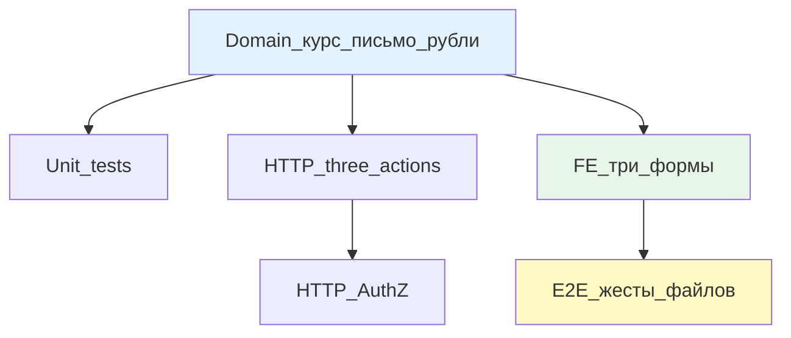

# Этап 3: Вернуть клиенту

## Цель

Менеджер выбирает «Вернуть клиенту» → выставляет курс → клиент получает сумму и курс → клиент либо прикладывает письмо-согласие, либо отказывает с причиной → если согласие, менеджер прикладывает рублёвую платёжку → эпизод закрыт. Подтверждения «клиент получил рубли» нет.

Курс можно менять и отправлять клиенту снова без лимита в системе. Предыдущие курсы остаются в истории.

## Контекст

После этапов 1-2: провайдер сообщил → менеджер в точке решения (может уточнить у клиента или выбрать финальную ветку).

Этап 3 реализует одну из двух финальных веток. Этап 4 (повторить платёж) — параллельно невозможен (общие поля на заявке).

По ответам заказчика:
- Письмо-согласие остаётся обязательным
- Подтверждение получения рублей снято
- Курс не float (string/decimal)
- Казначей не участвует

## Сверка с rules

Обязательны:
- [`планирование-сверка-с-rules`](.cursor/rules/планирование-сверка-с-rules.mdc): слои + QG
- [`use-cases`](.cursor/rules/use-cases.mdc): три use case (rate, consent, execute)
- [`чистая-архитектура`](.cursor/rules/чистая-архитектура.mdc): политика в домене
- [`solid`](.cursor/rules/solid.mdc): ISP — провайдер не видит письмо клиента
- [`безопасность-ролей-и-данных`](.cursor/rules/безопасность-ролей-и-данных.mdc): AuthZ, провайдер без ПДн
- [`интеграция-и-события`](.cursor/rules/интеграция-и-события.mdc): идемпотентность выплаты
- [`границы-и-контексты`](.cursor/rules/границы-и-контексты.mdc): поля на ReturnEpisode
- [`тесты-архитектуры`](.cursor/rules/тесты-архитектуры.mdc): unit + узкий E2E
- [`go-testing`](.cursor/rules/go-testing.mdc): table-driven
- [`честность-готовности`](.cursor/rules/честность-готовности.mdc): не готово без gate
- [`vdp-ci-local-gate`](.cursor/rules/vdp-ci-local-gate.mdc): `ci-pr-pilot`
- [`алгоритмы-и-сложность`](.cursor/rules/алгоритмы-и-сложность.mdc): курс не float
- [`ui-web-практики`](.cursor/rules/ui-web-практики.mdc): курс не placeholder
- [`ux-формы-навигация-онбординг`](.cursor/rules/ux-формы-навигация-онбординг.mdc): ошибка «приложите письмо»
- [`fe-interaction-contracts`](.cursor/rules/fe-interaction-contracts.mdc): файлы через `FilePickButton`
- [`playwright-e2e`](.cursor/rules/playwright-e2e.mdc): жест `filechooser`

Вне scope: казначей, подтверждение получения, частичный возврат (отдельное поле остатка), повтор платежа (этап 4).

## Слои



### Domain

Расширить `ReturnEpisode` в [`vdp/core/internal/domain/formpayment/`](vdp/core/internal/domain/formpayment/):

```go
type ReturnEpisode struct {
    // ... поля этапов 1-2
    
    // Return to client fields
    ToClientRate          string    `json:"to_client_rate,omitempty"`          // курс, не float
    ToClientRateHistory   []RateHistoryEntry `json:"to_client_rate_history,omitempty"` // история курсов
    ToClientRateSetAt     time.Time `json:"to_client_rate_set_at,omitempty"`
    ToClientRateSetBy     string    `json:"to_client_rate_set_by,omitempty"`
    
    ClientConsentFileID   string    `json:"client_consent_file_id,omitempty"`  // письмо-согласие
    ClientConsentGivenAt  time.Time `json:"client_consent_given_at,omitempty"`
    ClientConsentGivenBy  string    `json:"client_consent_given_by,omitempty"`
    
    ClientRefusalReason   string    `json:"client_refusal_reason,omitempty"`
    ClientRefusedAt       time.Time `json:"client_refused_at,omitempty"`
    
    ToClientRubPaymentFileID string    `json:"to_client_rub_payment_file_id,omitempty"` // рублёвая платёжка
    ToClientExecutedAt       time.Time `json:"to_client_executed_at,omitempty"`
    ToClientExecutedBy       string    `json:"to_client_executed_by,omitempty"`
    
    ToClientClosed        bool      `json:"to_client_closed,omitempty"`
}

type RateHistoryEntry struct {
    Rate   string    `json:"rate"`
    SetAt  time.Time `json:"set_at"`
    SetBy  string    `json:"set_by"`
}
```

**Действия:**

1. **`mgr_return_to_client_rate`** (менеджер):
   - Вход: `returnEpisode.Active == true`, статус `mgr_return_decision` или `client_return_refused`
   - Guard: rate не пустой, валидный decimal
   - Эффект: записать rate, добавить в history, timestamp → статус `client_return_consent_pending`
   - Идемпотентность: повтор с тем же rate → обновить timestamp

2. **`client_return_consent`** (клиент):
   - Вход: статус `client_return_consent_pending`
   - Guard: письмо (file_id) обязательно
   - Эффект: записать consent_file_id, timestamp → статус `mgr_return_to_client_ready_execute`

3. **`client_return_refuse`** (клиент):
   - Вход: статус `client_return_consent_pending`
   - Guard: причина отказа не пустая
   - Эффект: записать refusal_reason, timestamp → статус `mgr_return_decision` (снова менеджер может выставить курс)
   - Не закрывает эпизод: `Active` остаётся `true`

4. **`mgr_return_to_client_execute`** (менеджер):
   - Вход: статус `mgr_return_to_client_ready_execute`
   - Guard: 
     - письмо клиента есть (`ClientConsentFileID != ""`)
     - рублёвая платёжка (file_id) обязательна
   - Эффект: записать rub_payment_file_id, timestamp → `ToClientClosed = true`, `Active = false`
   - Идемпотентность: повтор → один эффект

**Guard без письма:**
Попытка `mgr_return_to_client_execute` без `ClientConsentFileID` → 409 `ErrConsentRequired`.

**История курсов:**
Не лимитируем количество. На практике обычно не больше 3 (по ответу заказчика), но в системе лимита нет.

### Unit tests

Файл: `vdp/core/internal/domain/formpayment/return_to_client_test.go`

```go
func TestMgrReturnToClientRate(t *testing.T) {
    tests := []struct{
        name string
        form Form
        rate string
        wantErr bool
    }{
        {"happy path", Form{ReturnEpisode: ReturnEpisode{Active: true}}, "75.50", false},
        {"empty rate denied", ..., "", true},
        {"invalid rate denied", ..., "abc", true},
        {"client cannot set rate", ..., Actor{Role: RoleClient}, ..., true},
        {"rate history grows", ..., // проверить history append
    }
}

func TestClientReturnConsent(t *testing.T) {
    tests := []struct{
        name string
        form Form
        fileID string
        wantErr bool
    }{
        {"happy with file", Form{Status: StatusClientReturnConsentPending}, "file123", false},
        {"no file denied", ..., "", true}, // без письма нельзя
        {"manager cannot consent as client", ..., Actor{Role: RoleManager}, ..., true},
    }
}

func TestClientReturnRefuse(t *testing.T) {
    tests := []struct{
        name string
        form Form
        reason string
        wantErr bool
    }{
        {"refuse with reason", Form{...}, "rate too low", false},
        {"empty reason denied", ..., "", true},
        {"after refusal manager can set rate again", ..., // проверить статус → mgr_return_decision
    }
}

func TestMgrReturnToClientExecute(t *testing.T) {
    tests := []struct{
        name string
        form Form
        rubFileID string
        wantErr bool
    }{
        {"happy with consent and rub file", Form{ReturnEpisode: ReturnEpisode{ClientConsentFileID: "consent123"}}, "rub456", false},
        {"no consent denied", Form{ReturnEpisode: ReturnEpisode{ClientConsentFileID: ""}}, "rub456", true}, // ErrConsentRequired
        {"no rub file denied", Form{ReturnEpisode: ReturnEpisode{ClientConsentFileID: "consent123"}}, "", true},
        {"treasurer cannot execute", ..., Actor{Role: RoleTreasurer}, ..., true}, // казначей 403
        {"provider cannot see consent", ..., // provider не читает ClientConsentFileID
        {"idempotent repeat", ..., // повтор → один эффект, не второй платёж
    }
}

func TestReturnToClientClosed(t *testing.T) {
    // После execute: ToClientClosed=true, Active=false
}
```

### HTTP

Routes: [`vdp/core/internal/transport/http/`](vdp/core/internal/transport/http/)

**Endpoints:**

1. `POST /api/v1/forms/:id/return/to-client/rate` (менеджер)
   ```json
   {
     "rate": "75.50"
   }
   ```
   Role: Manager

2. `POST /api/v1/forms/:id/return/to-client/consent` (клиент)
   ```json
   {
     "consent_file_id": "file123"
   }
   ```
   Role: Client

3. `POST /api/v1/forms/:id/return/to-client/refuse` (клиент)
   ```json
   {
     "reason": "Rate is too low"
   }
   ```
   Role: Client

4. `POST /api/v1/forms/:id/return/to-client/execute` (менеджер)
   ```json
   {
     "rub_payment_file_id": "file456"
   }
   ```
   Role: Manager

**AuthZ:**
- Manager endpoints: `RequireManager`
- Client endpoints: `RequireClient` + ownership check

### HTTP tests

Файл: `vdp/core/internal/transport/http/r8_return_to_client_test.go`

```go
func TestReturnToClient_AuthZ(t *testing.T) {
    // client → POST /rate → 403
    // manager → POST /consent → 403
    // treasurer → POST /execute → 403
    // provider → all → 403
}

func TestReturnToClient_ConsentRequired(t *testing.T) {
    // POST /execute без ClientConsentFileID → 409
}

func TestReturnToClient_Flow(t *testing.T) {
    // rate → consent → execute → closed
    // rate → refuse → rate again
}
```

### FE

Файлы: [`vdp/fe/src/components/ved/`](vdp/fe/src/components/ved/)

**Форма курса менеджера: `ManagerReturnRateForm.tsx`**
- Видимость: роль `manager`, статус `mgr_return_decision` или `client_return_refused`
- Поля:
  - Сумма возврата (read-only, из `returnEpisode.reportedAmount`)
  - Курс (input, обязательно, **не placeholder**, лейбл «Курс возврата», decimal)
  - История курсов (если есть) — показать предыдущие попытки
- Primary CTA: «Отправить клиенту»
- Валидация: курс не пустой, валидный decimal

**Форма согласия/отказа клиента: `ClientReturnConsentForm.tsx`**
- Видимость: роль `client`, статус `client_return_consent_pending`
- Показать: сумма, валюта, курс
- Два пути:
  1. Согласен: приложить письмо (обязательно, `FilePickButton`), CTA «Согласен»
  2. Не согласен: текст причины (обязательно, textarea), CTA «Отказать»
- Без письма кнопка «Согласен» disabled
- Ошибка: «Приложите письмо-согласие»

**Форма выплаты менеджера: `ManagerReturnExecuteForm.tsx`**
- Видимость: роль `manager`, статус `mgr_return_to_client_ready_execute`
- Показать: сумма, курс, письмо клиента (read-only, ссылка на файл)
- Поля:
  - Рублёвая платёжка (обязательно, `FilePickButton`)
- Primary CTA: «Выплатить»
- Валидация: файл обязателен

**API:**
Файл: `vdp/fe/src/lib/api/return.ts`
```ts
export async function mgrReturnToClientRate(formId: string, data: { rate: string }) {
  return apiClient.post(`/forms/${formId}/return/to-client/rate`, data);
}

export async function clientReturnConsent(formId: string, data: { consent_file_id: string }) {
  return apiClient.post(`/forms/${formId}/return/to-client/consent`, data);
}

export async function clientReturnRefuse(formId: string, data: { reason: string }) {
  return apiClient.post(`/forms/${formId}/return/to-client/refuse`, data);
}

export async function mgrReturnToClientExecute(formId: string, data: { rub_payment_file_id: string }) {
  return apiClient.post(`/forms/${formId}/return/to-client/execute`, data);
}
```

### FE unit

Файл: `vdp/fe/src/lib/ved/return-to-client.test.ts`

```ts
describe('Return to client flow', () => {
  it('manager sees rate form at decision', () => {
    // role=manager, status=mgr_return_decision
    // expect rate input visible
  });
  it('client sees consent form with rate', () => {
    // role=client, status=client_return_consent_pending, rate=75.50
    // expect rate displayed, consent button disabled without file
  });
  it('manager sees execute form after consent', () => {
    // role=manager, status=mgr_return_to_client_ready_execute
    // expect consent file visible, rub file required
  });
  it('after refusal manager can set rate again', () => {
    // simulate refusal → expect status=mgr_return_decision, rate form visible
  });
});
```

### E2E

Файл: `vdp/fe/e2e/return-episode-to-client.spec.ts`

```ts
test('return to client: rate → consent → execute', async ({ page, login, uploadFile }) => {
  // seed: returnEpisode.active=true, status=mgr_return_decision
  
  await login('manager');
  await page.goto('/forms/:id');
  await page.getByRole('button', { name: /вернуть клиенту/i }).click();
  await page.getByLabel(/курс/i).fill('75.50');
  await page.getByRole('button', { name: /отправить клиенту/i }).click();
  
  await login('client');
  await page.goto('/forms/:id');
  await expect(page.getByText('75.50')).toBeVisible();
  
  // Жест письма-согласия
  const [fileChooser1] = await Promise.all([
    page.waitForEvent('filechooser'),
    page.getByTestId('consent-file-zone').click()
  ]);
  await fileChooser1.setFiles('test-consent-letter.pdf');
  
  await page.getByRole('button', { name: /согласен/i }).click();
  
  await login('manager');
  await page.goto('/forms/:id');
  await expect(page.getByText(/письмо-согласие/i)).toBeVisible();
  
  // Жест рублёвой платёжки
  const [fileChooser2] = await Promise.all([
    page.waitForEvent('filechooser'),
    page.getByTestId('rub-payment-file-zone').click()
  ]);
  await fileChooser2.setFiles('test-rub-payment.pdf');
  
  await page.getByRole('button', { name: /выплатить/i }).click();
  
  await expect(page.getByText(/возврат завершён/i)).toBeVisible();
});

test('return to client: rate → refuse → rate again', async ({ page, login }) => {
  await login('manager');
  await page.goto('/forms/:id');
  await page.getByLabel(/курс/i).fill('70.00');
  await page.getByRole('button', { name: /отправить/i }).click();
  
  await login('client');
  await page.goto('/forms/:id');
  await page.getByRole('button', { name: /отказать/i }).click();
  await page.getByLabel(/причина/i).fill('Rate is too low');
  await page.getByRole('button', { name: /отправить/i }).click();
  
  await login('manager');
  await page.goto('/forms/:id');
  await expect(page.getByLabel(/курс/i)).toBeVisible(); // снова форма курса
  await page.getByLabel(/курс/i).fill('75.50');
  // ...
});
```

**Жесты файлов:**
- Письмо-согласие клиента: `filechooser` + клик по зоне
- Рублёвая платёжка менеджера: `filechooser` + клик по зоне

## Регресс

**Обязательно зелёный:**
- [`vdp/fe/e2e/pilot-matrix-refund.spec.ts`](vdp/fe/e2e/pilot-matrix-refund.spec.ts)
- E2E этапов 1-2

## DoD

1. **Domain:**
   - Поля курс, письмо, рубли на `ReturnEpisode`
   - История курсов (append, без лимита)
   - Четыре действия: rate, consent, refuse, execute
   - Guard: execute без письма → 409

2. **Unit:**
   - Table-driven на казначер 403, провайдер не видит письмо
   - Выплата без письма denied
   - Отказ → снова курс
   - Идемпотентность execute
   - Покрытие ≥80%

3. **HTTP:**
   - Четыре endpoint'а + AuthZ
   - HTTP тесты на 403, 409 (no consent)

4. **FE:**
   - Три формы: курс менеджера, согласие/отказ клиента, выплата менеджера
   - Курс не placeholder (ясный лейбл)
   - Ошибка «приложите письмо» при disabled кнопке
   - История курсов visible (если >1)

5. **E2E:**
   - Маршрут rate → consent → execute
   - Маршрут rate → refuse → rate again
   - Жесты файлов через `filechooser`

6. **Gate:**
   - `make check-env-parity` (первым)
   - `make ci-pr-pilot` зелёный
   - Регресс этапов 1-2 зелёный

7. **Не заявлять:**
   - Повтор платежа (этап 4)
   - Сквозные маршруты (этап 5)
   - Казначей в новом контуре
   - Подтверждение получения рублей

## Следующий этап

После закрытия этапа 3 → **Этап 4: Повторить платёж** (параллельно невозможен, общие поля).
