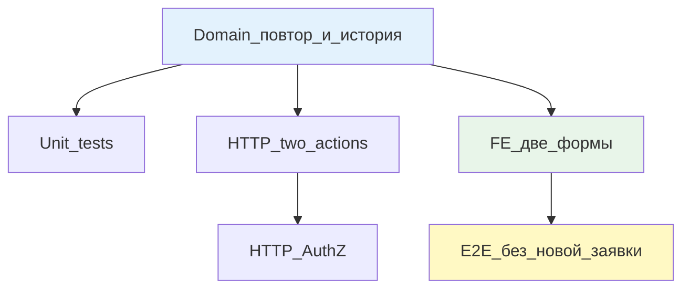

# Этап 4: Повторить платёж

## Цель

Менеджер выбирает «Повторить платёж» → оставляет обязательный комментарий (клиент не видит, видят менеджер/провайдер/внутренний доступ) → при необходимости меняет организацию провайдера или счёт → провайдер исполняет заново → старая платёжка остаётся в истории, новая добавляется. Если новый платёж снова вернулся, снова этап 1 (сообщить о возврате).

Новая заявка **не создаётся**. Документы, комплаенс, исходная оплата клиента не повторяются. Контрагент не проверяется заново (даже при смене организации провайдера).

## Контекст

После этапов 1-2: провайдер сообщил → менеджер в точке решения.

Этап 4 реализует вторую финальную ветку (альтернатива «вернуть клиенту»). После этапа 3 нельзя сразу перейти к этапу 4 — параллельно невозможны (общие поля на заявке).

По ответам заказчика:
- Комментарий обязателен; клиент не видит
- Смена организации провайдера/счёта — необязательна
- Контрагент не проверяется заново
- Повтор платежа может вернуться снова → снова этап 1

## Сверка с rules

Обязательны:
- [`планирование-сверка-с-rules`](.cursor/rules/планирование-сверка-с-rules.mdc): слои + QG
- [`use-cases`](.cursor/rules/use-cases.mdc): два use case (mgr repeat, prov execute)
- [`чистая-архитектура`](.cursor/rules/чистая-архитектура.mdc): политика в домене
- [`solid`](.cursor/rules/solid.mdc): ISP — клиент не видит комментарий
- [`безопасность-ролей-и-данных`](.cursor/rules/безопасность-ролей-и-данных.mdc): AuthZ, видимость по роли
- [`интеграция-и-события`](.cursor/rules/интеграция-и-события.mdc): идемпотентность исполнения
- [`границы-и-контексты`](.cursor/rules/границы-и-контексты.mdc): поля на ReturnEpisode, не новая форма
- [`тесты-архитектуры`](.cursor/rules/тесты-архитектуры.mdc): unit + узкий E2E
- [`go-testing`](.cursor/rules/go-testing.mdc): table-driven
- [`честность-готовности`](.cursor/rules/честность-готовности.mdc): не готово без gate
- [`vdp-ci-local-gate`](.cursor/rules/vdp-ci-local-gate.mdc): `ci-pr-pilot`
- [`ui-web-практики`](.cursor/rules/ui-web-практики.mdc): форма комментария
- [`ux-формы-навигация-онбординг`](.cursor/rules/ux-формы-навигация-онбординг.mdc): ошибка «оставьте комментарий»
- [`fe-interaction-contracts`](.cursor/rules/fe-interaction-contracts.mdc): файлы через `FilePickButton`
- [`playwright-e2e`](.cursor/rules/playwright-e2e.mdc): жест `filechooser`

Вне scope: новая заявка, повторная проверка контрагента, казначей, «вернуть клиенту» (этап 3).

## Слои



### Domain

Расширить `ReturnEpisode` в [`vdp/core/internal/domain/formpayment/`](vdp/core/internal/domain/formpayment/):

```go
type ReturnEpisode struct {
    // ... поля этапов 1-3
    
    // Repeat payment fields
    RepeatComment            string    `json:"repeat_comment,omitempty"`          // обязателен
    RepeatInitiatedAt        time.Time `json:"repeat_initiated_at,omitempty"`
    RepeatInitiatedBy        string    `json:"repeat_initiated_by,omitempty"`
    
    RepeatProviderOrgChanged bool      `json:"repeat_provider_org_changed,omitempty"` // факт смены
    RepeatNewProviderOrgID   string    `json:"repeat_new_provider_org_id,omitempty"`
    RepeatNewAccountID       string    `json:"repeat_new_account_id,omitempty"`
    
    RepeatExecutedAt         time.Time `json:"repeat_executed_at,omitempty"`
    RepeatExecutedBy         string    `json:"repeat_executed_by,omitempty"`
    RepeatPaymentFileID      string    `json:"repeat_payment_file_id,omitempty"`  // новая платёжка
    
    RepeatClosed             bool      `json:"repeat_closed,omitempty"`
}
```

**История платёжек:**
Не удалять старую `ProviderPaymentFileID`. Новая платёжка — в `RepeatPaymentFileID`. Если нужна полная история (>1 повтора), завести `[]PaymentHistoryEntry`.

**Действия:**

1. **`mgr_return_repeat`** (менеджер):
   - Вход: `returnEpisode.Active == true`, статус `mgr_return_decision`
   - Guard: комментарий не пустой
   - Эффект: 
     - Записать comment, timestamp, actorID
     - Если указана новая организация провайдера → `RepeatProviderOrgChanged = true`, записать new org/account
     - Статус → `prov_return_repeat_executing`
   - **Не проверять контрагента** заново (даже при смене организации)
   - **Не создавать новую заявку**

2. **`prov_return_repeat_execute`** (провайдер):
   - Вход: статус `prov_return_repeat_executing`
   - Guard: 
     - платёжка (file_id) обязательна
     - провайдер назначен (тот же или новый, если сменили)
   - Эффект: 
     - Записать repeat_payment_file_id, timestamp, actorID
     - `RepeatClosed = true`, `Active = false`
     - **Старая платёжка сохраняется** в истории
   - Идемпотентность: повтор → один эффект

**После повторного исполнения:**
Если деньги снова вернулись, провайдер может снова «Сообщить о возврате» (этап 1). Предыдущий эпизод к этому моменту закрыт (`Active = false`).

### Unit tests

Файл: `vdp/core/internal/domain/formpayment/return_repeat_test.go`

```go
func TestMgrReturnRepeat(t *testing.T) {
    tests := []struct{
        name string
        form Form
        comment string
        newProviderOrgID string
        wantErr bool
    }{
        {"happy without org change", Form{ReturnEpisode: ReturnEpisode{Active: true}}, "Retry with same provider", "", false},
        {"happy with org change", ..., "Retry with new provider", "neworg123", false},
        {"empty comment denied", ..., "", "", true},
        {"client cannot repeat", ..., Actor{Role: RoleClient}, ..., true},
        {"no counterparty recheck", ..., // проверить, что контрагент не проверяется
    }
}

func TestProvReturnRepeatExecute(t *testing.T) {
    tests := []struct{
        name string
        form Form
        fileID string
        wantErr bool
    }{
        {"happy with new payment", Form{Status: StatusProvReturnRepeatExecuting}, "newfile789", false},
        {"no file denied", ..., "", true},
        {"not assigned provider denied", ..., Actor{OrgID: "other"}, ..., true},
        {"idempotent repeat", ..., // повтор → один эффект
        {"old payment preserved", ..., // проверить, что старая платёжка не удалена
    }
}

func TestRepeatClosed(t *testing.T) {
    // После execute: RepeatClosed=true, Active=false
    // Можно снова prov_return_report (новый эпизод)
}

func TestClientCannotSeeComment(t *testing.T) {
    // Клиент не получает RepeatComment в своей проекции
}
```

### HTTP

Routes: [`vdp/core/internal/transport/http/`](vdp/core/internal/transport/http/)

**Endpoints:**

1. `POST /api/v1/forms/:id/return/repeat` (менеджер)
   ```json
   {
     "comment": "Retry with corrected account",
     "new_provider_org_id": "optional_org_id",
     "new_account_id": "optional_account_id"
   }
   ```
   Role: Manager

2. `POST /api/v1/forms/:id/return/repeat/execute` (провайдер)
   ```json
   {
     "payment_file_id": "file789"
   }
   ```
   Role: Provider

**AuthZ:**
- Manager endpoint: `RequireManager`
- Provider endpoint: `RequireProvider` + check `form.ProviderID == actor.OrgID` (или new если сменили)

**Видимость комментария:**
- Менеджер: видит
- Провайдер: видит
- Клиент: **не видит** (фильтровать в handler/projection)
- Внутренний доступ (root/support): видит

### HTTP tests

Файл: `vdp/core/internal/transport/http/r8_return_repeat_test.go`

```go
func TestReturnRepeat_AuthZ(t *testing.T) {
    // client → POST /repeat → 403
    // provider → POST /repeat → 403
    // user → POST /repeat/execute → 403
    // manager → POST /repeat → 200
    // provider → POST /repeat/execute → 200
}

func TestReturnRepeat_CommentRequired(t *testing.T) {
    // POST /repeat без comment → 400
}

func TestReturnRepeat_ClientCannotSeeComment(t *testing.T) {
    // GET /forms/:id as client → RepeatComment не включён в response
}

func TestReturnRepeat_NoCounterpartyRecheck(t *testing.T) {
    // Смена организации провайдера → нет повторной проверки контрагента
}
```

### FE

Файлы: [`vdp/fe/src/components/ved/`](vdp/fe/src/components/ved/)

**Форма повтора менеджера: `ManagerReturnRepeatForm.tsx`**
- Видимость: роль `manager`, статус `mgr_return_decision`
- Поля:
  - Комментарий (textarea, обязательно, placeholder «Причина повтора платежа»)
  - Сменить организацию провайдера (опционально, select/dropdown)
  - Сменить счёт (опционально, если есть несколько счётов)
- Primary CTA: «Повторить платёж»
- Валидация: комментарий не пустой; без комментария кнопка disabled
- Копирайт: «Комментарий будет виден менеджерам и провайдеру, но не клиенту»

**Форма исполнения провайдера: `ProviderReturnRepeatExecuteForm.tsx`**
- Видимость: роль `provider`, статус `prov_return_repeat_executing`
- Показать: комментарий менеджера (read-only), старая платёжка (ссылка)
- Поля:
  - Новая платёжка (обязательно, `FilePickButton`)
- Primary CTA: «Исполнить»
- Валидация: файл обязателен

**Клиент:**
Не видит форму повтора. Если эпизод закрыт `RepeatClosed=true`, клиент видит «Платёж повторен» (без комментария).

**API:**
Файл: `vdp/fe/src/lib/api/return.ts`
```ts
export async function mgrReturnRepeat(formId: string, data: { 
  comment: string; 
  new_provider_org_id?: string; 
  new_account_id?: string 
}) {
  return apiClient.post(`/forms/${formId}/return/repeat`, data);
}

export async function provReturnRepeatExecute(formId: string, data: { payment_file_id: string }) {
  return apiClient.post(`/forms/${formId}/return/repeat/execute`, data);
}
```

### FE unit

Файл: `vdp/fe/src/lib/ved/return-repeat.test.ts`

```ts
describe('Return repeat flow', () => {
  it('manager sees repeat form at decision', () => {
    // role=manager, status=mgr_return_decision
    // expect comment textarea visible, button disabled without comment
  });
  it('provider sees comment and execute form', () => {
    // role=provider, status=prov_return_repeat_executing
    // expect manager comment visible, old payment link visible, new payment required
  });
  it('client does not see comment', () => {
    // role=client, returnEpisode.repeatClosed=true
    // expect 'Платёж повторен' visible, no comment field
  });
  it('after execute can report return again', () => {
    // simulate execute → active=false → provider can report new return
  });
});
```

### E2E

Файл: `vdp/fe/e2e/return-episode-repeat.spec.ts`

```ts
test('return repeat: manager → provider → new execution', async ({ page, login }) => {
  // seed: returnEpisode.active=true, status=mgr_return_decision
  
  await login('manager');
  await page.goto('/forms/:id');
  await page.getByRole('button', { name: /повторить платёж/i }).click();
  await page.getByLabel(/комментарий/i).fill('Retry with corrected bank account');
  await page.getByRole('button', { name: /повторить/i }).click();
  
  await login('provider');
  await page.goto('/forms/:id');
  await expect(page.getByText(/retry with corrected bank account/i)).toBeVisible();
  await expect(page.getByText(/старая платёжка/i)).toBeVisible(); // ссылка на старую
  
  // Жест новой платёжки
  const [fileChooser] = await Promise.all([
    page.waitForEvent('filechooser'),
    page.getByTestId('repeat-payment-file-zone').click()
  ]);
  await fileChooser.setFiles('test-new-payment.pdf');
  
  await page.getByRole('button', { name: /исполнить/i }).click();
  
  await expect(page.getByText(/платёж исполнен/i)).toBeVisible();
  
  // Проверка: нет новой заявки, старые документы на месте
  await expect(page.getByText(/документы сделки/i)).toBeVisible(); // старые документы
});

test('return repeat: after new execution can report return again', async ({ page, login }) => {
  // seed: returnEpisode.repeatClosed=true, active=false
  
  await login('provider');
  await page.goto('/forms/:id');
  
  // Если деньги снова вернулись, кнопка «Сообщить о возврате» снова доступна
  await expect(page.getByRole('button', { name: /сообщить о возврате/i })).toBeEnabled();
});

test('client does not see repeat comment', async ({ page, login }) => {
  // seed: returnEpisode.repeatClosed=true, repeatComment='Internal retry'
  
  await login('client');
  await page.goto('/forms/:id');
  await expect(page.getByText(/internal retry/i)).not.toBeVisible();
  await expect(page.getByText(/платёж повторен/i)).toBeVisible();
});
```

## Регресс

**Обязательно зелёный:**
- [`vdp/fe/e2e/pilot-matrix-refund.spec.ts`](vdp/fe/e2e/pilot-matrix-refund.spec.ts)
- E2E этапов 1-3

## DoD

1. **Domain:**
   - Поля повтора на `ReturnEpisode`
   - Два действия: `mgr_return_repeat`, `prov_return_repeat_execute`
   - Комментарий обязателен
   - Контрагент не проверяется заново (guard отсутствует)
   - Старая платёжка сохраняется, новая добавляется
   - Не создаётся новая заявка

2. **Unit:**
   - Table-driven на клиент не видит комментарий
   - Повтор исполнения идемпотентен
   - Контрагент не проверяется при смене организации
   - История платёжек сохраняется
   - Покрытие ≥80%

3. **HTTP:**
   - Два endpoint'а + AuthZ
   - HTTP тесты на 403 (wrong role)
   - HTTP тесты на клиент не получает comment
   - HTTP тесты на 400 (empty comment)

4. **FE:**
   - Форма менеджера (комментарий обязателен, смена орг опционально)
   - Форма провайдера (комментарий read-only, новая платёжка обязательна)
   - Клиент не видит комментарий
   - Копирайт «не клиенту»

5. **E2E:**
   - Маршрут manager → provider → execute
   - Нет новой заявки (проверить старые документы на месте)
   - После execute можно снова report return
   - Клиент не видит comment
   - Жест новой платёжки через `filechooser`

6. **Gate:**
   - `make check-env-parity` (первым)
   - `make ci-pr-pilot` зелёный
   - Регресс этапов 1-3 зелёный

7. **Не заявлять:**
   - Новая заявка
   - Повторная проверка контрагента
   - Казначер
   - «Вернуть клиенту» (этап 3)
   - Сквозные маршруты (этап 5)

## Следующий этап

После закрытия этапов 1-4 → **Этап 5: Сквозные кабинеты** (два маршрута E2E + регресс + копирайт).

> **Status-sync 2026-09-24:** todos/DoD marked completed — code evidence recorded in sync reason. Batch triage archive; do not re-implement.
