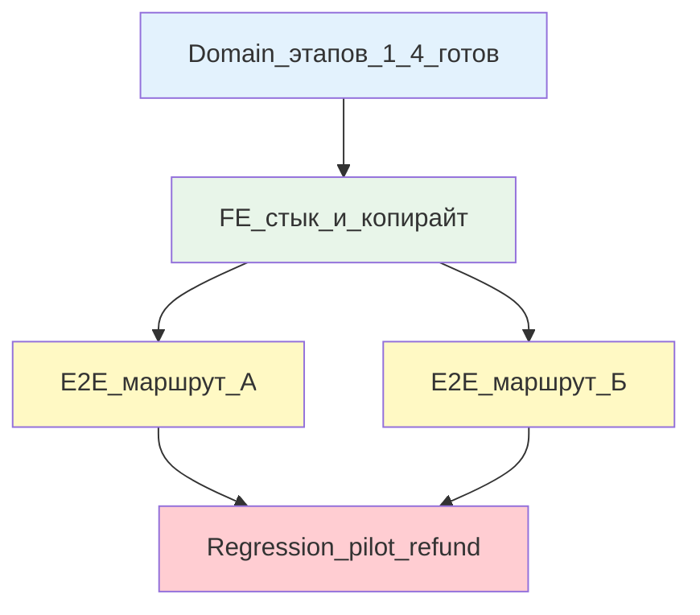

# Этап 5: Сквозные кабинеты и E2E

## Цель

Два маршрута E2E (не вся матрица): маршрут А (уточнить → вернуть клиенту) и маршрут Б (повторить → снова сообщить). Регресс пилотного refund обязателен. Копирайт, иерархия, пустые состояния. Действия уже реализованы в этапах 1-4 — здесь только стык и journey.

## Контекст

После этапов 1-4: провайдер сообщает факт → менеджер выбирает ветку → клиент отвечает/соглашается → завершение или повтор.

Этап 5 — **не новая функциональность**, а проверка сквозных маршрутов глазами роли и убедительность UX. Новый домен или HTTP не добавлять; если стык вскрыл дыру — фикс с unit в том же diff.

## Сверка с rules

Обязательны:
- [`планирование-сверка-с-rules`](.cursor/rules/планирование-сверка-с-rules.mdc): слои (здесь преимущественно FE + E2E) + QG
- [`use-cases`](.cursor/rules/use-cases.mdc): UI проекция, не источник статуса
- [`чистая-архитектура`](.cursor/rules/чистая-архитектура.mdc): политика в домене (этапы 1-4), UI отражает
- [`solid`](.cursor/rules/solid.mdc): нет лишних данных на роль
- [`безопасность-ролей-и-данных`](.cursor/rules/безопасность-ролей-и-данных.mdc): провайдер не видит ПДн клиента
- [`интеграция-и-события`](.cursor/rules/интеграция-и-события.mdc): UI не источник истины
- [`границы-и-контексты`](.cursor/rules/границы-и-контексты.mdc): проекция, не новый контекст
- [`тесты-архитектуры`](.cursor/rules/тесты-архитектуры.mdc): E2E journey, не дублирование unit
- [`честность-готовности`](.cursor/rules/честность-готовности.mdc): не готово без gate
- [`vdp-ci-local-gate`](.cursor/rules/vdp-ci-local-gate.mdc): `ci-pr-pilot` (после `check-env-parity`)
- [`ui-web-практики`](.cursor/rules/ui-web-практики.mdc): иерархия, паттерны, копирайт
- [`ux-взаимодействие-и-скорость`](.cursor/rules/ux-взаимодействие-и-скорость.mdc): один primary, обратная связь
- [`ux-когнитивная-нагрузка`](.cursor/rules/ux-когнитивная-нагрузка.mdc): не перегружай выбором
- [`ux-формы-навигация-онбординг`](.cursor/rules/ux-формы-навигация-онбординг.mdc): Jakob, Postel, пустые состояния
- [`fe-interaction-contracts`](.cursor/rules/fe-interaction-contracts.mdc): жесты файлов
- [`fe-platform-mounts`](.cursor/rules/fe-platform-mounts.mdc): обязательные панели на месте
- [`playwright-e2e`](.cursor/rules/playwright-e2e.mdc): real user behavior, filechooser

Вне scope: новый домен, HTTP, ML, казначей, экспорт, новая заявка.

## Слои



Новый домен/HTTP не добавлять. Если обнаружена дыра (например, guard пропускает недопустимый переход) — фикс с unit в том же diff, но основной фокус этапа — journey.

### Копирайт

По [`ui-web-практики`](.cursor/rules/ui-web-практики.mdc):

**Один термин:**
- «Заявка», не «сделка» или «процесс» вперемешку

**Кнопки:**
- «Сообщить о возврате» (провайдер)
- «Уточнить у клиента» (менеджер)
- «Вернуть клиенту» (менеджер)
- «Повторить платёж» (менеджер)
- «Согласен» / «Отказать» (клиент)
- «Выплатить» (менеджер)
- «Исполнить» (провайдер)

Глагол + объект. Не «Подтвердить», не «ОК».

**Статусы:**
Читаемый язык:
- «Провайдер сообщил о возврате средств»
- «Ожидает решения менеджера»
- «Ожидает ответа клиента»
- «Ожидает согласия клиента на курс»
- «Клиент согласился, ожидает выплата»
- «Ожидает исполнения провайдером»
- «Возврат завершён» (вернуть клиенту)
- «Платёж повторён» (повтор)

**«Следующий шаг»:**
Блок на карточке (как ManagerRouteHintPanel, но для возврата):
- Провайдер после исполнения: «Если средства вернулись, сообщите о возврате»
- Менеджер в точке решения: «Выберите действие: уточнить у клиента, вернуть клиенту или повторить платёж»
- Клиент при уточнении: «Ответьте на вопрос менеджера»
- Клиент при курсе: «Проверьте сумму и курс, приложите письмо-согласие или укажите причину отказа»

Источник «следующего шага» — матрица ролей (этапы 1-4), не догадка UI.

### Иерархия

По [`ux-взаимодействие-и-скорость`](.cursor/rules/ux-взаимодействие-и-скорость.mdc), [`ux-когнитивная-нагрузка`](.cursor/rules/ux-когнитивная-нагрузка.mdc):

**Порядок блоков на карточке:**
1. Статус заявки (как и было)
2. Блок возврата (если `returnEpisode.active`):
   - Сумма возврата (крупно)
   - Статус эпизода (читаемый язык)
   - «Следующий шаг» (по роли)
3. Действия (три кнопки менеджера / согласие клиента / исполнение провайдера)
4. История эпизода (курсы, уточнения, документы)
5. Остальные блоки заявки (документы, платежи, история общая)

**Один primary:**
На экране действия — один primary CTA. Secondary (отмена, назад) — меньший вес.

**Отказ и выплата:**
Не равны по визуальному весу без причины. «Выплатить» primary, «Отказать» secondary или текстовая ссылка.

### E2E маршрут А (уточнить → вернуть)

Файл: `vdp/fe/e2e/return-episode-full-a.spec.ts`

```ts
test('full journey A: report → clarify → return to client', async ({ page, login }) => {
  // Seed: форма payment_sent, провайдер назначен
  
  // 1. Провайдер сообщает
  await login('provider');
  await page.goto('/forms/:id');
  await page.getByRole('button', { name: /сообщить о возврате/i }).click();
  await page.getByLabel(/сумма/i).fill('1000');
  await page.getByLabel(/причина/i).fill('Chargeback');
  await page.getByRole('button', { name: /отправить/i }).click();
  
  // 2. Менеджер уточняет
  await login('manager');
  await page.goto('/forms/:id');
  await expect(page.getByText(/провайдер сообщил/i)).toBeVisible();
  await expect(page.getByText('1000')).toBeVisible();
  await page.getByRole('button', { name: /уточнить у клиента/i }).click();
  await page.getByLabel(/вопрос/i).fill('Please confirm invoice number');
  await page.getByRole('button', { name: /отправить/i }).click();
  
  // 3. Клиент отвечает
  await login('client');
  await page.goto('/forms/:id');
  await expect(page.getByText(/please confirm invoice number/i)).toBeVisible();
  await page.getByLabel(/ответ/i).fill('Invoice #12345');
  await page.getByRole('button', { name: /отправить/i }).click();
  
  // 4. Менеджер вернуть клиенту (курс)
  await login('manager');
  await page.goto('/forms/:id');
  await expect(page.getByText(/invoice #12345/i)).toBeVisible();
  await page.getByRole('button', { name: /вернуть клиенту/i }).click();
  await page.getByLabel(/курс/i).fill('75.50');
  await page.getByRole('button', { name: /отправить клиенту/i }).click();
  
  // 5. Клиент соглашается (письмо)
  await login('client');
  await page.goto('/forms/:id');
  await expect(page.getByText('75.50')).toBeVisible();
  const [fileChooser1] = await Promise.all([
    page.waitForEvent('filechooser'),
    page.getByTestId('consent-file-zone').click()
  ]);
  await fileChooser1.setFiles('test-consent.pdf');
  await page.getByRole('button', { name: /согласен/i }).click();
  
  // 6. Менеджер выплачивает (рубли)
  await login('manager');
  await page.goto('/forms/:id');
  await expect(page.getByText(/письмо-согласие/i)).toBeVisible();
  const [fileChooser2] = await Promise.all([
    page.waitForEvent('filechooser'),
    page.getByTestId('rub-payment-file-zone').click()
  ]);
  await fileChooser2.setFiles('test-rub-payment.pdf');
  await page.getByRole('button', { name: /выплатить/i }).click();
  
  // 7. Проверка завершения
  await expect(page.getByText(/возврат завершён/i)).toBeVisible();
  
  // Регресс: старые документы и платежи на месте
  await expect(page.getByText(/документы сделки/i)).toBeVisible();
});
```

### E2E маршрут Б (повторить → снова сообщить)

Файл: `vdp/fe/e2e/return-episode-full-b.spec.ts`

```ts
test('full journey B: report → repeat → new payment → report again', async ({ page, login }) => {
  // Seed: форма payment_sent, провайдер назначен
  
  // 1. Провайдер сообщает
  await login('provider');
  await page.goto('/forms/:id');
  await page.getByRole('button', { name: /сообщить о возврате/i }).click();
  await page.getByLabel(/сумма/i).fill('2000');
  await page.getByRole('button', { name: /отправить/i }).click();
  
  // 2. Менеджер повторить
  await login('manager');
  await page.goto('/forms/:id');
  await page.getByRole('button', { name: /повторить платёж/i }).click();
  await page.getByLabel(/комментарий/i).fill('Retry with corrected bank account');
  await page.getByRole('button', { name: /повторить/i }).click();
  
  // 3. Провайдер исполняет
  await login('provider');
  await page.goto('/forms/:id');
  await expect(page.getByText(/retry with corrected/i)).toBeVisible();
  const [fileChooser1] = await Promise.all([
    page.waitForEvent('filechooser'),
    page.getByTestId('repeat-payment-file-zone').click()
  ]);
  await fileChooser1.setFiles('test-new-payment.pdf');
  await page.getByRole('button', { name: /исполнить/i }).click();
  
  // 4. Проверка завершения
  await expect(page.getByText(/платёж повторён/i)).toBeVisible();
  
  // 5. Снова сообщить о возврате (если деньги вернулись)
  // Seed: симулируем, что новый платёж тоже вернулся
  await page.goto('/forms/:id');
  await expect(page.getByRole('button', { name: /сообщить о возврате/i })).toBeEnabled();
  await page.getByRole('button', { name: /сообщить о возврате/i }).click();
  await page.getByLabel(/сумма/i).fill('1800'); // неполная сумма
  await page.getByRole('button', { name: /отправить/i }).click();
  
  await login('manager');
  await page.goto('/forms/:id');
  await expect(page.getByText('1800')).toBeVisible(); // новый эпизод
  
  // Проверка: нет новой заявки, старые документы на месте
  await expect(page.getByText(/документы сделки/i)).toBeVisible();
});
```

### Регресс

**Обязательно зелёный:**

1. **Пилотный refund:** [`vdp/fe/e2e/pilot-matrix-refund.spec.ts`](vdp/fe/e2e/pilot-matrix-refund.spec.ts)
   - `mgr_refund_init`, `mgr_refund_start`, `mgr_refund_sent`, `mgr_refund_stop`, `mgr_refund_cancel`
   - Инвариант cancel
   - Казначер в матрице

2. **Platform mounts:** [`vdp/scripts/check-platform-mounts.sh`](vdp/scripts/check-platform-mounts.sh)
   - `ManagerRouteHintPanel` на `form-detail-page` (если добавили новую панель возврата, в реестр)

3. **E2E базовые этапов 1-4:**
   - Провайдер сообщает факт
   - Уточнение цикл
   - Вернуть клиенту без отказа
   - Повтор без снова сообщить

Не ломать при добавлении новых панелей или правок layout.

### Пустые состояния

По [`ux-формы-навигация-онбординг`](.cursor/rules/ux-формы-навигация-онбординг.mdc):

**Нет факта возврата:**
- Провайдер (после исполнения, до сообщения): «Если средства вернулись на счёт организации, нажмите "Сообщить о возврате"»
- Провайдер (до исполнения): кнопка disabled, подсказка «Доступно после исполнения платежа»

**Нет письма:**
- Клиент (курс выставлен): кнопка «Согласен» disabled, ошибка «Приложите письмо-согласие»

**Нет комментария:**
- Менеджер (повтор): кнопка disabled, ошибка «Оставьте комментарий»

**Нет активного возврата:**
- Менеджер / клиент: блок возврата не показан (не загромождать)

### Стык (если обнаружена дыра)

Если E2E вскрыл недопустимый переход или отсутствие guard:
- Фикс в domain + unit в том же diff
- Не откладывать на «потом»

Если копирайт расходится между панелями:
- Унифицировать в FE, не плодить варианты

Если иерархия ломается (например, два primary на одном экране):
- Фикс в компоненте в том же diff

## DoD

1. **Копирайт:**
   - Один термин «заявка»
   - Кнопки глагол+объект
   - «Следующий шаг» из матрицы, не догадка

2. **Иерархия:**
   - Статус → сумма возврата → действия → история
   - Один primary на экран действия
   - Отказ не равен выплате по весу

3. **E2E маршрут А:**
   - report → clarify → return to client (курс → письмо → рубли)
   - Зелёный в `make ci-pr-pilot`

4. **E2E маршрут Б:**
   - report → repeat → new payment → report again
   - Зелёный в `make ci-pr-pilot`

5. **Регресс:**
   - `pilot-matrix-refund.spec.ts` зелёный
   - `check-platform-mounts.sh` зелёный (если добавлена новая панель, в реестр)
   - E2E этапов 1-4 зелёные

6. **Пустые состояния:**
   - Нет факта → подсказка провайдеру
   - Нет письма → ошибка клиенту
   - Нет комментария → ошибка менеджеру

7. **Стык:**
   - Если обнаружена дыра domain — фикс + unit в том же diff

8. **Gate:**
   - `make check-env-parity` (первым)
   - `make ci-pr-pilot` зелёный (оба маршрута + регресс)
   - Не утверждать готовность при красном

9. **Не заявлять:**
   - Новый домен или HTTP (этапы 1-4 достаточны)
   - Всю матрицу в браузере (только два маршрута)
   - `release-gate`

## Уведомление менеджмента

После **зелёного** `make ci-pr-pilot` и закрытия этапа 5:
- Уведомить через [`vdp/scripts/notify-mgmt.sh`](vdp/scripts/notify-mgmt.sh) или `make notify-mgmt`
- **Продуктовый язык:** «Возврат после исполнения: провайдер сообщает факт → менеджер выбирает ветку (уточнить, вернуть клиенту, повторить платёж). Только импорт, аванс и постоплата. Письмо-согласие клиента обязательно при возврате рублей. Повтор платежа без новой заявки.»
- **Без:** номеров этапов, plan id, `@pilot-matrix`, `ci-pr-pilot`, `.cursor/plans`, DoD-жаргона

## Следующие шаги

После этапа 5 контур **завершён** для импорта. Дальше — по приоритету заказчика:
- Экспорт (если потребуется)
- Интеграция с почтовым продуктом (письмо-согласие как email-флоу)
- Дополнительные сценарии (частичный возврат как отдельная ветка — сейчас вне scope)

> **Status-sync 2026-09-24:** todos/DoD marked completed — code evidence recorded in sync reason. Batch triage archive; do not re-implement.
