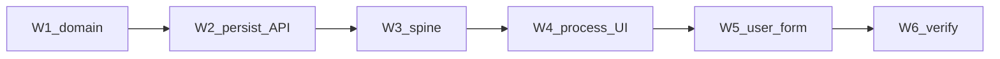
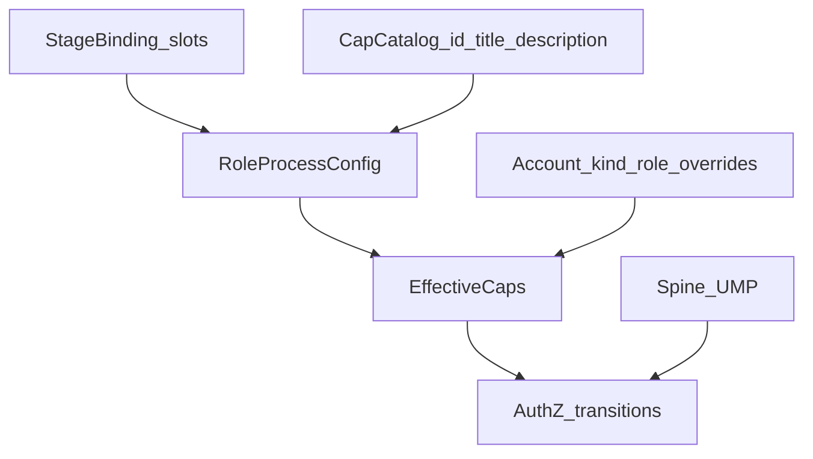

# Roles finalize — master index (W1–W6)

## Как запускать

1. Работать **только** дочерним планом текущей волны (не «весь мастер сразу»).
2. Перед стартом волны: открыть дочерний plan → секция «Сверка с `.cursor/rules`» + матрица мастера → исполнить → отметить todos дочернего и **этот** `master-wN` = completed.
3. Следующую волну не начинать, пока DoD предыдущей не зелёный (честность готовности).
4. Глобальный DoD + gate-чеки из rules закрывает только W6.
5. План без актуальной сверки с rules — **не** исполнять (`планирование-сверка-с-rules`).

| Волна | Plan file | Фокус |
|---|---|---|
| **W1** | [rfc_w1_domain_mandatory.plan.md](rfc_w1_domain_mandatory.plan.md) | `RoleProcessConfig.Mandatory`, root out, pilot ICO/ECO off |
| **W2** | [rfc_w2_persist_api.plan.md](rfc_w2_persist_api.plan.md) | migration 017, store, PUT/GET, catalog human labels |
| **W3** | [rfc_w3_continuity_spine.plan.md](rfc_w3_continuity_spine.plan.md) | преемственность 1–4, gate/bypass |
| **W4** | [rfc_w4_process_roles_ux.plan.md](rfc_w4_process_roles_ux.plan.md) | inline influence / в процессе / mandatory; понятные права |
| **W5** | [rfc_w5_admin_user_form.plan.md](rfc_w5_admin_user_form.plan.md) | форма пользователя 2B |
| **W6** | [rfc_w6_verify_dod.plan.md](rfc_w6_verify_dod.plan.md) | journey DoD + honesty |

## Критерий преемственности (глобальный DoD)

1. Клиент создаёт заявку и отправляет менеджеру на ревью.
2. Менеджер возвращает на доработку **или** отправляет провайдеру.
3. Провайдер завершает **или** возвращает менеджеру (уточнения / отклонение).
4. Root включает доп. участника в слот фиксированного процесса; 1–3 остаются выполнимы с учётом новых gate.

**Граница «в любое место»:** не BPM новых статусов — enable/mandatory/priority/influence/caps на существующих `StageBinding` / Action.

## Решения (зафиксированы)

- **1A:** `mandatory` editable root, persist в БД.
- **2B:** форма пользователя = аккаунт + глобальная process-policy роли + overrides.
- **Root** вне process list; админ через system/admin caps.
- **Пилот:** ICO/ECO default `enabled=false`, `mandatory=false`.
- **UX process-roles (доп.):** inline правка **влияния** и **в процессе**; права — человекопонятные title/description (не сырой `form.view` как единственный текст).
- Старые планы `roles_rbac` / `process_policy` по «mandatory only in code» — **superseded**.

## Сверка с `.cursor/rules` (мастер — MUST)

Полный проход по [`.cursor/rules`](.cursor/rules) (35 файлов). Дочерние планы сужают список, но **не противоречат** этой матрице. Перед исполнением любой волны — повторная сверка в дочернем plan.

### Обязательны на всю программу

| Rule | Зачем |
|---|---|
| `планирование-сверка-с-rules` | каждый plan с секцией rules + gate |
| `базовые-правила-инструмента` | опора на rules; docs только по запросу |
| `правила-построения` | тесты к сервисам; самопроверка после реализации |
| `честность-готовности` | нет ложного «100% / паритет» до DoD |
| `чистая-архитектура` | статус/матрица в домене, не в UI |
| `solid` | AuthZ/caps на use case; коннектор не в ядре |
| `use-cases` | действия ролей = именованные сценарии; тест запрета чужой роли |
| `детали-как-плагины` | Nest/UI/Mongo не канон статуса |
| `screaming-architecture` | имена по бизнес-возможности (process roles, caps) |
| `границы-и-контексты` | process config ≠ shared DB интеграция с чужим контекстом |
| `интеграция-и-события` | UI/config не источник истины статуса; state machine в домене |
| `безопасность-ролей-и-данных` | AuthZ на API; Provider без ПДн; root ≠ process actor |
| `устойчивость-и-наблюдаемость` | отказ AuthZ без ПДн; при выкл. роли — явный путь, не soft-lock |
| `тесты-архитектуры` | unit на политику; узкий journey; не «мороженое» E2E |
| `лучшие-практики` | REST/AuthZ/идемпотентность где уместно |

### Обязательны по волнам (дополнительно)

| Wave | Rules |
|---|---|
| W1–W3 | `go-architecture`, `go-testing`, `go-resilience-security` (AuthZ границы) |
| W2 | `развертывание-и-доставка` (миграция expand/contract, конфиг снаружи) |
| W3 | `go-observability` (correlation / id заявки в отказах пути) — минимум |
| W4–W5 | `ui-web-практики`, `ux-взаимодействие-и-скорость`, `ux-когнитивная-нагрузка`, `ux-формы-навигация-онбординг`, `typescript-clean-code`, `поддержка-и-обратная-связь` (понятный копирайт caps/статусов) |
| W6 | `go-testing` + FE vitest; `playwright-e2e` **только** если уже есть узкий journey — не раздувать матрицу |

### Вне scope всей программы (явно)

| Rule | Почему вне |
|---|---|
| `машинное-обучение` | не ядро ролей/статусов |
| `serverless-и-faas` | не путь AuthZ/статуса |
| `nestjs-modules` / `nestjs-testing` | контур VDP = Go + FE |
| `devops-культура` / `команды-и-закон-конвея` | оргпроцессы; не блокер кода волн |
| `алгоритмы-и-сложность` | нет новых структур данных как цели |
| `vdp-fe-docker-пересборка` | **не** запускать `compose-fe-refresh` без явного «да» |
| BPM / Nest KPI / 1С / docs без запроса / §3 провайдер клиенту | вне продукта этой программы |

### Gate / DoD-чеки из rules (закрывает W6)

- [ ] Unit: допустимый переход + запрет чужой роли; mandatory/disable; root не process actor (`use-cases`, `безопасность-ролей-и-данных`)
- [ ] Статусная машина в домене; UI только проекция (`чистая-архитектура`, `интеграция-и-события`)
- [ ] Provider DTO/UI без ПДн клиента (`безопасность-ролей-и-данных`)
- [ ] Нет soft-lock при disabled optional actor (`устойчивость-и-наблюдаемость`)
- [ ] Тесты к изменённым services/модулям (`правила-построения`, `go-testing`)
- [ ] Преемственность 1–4 проверяема; без «паритет 100%» (`честность-готовности`, `тесты-архитектуры`)
- [ ] FE: лейблы/ошибки/guided next; caps человекопонятны (`ui-web-практики`, `поддержка-и-обратная-связь`)
- [ ] Нет публичных smoke вроде `admin/test` (`тесты-архитектуры` / nestjs-testing spirit)
- [ ] FE docker deps — только после согласия пользователя (`vdp-fe-docker-пересборка`)

## Модель

## Вне программы

- Custom role id без кода.
- Редактор графа статусов.
- Docs `roles-and-authz.md` без явного запроса.
