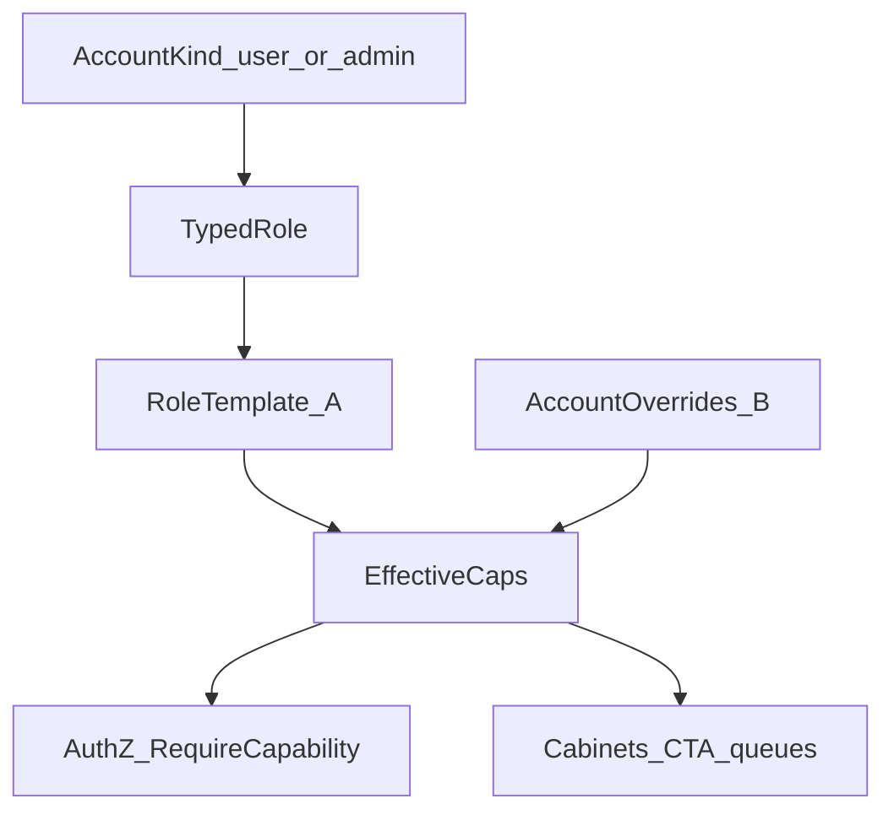

# Roles: AccountKind + A/B capabilities + full RBAC (2B)

## Решения (зафиксированы)

- **Волна:** 2B — источник истины AuthZ = **effective capabilities**, не `RequireRoles` / root-bypass как единственный механизм.
- **Уровень caps:** **A+B** — шаблон роли (дефолт) + override на аккаунте.
- **Override:** можно **сужать и расширять** относительно шаблона, но только внутри каталога, разрешённого `AccountKind`:
  - `user` → только **business** caps;
  - `admin` → business + **system** caps;
  - у `root` набор system caps **locked** (нельзя снять `accounts.manage` / `process_roles.manage` / `system.admin`).
- **Процесс заявки** по-прежнему фиксирован в коде (`StageBinding`); caps не меняют методологию статусов.
- **Root / admin** не участник бизнес-процесса: убрать из process-roles UI и из `IsMandatoryProcessRole` как «mandatory process actor».

## Целевая модель

| Понятие | Смысл | Примеры |
|---|---|---|
| AccountKind | Глобальный тип аккаунта | `user`, `admin` |
| Typed role | Ярлык шаблона / кабинет | клиент=`user`, `manager`, ICO, ECO, `provider`, `root` |
| Business caps | Действия в заявке/орг | `form.view`, `org.compliance`, influence actor/observer |
| System caps | Админ платформы | `accounts.manage`, `directories.manage`, `forms.admin`, `process_roles.manage` |
| Effective | template ⊕ override | то, что проверяет API и UI |

Маппинг ваших пунктов: a/a1/a2 → Kind+typed role; 2.1 → business; 2.2 → system; создание пользователя → kind → role → caps из шаблона → optional override.

## Сверка с `.cursor/rules`

**Обязательны:** `планирование-сверка-с-rules`, `базовые-правила-инструмента`, `правила-построения`, `use-cases`, `чистая-архитектура`, `solid`, `детали-как-плагины`, `безопасность-ролей-и-данных`, `интеграция-и-события` (UI/caps не источник статуса заявки), `тесты-архитектуры`, `go-testing`, `честность-готовности`, `ui-web-практики`, `границы-и-контексты`.

**Вне scope:** BPM/редактор этапов процесса; ML; смена StageBinding админкой; fe docker refresh без спроса; Nest-паритет как цель.

**Gate/DoD:** unit на EffectiveCaps и запреты kind; HTTP без «только роль» на критичных путях; journey AuthZ по caps; root не в process list; create user с kind+role+overrides; без ложного «паритет 100%» до закрытия sweep `RequireRoles`.

## Опора на код

- Роли: [`vdp/core/internal/domain/role.go`](vdp/core/internal/domain/role.go)
- Account: [`vdp/core/internal/domain/account.go`](vdp/core/internal/domain/account.go), миграция [`001_core.sql`](vdp/core/migrations/001_core.sql)
- Business caps + process config: [`capabilities.go`](vdp/core/internal/domain/formpayment/capabilities.go), [`role_config.go`](vdp/core/internal/domain/formpayment/role_config.go), [`015_role_process_config.sql`](vdp/core/migrations/015_role_process_config.sql)
- AuthZ: [`authz.go`](vdp/core/internal/authz/authz.go) — сегодня `RequireRoles` + root bypass (~70 call sites в service/http)
- Admin accounts API: [`auth_account_org_routes.go`](vdp/core/internal/transport/http/auth_account_org_routes.go); FE [`routes/admin.tsx`](vdp/fe/src/routes/admin.tsx)
- Process roles UI: [`process-roles-page.tsx`](vdp/fe/src/components/ved/pages/process-roles-page.tsx)

## Декомпозиция

### W1 — Таксономия и каталоги (domain)

- `AccountKind` (`user` \| `admin`); `KindForRole(role)` для миграции seed.
- `SystemCapability` catalog в коде: минимум `accounts.manage`, `directories.manage`, `forms.admin`, `process_roles.manage`, `system.admin`.
- Разделить: business caps остаются в `formpayment`; system — отдельный пакет `domain/systemcap` (или `domain/capability`), чтобы process package не владел админкой.
- `IsMandatoryProcessRole`: **убрать особый case `root`**; mandatory только из `StageBindings`.
- Default templates: user-роли как сейчас; `root` = kind admin, все system + (опционально) business для union CTA; **не** в process participation list.

### W2 — Persist A+B

- Миграция `016_account_kind_caps.sql`:
  - `accounts.account_kind`
  - `accounts.business_cap_overrides jsonb` (null = нет override, брать шаблон)
  - `accounts.system_cap_overrides jsonb`
  - backfill: `root` → admin, остальные → user; overrides null
- Расширить `role_process_configs` **или** ввести `role_templates` с `system_capabilities` для admin-ролей; process `enabled/priority/influence` только для process-eligible ролей.
- Seed/dev accounts без смены паролей/email.

### W3 — EffectiveCaps + AuthZ 2B

- Резолвер: `EffectiveCapabilities(account, roleTemplate) → {business, system, influence}`.
- `Principal` расширить effective caps (загрузка при login / withAuth).
- Новые примитивы: `RequireCapability` / `RequireAnyCapability` (business или system по контексту).
- **Заменить** все `RequireRoles` в service/http на capability-checks с явной таблицей маппинга endpoint/use-case → cap(s). Временный root-bypass убрать: `root` проходит через caps шаблона (все system + нужные business).
- Form transitions: оставить `RoleMayPerformWithConfig` на базе **effective business caps** аккаунта (не только шаблона роли), плюс `CanAccessForm` (зона данных) без изменения Provider/PII правил.
- Наблюдаемость: отказ AuthZ без ПДн; correlation как сейчас.

### W4 — Admin API: создать/править пользователя

- `POST/PATCH /api/v1/admin/account`: `account_kind`, `role`, optional overrides; валидация kind↔role, locked root system caps, user не получает system.
- `GET` account/public + me: отдавать `account_kind`, `effective_capabilities`, `overrides`.
- Process-roles API: только user/process роли; system caps редактируются в role template admin (отдельная секция или тот же экран с tabs Business | System).
- AuthZ на эти API: `accounts.manage` / `process_roles.manage`, не «просто root string».

### W5 — FE

- Admin create/edit: шаг kind → typed role → caps (шаблон prefill) → override toggles; disabled/locked для mandatory system у root.
- Process roles: убрать root; подпись business vs system; починить UX «Отключить» (не показывать активной, если mandatory).
- Кабинеты / `actionsFor`: фильтр по **effective** caps (+ influence), не только по `role ===`.
- Guided next step из доменной матрицы actions ∩ effective caps.

### W6 — Verify / DoD honesty

- Unit: EffectiveCaps merge; user+system override → reject; disable mandatory process role → reject; root strip `accounts.manage` → reject.
- Service/HTTP: бывшие RequireRoles paths → 403 без cap, 200 с cap; create account с override.
- Journey smoke (или существующие service journey): User submit → ICO → ECO → Manager → Provider с caps шаблонов; admin без process queue.
- Регрессия process policy: optional sales on/off без смены TargetStatus.
- Документацию [`roles-and-authz.md`](vdp/docs/domain/roles-and-authz.md) обновить **только если пользователь отдельно попросит docs** — иначе минимум: комментарии/API shape; отдельный docs-PR по запросу.
- Честно: закрытие 2B = ноль оставшихся `RequireRoles` в prod paths (кроме deprecated wrapper с тестом на пустоту call sites) + зелёные тесты выше.

## Порядок

W1 → W2 → W3 (ядро AuthZ) → W4 → W5 → W6.

## Вне плана

- Произвольные custom role id без кода.
- Полный Nest↔vdp паритет как KPI.
- Редактор статусов/этапов.
- Расширение override через kind boundary (user с system caps).
