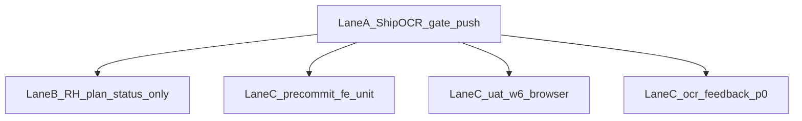

> **SUPERSEDED** by [unified_backlog_pipeline_70ee04a1.plan.md](unified_backlog_pipeline_70ee04a1.plan.md). Do not execute this plan.

# Пайплайн без отката и без помех

## Вердикт перепроверки (необходимость)

| Работа | Нужна ли сейчас | Почему |
|---|---|---|
| [ship_ocr_uat_clean_a5051c51.plan.md](.cursor/plans/ship_ocr_uat_clean_a5051c51.plan.md) `gate-ci-main` + `push-notify` | **Да — единственный блокер** | Продукт уже в локальном `3309e283` (`d2` ahead 1); gate/push не закрыты |
| [ocr_uat_unblock](.cursor/plans/ocr_uat_unblock_fb43d5c8.plan.md) `repro` / `qg-uat` | **Да как runtime того же ship** | Не писать код заново; закрывается зелёным `ocr-path-gate` + `ci-main` + push |
| `e2e-hitl-assert` | **Нет (код есть)** | Уже в `3309e283` / [ocr-wizard-path.spec.ts](vdp/fe/e2e/ocr-wizard-path.spec.ts) — только проставить `completed` после зелёного gate |
| [ocr_path_до_uat](.cursor/plans/ocr_path_до_uat_382e6525.plan.md) `ocr-path-verify-fix` | **Да как verify, не как re-impl** | Infra (`ocr-path-gate`) есть; нужен зелёный прогон вместе с ship |
| RH0–RH4 оставшиеся `pending` (workflow / build-tag / ICO / httptest / release-gate) | **Нет как код** | Уже в дереве (якорь `6afc6f7a`+); re-impl = риск отката более богатого CI/Makefile |
| [compose_push_harden](.cursor/plans/compose_push_harden_bc5c3683.plan.md) | **Нет** | Все todos `completed`; не трогать |
| [precommit_fe_unit](.cursor/plans/precommit_fe_unit_e03035eb.plan.md) | **Да, после ship** | Хуки ещё без path-aware `npm test`; не пересекается с OCR FE |
| [uat_w6](.cursor/plans/uat_w6_role_cabinets_browser.plan.md) | **Да, после ship** | Browser UAT ролей; API-only журнал не заменяет |
| [ocr_feedback_p0](.cursor/plans/ocr_feedback_p0_132b4b56.plan.md) | **Да, строго после push `3309e283`** | Трогает тот же wizard/e2e/Docling — иначе конфликт с ship |

**Итог:** из кластера OCR/RH «доделать продукт» нужно только **закрыть доставку OCR**; RH — только синхронизация статусов планов; три волны — развитие после clean tree.

## Анти-откат (жёстко)

- Не переписывать `.github/workflows/vdp-ci.yml`, `release-gate`, `compose-up-with-retry`, wait_pg, logout fixture.
- Не рефакторить и не «улучшать» файлы из `3309e283` в ship-волне (`return.ts`, flags, extraction poll, HITL e2e).
- Не `SKIP_PREPUSH_GATE`, не ослаблять path-gate / platform-mounts / gesture E2E.
- Compose Desktop flake → чинить CD, не продукт.
- Plan status sync ≠ product commit; RH metadata — отдельный коммит и только после доказательства в git (уже есть).
- FE Docker: перед `compose-fe-refresh` — явный вопрос пользователю (`vdp-fe-docker-пересборка`).

## Сверка с `.cursor/rules`

**Обязательны для этого пайплайна:** `планирование-сверка-с-rules`, `базовые-правила-инструмента`, `правила-построения`, `vdp-ci-local-gate`, `честность-готовности`, `mgmt-tg-notify` (закрытие ship / feedback), `vdp-fe-docker-пересборка` (если трогаем deps), `unexpected-main-fail-postmortem` (если после «готово» красный main).

**Вне scope этого оркестратор-плана:** новый продуктовый UX вне перечисленных волн; полный аудит всех ~328 pending по каталогу; silent `release-gate`.

## Lane A — сейчас (не мешать никому): ship OCR

Исполнять **только** [ship_ocr_uat_clean](.cursor/plans/ship_ocr_uat_clean_a5051c51.plan.md):

1. Чистый disk относительно OCR commit (plan dirt не в том же push, если мешает pre-push — stash plan-only).
2. `make check-env-parity` → `make ocr-path-gate` → **`make ci-main`**.
3. Push `d2` без SKIP → mgmt `done` (продуктовый язык).
4. После зелёного gate: в OCR-планах проставить `e2e-hitl-assert` / закрыть `qg-uat` / `ocr-path-verify-fix` как runtime-done (отдельный мелкий plan-only commit **после** product push, не до).

Пока Lane A открыт: **не** стартовать precommit/W6/feedback; **не** гонять `release-gate`; не refresh FE volume без «да».

## Lane B — после push, без кода продукта: RH status sync

Только правки frontmatter todos в rh0–rh4 (и при необходимости закрытие оставшихся «done in code» пунктов OCR), **без** изменения `vdp/**`. Цель — убрать ложный backlog, не «сделать RH заново».

DoD: diff только `.cursor/plans/rh*.plan.md` (+ OCR plan status); `git grep`/наличие файлов как доказательство; без CI product claim.

## Lane C — развитие, параллельно после clean tree

Три **разных** PR/коммита, разные path-фильтры:

1. **precommit_fe_unit** — только hooks/CD/docs/rules; gate: `check-env-parity` + `test-cd-scripts` + **`make ci-pr-fast`**.
2. **uat_w6** — browser кабинеты; не правит OCR wizard; gate по результатам findings: `ci-pr-pilot` или `ci-main` если появятся e2e вне smoke.
3. **ocr_feedback_p0** — honesty copy + Docling regex/conf + e2e assert; gate: `ci-pr-pilot` и при e2e вне smoke — **`ci-main`**; стартовать только когда `3309e283` на origin.

Изоляция: не смешивать коммиты; не делить один WT на две product-волны; длинный browser одной волны не параллелить с `ci-main` другой на том же compose.

## DoD оркестратора

- [ ] Перепроверка зафиксирована: RH/compose — no-reimpl; ship — единственный блокер
- [ ] Lane A: зелёный `ci-main` + push без SKIP + mgmt done
- [ ] Lane B: только plan status, без `vdp/**`
- [ ] Lane C: три отдельные поставки после clean tree; feedback после origin tip
- [ ] Ни один шаг не откатывает compose harden / CI / OCR UAT tip
