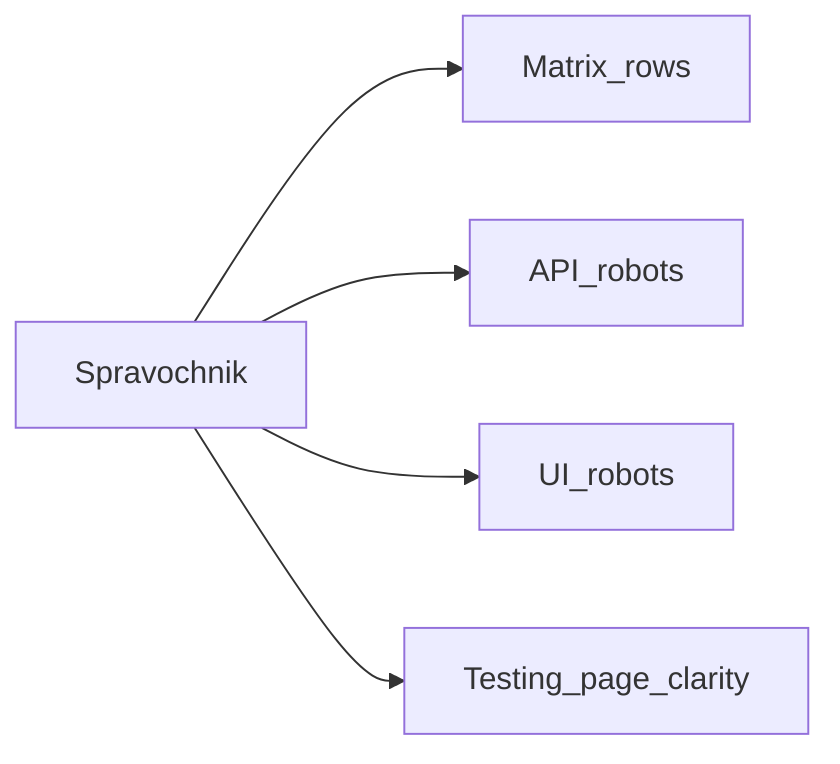

# Справочник сценариев/ролей + закрытие дыр роботов

## Ошибка, которую чиним

В робот-матрице не было 5 из 17 сценариев каталога. На экране `/testing` галочки выбора выглядят как «уже пройдено». Это нужно исправить: **полный список → честное покрытие → роботы по справочнику**.

## Сверка с `.cursor/rules` (MUST)

**Обязательны:**
- `планирование-сверка-с-rules`, `базовые-правила-инструмента`, `правила-построения`
- `честность-готовности` — в справочнике и матрице только проверяемые статусы (covered / partial / missing), без «всё зелёное»
- `use-cases` — каждый сценарий = намерение роли + ожидаемый статус
- `безопасность-ролей-и-данных` — провайдер без ПДн; AuthZ на сценариях смены статуса
- `тесты-архитектуры` — много быстрых API/unit; браузер только на критичный путь заявки и точечные UI-сценарии
- `интеграция-и-события` — статус из домена, UI только показывает
- `playwright-e2e`, `go-testing`
- `ui-web-практики` / `поддержка-и-обратная-связь` — на `/testing` нельзя путать «выбрано» и «успешно»
- `mgmt-tg-notify` — после закрытия gate

**Вне scope:** ML как ядро статуса; Nest-паритет 100%; combinatorial «все роли × все статусы» в браузере; customer-pack swap (после этой волны).

**Gate/DoD из rules:** unit/API на переходы и запрет чужой роли; Playwright на полный путь; справочник без молчаливых дыр; notify после DoD.

---

## Что такое «справочник» (главный артефакт)

Один документ-контракт: **какие роли участвуют, какие сценарии есть, кто что делает, чем проверяем**.

**Файл:** [`vdp/docs/pilot/scenario-role-directory.md`](vdp/docs/pilot/scenario-role-directory.md) (новый; по вашему запросу на справочник).

**Машинный якорь id** остаётся [`catalog.go`](vdp/core/internal/scenarioverify/catalog.go). Справочник **не дублирует другую правду** — для каждого id ссылается на каталог и пишет покрытие. Тесты и matrix обязаны ссылаться на id из справочника.

### Структура справочника (простым языком)

**Часть 1 — Роли**

| Роль (как в продукте) | Участие в пилоте сейчас | Зачем в сценариях |
|----------------------|-------------------------|-------------------|
| Клиент (user) | обязателен | создаёт, сдаёт, правит, грузит документы |
| Менеджер | обязателен | проверка (вместо выкл. комплаенса), оплата, закрытие |
| Провайдер | обязателен | исполнение платежа; без ПДн клиента |
| Суперадмин (root) | не слот процесса | отмена, каталоги, экран `/testing` |
| Внутренний комплаенс (ICO) | слот выключен | org-approve; в пилоте шаги может закрыть менеджер |
| Внешний комплаенс (ECO) | слот выключен | reject/accept; в пилоте — менеджер |
| Банк | канал рядом | заявка «от банка» |
| Прочие (sales, viewer, treasurer…) | по process config | в справочнике кратко: вкл/выкл, без раздувания тестов |

**Часть 2 — Все 17 сценариев** (как на `/testing`)

Для **каждого** id одна карточка:

- Название и смысл (зачем бизнесу)
- Роли по шагам (кто действует)
- Ожидаемый исход (статус / запрет / отсутствие ПДн)
- Пилот: актуален ли при ICO/ECO off (да / через менеджера / только если слот включён)
- Покрытие: API-робот / UI-робот / нет — **без пустых клеток**
- Ссылка на тест (файл или «добавить в волне B»)

**Часть 3 — Главный путь (spine)**

Отдельный блок: одна заявка от создания до закрытия + ветка «вернули → клиент отправил снова». Это **обязательный** критерий приёмки («путь не ломается»).

---

## Волны работ

### Волна 0 — Справочник

- Написать [`scenario-role-directory.md`](vdp/docs/pilot/scenario-role-directory.md) по шаблону выше на все 17 id + роли.
- Синхронизировать FE [`scenario-catalog.ts`](vdp/fe/src/lib/ved/scenario-catalog.ts): сейчас не хватает id из Go (continuity, reject, resubmit, provider return, OCR, rate) — FE должен знать полный список.
- В [`e2e-coverage-matrix.md`](vdp/docs/development/e2e-coverage-matrix.md) одна ссылка: «источник сценариев/ролей — справочник».
- Обновить [`matrix-rows.json`](vdp/testdata/robot-fixtures/matrix-rows.json): **ровно все 17 id** (+ ветка shipment, если остаётся рядом). Пустых id из каталога быть не должно.

### Волна A — Честность покрытия в справочнике и matrix

- Для каждого из 17: `API` / `UI` / `missing` / `soft_skip_forbidden`.
- Запрет в gate: «тихий skip» проверки организации, если сценарий выбран (нужен детерминированный seed «org ещё не одобрена»).

### Волна B — Роботы по справочнику (закрыть дыры)

По справочнику добить то, что сейчас missing/partial и влияет на путь или каталог:

| id | Работа |
|----|--------|
| `provider_return_to_manager` | API в compose-e2e + spot UI при наличии CTA |
| `manager_sets_deal_rate` | API в compose/scenarioverify gate + spot UI |
| `ico_org_pending_approve` | Детерминированный unapproved org; без soft-skip в gate |
| `eco_reject_resubmit` | В matrix явно: при ECO off = путь менеджера (тот же reject/resubmit) |
| `health_core` | В matrix как API smoke |

Spine уже закрыт `@pilot-matrix` — не переписывать; только стыковать со справочником.

### Волна C — Экран `/testing`: не путать выбор и результат

В [`testing.tsx`](vdp/fe/src/routes/demo/testing.tsx):

- Чекбокс = только «включить в запуск».
- Рядом (или второй колонкой): **последний результат** — успешно / сбой / ещё не запускали (из `listScenarioRuns`).
- Короткая подпись: «Галочка — выбор. Статус справа — итог последней проверки.»

### Волна D — Gate «путь не ломается»

Обязательные команды после A–C:

- `make robot-matrix-check` (все 17 id в matrix)
- `make compose-e2e`
- `make playwright-pilot-matrix`
- unit Go на новые куски + FE catalog sync test
- `make -C vdp notify-mgmt KIND=gate`

Customer fixtures — **следующая** волна после зелёного spine на template (не смешивать).

---

## DoD

- [ ] Справочник опубликован: все роли пилота + все 17 сценариев с покрытием
- [ ] Нет id каталога без строки в matrix/справочнике
- [ ] Дыры `#15`, `#17`, `#3` закрыты роботами без тихого skip
- [ ] `/testing`: выбор и результат прогона визуально разделены
- [ ] Spine green: compose-e2e + playwright-pilot-matrix
- [ ] Нет ложного «QG 100% на данных заказчика»
- [ ] notify-mgmt после gate

## Анти-паттерны

- Оправдывать пробел «так задумали» вместо строки в справочнике
- 17 полных браузерных спектаклей вместо API + узкого UI на путь
- Галочка выбора = «сценарий пройден»
