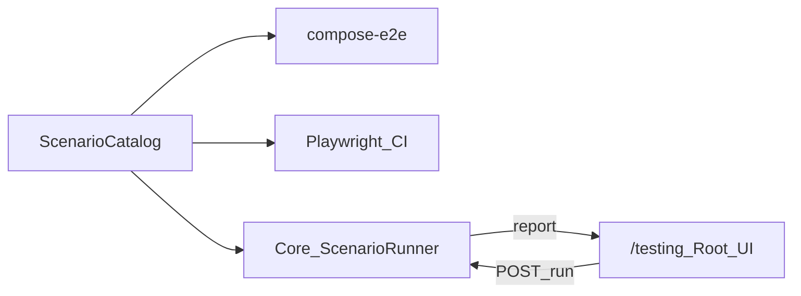

# Scenario verification: CI/Playwright + Root on-demand

## Зафиксированные решения (без развилок)

- **Единый каталог** именованных сценариев (~8–12) — источник правды для compose API E2E, Playwright и Root UI.
- **Порядок волн:** Wave 0 catalog → Wave 1 CI/Playwright → Wave 2 Root Scenario Console (потребляет тот же каталог/runner).
- **Среды:** мутирующие прогоны (создание заявок, переходы) — `local` / compose / `alpha` / `demo` / `test`. На `gamma` / `prod` — только health + dry-run матрицы ожидаемых CTA/статусов **без** смены статуса (политика least privilege).
- **Не** встраивать Chromium/автокликер в core или в кабинет root. Browser = Playwright (CI/ops). Root UI = триггер API-runner + отчёт.
- Документацию в репо не плодить: обновить только существующие [e2e-coverage-matrix.md](vdp/docs/development/e2e-coverage-matrix.md) и [testing.md](vdp/docs/development/testing.md) в рамках DoD (честность готовности).

---

## Сопоставление с `.cursor/rules` (MUST)

### Обязательны (оба плана + shared)

| Rule | Зачем |
|------|--------|
| [планирование-сверка-с-rules](.cursor/rules/планирование-сверка-с-rules.mdc) / [базовые-правила-инструмента](.cursor/rules/базовые-правила-инструмента.mdc) | План со сверкой |
| [правила-построения](.cursor/rules/правила-построения.mdc) | Тесты к сервисам/функциям; самопроверка |
| [тесты-архитектуры](.cursor/rules/тесты-архитектуры.mdc) | Пирамида: unit/API ≫ узкий E2E; journeys не combinatorial |
| [безопасность-ролей-и-данных](.cursor/rules/безопасность-ролей-и-данных.mdc) | AuthZ на сервисе; root-only; Provider без ПДн; нет ПДн в логах/отчётах |
| [чистая-архитектура](.cursor/rules/чистая-архитектура.mdc) / [use-cases](.cursor/rules/use-cases.mdc) / [solid](.cursor/rules/solid.mdc) | Runner = use case; UI/HTTP — адаптеры; статусная машина не в FE |
| [интеграция-и-события](.cursor/rules/интеграция-и-события.mdc) | Статус из домена; UI проекция |
| [границы-и-контексты](.cursor/rules/границы-и-контексты.mdc) / [screaming-architecture](.cursor/rules/screaming-architecture.mdc) | Пакет по возможности `scenarioverify`, не «ещё handlers» |
| [устойчивость-и-наблюдаемость](.cursor/rules/устойчивость-и-наблюдаемость.mdc) | correlation/form id в отчёте; таймауты шагов |
| [честность-готовности](.cursor/rules/честность-готовности.mdc) | Не заявлять full role×status browser coverage |
| [go-architecture](.cursor/rules/go-architecture.mdc) / [go-testing](.cursor/rules/go-testing.mdc) / [go-resilience-security](.cursor/rules/go-resilience-security.mdc) | Core runner |
| [playwright-e2e](.cursor/rules/playwright-e2e.mdc) | Locators, fixtures, без hardcoded timeouts |
| [typescript-clean-code](.cursor/rules/typescript-clean-code.mdc) | FE `/testing` |
| [ui-web-практики](.cursor/rules/ui-web-практики.mdc) + ux-* | Root UI: один primary Run, ясный отчёт, guided next |
| [развертывание-и-доставка](.cursor/rules/развертывание-и-доставка.mdc) / [devops-культура](.cursor/rules/devops-культура.mdc) | CI jobs, не ручной snowflake |
| [детали-как-плагины](.cursor/rules/детали-как-плагины.mdc) | Playwright/Docker — деталь; каталог сценариев — политика списка проверок |

### Вне scope

- ML / FaaS / serverless как носитель статуса ([машинное-обучение](.cursor/rules/машинное-обучение.mdc), [serverless-и-faas](.cursor/rules/serverless-и-faas.mdc))
- NestJS modules ([nestjs-modules](.cursor/rules/nestjs-modules.mdc), [nestjs-testing](.cursor/rules/nestjs-testing.mdc)) — VDP Go+FE
- `release-gate` promote console ([release-gate.md](vdp/docs/operations/release-gate.md)) — другой продукт
- Публичные `admin/test` smoke без AuthZ (запрет духа nestjs-testing / финтех)
- Тихая пересборка FE Docker ([vdp-fe-docker-пересборка](.cursor/rules/vdp-fe-docker-пересборка.mdc)) — только после явного «да»
- Новые markdown-гайды сверх точечного обновления matrix/testing

### Gate/DoD-чеки из rules

- Unit: допустимый переход + запрет чужой роли; AuthZ root-only на run API
- Provider-сценарий: assert отсутствия ПДн клиента в ответе/проекции
- E2E browser: только named journeys; role-based locators
- Нет утверждения «100% UI всех ролей»
- Логи/отчёт без ПДн; есть form id / run id

---

# Wave 0 — Shared scenario catalog (фундамент обоих планов)

**Цель:** один машиночитаемый каталог journeys (id, title, steps, expected status/ACL asserts, tags: `api` | `ui` | `smoke`).

**Где:** новый пакет Go, например [`vdp/core/internal/scenarioverify/`](vdp/core/internal/) (screaming: scenario verification), плюс зеркало id для FE/Playwright (константы/JSON, генерируемый или дублированный thin list — без второй «истины шагов»).

**Источник шагов:** вынести логику из [`vdp/scripts/compose-e2e.sh`](vdp/scripts/compose-e2e.sh) и список из [`vdp/docs/pilot/uat-scenarios.md`](vdp/docs/pilot/uat-scenarios.md) / [`INTEGRATION_JOURNEY`](vdp/fe/src/lib/ved/integration-journey.test.ts).

**Стартовый каталог (именованные):**

1. `happy_path_to_completed` — User→ICO?→ECO→Manager→Provider→report→completed  
2. `eco_reject_resubmit`  
3. `ico_org_pending_approve`  
4. `manager_payment_assign_provider`  
5. `provider_payment_no_pii`  
6. `bank_channel_badge`  
7. `root_cancel`  
8. `refund_smoke` (API; UI — позже)  
9. UX-регрессии точечно: `manager_hides_drafts`, `doc_preview_visible` (привязка к C2/C3) — только как UI tags

**DoD Wave 0:** Go table-driven tests на описание каталога; `compose-e2e.sh` вызывает те же id/шаги (или тонкая обёртка над runner CLI); matrix.md обновлён без ложного «full coverage».

---

# Plan A — CI / Playwright (системная регрессия UI)

## Цель

Стабильный, повторяемый browser-gate по критичным journeys; логика статусов не дублируется в Playwright (seed через API helpers, assert проекции UI).

## In scope

- Расширить specs в [`vdp/fe/e2e/`](vdp/fe/e2e/) до покрытия каталога с tag `ui` (минимум: happy до завершающего assert статуса/badge; ICO spot; reject; provider ACL; manager payment; bank; login).
- Починить рассинхрон docs ↔ код (`completed-journey` отсутствует — либо добавить spec, либо убрать из docs).
- [`auth.fixture.ts`](vdp/fe/e2e/fixtures/auth.fixture.ts) + [`helpers/api.ts`](vdp/fe/e2e/helpers/api.ts): seed по scenario id; role locators per [playwright-e2e](.cursor/rules/playwright-e2e.mdc).
- CI [`.github/workflows/vdp-ci.yml`](.github/workflows/vdp-ci.yml):
  - **PR required:** `login-form` + `user-submit` + 1–2 самых стабильных (например `provider-acl` **или** короткий happy до ECO accept) — без combinatorial.
  - **Nightly / `integration` label / `release-gate`:** полный `make playwright-e2e` по ui-tagged specs.
- Обновить [testing.md](vdp/docs/development/testing.md) / [e2e-coverage-matrix.md](vdp/docs/development/e2e-coverage-matrix.md) честно.

## Out of scope (Plan A)

- Root `/testing` Run button и persist runs
- Прогон всех 60 CTA в браузере
- Demo `/demo/*` E2E

## Работы (последовательность)

1. Инвентаризация specs vs catalog tags; удалить/добавить `completed-journey` по факту.
2. Рефактор helpers: `runApiSeed(scenarioId)` → formId для UI.
3. Дописать недостающие UI journeys (ICO, happy→completed или manager completed badge — по стабильности uploads).
4. CI split: `PLAYWRIGHT_ARGS` PR vs full.
5. Gate: `make playwright-e2e` green локально/compose; traces на failure уже есть.

## DoD Plan A

- [ ] Named UI journeys из каталога зелёные через `make playwright-e2e`
- [ ] PR job не раздут; full suite на nightly/release-gate
- [ ] Нет combinatorial role×status в browser
- [ ] Matrix/testing отражают факт (честность)
- [ ] Provider journey asserts: нет колонки/полей ПДн клиента

---

# Plan B — Root Scenario Console («по запросу»)

## Цель

Суперадмин на [`/testing`](vdp/fe/src/routes/testing.tsx) запускает проверку среды и получает отчёт по шагам. Исполнение — **use case в core**, не клики в браузере кабинета.

## In scope

### Domain / application

- Пакет `scenarioverify`: catalog, `RunScenario(ctx, id, mode)`, step results, env gate (`mutating` vs `dry_run`).
- AuthZ: только principal с `system.admin` ([systemcap](vdp/core/internal/domain/systemcap/systemcap.go) / [authz](vdp/core/internal/authz/authz.go)); чужая роль → 403 (тест).
- Синтетические данные: префикс `probe-` / seed accounts; cleanup или mark completed/canceled после run.
- Отчёт: scenario id, step name, ok/fail, expected/actual status, form id, run id, duration; **без ПДн**.
- Режимы: `mutating` (non-prod) | `dry_run` (prod/gamma default) | опционально `health` (как [staging-smoke.sh](vdp/scripts/staging-smoke.sh) probes).

### HTTP adapter

- `GET /api/v1/admin/scenario-catalog` — список (root)
- `POST /api/v1/admin/scenario-runs` — body `{ scenario_id | scenario_ids, mode }`
- `GET /api/v1/admin/scenario-runs/{id}` — статус/отчёт
- `GET /api/v1/admin/scenario-runs` — история (лимит)

Исполнение: sync для коротких smoke; async+poll если happy path долгий (таймаут шага + overall; контекст cancel).

### FE

- Расширить [`TestingPage`](vdp/fe/src/routes/demo/testing.tsx): каталог с чекбоксами, primary **Запустить**, прогресс/скелетон (&lt;400ms feedback), таблица шагов ok/fail, история.
- Сохранить существующие seed-таблицу и Bank smoke; сценарии-markdown заменить/дополнить данными с API.
- Nav уже root-only: [`nav-config.ts`](vdp/fe/src/lib/ved/nav-config.ts) `/testing`.

### Tests

- Go unit: AuthZ 403; dry_run не меняет статус; mutating happy path на memory/integration; provider no-PII assert.
- FE vitest: маппинг отчёта / disabled Run на prod dry_run copy.
- Не публичный открытый smoke без JWT.

## Out of scope (Plan B)

- Playwright внутри кнопки root
- Dispatch GitHub Actions из кабинета (можно later; не MVP)
- release-gate promote
- Mutating runs на gamma/prod

## Работы (последовательность)

1. Go catalog + runner (extract из compose-e2e) + env policy.
2. Persist run (postgres store; memory для unit).
3. HTTP routes + AuthZ tests.
4. FE `/testing` Run UI + API client.
5. Wire `compose-e2e` / optional `make scenario-verify` CLI к runner (один путь с Root).
6. Обновить matrix: «Root on-demand API» колонка.

## DoD Plan B

- [ ] Root запускает ≥ smoke + happy (non-prod) и видит пошаговый отчёт
- [ ] Non-root 403; gamma/prod default dry_run без переходов
- [ ] Provider scenario: нет ПДн в отчёте/выборке
- [ ] Unit/service tests зелёные; correlation/run id в результате
- [ ] UI: один primary CTA, явный fail step, ссылка на probe form id
- [ ] Честность: инструмент ≠ «полный UI E2E всех контролов»

---

## Зависимости между планами

| Артефакт | A (CI/PW) | B (Root) |
|-----------|-----------|----------|
| Wave 0 catalog | обязателен | обязателен |
| API runner in core | опционален (PW сеет через HTTP) | обязателен |
| Playwright specs | обязателен | не использует |
| `/testing` Run | не использует | обязателен |

Рекомендуемый календарь: **0 → A → B** (A стабилизирует UI asserts; B даёт ops-кнопку на том же API-пути, что compose-e2e).

---

## Анти-паттерны (запрет в исполнении)

- «Прокликать все контролы» в одном browser suite
- Статусная истина только в FE/Playwright
- Seed-пароли всех ролей в клиентском бандле для автопрогона (runner на сервере / server-side tokens)
- Open endpoint без AuthZ «для удобства суперадмина»
- Заявление 100% готовности UI всех ролей после MVP
