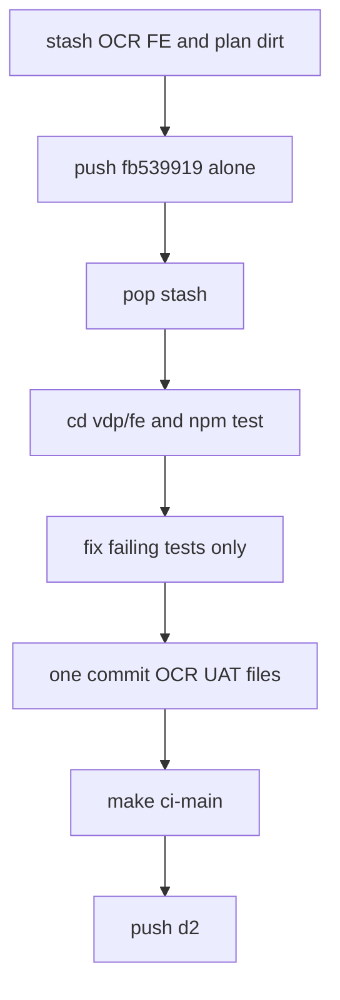

# Ship OCR UAT (clean push)

## Зачем отдельно

Сейчас в одном WT смешаны: уже закоммиченный `fb539919` (plans/corpus), незакоммиченный OCR FE (`return` / `feature-flags` / `extraction` / pages / e2e), правки plan status. Pre-push гоняет `fe-npm-test` по диску → push «лёгкого» коммита краснеет из‑за WIP FE. Правило: **1 план = 1 коммит = 1 push**, clean tree.

Существующий продуктовый план [ocr_uat_unblock_fb43d5c8.plan.md](.cursor/plans/ocr_uat_unblock_fb43d5c8.plan.md) описывает смысл фичи; **этот план — только доставка**: развести → зелёный unit → один коммит → gate → push. Не править compose harden, не трогать pre-commit/pre-push хуки (это планы 2–3).

## Сверка с `.cursor/rules`

**Обязательны:** `планирование-сверка-с-rules`, `vdp-ci-local-gate`, `честность-готовности`, `правила-построения`, `playwright-e2e` / `fe-interaction-contracts` (только не ломать e2e gesture), `mgmt-tg-notify` при закрытии волны (product done).

**Вне scope:** изменение `.githooks` / `precommit-mgmt-notify` / `prepush-gate`; compose retry; Docling OOM; UAT W6/W7; `ocr_feedback_p0` (другой план).

## Слои

| Слой | Scope |
|---|---|
| UI / FE | только уже начатые файлы OCR UAT: [return.ts](vdp/fe/src/lib/api/return.ts), [feature-flags.ts](vdp/fe/src/lib/ved/feature-flags.ts), [extraction.ts](vdp/fe/src/lib/ved/extraction.ts), [forms-new-page.tsx](vdp/fe/src/components/ved/pages/forms-new-page.tsx), [form-detail-page.tsx](vdp/fe/src/components/ved/pages/form-detail-page.tsx) |
| Unit | [return.test.ts](vdp/fe/src/lib/api/return.test.ts), [feature-flags.test.ts](vdp/fe/src/lib/ved/feature-flags.test.ts), [extraction.test.ts](vdp/fe/src/lib/ved/extraction.test.ts) |
| E2E | [ocr-wizard-path.spec.ts](vdp/fe/e2e/ocr-wizard-path.spec.ts) — HITL/degraded assert; path → `ci-main` |
| Docs | [extraction.md](vdp/docs/architecture/extraction.md) только если входит в тот же OCR diff; `docs-format-check` |
| Домен / API / Go / compose hooks | вне scope |

## Порядок исполнения (не смешивать)

1. **Развести:** `git stash push -u` для OCR FE + plan/docs dirt (всё кроме уже закоммиченного). Working tree = clean относительно HEAD. Push `fb539919` на origin (**без** FE на диске). Не `SKIP_PREPUSH_GATE`.
2. **Вернуть stash.** `cd vdp/fe && npm test` с полными правами (не sandbox). Починить только assert/import/mock — не рефакторить соседнее.
3. **Один коммит** только OCR UAT пути (+ extraction.md если нужен для той же волны). Не включать corpus, compose plans, `ocr_feedback_p0`.
4. **QG:** `make check-env-parity` → `cd fe && npm test` → `make ocr-path-gate` (стек уже up) → **`make ci-main`** (есть e2e вне smoke).
5. Push без dirty `vdp/fe` рядом. Notify `done` product language при закрытии (mgmt-tg-notify).

## Рядом не сломать

- Не откатывать `compose-up-with-retry` / wait_pg / logout fixture.
- Не менять pre-commit/pre-push в этом коммите.
- `return.ts`: все вызовы через `apiFetch`; form-detail `retry: false` на episode — не вернуть bare fetch.
- `EMPTY_FLAGS` / `getServerFeatureFlags` — стабильная ссылка; не аллоцировать `{}` в snapshot.
- `OCR_POLL_TIMEOUT_MS = 165_000` > hub 120s; e2e HITL при degraded сохранить.

## DoD

- [x] Corpus/plans commit запушен отдельно при clean tree
- [x] `npm test` в `vdp/fe` зелёный
- [x] Ровно один OCR UAT commit на `d2`, без чужого WIP в том же commit
- [ ] `make check-env-parity` + `make ci-main` зелёные
- [ ] Push без `SKIP_PREPUSH_GATE`
- [ ] mgmt notify done (продуктовый язык) при закрытии волны
