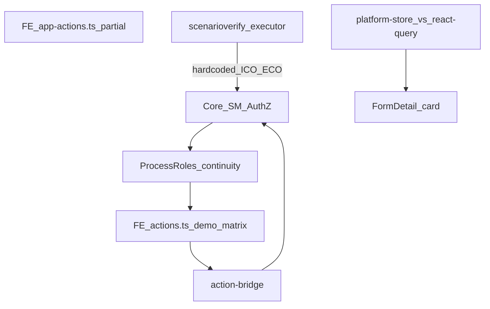
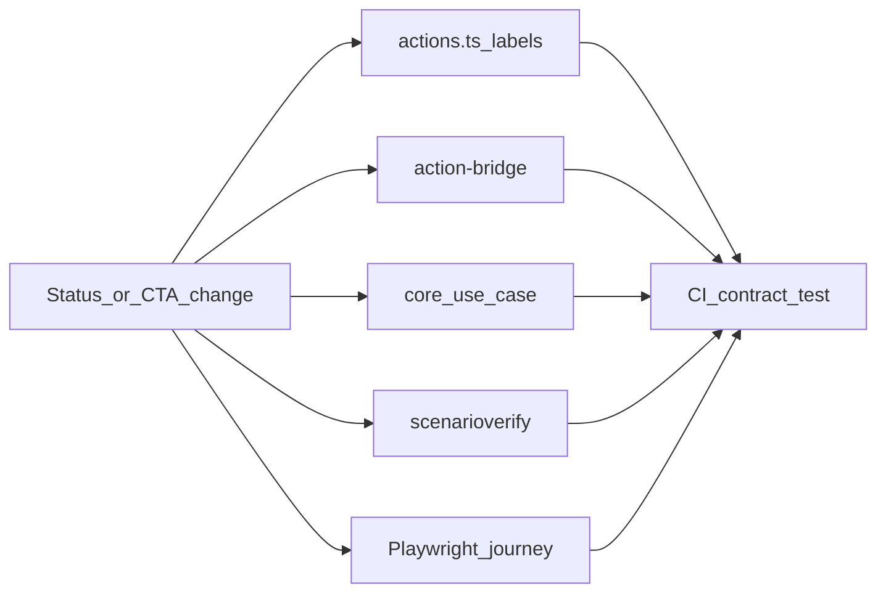

# Стабилизация app-контура: отладка по скриншотам + качество CI

## Сверка с `.cursor/rules`

**Обязательны:** `планирование-сверка-с-rules`, `базовые-правила-инструмента`, `правила-построения`, `честность-готовности`, `тесты-архитектуры`, `use-cases`, `безопасность-ролей-и-данных`, `интеграция-и-события`, `чистая-архитектура`, `ui-web-практики` + `ux-*`, `playwright-e2e`, `go-testing`, `развертывание-и-доставка`, `devops-культура`, `vdp-fe-docker-пересборка` (пересборка FE volume только после явного «да»).

**Вне scope этой волны:** Ollama/own extraction (отдельный план), Nest parity, prod PRIMARY OCR, ML auto-approve, silent `compose-fe-refresh`.

**Gate/DoD:** unit на seed wipe / continuity copy / confirm→card sync; scenarioverify mutating green при ICO/ECO off; Playwright reject-path + manager continuity CTA; честный текст в known-gaps (каталог ≠ «сделки в системе»).

---

## Системный диагноз (почему «правки не везде»)

Многие баги из скринов — **не один дефект UI**, а рассинхрон слоёв:

| Точка касания | Факт | Следствие |
|---|---|---|
| CTA UI | [`ActionPanel`](vdp/fe/src/components/ved/ActionPanel.tsx) всегда берёт [`actionsFor`](vdp/fe/src/lib/ved/actions.ts) (demo-матрица + continuity inject) | Manager при выкл. ICO видит **ICO-лейблы** («передать во внешний комплаенс») |
| App matrix | [`app-actions.ts`](vdp/fe/src/lib/ved/app-actions.ts) — частичная, почти не используется панелью | Ложное ощущение «в app уже правильные CTA» |
| Continuity | [`continuityInjectedActions`](vdp/fe/src/lib/ved/actions.ts) копирует MATRIX ICO/ECO **как есть** | Копирайт про ECO, которого нет в процессе |
| Seed org | [`seed.Dev`](vdp/core/internal/repository/seed/seed.go): `OrgNotApproved` | Каждая заявка → `organization_*`, даже при U→M→P |
| Scenario runner | [`advanceCompliance`](vdp/core/internal/scenarioverify/executor.go) всегда бьёт ICO/ECO API | Ошибки «у роли нет права» на `/testing` (скрин 6) при continuity |
| Карточка | `fromStore` побеждает `formQuery` в [`form-detail-page.tsx`](vdp/fe/src/components/ved/pages/form-detail-page.tsx) | После confirm OCR параметры могут не обновиться |
| CI PR | playwright: только login + user-submit; integration условный | UX/continuity/runner регрессии не блокируют merge |
| FE Docker | volume `fe_node_modules` | UI-правки кода видны, но deps/sync легко «не применить» без refresh |

**Зафиксированное решение волны:** пилотный стержень = U→M→P (ICO/ECO off), как в [чеклисте преемственности](заметки/vdp-чеклист-преемственность-ручное-тестирование-2026-09-07.md). Runner, seed org, continuity CTA и копирайт должны этому соответствовать.

---

## Пункт 1 — Seed Core API: только пользователи ролей + документ

### Аналитика
- [`seed.Dev`](vdp/core/internal/repository/seed/seed.go) **уже не создаёт заявки** — только accounts, 2 org, 3 counterparties, 2 work chats.
- «11 сделок» в футере = `store.forms.length` из Postgres volume ([`VedAppShell`](vdp/fe/src/components/ved/VedAppShell.tsx)), накопленные `/testing` + ручные тесты, **не** длина каталога сценариев.
- Учётки уже частично в [`app-seed-accounts.ts`](vdp/fe/src/lib/ved/app-seed-accounts.ts) (нет **bank**) и в чеклисте (нет bank).

### Работы
1. **Wipe заявок при старте local/compose (не prod):** после `seed.Dev` — очистка forms / compliance history / scenario runs (idempotent), либо Makefile `make core-seed-reset` + вызов из compose entry/docs runbook. Цель: чистый реестр после `compose-up`.
2. **Урезать seed «лишних» сущностей:** убрать seed counterparties и work chats из `Dev` (оставить accounts + org клиента + bank org — без org user login ломается). Справочники контрагентов пользователь создаёт сам / тесты создают по месту.
3. **Документ** [`заметки/vdp-seed-пользователи-app.md`](заметки/vdp-seed-пользователи-app.md): все роли из seed (user, manager, ico, eco, provider, root, **bank**), email/password (= local-part), UUID, org INN, правило «пароль = local-part», app vs demo emails, ссылка на `seed.go` / `APP_SEED_ACCOUNTS`.
4. Синхронизировать `APP_SEED_ACCOUNTS` с bank; personName как в core (`Ivan Petrov` / `Manager Seed`…).

### DoD
- После reset: forms=0, login всех ролей ок.
- Документ в `заметки/` полный; тесты seed не ломаются (создают свои forms в unit).

---

## Пункт 2 — Убрать вызов контекстного меню с ячейки таблицы

### Аналитика
[`RowNavContextMenu`](vdp/fe/src/components/ved/RowNavContextMenu.tsx) вешает **left-click и right-click** на любой `td` / `tr` внутри shell: меню «Рабочие чаты / Профиль / Справочники» — навигация, не row-actions. Конфликт с кликом по строке реестра (скрин 21.26.27).

### Работы
1. Убрать left-click (`click` listener) с ячеек таблицы полностью.
2. Right-click: либо тоже убрать с `td`/`tr` реестра, либо оставить только на явных `[data-row-menu]` (по умолчанию — **убрать с таблиц**; профиль остаётся в header shell).
3. Тест: клик по строке `/forms` открывает карточку, меню не появляется.

### DoD
- Реестр: ЛКМ → навигация в заявку; контекстное nav-меню с ячеек не вызывается.

---

## Пункт 3 — «Возвращена на коррекцию»: что делать и где

### Аналитика
- Статус `form_waiting_corrections`; баннер «ВОЗВРАТ… / Отметка: Курс не согласован» — это **свободная отметка** из history ([`rejectMark`](vdp/fe/src/components/ved/pages/form-detail-page.tsx)), не привязка к UI курса.
- Клиентский CTA: «Отправить исправления» ([`app-actions` / `actions`](vdp/fe/src/lib/ved/actions.ts)) — повторный submit **без** чеклиста «что править» и без экрана согласования курса ([`SetRate`](vdp/core/internal/service/form_payment.go) есть в core, в карточке коррекции не выведен).
- Ожидание «согласуйте курс» ≠ доступный контрол → путаница (скрин 21.23.52).

### Работы
1. Блок «Что исправить» под баннером возврата: маркированный список из `rejectMark` + `rejectText`; явный next-step: какие секции открыть (параметры / документы / курс).
2. Если отметка содержит курс/rate (или mark id из compliance tools): показать секцию **согласования курса** (read rate + confirm / поле) на статусе коррекции для user; иначе — честный текст «уточните у менеджера / приложите документ».
3. После правок primary остаётся «Отправить исправления»; disabled с причиной, если обязательное по mark не тронуто (минимально — курс, если mark про курс).
4. Unit/UI copy test + e2e reject-path уже ждёт title «Возвращена на коррекцию» — расширить assert видимости guided block.

### DoD
- На коррекции клиент видит: причину → конкретные поля/секции → CTA submit; курс не «висящий» текстом без места действия.

---

## Пункт 4 — Карточка: сумма, контрагент, кнопка про комплаенс

### Аналитика (скрин 21.22.55, роль Manager)
1. **CTA «Одобрить и передать во внешний комплаенс»** — inject ICO matrix на manager при disabled ICO ([`continuityInjectedActions`](vdp/fe/src/lib/ved/actions.ts)); лейбл врёт, если ECO тоже off.
2. **Контрагент «—»** — `counterparty_id` пустой при create/OCR; seed CP убраны → lookup пуст; OCR confirm **не** пишет counterparty.
3. **Сумма** — `ConfirmExtraction` пишет `InvoiceAmount`/`Currency` в form, но UI часто показывает stale `fromStore` раньше свежего API.

### Работы
1. Continuity CTA: отдельные лейблы для manager-bypass, напр. «Одобрить организацию и продолжить» / «Подтвердить заявку (без внешнего комплаенса)» — **без** упоминания ECO, если slot disabled.
2. Seed org для пилота: `OrgApproved` (+ IsActive), чтобы U→M→P не упирался в org-stage без нужды; сценарий ICO остаётся отдельным (`ico_org_pending_approve`) с org not-approved probe.
3. Create/detail: обязательный контрагент или явный empty-state «не выбран — укажите в параметрах» + deep-link; не показывать сырой UUID.
4. Form detail data source: после invalidate — приоритет `formQuery.data` над store в app mode (или sync store из query onSuccess confirm/actions).
5. Тесты: continuity labels; mapper amount после confirm; manager не видит ECO wording.

### DoD
- Manager на org/form bypass: корректный копирайт и действие, согласованное с process-roles.
- Карточка показывает актуальную сумму после confirm; контрагент либо имя, либо честный empty CTA.

---

## Пункт 5 — «Распознанные данные»: зачем и был ли save

### Аналитика (скрин 21.22.02)
- Панель [`ExtractionReviewPanel`](vdp/fe/src/components/ved/ExtractionReviewPanel.tsx): кнопка **«Подтвердить распознавание»** (не «Сохранить»); после confirm — только текст gold; **нет toast** и нет подсветки, что параметры заявки обновились.
- На статусе org-waiting у user actions=0 → кажется, что OCR «бесполезен».
- Поля editable до confirm; без кнопки легко решить, что «уже сохранилось».

### Работы
1. Копирайт панели: зачем HITL (данные попадут в сумму/валюту/договор заявки + gold); отличие от submit заявки.
2. Toast/inline success: «Сохранено: сумма X, валюта Y» + scroll/highlight блока «Параметры заявки».
3. Пока `mutation.isSuccess` кратко; при ошибке — уже есть destructive text.
4. Если роль не может confirm (нет cap / чужой статус) — disabled inputs + причина, не «тихие» поля.
5. Vitest panel + API confirm sync test.

### DoD
- Пользователь понимает: confirm ≠ submit; после confirm видно изменение параметров.

---

## Пункт 6 — «Проверка сценариев» и «фиксированные 11»

### Аналитика (скрин 21.32.56)
- Каталог **намеренно фиксированный**: 11 id в [`scenarioverify/catalog.go`](vdp/core/internal/scenarioverify/catalog.go) (`Catalog returns the fixed scenario list`).
- Кнопка «Запустить проверку (N)» = число **выбранных** сценариев; футер «сделок: 11» = **forms in DB**, совпадение числа случайно.
- Падения «нет права» / «не тот статус»: [`advanceCompliance`](vdp/core/internal/scenarioverify/executor.go) всегда ICO→ECO, а process-roles continuity запрещает эти роли — runner **не выровнен** с продуктом.

### Работы
1. **Runner continuity path:** если ICO/ECO disabled — approve org/form через manager continuity API (те же действия, что UI inject), не через ico/eco tokens.
2. UI `/testing`: подпись «В каталоге N сценариев (фиксированный набор)» + отдельно «Заявок в БД: M»; не смешивать.
3. Refund smoke: сейчас fail при **успешном** запрете отмены — инвертировать assert (OK когда cancel forbidden).
4. UI-only сценарии (`manager_hides_drafts`, `doc_preview_visible`) в API mutating помечать dry_run/skip с честной деталью, не красным «сбой» без смысла.
5. Опционально: кнопка «Очистить тестовые заявки» (root) → тот же wipe, что п.1.

### DoD
- Mutating happy/reject/provider green при default continuity (ICO/ECO off).
- Пользователь не путает каталог со счётчиком сделок.

---

## Волна Q — Качество CI/CD (чтобы точки касания не расходились)

1. **Контрактный тест одного источника CTA:** table-driven: status × role × processRoles → labels/coreAction; запрет ECO wording при disabled ECO.
2. **Scenarioverify unit** на continuity path (mock AuthZ).
3. **PR playwright расширить** минимум: `reject-path` + один manager continuity CTA (или tag `smoke` из catalog), не только login/user-submit — иначе п.2–4 снова проскочат.
4. **integration-gate / release-gate:** явный шаг «scenario catalog mutating subset» через core test или compose; задокументировать в [`e2e-coverage-matrix.md`](vdp/docs/development/e2e-coverage-matrix.md) честно.
5. **Чеклист touchpoints** в known-gaps коротко: FE matrix / app-actions / bridge / core AuthZ / process-roles / scenario runner / Playwright — любой статусный UX меняет ≥3 слоя.
6. Перед ручной приёмкой: спросить про `make compose-fe-refresh` (rule), не запускать без «да».

---

## Порядок исполнения

| Wave | Фокус | Зависит |
|------|--------|---------|
| W0 | Seed wipe + doc пользователей + bank в APP_SEED | — |
| W1 | RowNavContextMenu off tables | — |
| W2 | Continuity CTA copy + seed OrgApproved + formQuery priority + empty counterparty | W0 |
| W3 | Correction guided UX (+ rate if mark) | W2 |
| W4 | Extraction confirm feedback + sync | W2 |
| W5 | Scenario runner continuity + /testing copy + refund assert | W0, W2 |
| W6 | CI contract + playwright smoke expand + matrix honesty | W5 |

Параллельно после W0: W1 ∥ старт W2.

---

## DoD стабильной версии (волна целиком)

- [ ] App compose: после reset 0 заявок; все seed-роли логинятся; документ в `заметки/`
- [ ] Реестр без nav-меню с ячеек
- [ ] Коррекция: понятно что/где править; курс не «текстом в пустоту»
- [ ] Manager continuity без ECO-лейбла; сумма/контрагент честные
- [ ] OCR confirm даёт явный feedback и обновляет параметры
- [ ] `/testing` mutating green на continuity; каталог ≠ счётчик сделок
- [ ] CI ловит рассинхрон matrix/runner на PR (не только login)
- [ ] Нет утверждения «100% паритет всех ролей×статусов»
