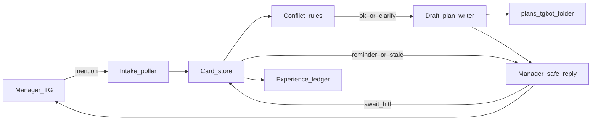

# План: TG-бот — планы HITL без техдеталей для менеджера

## Объём (зафиксировано: п1)

В scope:

1. Черновик **плана работ** из вводной менеджера (правила + эвристики, не ML-истина).
2. В общем чате: **предложение по реализации + сроки** + вопрос «выполнить?» + статусы; при тишине — мягкий возврат позже.
3. Накопление опыта (исходы approve / отказ / тишина / найденные противоречия) для улучшения шаблонов — **не** обучение модели на Cursor IDE.

Вне scope этого этапа: автозапуск Cursor/агента, авто-QG, деплой alpha, смена статусов заявок VDP, `notify-mgmt` как канал разбора вводных.

База: уже есть транспорт+простой analyze в [`инструменты/поток-вводных/`](инструменты/поток-вводных/) (волны A/B плана mention/analyze).

## Контрольный образ для менеджера (чатовый UX)

Менеджер (или вы) в супергруппе видит **только деловой язык**, например:

- принято / нужно уточнение (один вопрос);
- «вижу противоречие: …» (простыми словами);
- «предложение: сделать X; ориентир по сроку: ~N раб. часов (или полдня / 1–2 дня)»;
- «план готов — выполнить?» (да/нет или короткая реакция с @ботом).

Строгий запрет в ответах бота менеджеру (и в любых статусах в этот чат от intake):

- пути репозитория, `.cursor/plans/…`, имена файлов, PR/commit URL, `localhost`, команды (`make`, `go test`, docker), названия IDE/моделей/раннеров, внутренние id модулей как «для клика»;
- эхо сырого текста с ПДн; разбор только после redact.

Технический артефакт **существует**, но **не упоминается** в чате: eng открывает папку сам.

Опора: дух [`mgmt-tg-notify`](.cursor/rules/mgmt-tg-notify.mdc) + отдельный санитайзер **manager-facing** для intake (строже: zero tech surface).

## Куда складывать планы работ

Каталог: [`.cursor/plans/тгбот/`](.cursor/plans/тгбот/) (создать).

- Один markdown на карточку вводной: id карточки, суть (redact), класс, конфликты, шаги черновика, оценка, статус HITL (`draft` / `awaiting_approve` / `approved` / `declined` / `stale`).
- Имена без секретов: например `card-<chatShort>-<messageId>.md` или стабильный `card-id` из store.
- В git — да (чтобы «изучать в любой момент»); ПДн в файле не класть (тот же redact).
- Путь записи: config `INTAKE_WORKSPACE` / корень репо; поллер пишет файл **только** на диск для eng.

## Сроки

Источник: [`заметки/ориентир-скорости-2026-08-25.md`](заметки/ориентир-скорости-2026-08-25.md) (~**3.8 todo/ч** как календарный ориентир).

В модуле: эвристика размера волны → число «условных todo» → часы → округление до понятной фразы для менеджера («около 2–3 часов», «около одного рабочего дня»). В eng-файле можно кратко указать базу ориентира; **в чат формулу и файл не слать**.

## Противоречия и конфликты

Детектор в `internal/` (правила):

- тег/класс vs текст (например `#баг`, а текст про «добавить фичу»);
- в треде карточки: новое сообщение опровергает предыдущее («не делать X» после «сделать X»);
- пустой/шумный вход при просьбе «сделать план».

В чат: одно короткое предупреждение + при необходимости **один** уточняющий вопрос (Hick). В eng-плане и experience — флаг `conflicts[]`.

## Тишина → вернуться позже

Карточка в `awaiting_approve` / `awaiting_clarify`:

- не спамить; один soft-reminder через конфигурируемый интервал (например 24ч, env);
- демон intake при опросе проверяет due reminders;
- после N напоминаний без реакции → `stale`, в чат одна фраза «отложили, напишите @бот когда продолжим» — дальше молча до нового @mention.

## Опыт («учится на Cursor» — урезанно и честно)

Не ML на IDE. В `~/.vdp-intake/experience/` (jsonl вне git или redact):

- исход HITL, размер оценки vs факт (факт вручную/позже), были ли конфликты, rejected draft.

Позже шаблоны планов подстраиваются по этой ленте. Cursor остаётся **вне** автозапуска на этом этапе.

## Поток

## Волны реализации

### C — Карточка + manager-safe коммуникация + конфликты

Расширить [`инструменты/поток-вводных/`](инструменты/поток-вводных/):

- store карточки (связь update/message, статус, last_ask_at);
- `internal/comms` санитайзер + шаблоны без tech;
- conflict rules + unit;
- reply: clarify / conflict / status — без путей и ссылок на планы.

### D — Черновик плана + сроки + «выполнить?»

- `internal/plan` / `estimate`: размер → часы по ориентиру скорости;
- запись markdown в `.cursor/plans/тгбот/`;
- в чат только предложение + срок + «выполнить?»;
- реакция да/нет (mention + ключевые слова) → статус approved/declined + деловой ack; **код/деплой не стартуют**.

### E — Experience + soft re-engage

- ledger исходов;
- reminder/stale в демоне;
- unit на reminder/sanitize/estimate; ручной сценарий в супергруппе без утечки tech в ответе.

## Сверка с `.cursor/rules` (MUST)

| Rule | Как применяем |
|------|----------------|
| `планирование-сверка-с-rules`, `базовые-правила-инструмента`, `workspace-карта` | Side-tool intake; не ядро заявки; планы тгбот — eng-артефакты в `.cursor/plans/тгбот/`. |
| `честность-готовности` | Не обещать авто-Cursor/QG/alpha; «опыт» ≠ обученная модель. |
| `безопасность-ролей-и-данных`, `поддержка-и-обратная-связь` | Менеджеру — zero tech surface; redact; без ПДн в планах/логах. |
| `mgmt-tg-notify` | Разбор вводных и HITL — только `@vdp_intake_bot`; не слать draft/анализ через `notify-mgmt`. Релизные пинги mgmt — отдельный контур (можно позже стыковать статусом «поставка», без путей). |
| `машинное-обучение` HITL | Класс/оценка — эвристики; approve только человек; запрет auto-pay/статусов заявки. |
| `ux-когнитивная-нагрузка`, `ux-взаимодействие-и-скорость` | Один вопрос за ход; быстрый ack; soft reminder без простыни. |
| `границы-и-контексты`, `чистая-архитектура`, `solid`, `детали-как-плагины`, `screaming-architecture` | Политика карточки/плана внутри модуля; Telegram — адаптер. |
| `интеграция-и-события`, `устойчивость-и-наблюдаемость`, `go-*`, `тесты-архитектуры`, `правила-построения` | Dedupe update_id; correlation в логах без ПДн; unit + узкий ручной journey. |
| `развертывание-и-доставка`, `devops-культура` | Тот же compose модуля; секреты снаружи; CI = `go test` job `intake`, не `make ci-pr`. |

Вне scope rules: `use-cases`/статусы VDP, nest/FE/playwright, `vdp-fe-docker-пересборка`, serverless как носитель истины, полный IN3 «автоплан в работу без HITL».

### Gate / DoD

- В чате есть предложение + срок + «выполнить?» **без** путей/ссылок на `.cursor/plans`.
- Файл черновика появляется в `.cursor/plans/тгбот/` и открывается eng вручную.
- Конфликт → понятное предупреждение менеджеру.
- Нет реакции → soft reminder → stale без спама.
- Experience jsonl пишет исход HITL.
- Unit green; токен не в git; hub не трогаем; статусы заявок не меняются.
- Честно: выполнение работ / QG / alpha = **0%** этого этапа.
