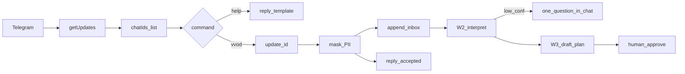

# Поток вводных Telegram → backlog

## Цель

Мост «чат → артефакт → агент → волна 2–3 дня» как **dev-инструмент**, не продукт. Источник истины статусов/ролей остаётся в домене VDP.

Уже проверено: `@vdp_intake_bot`, privacy ON, webhook пуст, группа `chat_id=-5437125886`, `/vvod проверка связи`. Кода модуля нет.

## Решения (уточнения)

- Inbox: `~/.vdp-intake/inbox/`; ретеншн бессрочный, чистка руками.
- Ack: reply на `/vvod`, текст «принято», без эха (ПДн).
- Поллер: `--once` и без флага — бесконечный цикл.
- Авторы W0: любой участник allowlist-чата (не username-allowlist).
- Чаты: сейчас один; конфиг сразу как список (`TELEGRAM_INTAKE_CHAT_IDS`), чтобы потом добавить чаты без переделки фильтра.
- Команды W0: `/vvod` (+ `/vvod@vdp_intake_bot`) и `/help` с кратким шаблоном 6 полей.
- BotFather: не молча; после кода — готовый список команд и шаги `/setcommands` (п.А для вас).
- W1: и шаблон, и свободный текст — `/help` с шаблоном в W0; свободный `/vvod` принимается; soft-parse и `needs_clarify` — волна W1, ужесточение после 5–10 реальных сообщений.
- Рантайм W0: отдельный Docker Compose **в модуле**, не сервис в [`vdp/docker-compose.yml`](vdp/docker-compose.yml) и не hub. Токен/inbox — volume/env с хоста, не в образе.
- CI: отдельный job в [`.gitlab-ci.yml`](.gitlab-ci.yml), `go test` модуля; `changes` на `инструменты/поток-вводных/**` (сейчас `fast` смотрит только `vdp/**`).
- W2 уточнение: бот пишет **один** вопрос в тот же чат; в wave карточка не попадает.
- Волна 2–3 дня: драфт агента, **всегда утверждает человек** (не авто-P0).
- W4 allowlist авторов — не нужен, пока не решите иначе.

## Сверка с `.cursor/rules`

**Обязательны:** `планирование-сверка-с-rules`, `базовые-правила-инструмента`, `границы-и-контексты`, `детали-как-плагины`, `screaming-architecture`, `чистая-архитектура`, `solid`, `безопасность-ролей-и-данных`, `интеграция-и-события`, `устойчивость-и-наблюдаемость`, `развертывание-и-доставка` (отдельный артефакт/контейнер, секреты снаружи), `go-architecture`, `go-testing`, `go-resilience-security`, `тесты-архитектуры`, `правила-построения`, `поддержка-и-обратная-связь`, `честность-готовности`, HITL из `машинное-обучение`, Hick/Miller из `ux-когнитивная-нагрузка`, Doherty из `ux-взаимодействие-и-скорость` (ack reply).

**Вне scope:** `nestjs-*`, `playwright-e2e`, `vdp-fe-docker-пересборка` (не спрашивать refresh FE), статусы/платежи/AuthZ продукта, webhook на intake-боте, `vdp_notify_bot` / [`vdp/hub/internal/adapters/telegram/webhook.go`](vdp/hub/internal/adapters/telegram/webhook.go), ML-скоринг как истина, авто-merge, авто-утверждение волны.

**Gate продуктовых волн из backlog (после W3):** unit на переход и чужую роль; идемпотентность денег если payment; без ПДн у Provider; нет «100%» без DoD; без лишней документации.

## Граница

Каталог: [`инструменты/поток-вводных/`](инструменты/поток-вводных/). Module: `github.com/viletech/tools/intake`. Не импортировать hub.

Секреты: `~/.vdp-intake/env` (`TELEGRAM_INTAKE_TOKEN`, `TELEGRAM_INTAKE_CHAT_IDS=-5437125886`). Inbox: `~/.vdp-intake/inbox/YYYY-MM-DD.jsonl`. Seen: `~/.vdp-intake/seen/update_ids`. В git только код.

Чужой `chat_id` и не-команды — молча. `/help` — ответ с шаблоном, без записи в backlog-jsonl (или служебная метка `kind=help`, не карточка).

## W0 — транспорт + ops (исполнять первым)

Структура: `cmd/intake`, `internal/telegram`, `internal/normalize`, `internal/redact`, `internal/store`, `internal/config`.

Поля jsonl `/vvod`: `update_id`, `message_id`, `chat_id`, `from_id`, `from_username`, `command`, `text` (redact), `received_at`.

HTTP: timeout, backoff 429/5xx; ack best-effort; файл — истина intake.

Docker: `инструменты/поток-вводных/docker-compose.yml` + Dockerfile; `INTAKE_HOME=/var/lib/vdp-intake`; mount хостового `~/.vdp-intake`; один контейнер = один процесс поллера (`развертывание-и-доставка`). Не добавлять сервис в compose VDP.

CI: job `intake` stage `fast`, image `golang:1.22`, quoted path `инструменты/поток-вводных`, `go test ./...`. Не раздувать существующий job `fast` (там fe + `vdp` make).

BotFather (п.А, вы делаете в Telegram): агент отдаёт готовый список:

- `vvod` — ввод в поток (баг / доработка / вопрос)
- `help` — шаблон полей

**DoD W0**

- `go test ./...`: parse `/vvod` и `/vvod@bot`, `/help`, ignore прочее, dedupe, redact, ack/help без исходного текста пользователя
- `--once` и цикл собираются
- Docker: контейнер стартует с env с хоста; токена нет в образе и в git
- GitLab job на изменения модуля
- ручной `/vvod` → jsonl + reply «принято»; `/help` → шаблон
- инструкция BotFather отдана в чате агента
- `vdp/hub` не меняется
- честно: скелет транспорта+ops; интерпретация/приоритет = 0%

**Вне W0:** hard-валидация 6 полей, классификация, WSJF, Cursor Automation, ретеншн-cleaner.

## W1 — контракт (после накопления)

Шаблон тот же, что в `/help`. Soft-parse свободного текста + полей; неполный → `needs_clarify` (пока без жёсткого отказа W0). После 5–10 реальных `/vvod` — ужесточение и при необходимости правка шаблона.

DoD: unit на теги и поля; фикстуры с реальных (уже redact) сообщений, без ПДн в git.

## W2 — интерпретация

Классификация `bug|gap|change|confused|noise`, слой, роль матрицы, card id = `chat_id:message_id`. Один вопрос бота в чат при low confidence. Конфликт с [`вводные/`](вводные/) → «решение владельца». `confused` → UX/копирайт.

## W3 — волна 2–3 дня

P0–P3 + WSJF-lite, size 1/3/5, ёмкость в todo plan-файла, ориентир [`заметки/ориентир-скорости-2026-08-25.md`](заметки/ориентир-скорости-2026-08-25.md) как нижняя граница. Scope режется, gate нет. Человек утверждает `.cursor/plans/` до кода продукта.

## Честная готовность сейчас

Транспорт вручную ~40% (нет кода). W0–W3 = 0%. End-to-end не готов.

## Первый шаг после утверждения

Только W0 по этому документу. W1+ — следующие волны после DoD W0.
