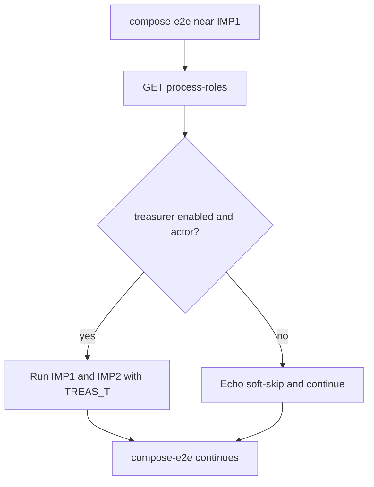

# Адаптация gate под выключенного казначея

## Контекст

Локальный тюнинг process-roles (казначей `enabled: false`, `capabilities: null`) ломал UI и краснел `compose-e2e` на IMP1. Часть фикса уже в рабочей копии: нормализация null на FE/API и временный force-enable treasurer перед IMP1. Цель плана — **оставить защиту UI**, **убрать force-enable**, сделать тест честным к snapshot.

## Сверка с rules

**Обязательны:** `планирование-сверка-с-rules`, `честность-готовности`, `plan-закрытие-и-dod`, `vdp-ci-local-gate`, `тесты-архитектуры`, `use-cases`, `безопасность-ролей-и-данных`, `интеграция-и-события` (статусная машина в домене, UI/тест — проекция).

**Вне scope:** UX «на кого переложить / убрать шаг»; continuity для `treasurer.ops` в домене; Playwright/`@pilot-matrix` правки; `compose-fe-refresh`; docs/mgmt notify.

**Gate в DoD:** `make check-env-parity` → unit FE (`process-roles` / filter) + при необходимости Go HTTP → `make ci-pr-fast` (включает `compose-e2e`). Полный `ci-pr-pilot` — только если после правок снова гоняете Pilot перед публикацией; для этого diff достаточно `ci-pr-fast`.

## Слои

| Слой | Scope |
|---|---|
| UI / FE | Уже: [`process-roles-page.tsx`](vdp/fe/src/components/ved/pages/process-roles-page.tsx), [`process-roles.ts`](vdp/fe/src/lib/api/process-roles.ts) `normalizeProcessRoles`, [`process-role-filter.ts`](vdp/fe/src/lib/ved/process-role-filter.ts). Довести/проверить unit. |
| API | Уже: [`process_roles_routes.go`](vdp/core/internal/transport/http/process_roles_routes.go) — `nil` caps → `[]`. Домен статусов **не** меняем. |
| Compose | Главная работа: [`compose-e2e.sh`](vdp/scripts/compose-e2e.sh) — убрать блок force-enable (~362–369), читать snapshot, ветвить IMP1/IMP2. |
| Unit | FE: расширить/оставить тест `normalizeProcessRoles`. Go: существующий HTTP suite достаточно, если caps уже `[]`. |
| E2E browser | Вне scope. |
| Seed / CI default | Без смены seed: в [`role_config.go`](vdp/core/internal/domain/formpayment/role_config.go) treasurer по умолчанию `Enabled: true` — на чистой/CI среде soft-skip не сработает. |

## Реализация

1. **Сохранить** нормализацию null capabilities (FE + GET handler) и unit на coerce null → `[]`.
2. В [`compose-e2e.sh`](vdp/scripts/compose-e2e.sh):
   - Удалить `ensure treasurer process slot for IMP1/IMP2` (PUT force-enable).
   - Перед IMP1: `GET /api/v1/process-roles` с `$ROOT_T` (уже есть после RD8), python-проверка: роль `treasurer`, `enabled == true`, `influence == "actor"`.
   - Если да — текущие IMP1 + IMP2 без изменений.
   - Если нет — `echo` явного soft-skip (reason: treasurer slot off), **не** вызывать `/treasurer/.../confirm-payment`, не `exit 1`, продолжить скрипт.
3. При необходимости одна проверка в [`test-cd-scripts.sh`](vdp/scripts/test-cd-scripts.sh): что compose-e2e **не** содержит force-enable PUT на treasurer перед IMP1 (зеркало существующим grep-контрактам continuity).
4. Ручной/локальный repro: с выключенным казначеем — `/process-roles` открывается; `compose-e2e` soft-skip IMP1/IMP2; после включения казначея — IMP1/IMP2 снова полные.

## DoD

- [ ] `/process-roles` не падает при `capabilities: null` у выключенной роли
- [ ] Нет force-enable treasurer в `compose-e2e` перед IMP1
- [ ] Snapshot-ветка: on → IMP1/IMP2; off → soft-skip с понятным логом
- [ ] Unit FE на normalize зелёный
- [ ] `make check-env-parity` + `make ci-pr-fast` зелёный (или честный fail с причиной вне этого scope)
- [ ] Todos + DoD в plan-файле закрыты (`plan-закрытие-и-dod`)

## Follow-up (не в этом плане)

Домен + UI: при выключении казначея — delegate на роль или skip шага в статусной машине; затем заменить soft-skip на реальные ветки happy-path.
