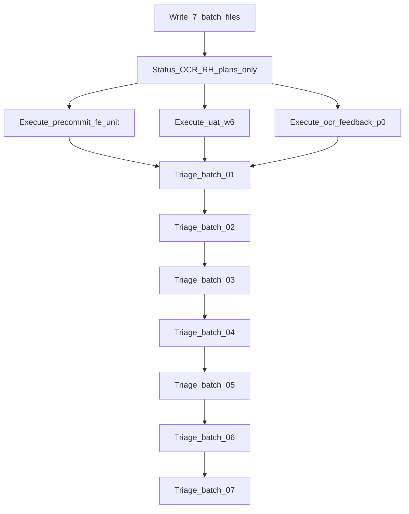

# Единый backlog pipeline (merge)

**Заменяет и поглощает:**
- [safe_backlog_pipeline_0c5a3c9f](/Users/levpogosov/.cursor/plans/safe_backlog_pipeline_0c5a3c9f.plan.md) — lanes A/B/C, anti-rollback
- [missing_work_plans_dcef49ea](.cursor/plans/missing_work_plans_dcef49ea.plan.md) — 7 batch × полные списки 73 планов, шаблон triage, verify-counts

После approve: один канон = этот файл; два старых → `cancelled` / overview «superseded by unified_backlog_pipeline».

## Факты (комментарии учтены)

- Ship OCR **уже закрыт**: [ship_ocr_uat_clean](.cursor/plans/ship_ocr_uat_clean_a5051c51.plan.md) все todos `completed`; tip `3309e283` на `origin/d2` (`ahead 0`). **Не** гонять снова `ci-main`/push.
- Каталог: **329** open todos в **73** планах. «73 туду по 10, последний 13» = **73 каталожных плана** (не 73 atomic product-todo).
- Приоритетный кластер закрывает **28** (14 meta OCR/RH + 14 product Lane C); остальное — triage batch.
- RH0–RH4 / compose harden: код есть → **только status**, не re-impl.
- Product Lane C уже спланированы отдельными файлами — **не дублировать** содержимое в batch; batch = очередь triage со ссылкой.
- WT сейчас: dirt в `.cursor/plans/*` + untracked ship/precommit; `vdp/**` чистый.

## Цифры

| Метрика | Значение |
|---|---|
| Open в каталоге | 329 todos / 73 плана |
| Закроет приоритет (OCR/RH status + Lane C) | 28 todos |
| Batch-покрытие (из missing_work_plans) | 73 плана → 7 файлов (10+10+10+10+10+10+13) |
| После приоритета останется open ≈ | 301 (чужой backlog → triage) |

## Сверка с `.cursor/rules`

**Обязательны:** `планирование-сверка-с-rules`, `базовые-правила-инструмента`, `правила-построения`, `vdp-ci-local-gate`, `честность-готовности`, `mgmt-tg-notify` (закрытие product-волн), `vdp-fe-docker-пересборка` (спросить до refresh), `unexpected-main-fail-postmortem` при неожиданном red main.

**Вне scope:** silent `release-gate`; rewrite CI/Makefile/compose; big-bang 329 todos одним PR.

## Анти-откат и анти-помехи

- Не трогать `vdp-ci.yml` / `release-gate` / `compose-up-with-retry` / wait_pg / logout fixture / OCR tip `3309e283`.
- Не `SKIP_PREPUSH_GATE`; не ослаблять path-gate / mounts / gesture E2E.
- Compose flake → CD, не продукт.
- Status-sync ≠ product commit.
- Не параллелить W6 browser и `ci-main`/feedback на одном compose.
- Batch = triage-очередь, не параллельный rewrite всех волн.
- FE Docker refresh — только после «да».

## Порядок исполнения

Lane C после meta — по одному (не смешивать коммиты). Запись 7 batch-файлов можно параллельно; **исполнение** triage — строго batch 01→07.

### Фаза 0 — артефакты (merge + missing_work_plans)

1. Канон = этот unified в [`.cursor/plans/`](.cursor/plans/).
2. Создать 7 файлов `open_plans_batch_0N_*.plan.md` по **полным спискам** ниже (todos `write-batch-01`…`07` + `verify-batch-counts`).
3. Пометить safe_backlog + missing_work_plans superseded/cancelled.
4. Не переписывать тела `precommit_fe_unit` / `uat_w6` / `ocr_feedback_p0` / ship / compose.

### Фаза 1 — metadata (бывший Lane A status + Lane B)

Без `vdp/**`. Один plan-only commit:

- OCR: `ocr_uat_unblock` (`repro`, `e2e-hitl-assert`, `qg-uat`) + `ocr_path` (`ocr-path-verify-fix`) → `completed` (доказательство: ship + `3309e283`).
- RH0–RH4: 10 оставшихся pending → `completed` (якорь `6afc6f7a`+).

### Фаза 2 — product Lane C (существующие планы)

1. [precommit_fe_unit](.cursor/plans/precommit_fe_unit_e03035eb.plan.md) → gate **`make ci-pr-fast`**.
2. [uat_w6](.cursor/plans/uat_w6_role_cabinets_browser.plan.md) → живой browser; gate `ci-pr-pilot` или `ci-main` по path.
3. [ocr_feedback_p0](.cursor/plans/ocr_feedback_p0_132b4b56.plan.md) → `ci-pr-pilot` (+ `ci-main` если e2e вне smoke).

### Фаза 3 — triage 73 планов (содержимое missing_work_plans, inlined)

#### Шаблон одного batch-плана

Каждый файл `open_plans_batch_0N_*.plan.md` в `.cursor/plans/`:

- **overview:** triage пакета N из 7; не откатывать продукт; следовать этому оркестратору.
- **todos:** ровно 10 (batch 07 — 13); id `triage-<slug>`; content: `Triage {plan.md}: проверить необходимость open todos → status-sync если код есть / исполнить если реально нужно / cancelled если obsolete; без отката vdp/**`.
- **Сверка с rules:** `планирование-сверка-с-rules`, `честность-готовности`, `vdp-ci-local-gate` (gate только если triage = execute product), `правила-построения`.
- **Слои:** по умолчанию metadata/triage; product UI/FE/API/E2E — только если triage = execute и тогда работа в **исходном** plan-файле, не дублировать scope в batch.
- **DoD batch:** все triage-todos закрыты решением (completed / cancelled с причиной); product CI не обязателен для чистого status-sync.

В batch 03/05/06 triage по OCR/RH/precommit/W6/feedback после фаз 1–2 закрывается как «уже сделано / в работе по product-плану», без повторного execute.

#### Batch 01 (10) — plans 1–10

1. `ap0_intake_harden.plan.md`
2. `ap1_analytics_boundary.plan.md`
3. `ap2a_console_operator.plan.md`
4. `ap2b_operator_tg.plan.md`
5. `ap3_cursor_plan_parity.plan.md`
6. `ap4_selective_publish.plan.md`
7. `api_contract_a1_forms_yaml.plan.md`
8. `api_contract_a2_schema_helper.plan.md`
9. `api_contract_a3_httptest.plan.md`
10. `api_contract_a4_docs_qg.plan.md`

#### Batch 02 (10) — plans 11–20

1. `api_contract_b1_golden.plan.md`
2. `api_contract_b2_vitest.plan.md`
3. `api_contract_b3_docs_qg.plan.md`
4. `api_contract_lean_master.plan.md`
5. `ci_situation_analytics_6f54693b.plan.md`
6. `demo_document_ocr_47af6bf7.plan.md`
7. `in0_intake_transport_da671411.plan.md`
8. `intake_ollama_dialogue_3acea8a9.plan.md`
9. `integrity_full_scope_series_c3883655.plan.md`
10. `milestone_2_full_scope_7c4ecee1.plan.md`

#### Batch 03 (10) — plans 21–30

1. `nest_to_parity_rename_36a204c3.plan.md`
2. `ocr_feedback_p0_132b4b56.plan.md`
3. `ocr_path_до_uat_382e6525.plan.md`
4. `ocr_uat_unblock_fb43d5c8.plan.md`
5. `phase_5_export_domain_dffbc889.plan.md`
6. `phase_6_export_ui_e2e_22fcdbc8.plan.md`
7. `phase_7_refunds_system_87a207ef.plan.md`
8. `phase_8_logistics_shipment_b7770f93.plan.md`
9. `precommit_fe_unit_e03035eb.plan.md`
10. `return_after_execution_0_boundary.plan.md`

#### Batch 04 (10) — plans 31–40

1. `return_after_execution_1_fact.plan.md`
2. `return_after_execution_2_clarify.plan.md`
3. `return_after_execution_3_return_client.plan.md`
4. `return_after_execution_4_repeat.plan.md`
5. `return_after_execution_5_e2e_journeys.plan.md`
6. `rfc_w1_domain_mandatory.plan.md`
7. `rfc_w2_persist_api.plan.md`
8. `rfc_w3_continuity_spine.plan.md`
9. `rfc_w4_process_roles_ux.plan.md`
10. `rfc_w5_admin_user_form.plan.md`

#### Batch 05 (10) — plans 41–50

1. `rfc_w6_verify_dod.plan.md`
2. `rh0_ci_pipeline.plan.md`
3. `rh1_postgres_integration.plan.md`
4. `rh2_e2e_coverage.plan.md`
5. `rh3_staging_adapters.plan.md`
6. `rh4_release_gate.plan.md`
7. `rw0_terminology_foundation.plan.md`
8. `uat_w2_parties_hygiene.plan.md`
9. `uat_w3_no_docs_invoice_gate.plan.md`
10. `uat_w4_card_field_labels.plan.md`

#### Batch 06 (10) — plans 51–60

1. `uat_w5_root_cancel.plan.md`
2. `uat_w6_role_cabinets_browser.plan.md`
3. `uat_w7_browser_ladders_return.plan.md`
4. `ux_c1_create_ocr_copy.plan.md`
5. `ux_c2_document_view.plan.md`
6. `ux_c3_manager_hide_drafts.plan.md`
7. `ux_c4_timeline_labels.plan.md`
8. `ux_c5_manager_org_waiting.plan.md`
9. `ux_t_form_flow_tests.plan.md`
10. `ux_v_verify_gate.plan.md`

#### Batch 07 (13) — plans 61–73

1. `vdp_blockers_and_deploy_99106aff.plan.md`
2. `vdp_documentation_program_7809e01f.plan.md`
3. `vdp_prod_readiness_master_89fa45e7.plan.md`
4. `vdp_roadmap_r0-r12_b92091dd.plan.md`
5. `vdp_role_debug_master.plan.md`
6. `vedy_bot_audiences_qg_10445819.plan.md`
7. `vedy_bot_p0_agent_cloud.plan.md`
8. `vedy_bot_p1_knowledge_rag.plan.md`
9. `vedy_bot_p2_tg_cursor_auto.plan.md`
10. `vedy_bot_p3_hitl_cursor_primary.plan.md`
11. `vedy_bot_p4_local_cursor_agent.plan.md`
12. `vedy_bot_p5_alpha_stand_tests.plan.md`
13. `карточка_без_прочерков_e874f6dc.plan.md`

Отдельный `plan_status_sync_ocr_rh` **не нужен**: OCR/RH status — фаза 1; в triage batch 03/05 после фазы 1 закрываются как done.

## DoD

- [x] Один канон-план в workspace; `safe_backlog` + `missing_work_plans` superseded
- [x] 7 batch-файлов; сумма triage-todos = 73; списки 1:1 с каталогом выше
- [x] Фаза 1: plan-only commit OCR+RH status; нет diff в `vdp/**`
- [x] Фаза 2: три product-поставки по своим планам и named gates
- [x] Фаза 3: batch по порядку; решения зафиксированы
- [x] Нет отката compose/CI/OCR tip; нет повторного ship gate
- [x] Содержимое Lane C / ship / compose **не** перезаписано batch-файлами
