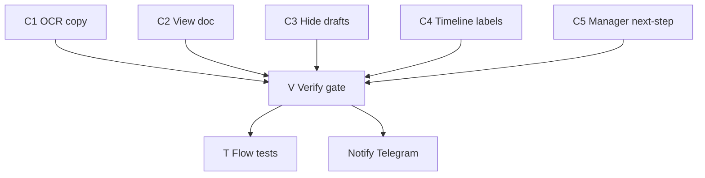

# UX Corrections 2026-09-07 — master index

## Цель

Закрыть 5 UX/AuthZ кейсов по скриншотам кабинета «Веди ВЭД», плюс gate перепроверки и план автотестов флоу заявки. Источник истины статусов/ролей — домен (`vdp/core`), UI — проекция.

## Карта кейсов → дочерние планы

| ID | Скрин / симптом | Plan file | Слой |
|----|-----------------|-----------|------|
| C1 | Шаг 5 «Проверка»: нет текста про распознавание; нужна подпись у «Создать заявку» | [ux_c1_create_ocr_copy.plan.md](.cursor/plans/ux_c1_create_ocr_copy.plan.md) | FE copy |
| C2 | Документы: только «Скачать», нет «Посмотреть» | [ux_c2_document_view.plan.md](.cursor/plans/ux_c2_document_view.plan.md) | FE + preview API |
| C3 | Менеджер видит клиентский `Черновик` | [ux_c3_manager_hide_drafts.plan.md](.cursor/plans/ux_c3_manager_hide_drafts.plan.md) | Core AuthZ + FE filter |
| C4 | Хронология: `creating → draft` сырыми кодами | [ux_c4_timeline_labels.plan.md](.cursor/plans/ux_c4_timeline_labels.plan.md) | FE mapper |
| C5 | «Ожидает проверки организации» ≠ «Требуют моего действия»; пустые действия у менеджера | [ux_c5_manager_org_waiting.plan.md](.cursor/plans/ux_c5_manager_org_waiting.plan.md) | FE guided next-step + counters |
| V | Перепроверка кейсов + локальная сборка | [ux_v_verify_gate.plan.md](.cursor/plans/ux_v_verify_gate.plan.md) | Gate |
| T | Автотесты флоу заявки | [ux_t_form_flow_tests.plan.md](.cursor/plans/ux_t_form_flow_tests.plan.md) | Vitest + Playwright + Go |

## Аналитика проблем (кратко)

### C1 — OCR на шаге «Проверка»
- Факт: [`forms-new-page.tsx`](vdp/fe/src/components/ved/pages/forms-new-page.tsx) `step === 4` — только summary; subtitle про API, не про распознавание.
- App post-create: auto [`recognize_complete`](vdp/fe/src/lib/ved/platform-create.ts) (OCR vendor не на user path, D2).
- Решение: тексты на шаге 5 + подпись у CTA про фон и помощника «Вэди»; **не** обещать реальный TG/OCR-vendor в MVP без канала — in-app/статус как носитель сигнала при ошибках (честность готовности).

### C2 — «Посмотреть»
- Факт: app mode в [`DocumentViewer.tsx`](vdp/fe/src/components/ved/DocumentViewer.tsx) только «Скачать»; preview URL уже есть (`previewPrivatePath` / тот же private preview).
- Решение: кнопка «Посмотреть» рядом со «Скачать» → blob/iframe modal с auth fetch.

### C3 — Черновики у менеджера
- Факт: [`CanSeeForm`](vdp/core/internal/domain/formpayment/actions.go) для manager = `true` на все статусы; FE [`visibleForms`](vdp/fe/src/lib/ved/store.tsx) тоже пропускает все.
- Решение: исключить `creating`/`draft` для `RoleManager` в core list/get и FE `visibleForms` (+ тесты). Deep-link на чужой draft → 403/«не найдена».

### C4 — Техстатусы в хронологии
- Факт: [`mapComplianceHistory`](vdp/fe/src/lib/api/mappers.ts) склеивает сырые `from_status → to_status`; лейблы уже в [`statuses.ts`](vdp/fe/src/lib/ved/statuses.ts).
- Решение: маппинг через `statusMeta().label`; поправить hardcoded `actorRole: "manager"`.

### C5 — Нестыковка очереди менеджера (решение зафиксировано)
- Домен: `organization_waiting_verification` — действие **Internal CO** (`ico_form_start`), не Manager ([`actions.ts`](vdp/fe/src/lib/ved/actions.ts), backend `ActionICOStart`).
- Фильтр «Требуют моего действия» корректно **не** включает заявку (`actionsFor(manager, status) === []`).
- Баг восприятия: карточка говорит «действий нет», без имени следующего актора; счётчики/заголовок создают ожидание, что менеджер должен что-то сделать.
- Решение (**не** выдавать менеджеру ICO-действия): блок «Следующий шаг» из матрицы роли; empty state ActionPanel с ролью-владельцем; выравнивание dashboard/registry с effective actions (`processRoles`); при необходимости отдельная семантика «В ожидании комплаенса» уже есть — не смешивать с «моими действиями».

## Сверка с `.cursor/rules`

**Обязательны для всей волны:** `планирование-сверка-с-rules`, `базовые-правила-инструмента`, `правила-построения`, `честность-готовности`, `use-cases`, `безопасность-ролей-и-данных`, `чистая-архитектура`, `детали-как-плагины`, `интеграция-и-события`, `ui-web-практики`, `ux-взаимодействие-и-скорость`, `ux-когнитивная-нагрузка`, `ux-формы-навигация-онбординг`, `поддержка-и-обратная-связь`, `тесты-архитектуры`, `go-testing`, `playwright-e2e`, `typescript-clean-code`, `машинное-обучение` (OCR только side-path, не auto-pay).

**Вне scope волны:** Nest parity, serverless/FaaS, ML scoring, prod Diadoc/OCR vendor, `vdp-fe-docker-пересборка` без вопроса пользователю, смена матрицы ролей ICO→Manager.

**Gate/DoD из rules:** unit на AuthZ/переходы; FE unit на mapper/visibleForms/actions; узкий e2e journey; UI «Следующий шаг» = доменная матрица; без ложного «100% OCR».

## Порядок исполнения

1. C4 (быстрый mapper) ∥ C2 (DocumentList) ∥ C1 (copy)
2. C3 (core + FE AuthZ) — до C5 verify
3. C5 (guided next-step + counters)
4. V — ручная перепроверка скрин-кейсов + `make`/compose build fe+core tests
5. T — расширить автотесты флоу
6. Сообщить в TG: https://t.me/+XAl4Vq3otV81YzVi (`@vdp_intake_bot`, chat из `~/.vdp-intake/env`)

## Глобальный DoD

- [ ] Каждый дочерний план: DoD чеклист зелёный + тесты из плана
- [ ] Менеджер не видит `creating`/`draft` в реестре/дашборде/detail
- [ ] Хронология на русском через `STATUS_META`
- [ ] «Посмотреть» работает в app mode для PDF с `fileId`
- [ ] Шаг 5: тексты про распознавание + подпись у CTA
- [ ] На `organization_waiting_verification` менеджер видит **кто** действует дальше; фильтр «мои действия» согласован с матрицей
- [ ] Локальная сборка/тесты прогнаны (V)
- [ ] Сообщение в TG отправлено

## Вне этого индекса

Не трогать: demo-only seed UX без нужды; выдачу менеджеру `ico_*`; подключение реального OCR-vendor; silent `compose-fe-refresh`.
