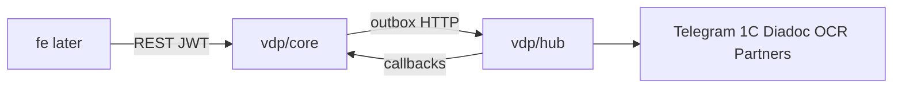

# План п.2: скелет `vdp` + Go `core`/`hub`

## Решения (зафиксированы)

- **Поведение:** Nest [`backend-for-ved`](кастомные%20модули%20для%20адаптации%20и%20переиспользования/backend-for-ved) + [`заметки/gap-analysis-backend.md`](заметки/gap-analysis-backend.md) = ТЗ.
- **Стек:** Go, PostgreSQL, HTTP API; async core→hub через **outbox** (паттерн из AMG, без Kafka на этом этапе).
- **Граница:** `core` = домен/RBAC/state machine/документы; `hub` = Telegram, 1C, Diadoc, OCR, партнёры/провайдеры (без Striga/Bitso/иностр. PSP).
- **Extract, не link:** копируем/адаптируем куски из AMG; vendored модули не подключаем как зависимости.
- **Вне scope реализации п.2:** analytics, assistant, BDUI, фронт — только пустые каталоги.
- **Документация:** README/ARCHITECTURE не плодим (правило построения / базовые); только код и тесты.

## Правила проекта (обязательные ограничения п.2)

Опираемся на `.cursor/rules` (границы, интеграция, роли/ПДн, устойчивость, go-*). UX / NestJS / Playwright / ML — вне реализации п.2 (ML не в процессном ядре; analytics/assistant только скелет).

| Правило | Как применяем в п.2 |
|---------|---------------------|
| `границы-и-контексты` | Разрез core vs hub по бизнес-контексту; **отдельные БД** (не shared DB); контракты в бизнес-терминах через `shared` events/API |
| `интеграция-и-события` | REST для команд; outbox/events для смены статусов и реакций; статусы только через SM в core; **идемпотентность** платежей/ретраев (ключ события / эффект) |
| `безопасность-ролей-и-данных` | AuthN/AuthZ **на core и на hub**; роль + зона видимости на endpoint; Provider без ПДн; секреты/документы не в логи |
| `устойчивость-и-наблюдаемость` | Корреляция логов/трейсов по **id заявки**; при сбое провайдера — явная деградация, статус заявки ожидаемый, повтор безопасен; лимиты ретраев + backoff |
| `go-architecture` | `cmd/` / `internal/` / `pkg/`; DI через конструкторы; интерфейсы на границах; `fmt.Errorf("%w")` |
| `go-testing` / `правила-построения` | Unit table-driven + parallel; тесты к публичным функциям/сервисам; после реализации — самопроверка переходов и ролей |
| `go-observability` | Structured JSON logs; request/trace id; health; метрики latency/errors (OTel-ready middleware из AMG) |
| `go-resilience-security` | Валидация входа; timeouts на внешние вызовы hub; retries/backoff; rate-limit на публичных HTTP |
| `лучшие-практики` | Версионируемый публичный API (`/api/v1/...`); JWT; без «admin/test» smoke-эндпоинтов |
| `машинное-обучение` | OCR в hub как интеграция/заглушка; никакого ML в transition/payment path core |

## Целевая структура `vdp`

Сейчас есть пустые `vdp/core` и `vdp/fe`. Создаём скелет:

```
vdp/
  shared/           # контракты: OpenAPI/events/proto (пусто + go.mod при необходимости)
  core/             # Go — реализация п.2
  hub/              # Go — реализация п.2
  analytics/        # заготовка (позднее AMG-Analytics / ABS)
  assistant/        # заготовка (позднее vili / chat-RAG)
  fe/               # заготовка UI (п.4)
```

В каждом отложенном каталоге — `.gitkeep` (без README/доков). В `core` и `hub` — полноценный Go layout:

```
cmd/api/main.go
internal/{domain,service,repository,transport/http,authz,outbox}
migrations/
pkg/{config,logger,errors}
go.mod
```



## Extract из AMG (что брать)

| Источник | Что переносим в `core`/`hub` |
|----------|------------------------------|
| [AMG-Core-Platform/go-backend](кастомные%20модули%20для%20адаптации%20и%20переиспользования/AMG-Core-Platform/go-backend) | `pkg/config`, `pkg/logger`, `pkg/errors`; outbox (`006_outbox_inbox_schema.sql` + `internal/outbox`); HTTP middleware (recovery, metrics); health handlers |
| [AMG-Integration-Hub](кастомные%20модули%20для%20адаптации%20и%20переиспользования/AMG-Integration-Hub) | plugin-интерфейс интеграций → `hub/internal/domain` + registry |
| Nest enums/transitions | роли, статусы орг., `FormPaymentStatus`, `transitionsImportForm` / export / rate-on-provider |

**Не брать:** Striga/Railsr/fees/fraud chat-домен AMG; BDUI; Python analytics.

## Порядок реализации (приоритет)

### A. Скелет + каркас сервисов
1. Создать папки `shared`, `hub`, `analytics`, `assistant`; оставить `core`/`fe`.
2. Инициализировать `vdp/core` и `vdp/hub` (`go mod`, `cmd/api`, health, config, logger).
3. Отдельные Postgres БД/схемы для core и hub; migrations core: accounts, organizations, form_payments, documents, compliance_history, outbox; hub: inbox + integration state (из AMG `006`).
4. Публичный API с префиксом `/api/v1/`; JWT middleware; без `admin/test` эндпоинтов.

### B. `vdp/core` — домен (Must)
1. **RBAC:** `AccountRole` из Nest (без мёртвого `REPORTER`); guards → middleware + zone (свои заявки / ICO / ECO / manager / provider) на каждом endpoint.
2. **Organization statuses** + задел под Must-have «ожидающий обработки» + рейтинг (красн/жёлт).
3. **State machine:** таблицы переходов из [`form-payment.constants.ts`](кастомные%20модули%20для%20адаптации%20и%20переиспользования/backend-for-ved/src/modules/form-payment/form-payment.constants.ts); сервис `Transition(form, action, role)` — единственный путь смены статуса (источник истины — домен, не UI).
4. **Form payment API** по ролевым контроллерам Nest (`site`, `manager`, `provider`, `compliance-officer`, `internal-compliance-officer`, `treasurer`, `one-c` → thin handlers).
5. **Must-have gaps:**
   - Provider projection **без ПДн**
   - Поле дедлайна исполнения + назначение менеджером
   - Статус/очередь awaiting + rating
   - Rate + Commission как доменные сущности (расчёт в core; внешние курсы позже через hub при необходимости)
6. Documents/file metadata + ComplianceHistory; генерация PDF/docx — вызов hub или stub с тем же контрактом событий.
7. Логи/спаны с `form_payment_id` (и связанными id); ПДн не логировать.

### C. `vdp/hub` — интеграции
1. `IntegrationPlugin` interface + registry (из AMG Hub pattern); AuthN service-to-service на входящих вызовах.
2. Адаптеры (минимально рабочие stubs с реальным HTTP-контрактом core↔hub):
   - Telegram (уведомления)
   - 1C (payment cover/fee callbacks; идемпотентный ключ)
   - Diadoc (подпись)
   - OCR/Recognition (без ML-автоисполнения платежа)
   - Partner/Provider connector (generic, без иностр. PSP)
3. Inbox consumer: события из core outbox; идемпотентность по event id; timeout + limited retries/backoff на внешние API; при сбое — явная ошибка/деградация, без записи статуса в core.
4. Callbacks в core: смена статуса только через доменный transition API (hub не пишет в БД core).

### D. Should-have (после Must, в том же п.2 если успеваем)
- Алиас ECO ↔ `COMPLIANCE_OFFICER`
- Явный assign provider/agent
- Хеш XOR файл подтверждения у провайдера
- Unblock `BLOCKED`; immutable org fields после ICO
- Убрать дубль VirtualAccount; не переносить `REPORTER`

### E. Тесты + самопроверка
- Unit table-driven + parallel: transitions (статус × роль × действие), provider DTO без ПДн, deadline assign.
- HTTP contract smoke: health + 1–2 ролевых сценария create→draft→ICO path.
- Hub: plugin registry + idempotent inbox handler.
- После реализации: явная сверка допустимых переходов и прав ролей (правила построения).

## Якоря Nest → Go

| Nest | Go target |
|------|-----------|
| `account.enums.ts` AccountRole | `core/internal/domain/role.go` |
| `organization.enums.ts` | `core/internal/domain/organization.go` |
| `form-payment.enums.ts` + `form-payment.constants.ts` | `core/internal/domain/formpayment/` |
| `form-payment.service.ts` (монолит) | разбить: transition, docs, assign, rate/commission |
| `modules/{telegram,diadoc,recognition,payment}` | `hub/internal/adapters/...` |
| Diadoc/Telegram/1C wiring | hub plugins + core outbox events |

## Критерий готовности п.2

- Каталоги-скелет `vdp/{shared,core,hub,analytics,assistant,fe}` на месте.
- `core` и `hub` собираются (`go build ./...`); **отдельные** миграции/БД применяются локально.
- State machine + RBAC покрыты unit-тестами; Must-have gaps закрыты в API; самопроверка переходов/ролей пройдена.
- AuthZ на endpoint core (и s2s на hub); provider response без ПДн; корреляция по id заявки в логах.
- Hub: plugin stubs; outbox→hub→callback на одном событии (Telegram notify) проходит smoke; ретраи идемпотентны.
- Analytics/assistant/fe без кода реализации; без лишней документации.

## Вне этого плана

- П.3 полный inventory остальных модулей (после п.2).
- П.4 фронт в `vdp/fe`.
- Реальная прод-интеграция Diadoc/1C credentials, BDUI, analytics ABS, assistant RAG.