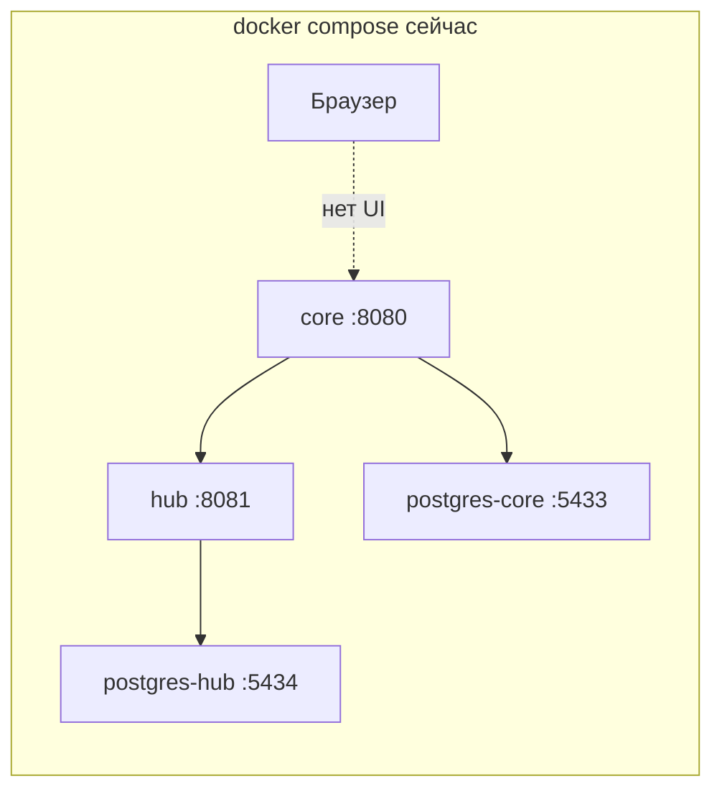
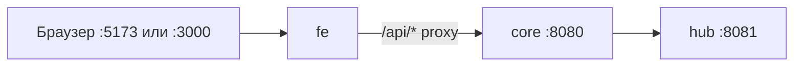

# План: фронт и бэк VDP в Docker одновременно

## Текущее состояние



- [`vdp/docker-compose.yml`](vdp/docker-compose.yml) — только `core`, `hub`, две Postgres.
- Фронт в [`vdp/fe/`](vdp/fe/) запускается отдельно (`npm run dev`).
- API-клиент использует **относительные** пути (`apiBase()` пустой → `/api/v1/...`) — см. [`vdp/fe/src/lib/api/client.ts`](vdp/fe/src/lib/api/client.ts).
- Прокси в dev: [`vdp/fe/vite.config.ts`](vdp/fe/vite.config.ts) шлёт `/api` на `http://localhost:8080` (в контейнере это **не сработает** без замены на `http://core:8080`).
- В `core` **нет CORS** — прямой вызов `http://localhost:8080` из браузера с другого порта нежелателен; сохраняем паттерн **same-origin proxy**.

## Целевая архитектура



Пользователь открывает только фронт; `/api` проксируется на `core` внутри Docker-сети.

---

## Сверка с rules

| Rule | Обязательно | Как закрываем |
|------|-------------|---------------|
| [`планирование-сверка-с-rules`](.cursor/rules/планирование-сверка-с-rules.mdc) | Да | Эта секция |
| [`развертывание-и-доставка`](.cursor/rules/развертывание-и-доставка.mdc) | Да | Один compose, иммутабельные образы, конфиг через env |
| [`границы-и-контексты`](.cursor/rules/границы-и-контексты.mdc) | Да | `fe` — адаптер UI; статусы остаются в `core` |
| [`интеграция-и-события`](.cursor/rules/интеграция-и-события.mdc) | Да | UI не оркестратор; только HTTP proxy |
| [`безопасность-ролей-и-данных`](.cursor/rules/безопасность-ролей-и-данных.mdc) | Да | Dev-секреты только в compose; не коммитить prod secrets |
| [`правила-построения`](.cursor/rules/правила-построения.mdc) | Да | Smoke-скрипт + существующий `compose-e2e` |
| [`тесты-архитектуры`](.cursor/rules/тесты-архитектуры.mdc) | Частично | Shell smoke на UI; без тяжёлого Playwright в этой итерации |
| [`ui-web-практики`](.cursor/rules/ui-web-практики.mdc) | Вне scope | Без изменений UI |
| Документация | Вне scope | Только echo в Makefile (без нового README) |

**DoD / gate:**
- `docker compose up -d --build` поднимает 5 сервисов (4 старых + `fe`).
- `http://localhost:5173/login` отдаёт HTML.
- Логин `user@vdp.local` / `user` через UI работает (прокси до `core`).
- `make compose-e2e` по-прежнему зелёный (API-only).
- `docker compose --profile prod up -d --build` поднимает prod-like `fe` на `:3000`.

---

## Волна 1 — Dev-режим (по умолчанию)

### 1. Параметризовать proxy target

Файл: [`vdp/fe/vite.config.ts`](vdp/fe/vite.config.ts)

- Вынести target в env: `VDP_API_PROXY_TARGET` (default `http://localhost:8080` для локального `npm run dev` вне Docker).
- В compose для `fe`: `VDP_API_PROXY_TARGET=http://core:8080`.
- Прокси оставить только на `/api` — совместимо с текущим `apiBase() === ""`.

### 2. `fe/Dockerfile` (multi-stage, target `development`)

Новый файл: `vdp/fe/Dockerfile`

- Base: `node:22-alpine`.
- `WORKDIR /app`, `COPY package*.json`, `npm ci`.
- `COPY . .`
- `EXPOSE 5173`
- `CMD ["npm", "run", "dev", "--", "--host", "0.0.0.0", "--port", "5173"]`

### 3. `fe/.dockerignore`

Исключить: `node_modules`, `dist`, `.nitro`, `.output`, coverage, логи — ускорение сборки.

### 4. Сервис `fe` в compose (default profile)

Файл: [`vdp/docker-compose.yml`](vdp/docker-compose.yml)

```yaml
fe:
  build:
    context: ./fe
    dockerfile: Dockerfile
    target: development
  environment:
    VDP_API_PROXY_TARGET: http://core:8080
  ports:
    - "5173:5173"
  depends_on:
    core:
      condition: service_healthy
  healthcheck:
    test: ["CMD-SHELL", "wget -qO- http://127.0.0.1:5173/ >/dev/null || exit 1"]
    interval: 5s
    timeout: 3s
    retries: 20
    start_period: 30s
  volumes:
    - ./fe:/app
    - fe_node_modules:/app/node_modules   # anonymous named volume
```

Named volume `fe_node_modules` — чтобы bind-mount не затирал `node_modules` с хоста.

### 5. Обновить Makefile

Файл: [`vdp/Makefile`](vdp/Makefile)

- `compose-up`: после health `core`/`hub` ждать `fe` (`:5173`).
- В конце печатать: `UI http://localhost:5173`, `API http://localhost:8080`.
- `compose-ps` без изменений логики.

### 6. Smoke UI

Новый скрипт: `vdp/scripts/compose-fe-smoke.sh`

- `curl -sf http://127.0.0.1:5173/login` → grep по заголовку/тексту «Вход».
- Вызывать из `make compose-up` после health (лёгкий gate, не Playwright).

---

## Волна 2 — Prod profile (`--profile prod`)

TanStack Start сейчас собирается через nitro с **cloudflare** preset (см. комментарий в `vite.config.ts`). Для Docker нужен **node-server**.

### 7. Prod target в `fe/Dockerfile`

Stage `production`:

1. `npm ci && npm run build` с `NITRO_PRESET=node-server` (или явный override в config).
2. Runtime: `node .output/server/index.mjs` (путь уточнить после первой сборки).
3. `EXPOSE 3000`, `ENV PORT=3000`, `ENV HOST=0.0.0.0`.

### 8. Nitro proxy для `/api` в prod

В [`vdp/fe/vite.config.ts`](vdp/fe/vite.config.ts) (через `defineConfig` → nitro options):

```ts
routeRules: {
  "/api/**": { proxy: `${process.env.VDP_API_PROXY_TARGET ?? "http://localhost:8080"}/api/**` },
}
```

- В prod compose: `VDP_API_PROXY_TARGET=http://core:8080`.
- Проверить, что SSR-страницы и client fetch оба ходят через same-origin `/api`.

### 9. Сервис `fe-prod` в compose profile

```yaml
fe-prod:
  profiles: ["prod"]
  build:
    context: ./fe
    target: production
  environment:
    VDP_API_PROXY_TARGET: http://core:8080
    PORT: "3000"
  ports:
    - "3000:3000"
  depends_on:
    core:
      condition: service_healthy
```

Dev-сервис `fe` можно оставить в default profile; при `--profile prod` поднимать **либо** dev, **либо** prod (документировать в echo Makefile: `compose-up-prod`).

### 10. Makefile: `compose-up-prod`

- `docker compose --profile prod up -d --build`
- Health на `:3000`, smoke на `/login`.

---

## Волна 3 — Полировка и риски

### Известные риски

| Риск | Митигация |
|------|-----------|
| Nitro cloudflare → node-server ломает build | Проверить `npm run build` локально до merge; зафиксировать preset в config |
| Медленный cold start fe (npm ci в образе) | `.dockerignore`, кэш слоёв, named volume для `node_modules` в dev |
| HMR через Docker Desktop на macOS | `--host 0.0.0.0`; при проблемах — `CHOKIDAR_USEPOLLING=true` в env |
| Lovable/vite-tanstack-config переопределяет nitro | Override только через поддерживаемые поля `defineConfig`; не дублировать плагины (см. комментарий в vite.config) |

### Что сознательно не делаем

- CORS в `core` — proxy достаточен для same-origin.
- Отдельный nginx-сервис — избыточно на MVP; nitro/vite proxy проще.
- Playwright E2E UI — отдельная задача.
- Публичные smoke-endpoint'ы на `core` — запрещено правилами nestjs/go для финтеха.

---

## Порядок проверки после реализации

1. `cd vdp && docker compose down -v` (чистый старт при необходимости).
2. `make compose-up` → 5 контейнеров, UI на `:5173`, логин через форму.
3. `make compose-e2e` — API journey без регрессий.
4. `docker compose --profile prod up -d --build` → UI на `:3000`, тот же логин.
5. Локально без Docker: `cd fe && npm run dev` — proxy по-прежнему на `localhost:8080`.
