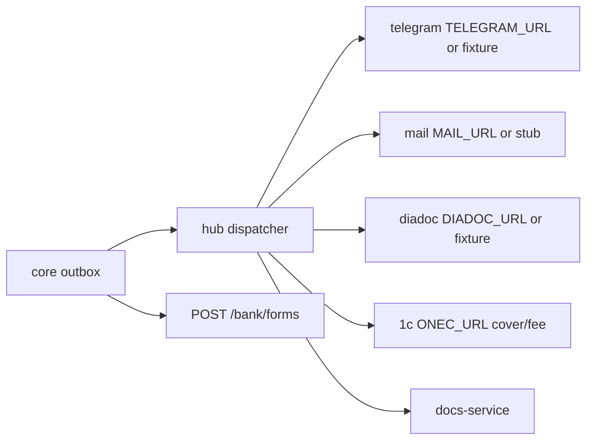
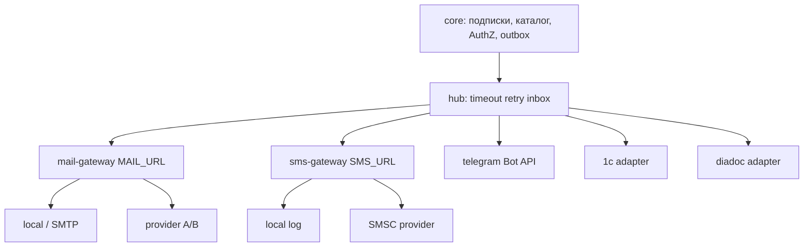

# План: уведомления, 1С, Диадок, банк, почта/SMS

Эталон скорости: [заметки/ориентир-скорости-2026-08-25.md](заметки/ориентир-скорости-2026-08-25.md) — **3.8 todo/ч**, ~1950 строк/ч; для вендоров **×1.5–2**. Один эталонный день ≈ 10.6 ч / ~40 todos.

Зафиксированные решения:

- Почта и SMS — **новые контейнеры** `mail-gateway` и `sms-gateway` (как [vdp/docs-service](vdp/docs-service)), hub остаётся тонким HTTP-клиентом (`MAIL_URL` / `SMS_URL`).
- Diadoc в этой волне: контракт, smart stub, статус в UI; **реальный вендор не блокер** (пилот D1 — manual, [vdp/docs/pilot/b2-decisions.md](vdp/docs/pilot/b2-decisions.md)).
- Telegram: **один бот платформы**; личная привязка + рабочие чаты с запросом на вступление (approve: admin/manager).
- 1С: исходящие `cover`/`fee` на существующем порте; staging fixture, пока нет `ONEC_URL`.
- Банк: **только исследование** (отчёт + gap), не реализация партнёрского OpenAPI.
- SMS не на каждый статус: OTP и критичные события; mail — текущие шаблоны статусов в [vdp/core/internal/service/form_payment.go](vdp/core/internal/service/form_payment.go).

## Сверка с `.cursor/rules`

**Обязательны:** `планирование-сверка-с-rules`, `интеграция-и-события`, `границы-и-контексты`, `детали-как-плагины`, `безопасность-ролей-и-данных`, `устойчивость-и-наблюдаемость`, `serverless-и-faas`, `use-cases`, `solid`, `чистая-архитектура`, `screaming-architecture`, `тесты-архитектуры`, `go-testing`, `развертывание-и-доставка`, `честность-готовности`, `ui-web-практики`, `ux-взаимодействие-и-скорость`, `ux-когнитивная-нагрузка`, `vdp-fe-docker-пересборка` (спросить перед `compose-fe-refresh`).

**Вне scope:** смена машины статусов заявки; OCR/auto-pay; shared DB с Nest; prod Diadoc без credentials; полный Bank OpenAPI/sandbox партнёра; вынос 1С/Diadoc в отдельные процессы.

**Gate/DoD:** событие в [vdp/shared/events/events.go](vdp/shared/events/events.go); адаптер hub + `make test-adapters`; идемпотентный inbox; AuthZ на link/join; нет ПДн в логах коннекторов; stub без URL; UI — проекция, не источник статуса; не утверждать «100%» без staging env.

## Текущая база (не с нуля)

Маршрутизация: [vdp/hub/internal/dispatcher/dispatcher.go](vdp/hub/internal/dispatcher/dispatcher.go). Плагины: [vdp/hub/cmd/api/main.go](vdp/hub/cmd/api/main.go). Колонка `accounts.telegram_chat_id` уже в [vdp/core/migrations/002_extended.sql](vdp/core/migrations/002_extended.sql), но **не прокинута** в [vdp/core/internal/domain/account.go](vdp/core/internal/domain/account.go) — notify сейчас без адресата.

## Целевой разрез

Имена модулей по возможности: `notifications`, `telegram-binding`, `work-chats`, `mail-gateway`, `sms-gateway` — не «ещё один adapters dump».

Политика: core решает **когда и кому**; gateway решает **через какого провайдера**; статус заявки не меняется в gateway.

## Волна 0. Контракты уведомлений (6 todos, ~1.5 ч эталон / ~3 ч ×2)

Каталог: событие → каналы (tg/mail/sms) → роли → шаблон без ПДн.

Модель: account ↔ `telegram_chat_id`; work chat (id, title, chat_id, kind); join `none|pending|approved|rejected`.

Порт gateway: `POST /notify` с `event_id`, `form_payment_id`, `to`, `template`, `idempotency_key`; ответ `accepted|duplicate`; health `/health`.

Критерий выноса уже выбран: отдельные процессы. Общей БД с core/hub **нет** — только HTTP.

DoD: короткая заметка в `vdp/docs/` (только эта, по запросу плана) + черновик event/OpenAPI; тесты контракта payload без вендора.

## Волна 1. Telegram личный + notify (10 todos, ~2.5 ч / ~5 ч)

Bot webhook в **hub** (не в core): `/telegram/webhook`. Deep-link / одноразовый код → core API bind.

Core: поле `TelegramChatID` на Account; `POST /api/v1/me/telegram/link|unlink`; preferences (какие статусы).

При `TypeTelegramNotify` подставлять `chat_id` из аккаунта владельца/подписчика, не из пустого payload.

Hub адаптер: Bot API за тем же портом `telegram`; без токена — fixture как сейчас.

FE: блок в профиле «привязать Telegram» (один primary CTA).

Тесты: AuthZ чужой chat; идемпотентный notify; шаблон без ФИО/паспорта.

DoD: привязка → переход статуса → сообщение (или fixture с chat_id в логе/Sent).

## Волна 2. mail-gateway + шина (12 todos, ~3 ч / ~6 ч)

Новый сервис [vdp/mail-gateway](vdp/mail-gateway) по образцу docs-service: порт, Dockerfile, health, `POST /notify`.

Внутри: интерфейс `MailProvider`; адаптеры `local` (лог, CI) и `smtp`; конфиг `MAIL_PROVIDER=local|smtp` + секреты снаружи образа.

Hub [vdp/hub/internal/adapters/mail/mail.go](vdp/hub/internal/adapters/mail/mail.go): в compose `MAIL_URL=http://mail-gateway:8091/notify`; пустой URL — stub (dev без gateway).

Идемпотентность в gateway по `event_id`; retry/timeout как hub; маскирование `to` в логах.

Compose + release overlay + image-build (как docs-service). Staging-smoke на `/health` и probe.

DoD: смена статуса → письмо через local provider в compose; смена провайдера — только env, без правки core.

## Волна 3. Bank API — исследование (5 todos, ~1.5 ч / ~2–3 ч)

Не код партнёра. Сверка §5 [вводные/расширение вводных.txt](вводные/расширение%20вводных.txt) с [vdp/core/internal/service/bank.go](vdp/core/internal/service/bank.go), миграциями `011`/`013`, webhook HMAC.

Отчёт в `заметки/`: есть / нет (OpenAPI, sandbox, poll, live badge); AuthN mTLS vs API key vs OAuth2; идемпотентность; confused deputy; must/should/later; оценка следующей волны в todos эталона.

DoD: отчёт + таблица разрывов; **не** утверждать готовность банка к партнёру.

## Волна 4. Рабочие чаты Telegram (10 todos, ~2.5 ч / ~5 ч)

Зависит от волны 1 (бот жив).

Core: каталог рабочих чатов (seed/admin); `GET` список; `POST` join-request; approve/reject ролями admin/manager; бот add/invite только после approve.

FE: список чатов + статус заявки + CTA «запросить добавление»; disabled + причина, если pending.

Тесты: User не approve; повторный request идемпотентен; в группу не шлём ПДн клиента.

DoD: pending виден админу; approved → notify в этот chat_id.

## Волна 5. sms-gateway + шина (10 todos, ~2.5 ч / ~4–5 ч)

Копия паттерна mail: `vdp/sms-gateway`, событие `sms.notify` в shared/events, plugin hub, `route()` в dispatcher.

Каталог: только OTP / критичные (блок организации, отказ CO) — не дублировать все mail-шаблоны.

Провайдеры: `local` + один внешний за портом; rate limit; маска телефона в логах.

FE опционально: тумблер SMS в профиле (default off).

DoD: CI на HTTP-контракт; compose local; внешний провайдер — env, не блокер CI.

## Волна 6. 1С staging (8 todos, ~2 ч / ~4–6 ч + ожидание стенда)

Не новый сервис. Уточнить payload `cover`/`fee` в [vdp/hub/internal/adapters/onec/onec.go](vdp/hub/internal/adapters/onec/onec.go); callback в core без двойной оплаты (`external_id`).

Smart stub: timeout, 409, повтор события = один эффект.

Staging: `ONEC_URL` в checklist; без URL — fixture. Runbook + semantic alert backlog.

DoD: unit/adapter тесты зелёные; реальный 1С — только при URL, иначе честно «fixture».

## Волна 7. Diadoc контракт + UI (8 todos, ~2 ч / ~4 ч)

Ручной путь пилота **не ломать**. Hub: контракт `kind` + callback signed/rejected → use case core (не прямой UPDATE статуса из адаптера).

Smart stub timeout. FE: бейдж/статус ЭДО из API; fallback «скачать/загрузить вручную».

Реальный `DIADOC_URL` — опциональный хвост, если появятся credentials.

DoD: queued → callback на stub; UI показывает wait/fail; D1 manual жив.

## Календарь по эталону

- **День A (~33 todos):** волны 0+1+2+3. Эталон ~8.5 ч; с ×1.5 ~13 ч (может перейти на утро B).
- **День B (~20 todos):** волны 4+5. Эталон ~5 ч; ×1.5 ~8 ч.
- **День C (~16 todos):** волны 6+7. Эталон ~4 ч; ×1.5–2 ~6–8 ч + пауза на 1С.

Итого **~64 todos** ≈ 17 ч «как 25.08» или **~25–32 ч** с вендор-коэффициентом (**~2.5–3 эталонных дня** чистой работы). Строки/ч здесь потолок, не план: больше контрактов, меньше +20k LOC.

Параллель: Bank research ‖ mail-gateway ‖ TG bind. SMS после mail. Work chats после бота. 1С/Diadoc не блокируют A/B.

## FE Docker

Перед подъёмом стека / после смены `vdp/fe/package.json` спросить: «Обновить зависимости фронта в Docker (`make compose-fe-refresh`)?» Не запускать без «да».

## Анти-паттерны

- Gateway меняет статус заявки.
- ПДн клиента в TG/SMS/1С/Diadoc payload и логах.
- Два источника истины подписок (только core).
- Shared DB gateway с core.
- «100% Diadoc/банк/1С» при stub.
- SMS на каждый переход статуса.
