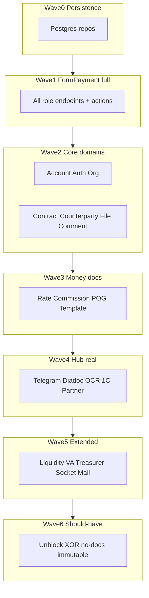

# План: `vdp` → 100% паритет с Nest (`backend-for-ved`)

## Цель и критерий «100%»

**Цель:** поведенческий паритет с Nest Fea360: те же роли, статусы, переходы, документы и интеграции, что в [`backend-for-ved`](кастомные%20модули%20для%20адаптации%20и%20переиспользования/backend-for-ved) + закрытые Must/Should из [`заметки/gap-analysis-backend.md`](заметки/gap-analysis-backend.md).

**Не цель:** построчный порт Nest; сохраняем Go-разрез `core` / `hub` / `shared`.

**Критерий готовности:**
- Для каждого Nest-модуля из списка ниже — Go-пакет + HTTP API + тесты (unit SM/RBAC + smoke по happy-path роли).
- Persistence: **Postgres** (не in-memory) по отдельным БД core/hub; миграции применяются.
- Hub-адаптеры исполняют контракт событий из [`vdp/shared/events`](vdp/shared/events/events.go); статусы меняет только core SM.
- Чеклист самопроверки: все `transitionsImportForm` / export / rate-on-provider + права ролей сходятся с Nest.
- Исключение: `REPORTER` не переносим.

**База (уже есть):** каркас SM/RBAC, must-have gaps (provider no-PII, deadline, awaiting/rating, rate/commission поля), outbox→hub stubs, `/api/v1`.

## Матрица покрытия (Nest → vdp)

| Nest module | Controllers | Целевой пакет | Волна |
|-------------|-------------|---------------|-------|
| form-payment | 9 | `core/.../formpayment` + handlers | 1 |
| account / auth / token / code | 8+3+1+1 | `core` auth/account | 2 |
| organization | 5 | `core` organization (+ ICO/Senior) | 2 |
| contract / counterparty / comment / file / compliance-history | 4+1+4+6+2 | `core` | 2 |
| currency / configuration / agent / hs-code | 3+2+4+3 | `core` | 2 |
| rate / commission-calculation / payment-order-generation / template | 0–2 | `core` (+ hub gen docs) | 3 |
| payment / recognition / diadoc / telegram | 3+2+2+1 | `hub` adapters + core callbacks | 4 |
| liquidity / virtual-account / treasurer-task / socket / mail | 7+1+2+3+1 | `core` (+ hub notify) | 5 |

Источник поведения: Nest controllers в `src/modules/*/web/` и [`form-payment.service.ts`](кастомные%20модули%20для%20адаптации%20и%20переиспользования/backend-for-ved/src/modules/form-payment/service/form-payment.service.ts) + [`form-payment.constants.ts`](кастомные%20модули%20для%20адаптации%20и%20переиспользования/backend-for-ved/src/modules/form-payment/form-payment.constants.ts).

## Wave 0 — Persistence foundation

Заменить [`repository/memory.go`](vdp/core/internal/repository/memory.go) на Postgres (pgx), сохранив интерфейсы.

- Расширить [`vdp/core/migrations/001_core.sql`](vdp/core/migrations/001_core.sql): недостающие колонки form/org/account; таблицы contract, counterparty, comment, file_meta, agent, hs_code, liquidity stubs-ready.
- [`vdp/hub/migrations`](vdp/hub/migrations): inbox unique by event_id, integration_operations.
- Outbox publisher: фоновый poller (не только manual flush).
- Dev seed через SQL/миграции-фикстуры (текущие `user@vdp.local` и роли).
- Тесты: repository integration (testcontainers или docker-compose postgres) + unit на интерфейсах.

## Wave 1 — FormPayment 100%

Сейчас: тонкий `POST /forms/{id}/actions/{action}`. Нужен паритет ролевых контроллеров Nest.

1. Инвентарь всех endpoint’ов `form-payment/web/{site,manager,provider,compliance-officer,internal-compliance-officer,treasurer,one-c,admin}` → OpenAPI-черновик в `vdp/shared` (events уже есть; добавить `openapi/forms.yaml` только как контракт, без README).
2. Расширить `Action` / `TargetStatus` до полного набора Nest-команд (accept/reject order/report/shipment, treasurer branches, refund, diadoc report).
3. Ролевые route-группы `/api/v1/{site|manager|provider|eco|ico|treasurer|one-c|admin}/forms/...` с теми же AuthZ zones.
4. Поля заявки: invoice, totals, docs refs, agent/provider/manager, paymentMethod, platformPostpayMode, executionDeadline.
5. ComplianceHistory на каждый transition (уже частично).
6. Тесты: table-driven на **все** ключи `transitionsImportForm` + export overlay + rate-on-provider; smoke create→draft→ICO→ECO→manager order.

## Wave 2 — Core domain modules

Порт поведения (не UI) по Nest:

- **Auth/Account/Token/Code:** login, refresh, register, RBAC ROOT bypass, block flags.
- **Organization:** ICO approve/block/un-approve; Senior Provider org CRUD; status + rating queue (уже); fields_frozen после ICO.
- **Contract / Counterparty / Comment / File:** CRUD + привязка к form; file metadata + storage interface (S3-compatible stub OK).
- **Currency / Configuration / Agent / HsCode:** справочники и привязки к invoice goods / form.agent.
- **Mail/Socket:** в core — порты интерфейсов; реализация доставки в hub (wave 4/5).

Каждый модуль: `domain` + `service` + `repository` + `transport/http` + unit tests.

## Wave 3 — Rate, Commission, документы поручения/отчёта

- Логика расчёта rate/commission из Nest `rate` / `commission-calculation` → `core` domain services (поля уже есть).
- `payment-order-generation`: async job через outbox → hub `docs.generate` (PDF/docx); результат — file meta в core.
- `template` Excel import: парсер в core или hub OCR/template adapter; статус CREATING→DRAFT.
- Свести дубли GenerateDocs / POG как в gap.

## Wave 4 — Hub: stubs → рабочие адаптеры

Контракт без смены статусов в БД core:

| Adapter | Nest source | Поведение |
|---------|-------------|-----------|
| telegram | `modules/telegram` | notify по status_changed |
| diadoc | `modules/diadoc` | sign contract/order/report; callback → core transition API |
| ocr | `modules/recognition` | recognize invoice; callback draft fields (не auto-pay) |
| onec | `modules/payment` + `1c` | cover/fee idempotent by externalId |
| partner | provider connectors | generic dispatch, без Striga/Bitso |

- S2S auth уже есть; добавить signed callbacks `POST /api/v1/internal/hub/callback` в core (только `ActionInternalCallback` / явные actions).
- Timeout/backoff/idempotent inbox — уже; покрыть тестами сбоев (деградация без смены статуса).

## Wave 5 — Extended Nest contour

- **Liquidity:** стакан import/export, связь со статусами form/provider.
- **VirtualAccount:** балансы; один модуль (без дубля Nest).
- **TreasurerTask:** задачи refund/overpay + treasurer form endpoints.
- **Socket:** realtime events (или SSE) по form id.
- **Mail:** уведомления через hub/mail adapter.

## Wave 6 — Should-have gaps (gap §7)

- Unblock workflow `BLOCKED` → request + ICO/Manager.
- Provider confirmation: hash XOR file по типу валюты.
- Явный API «нет документов» на создании заявки.
- Immutable org fields после ICO (частично `fields_frozen` — дожать enforcement).
- ECO alias уже есть (`external_compliance_officer`); зафиксировать в OpenAPI.
- Явный assign provider/agent — частично есть; довести до Nest semantics («согласовано с клиентом» если было в Nest).

## Wave 7 — Verification gate

- Матрица Nest endpoint → vdp route (артефакт в `заметки/` только если пользователь попросит; иначе держать как test table в коде).
- `go test ./...` green; smoke docker-compose: core+hub+postgres, путь User→ICO→ECO→Manager→Provider.
- Самопроверка правил: AuthZ на каждом сервисе; нет ПДн в provider DTO и логах; отдельные БД; идемпотентность 1C/outbox.

## Порядок работ и Definition of Done по волнам

Каждая волна закрывается только если: код в `vdp/`, тесты, `go build ./...`, и чеклист паритета модуля отмечен.

**Вне scope этого плана:** analytics/assistant/fe реализация; BDUI; иностр. PSP; правка файла плана п.2.

## Ключевые файлы якоря

- Текущий API: [`vdp/core/internal/transport/http/server.go`](vdp/core/internal/transport/http/server.go)
- SM: [`vdp/core/internal/domain/formpayment/`](vdp/core/internal/domain/formpayment/)
- Hub plugins: [`vdp/hub/internal/adapters/`](vdp/hub/internal/adapters/)
- Nest inventory: `backend-for-ved/src/modules/*/web/`
- Gap: [`заметки/gap-analysis-backend.md`](заметки/gap-analysis-backend.md)
