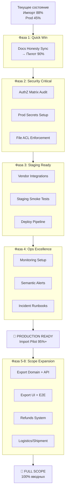

# VDP Production Readiness Master Plan

## Текущее состояние и цели

**Сейчас:**
- Пилот (импорт): ~88% готовности  
- Production go-live: ~45% готовности
- Full scope вводных: ~65% готовности

**Цели:**
1. **Краткосрочно (2-4 недели)**: Production-ready импорт пилот (95%+ готовности)
2. **Среднесрочно (2-3 месяца)**: Полный scope вводных + operational excellence
3. **Долгосрочно**: Масштабируемая платформа с полным coverage

## Архитектура фаз

## Фазы исполнения

### Фаза 1: Documentation Honesty (1-2 дня)
**Цель:** Поднять честную оценку пилота с 88% до 90%
- Синхронизация docs с уже существующими `@pilot-matrix` specs
- Обновление `readiness-and-limits.md` и `known-gaps.md`  
- Закрытие stale todos в планах imp7/8/9

### Фаза 2: Security Hardening (1-2 недели)  
**Критический блокер для prod**
- AuthZ matrix audit всех endpoints (User/Manager/Provider/Treasurer/Root)
- Prod secrets: JWT_SECRET, HUB_SHARED_SECRET rotation
- File ACL: User видит только свои формы, Provider без ПДн
- Security sign-off checklist execution

### Фаза 3: Staging Readiness (1-2 недели)
**Реальные интеграции**  
- DOCS_URL, MAIL_URL, DIADOC_URL с real vendor endpoints
- `staging-smoke.sh` с live services
- Deploy pipeline hardening + rollback procedures

### Фаза 4: Operational Excellence (1-2 недели)
**Live monitoring**
- Deployed semantic alerts (stuck payments, compliance delays)
- Incident runbooks с real scenarios
- SLA calibration + on-call procedures

**Milestone 1: PRODUCTION READY** (95%+ для импорт пилота)

### Фаза 5: Export Domain (2-3 недели)
**Новый маршрут согласно вводных**
- State machine export + PAY_FROM_EXPORT treasurer
- API endpoints + AuthZ matrix expansion  
- Unit/HTTP tests export journeys

### Фаза 6: Export UI/E2E (2-3 недели)
- Export кабинеты (User/Manager/Treasurer/Provider)
- Browser E2E coverage export ladder
- Integration с pilot-matrix methodology

### Фаза 7: Refunds System (2-4 недели)  
**PAYMENT_REFUND_* из §4 вводных**
- Domain: state machine возврата ДС + инварианты
- API + Manager UI для инициирования возвратов
- E2E: full refund journey + edge cases

### Фаза 8: Logistics/Shipment (3-4 недели)
**SHIPMENT_* контур**
- Domain расширение + документооборот отгрузки
- UI логистических статусов + workflow
- Full E2E shipment ladder

**Milestone 2: FULL SCOPE** (100% требований вводных)

## Dependency Map

- **Фазы 1-4**: Последовательные (каждая зависит от предыдущей)
- **Фазы 5-8**: Могут идти параллельно после Milestone 1
- **Export** не зависит от Refunds/Logistics
- **Security/Staging** критичны для любого prod deployment

## Риски и митигация

**High Risk:**
- Security audit может выявить архитектурные проблемы → план B: временные mitigations
- Vendor integrations могут требовать изменений API → early prototyping

**Medium Risk:**  
- Export domain может конфликтовать с import patterns → design review
- E2E expansion может замедлить CI → selective coverage strategy

## Success Metrics

**Фаза 1-4 (Prod Ready):**
- Security checklist: 100% выполнено
- Staging smoke: все интеграции green  
- Monitoring: 0 alert gaps для money path
- Deploy: rollback tested + documented

**Фаза 5-8 (Full Scope):**
- Export: паритет с import coverage (domain → E2E)
- Refunds: state machine + UI + E2E journey  
- Logistics: full SHIPMENT_* workflow
- Overall: 100% requirements из `@вводные`

## Handover Criteria

**К заказчику (после Milestone 1):**
- `handover-secrets-checklist.md` закрыт
- Production environment bootstrapped
- On-call procedures transferred + documented
- Knowledge transfer sessions completed

Каждая фаза имеет детальный план с конкретными задачами, файлами и DoD критериями.