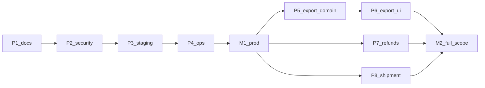

# VDP Production Readiness — master index

**Не исполнять этот файл целиком.** Как [`vdp_role_debug_master.plan.md`](vdp_role_debug_master.plan.md) / intake masters: работать **дочерним** `.plan.md`. После DoD дочернего — отметить todo здесь `completed` и перейти к следующему.

**Ритм:** [`заметки/ориентир-скорости-2026-08-25.md`](../../заметки/ориентир-скорости-2026-08-25.md) — 3.8 todo/ч. Сроки в child-планах от этого базиса.

## Как запускать по очереди

1. Открыть child-план из карты ниже (не этот master).
2. Исполнить его DoD / gate.
3. Закрыть todos в child + соответствующий todo в этом master.
4. Следующий по порядку (P1→P2→P3→P4→**M1**, затем P5→P6; P7 и P8 параллельно после M1; затем **M2**).

Agent prompt (шаблон): «Исполни план `@.cursor/plans/<child>.plan.md`. Master `@.cursor/plans/vdp_prod_readiness_master_89fa45e7.plan.md` только обнови статус todo после DoD.»

## Карта исполнения

## Дочерние планы

- **P1 Docs honesty** — [`phase_1_docs_honesty_5117c6f8.plan.md`](phase_1_docs_honesty_5117c6f8.plan.md) — **completed** (факт: [`import_docs_honesty_sync_3d8a9c27.plan.md`](import_docs_honesty_sync_3d8a9c27.plan.md)). Срок ~4–6 ч.
- **P2 Security** — [`phase_2_security_hardening_140a1ecf.plan.md`](phase_2_security_hardening_140a1ecf.plan.md) — **completed** (AuthZ matrix + file ACL + Provider/hub PII scrub + prod secret guards + rotation/backup runbooks; Phase 2 пункты `security-signoff-checklist.md`). Evidence: `authz_matrix_audit_test.go`, `file_acl_test.go`, `provider_pii_audit_test.go`, `hub_events_pii_audit_test.go`, `secrets-rotation-runbook.md`, `backup-encryption-runbook.md`.
- **P3 Staging** — [`phase_3_staging_readiness_d70c6ff0.plan.md`](phase_3_staging_readiness_d70c6ff0.plan.md) — **completed** (2026-09-15: make staging-smoke green with live docs/mail/sms; rollback-rehearsal-local + test-cd-scripts; alpha edge health/login OK; remote SSH rollback blocked until DEPLOY_SSH_KEY refresh).
- **P4 Ops** — [`phase_4_ops_excellence_20962059.plan.md`](phase_4_ops_excellence_20962059.plan.md) — pending. **Следующий к исполнению.** ~2–3 дня.
- **M1 Prod go-live** — [`milestone_1_prod_go_live_38e889e1.plan.md`](milestone_1_prod_go_live_38e889e1.plan.md) — pending. После P1–P4. Gate: `make release-gate` + handover checklists.
- **P5 Export domain** — [`phase_5_export_domain_dffbc889.plan.md`](phase_5_export_domain_dffbc889.plan.md) — pending. После M1. ~5–7 дней.
- **P6 Export UI/E2E** — [`phase_6_export_ui_e2e_22fcdbc8.plan.md`](phase_6_export_ui_e2e_22fcdbc8.plan.md) — pending. После P5. ~4–6 дней.
- **P7 Refunds** — [`phase_7_refunds_system_87a207ef.plan.md`](phase_7_refunds_system_87a207ef.plan.md) — pending. После M1 (параллельно P5/P6). ~6–8 дней.
- **P8 Logistics/shipment** — [`phase_8_logistics_shipment_b7770f93.plan.md`](phase_8_logistics_shipment_b7770f93.plan.md) — pending. После M1 (параллельно). ~7–9 дней.
- **M2 Full scope** — [`milestone_2_full_scope_7c4ecee1.plan.md`](milestone_2_full_scope_7c4ecee1.plan.md) — pending. После P5–P8. Gate: `ci-pr-pilot` + §9 sync.

## Цели (сводка)

- **Сейчас:** пилот импорт ~90% (P1), security (P2) и staging smoke local (P3) закрыты, prod go-live ~65–70% (остались P4 ops + M1 gate + alpha SSH key), full scope вводных ~65%.
- **После M1 (~2–3 раб. дня от старта P4):** import pilot prod-ready 95%+.
- **После M2 (~30–40 раб. дней от M1):** in-scope маршруты вводных domain→E2E; residual gaps остаются gaps.

## Dependency Map

- **P1–P4:** строго последовательно.
- **M1:** только после P1–P4.
- **P5→P6:** последовательно.
- **P7, P8:** после M1, параллельно друг другу и с P5/P6.
- **M2:** после P5–P8.

## Глобальные DoD

**M1:** security-signoff + handover-secrets + staging-smoke + alerts dry-run + `make release-gate` + notify-mgmt once.

**M2:** export+refunds+shipment branch green; §9 галочки = факт; readiness/gaps честны; `ci-pr-pilot`; notify-mgmt once.

## Rules (вся серия)

**Обязательны:** `планирование-сверка-с-rules`, `честность-готовности`, `vdp-ci-local-gate`, `mgmt-tg-notify`, `правила-построения`, `безопасность-ролей-и-данных`, `тесты-архитектуры`.

**По фазам:** P2 — security; P3 — `развертывание-и-доставка`; P4 — `устойчивость-и-наблюдаемость`; P5–P8 — `use-cases`, `playwright-e2e` / `ui-web-практики` где UI.

**Вне серии:** analytics/assistant product, own OCR PRIMARY, Nest data migration, POSTPAY_FIXED_RATE, logistics-as-separate-product, полный `release-gate` на каждый child (только M1).

## Риски

- ~~AuthZ audit в P2 может вскрыть дыры → fix до P3.~~ **снято:** дыры (accounts list, org create, counterparties, Provider identity docs) закрыты в P2.
- Vendor URL в P3 — внешняя зависимость по сроку.
- P7/P8 domain уже частично в formpayment — не переписывать с нуля, дожимать product+E2E.
- Ops-side backup encryption: runbook есть; фактическая верификация на инфра — в P4 / M1 handover.

> **Status-sync 2026-09-24:** cancelled as obsolete/superseded — see todo notes / overview. Do not execute this plan as a product wave.
