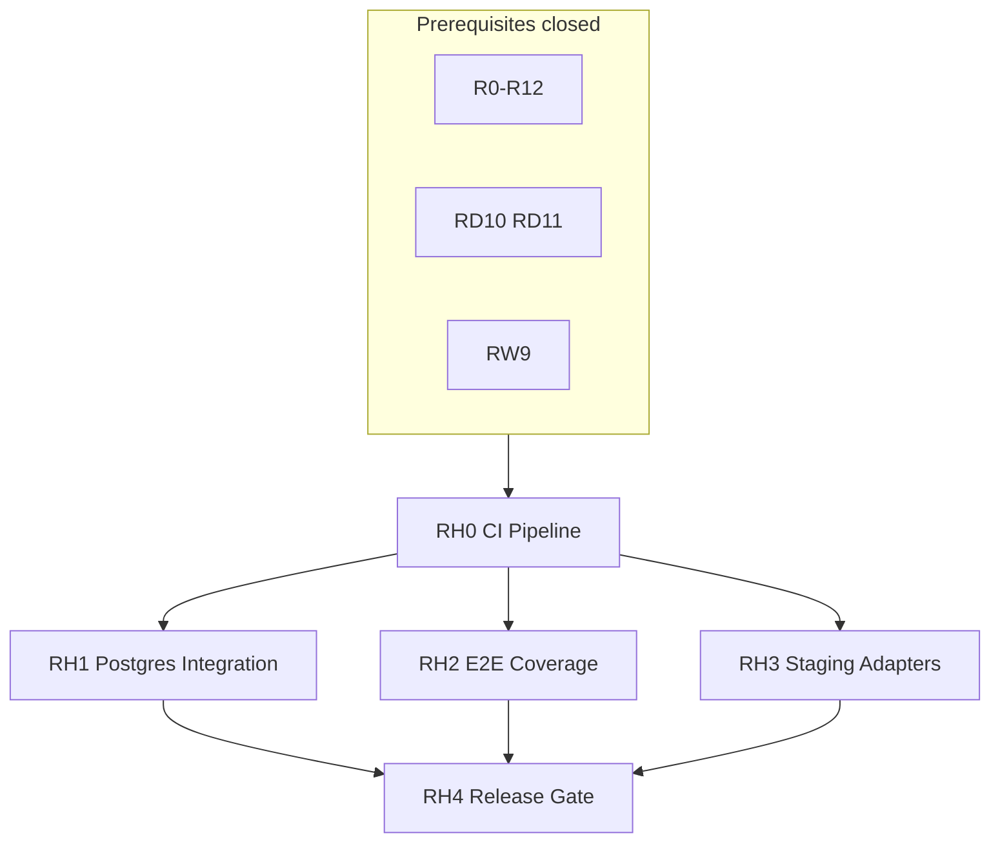

# VDP Reliability Hardening — master index

## Контекст

После закрытия **R0–R12** (backend), **RD0–RD11** (app-функция), **RW0–RW9** (copy) локальные gate'ы зелёные (`make integration-gate`, `make playwright-e2e`), но **автоматический контур стабильности отсутствует** — см. [`vdp/docs/pilot/known-gaps.md`](../vdp/docs/pilot/known-gaps.md).

Программа **RH** замыкает: CI/CD как владелец проверок, Postgres-слой, расширение E2E, staging-адаптеры, единый release-gate.

**Не путать с RD/RW:** RH не чинит UI journey и copy — автоматизирует и углубляет уже существующие gate'ы.

## Карта зависимостей

## Порядок исполнения

1. **RH0** — первым (без CI остальное не автоматизируется)
2. **RH1 + RH2 + RH3** — параллельно после RH0 (разные зоны кода)
3. **RH4** — после RH1–RH3 (агрегирует все gate'ы)

## Дочерние планы RH

| ID | Plan | Точка роста | Status |
|----|------|-------------|--------|
| RH0 | [rh0_ci_pipeline.plan.md](rh0_ci_pipeline.plan.md) | CI/CD владеет gate'ами; integration ≠ Playwright | pending |
| RH1 | [rh1_postgres_integration.plan.md](rh1_postgres_integration.plan.md) | Memory tests → Postgres integration layer | pending |
| RH2 | [rh2_e2e_coverage.plan.md](rh2_e2e_coverage.plan.md) | Узкое E2E → расширение + матрица покрытия | pending |
| RH3 | [rh3_staging_adapters.plan.md](rh3_staging_adapters.plan.md) | Stub-only → HTTP fake-server tests | pending |
| RH4 | [rh4_release_gate.plan.md](rh4_release_gate.plan.md) | Единый release-gate + observability | pending |

Обзор программы: [vdp_reliability_program.plan.md](vdp_reliability_program.plan.md)

## Команды gate (локально)

| Команда | Слой | Когда |
|---------|------|-------|
| `cd vdp/fe && npm test` | FE unit | каждый PR |
| `cd vdp && make test` | Go unit (memory) | каждый PR |
| `cd vdp && make test-integration` | Go integration (postgres) | после RH1 |
| `cd vdp && make integration-gate` | npm + go + compose-e2e | main / pre-merge |
| `cd vdp && make playwright-e2e` | Browser E2E | main / pre-release |
| `cd vdp && make release-gate` | Все gate'ы | после RH4 |

## Rules (все RH*)

**In:** развертывание-и-доставка, devops-культура, тесты-архитектуры, playwright-e2e, go-testing, правила-построения, честность-готовности, интеграция-и-события, устойчивость-и-наблюдаемость, безопасность-ролей-и-данных, use-cases, serverless-и-faas (OCR side-path).

**Out:** Nest data migration; logistics/analytics/BDUI; переписывание R/RD/RW; prod credentials в git; combinatorial E2E «все роли × все статусы».

## Глобальный DoD программы RH

- [ ] RH0–RH4 закрыты по DoD дочерних планов
- [ ] CI: `fast` на PR; `integration` + `playwright` раздельно на main
- [ ] Postgres integration tests green в CI (≥5 без skip)
- [ ] E2E matrix в [`vdp/docs/development/e2e-coverage-matrix.md`](../vdp/docs/development/e2e-coverage-matrix.md)
- [ ] Hub docs/mail покрыты HTTP fake-server tests
- [ ] `make release-gate` — единая pre-handover команда
- [ ] [`known-gaps.md`](../vdp/docs/pilot/known-gaps.md) обновлён без ложного «prod 100%»
- [ ] Root/demo/copy rules RW не нарушены

## Связь с другими программами

| Программа | Связь |
|-----------|-------|
| RD10/RD11 | RH0/RH2 автоматизируют локальные gate'ы |
| RW9 | Playwright specs опираются на стабильные labels |
| R8/R12 | RH3 углубляет adapter contract |
| DOC7 | CI doc → [`vdp/docs/operations/ci.md`](../vdp/docs/operations/ci.md) в RH0 |

## Источники истины

- [`vdp/Makefile`](../vdp/Makefile) — targets gate
- [`vdp/scripts/compose-e2e.sh`](../vdp/scripts/compose-e2e.sh) — API journey
- [`vdp/scripts/compose-playwright.sh`](../vdp/scripts/compose-playwright.sh) — browser E2E
- [`vdp/docs/development/testing.md`](../vdp/docs/development/testing.md) — пирамида тестов
- [`vdp/docs/pilot/known-gaps.md`](../vdp/docs/pilot/known-gaps.md) — честные пробелы
