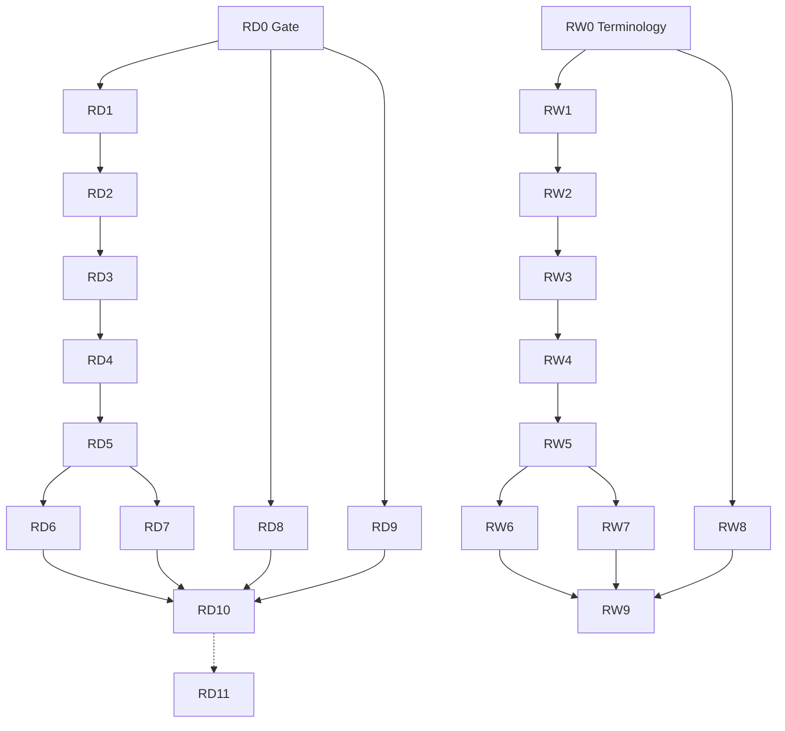

# VDP Role Debug + Role Wording — master index

## Контекст
App-контур: `/login` → JWT → `/api` → `vdp/core`. Demo `/demo/*` вне scope.
После Lovable UI + API — две ветки: **RD** (функция) и **RW** (формулировки).

## Карта зависимостей

## Порядок исполнения
1. RD0 + RW0 (можно одной сессией)
2. RD1 + RW1 (клиент)
3. Линейно RD2–RD6 / RW2–RW6
4. RD7 после RD5; RW7 после RW5
5. RD8/RD9 и RW8 параллельно после RD0/RW0
6. RW9 перед/вместе с RD10
7. RD11 после RD10 + RW9 (deferred)

## Дочерние планы RD

| ID | Plan | Роль | Status |
|----|------|------|--------|
| RD0 | [rd0_role_debug_gate.plan.md](rd0_role_debug_gate.plan.md) | Infra | done |
| RD1 | [rd1_user_app.plan.md](rd1_user_app.plan.md) | User | done |
| RD2 | [rd2_ico_app.plan.md](rd2_ico_app.plan.md) | ICO | pending |
| RD3 | [rd3_eco_app.plan.md](rd3_eco_app.plan.md) | ECO | pending |
| RD4 | [rd4_manager_contract.plan.md](rd4_manager_contract.plan.md) | Manager | pending |
| RD5 | [rd5_manager_payment.plan.md](rd5_manager_payment.plan.md) | Manager | pending |
| RD6 | [rd6_manager_close.plan.md](rd6_manager_close.plan.md) | Manager | pending |
| RD7 | [rd7_provider_app.plan.md](rd7_provider_app.plan.md) | Provider | pending |
| RD8 | [rd8_root_admin.plan.md](rd8_root_admin.plan.md) | Root | pending |
| RD9 | [rd9_bank_channel.plan.md](rd9_bank_channel.plan.md) | Bank | pending |
| RD10 | [rd10_integration_gate.plan.md](rd10_integration_gate.plan.md) | Final | pending |
| RD11 | [rd11_playwright_e2e.plan.md](rd11_playwright_e2e.plan.md) | Playwright | pending |

## Дочерние планы RW (root wording вне scope)

| ID | Plan | Роль |
|----|------|------|
| RW0 | [rw0_terminology_foundation.plan.md](rw0_terminology_foundation.plan.md) | Методология |
| RW1 | [rw1_user_copy.plan.md](rw1_user_copy.plan.md) | User |
| RW2 | [rw2_ico_copy.plan.md](rw2_ico_copy.plan.md) | ICO |
| RW3 | [rw3_eco_copy.plan.md](rw3_eco_copy.plan.md) | ECO |
| RW4 | [rw4_manager_copy_contract.plan.md](rw4_manager_copy_contract.plan.md) | Manager |
| RW5 | [rw5_manager_copy_payment.plan.md](rw5_manager_copy_payment.plan.md) | Manager |
| RW6 | [rw6_manager_copy_close.plan.md](rw6_manager_copy_close.plan.md) | Manager |
| RW7 | [rw7_provider_copy.plan.md](rw7_provider_copy.plan.md) | Provider |
| RW8 | [rw8_bank_copy.plan.md](rw8_bank_copy.plan.md) | Bank |
| RW9 | [rw9_copy_consistency_gate.plan.md](rw9_copy_consistency_gate.plan.md) | Consistency |

Методология: [`.cursor/rules/методология/`](../rules/методология/)

## Seed app
| Email | Password | Role |
|-------|----------|------|
| user@vdp.local | user | User |
| ico@vdp.local | ico | ICO |
| eco@vdp.local | eco | ECO |
| manager@vdp.local | manager | Manager |
| provider@vdp.local | provider | Provider |
| root@vdp.local | root | Root |
| bank@vdp.local | bank | Bank API |

## Источники истины
- [`actions.ts`](../vdp/fe/src/lib/ved/actions.ts) · [`statuses.ts`](../vdp/fe/src/lib/ved/statuses.ts)
- [`action-bridge.ts`](../vdp/fe/src/lib/ved/action-bridge.ts) · [`platform-store.ts`](../vdp/fe/src/lib/ved/platform-store.ts)
- [`compose-e2e.sh`](../vdp/scripts/compose-e2e.sh) · [`compose-fe-smoke.sh`](../vdp/scripts/compose-fe-smoke.sh)

## Rules (все RD*/RW*)
**In:** use-cases, интеграция-и-события, безопасность-ролей-и-данных, ui-web-практики, ux-*, тесты-архитектуры, правила-построения.
**Out RD0–RD10:** Playwright, demo regress, ML.
**Out RW\*:** root wording, смена status/action id.

## Глобальный DoD
**RD:** compose-e2e green; UI journey User→completed; Provider без ПДн; refund+bank; RD11 plan готов.
**RW:** методология; role-aware labels; root UI не изменён; RW9 consistency.

## Bug template
| Role | Form ID | Status before | CTA | Expected | Actual | Layer | Fix PR |
|------|---------|---------------|-----|----------|--------|-------|--------|
| … | … | … | … | … | … | UI/bridge/core/copy | … |
