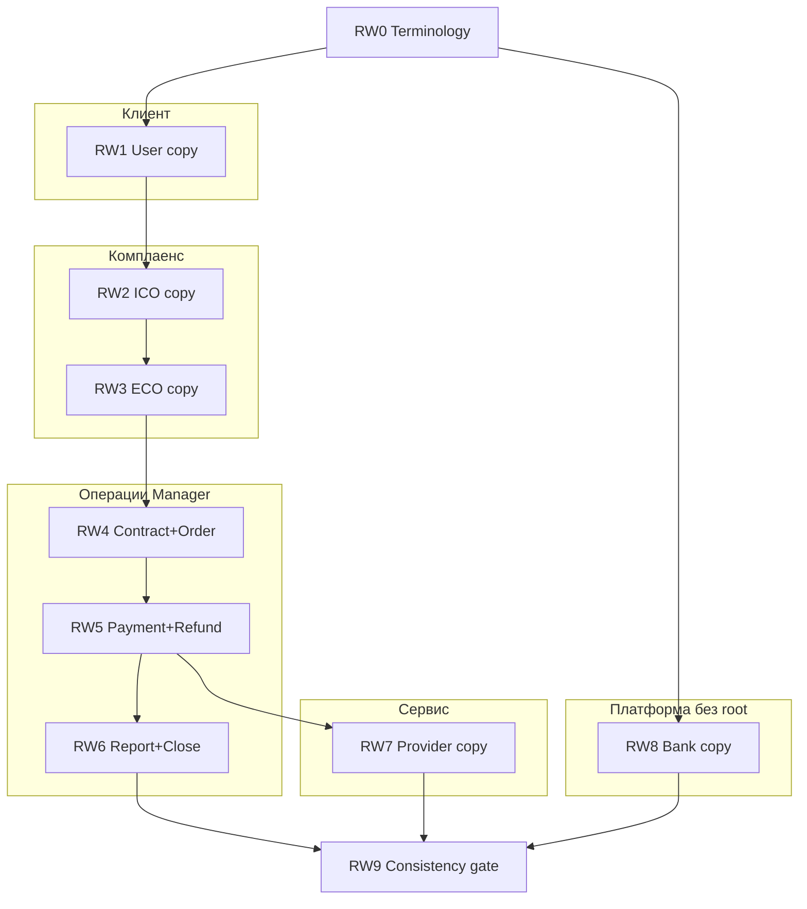
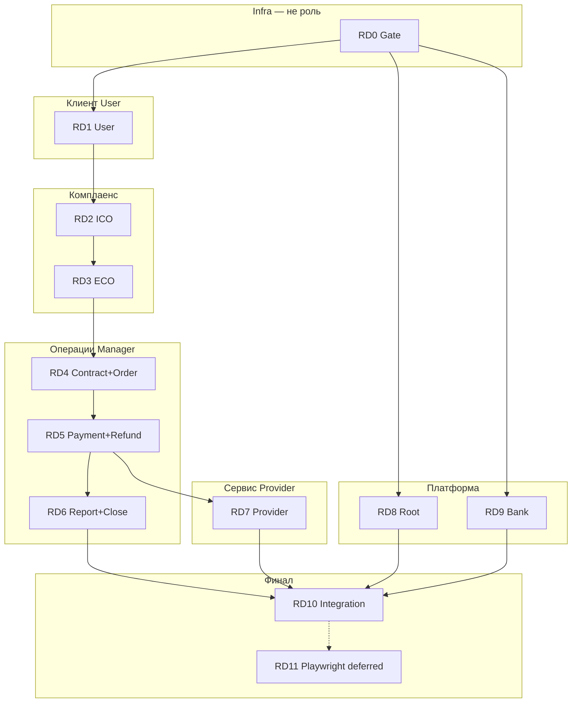

# VDP Role Debug + Role Wording: нарезка plan-файлов

## Контекст

После интеграции Lovable UI + API ([`vdp/fe/README.md`](vdp/fe/README.md)) — две параллельные программы в **app-контуре** (`/login` → JWT), **не** `/demo/*`:

| Ветка | Префикс | Цель |
|-------|---------|------|
| **Отладка** | RD0–RD11 | Функциональность, AuthZ, journey по ролям |
| **Копирайт** | RW0–RW9 | Формулировки UI ближе к **сленгу каждой роли**; **root/superadmin не трогаем** |

Master-план и дочерние файлы **ещё не на диске** — этот документ на **ревью**; создание файлов — после ваших инструкций.

---

## Ветка RW — Role Wording (новая)

### Принципы

- **Один канонический термин в домене** (status id, action id в core) — **не меняем**; меняем только **проекцию в UI** (label, subtitle, empty state, confirm).
- **Роль-специфичный слой:** клиент говорит «сделка / контракт / инвойс»; комплаенс — «проверка / досье / соответствие»; менеджер — «агент / поручение / исполнение»; провайдер — «платёж / реквизиты / подтверждение» (без ПДн).
- **Root (`root`, «Суперадмин»)** — **вне scope RW** (nav, dashboard superadmin, `/admin`, union CTA не переписываем).
- **Demo** — вне scope; правим app-контур и общие словари, если они shared.

### Справочная база (закладываем в платформу)

| Источник | URL | Использование в RW |
|----------|-----|-------------------|
| Портал ВЭД | [ved.gov.ru](https://ved.gov.ru/#/) | Официальная терминология, процессы участника ВЭД |
| Реестры Минфина | [minfin.gov.ru/ru/opendata/registry/](https://minfin.gov.ru/ru/opendata/registry/) | Справочники, открытые данные для UI подписей |
| Инфраструктура ЦБ | [cbr.ru/registries/infrastr/](https://cbr.ru/registries/infrastr/) | Финрынок, платёжная инфраструктура — для bank/manager copy |
| ТН ВЭД (ФТС) | [customs.gov.ru — ТН ВЭД](https://customs.gov.ru/uchastnikam-ved/spravochnaya-informacziya/tovarnaya-nomenklatura-%28tn-ved-eaes-i-tn-ved-sng%29) | Коды ТН ВЭД, таможенная лексика |
| Методология (PDF) | `Ksenofontova_OsnoviVED_.pdf` (приложен) | Конспект + терминологический словарь |

### RW0 — Методология и архитектура копирайта

**Артефакты (создать при исполнении RW0):**

```
.cursor/rules/методология/
  osnovy-ved-konspekt.txt      # структура + сокращения + термины из PDF (конспект, не полный OCR)
  terminologiya-ved.txt        # выжимка терминологического словаря (аккредитив, контракт, экспорт…)
  istochniki-i-ssylki.txt      # 4 URL выше + назначение для продукта
  glossariy-po-rolyam.txt      # таблица: термин канона → user / ico / eco / manager / provider / bank
```

**Техническая цель FE:** вынести строки из разрозненных файлов в слой копирайта, например:

- [`vdp/fe/src/lib/ved/copy/`](vdp/fe/src/lib/ved/copy/) — `status-labels.ts`, `action-labels.ts`, `nav-labels.ts`, `role-voice.ts`
- Потребители: [`actions.ts`](vdp/fe/src/lib/ved/actions.ts), [`statuses.ts`](vdp/fe/src/lib/ved/statuses.ts), [`nav-config.ts`](vdp/fe/src/lib/ved/nav-config.ts), [`dashboard-page.tsx`](vdp/fe/src/components/ved/pages/dashboard-page.tsx) (`ROLE_FOCUS`), страницы, [`SubjectReview.tsx`](vdp/fe/src/components/ved/SubjectReview.tsx)

**DoD RW0:** папка методологии в rules; glossariy-po-rolyam заполнен черновиком; решение «role-aware labels» зафиксировано в RW1 plan.

### Группировка RW по ролям



| RW | Файл plan | Роль | Зависимости | Не трогаем |
|----|-----------|------|-------------|------------|
| RW0 | `rw0_terminology_foundation.plan.md` | — | — | — |
| RW1 | `rw1_user_copy.plan.md` | User | RW0 | root |
| RW2 | `rw2_ico_copy.plan.md` | Internal CO | RW0, желательно RD2 | root |
| RW3 | `rw3_eco_copy.plan.md` | External CO | RW2 | root |
| RW4 | `rw4_manager_copy_contract.plan.md` | Manager | RW3 | root |
| RW5 | `rw5_manager_copy_payment.plan.md` | Manager | RW4 | root |
| RW6 | `rw6_manager_copy_close.plan.md` | Manager | RW5 | root |
| RW7 | `rw7_provider_copy.plan.md` | Provider | RW0 | root, ПДн |
| RW8 | `rw8_bank_copy.plan.md` | Bank channel | RW0 | root |
| RW9 | `rw9_copy_consistency_gate.plan.md` | все RW* | RW1–RW8 | root |

**Порядок:** RW0 → RW1 → … → RW6; RW7 после RW5; RW8 после RW0; **RW9** перед или сразу после **RD10** (согласованность терминов в сквозном journey).

**Связь с RD\*:** RW можно вести **параллельно** (RW1 сразу после RD1 на той же роли) или **блоком** после RD7; минимум — RW0 до любого RW1.

### Примеры сдвига формулировок (черновик для ревью)

| Канон (status/action) | Сейчас (общее) | User | Manager | ICO |
|----------------------|----------------|------|---------|-----|
| `draft` | Черновик | Черновик заявки | — | — |
| `organization_waiting_verification` | Ожидает проверки организации | Отправлено на проверку компании | — | В очереди на верификацию организации |
| `accept_form` | Отправить на проверку | Отправить заявку в банк/оператору | — | — |
| `mgr_assign_agent` | Назначить платёжного агента | — | Назначить агента по сделке | — |
| `prov_payment_sent` | Платёж отправлен | — | — | — |

*(Финальные формулировки — в glossariy-po-rolyam.txt на RW0.)*

### Rules (RW обязательны)

- [`ui-web-практики`](.cursor/rules/ui-web-практики.mdc) — один термин на сущность **внутри кабинета роли**; копирайт = глагол + объект
- [`ux-формы-навигация-онбординг`](.cursor/rules/ux-формы-навигация-онбординг.mdc) — Jakob: узнаваемая лексика ВЭД
- [`безопасность-ролей-и-данных`](.cursor/rules/безопасность-ролей-и-данных.mdc) — provider copy без намёков на ПДн
- [`интеграция-и-события`](.cursor/rules/интеграция-и-события.mdc) — status id не меняем, только UI projection
- [`поддержка-и-обратная-связь`](.cursor/rules/поддержка-и-обратная-связь.mdc) — help-тексты по роли в том же релизе

### DoD ветки RW (глобально)

- [ ] RW0: методология в `.cursor/rules/методология/`, glossariy-po-rolyam
- [ ] RW1–RW8: role-aware labels для nav, statuses, actions, dashboard subtitle, ключевых empty states
- [ ] Root UI **без изменений** (явный чек в каждом RW*)
- [ ] RW9: один термин не конфликтует между кабинетами на сквозном сценарии; `npm test` на copy/helpers
- [ ] Ссылки на внешние реестры — в `istochniki-i-ssylki.txt` (+ при необходимости tooltips «источник: ФТС/ЦБ»)

---

## Группировка по ролям (4 блока + gate + финал)



| Группа | RD | Роль / фокус | Login app | Зависимости |
|--------|-----|--------------|-----------|-------------|
| **Infra** | RD0 | Gate, baseline, bug template | — | — |
| **Клиент** | RD1 | User: create → draft → submit → uploads | `user@vdp.local` / `user` | RD0 |
| **Комплаенс** | RD2 | Internal CO: org + ICO form | `ico@vdp.local` / `ico` | RD1 |
| | RD3 | External CO: accept/reject/corrections | `eco@vdp.local` / `eco` | RD2 |
| **Операции** | RD4 | Manager: agent, contract, order | `manager@vdp.local` / `manager` | RD3 |
| | RD5 | Manager: provider, payment, refund | same | RD4 |
| | RD6 | Manager: report, shipment, completed | same | RD5 |
| **Сервис** | RD7 | Provider: ACL, payment, **без ПДн** | `provider@vdp.local` / `provider` | RD5 |
| **Платформа** | RD8 | Root: admin, dashboard, cancel | `root@vdp.local` / `root` | RD0 |
| | RD9 | Bank: API channel + UI badge | `bank@vdp.local` / `bank` | RD0 |
| **Финал** | RD10 | Сквозной UI journey + gates | все роли | RD1–RD9 |
| | RD11 | Playwright E2E (deferred) | — | RD10 |

**Порядок исполнения:** RD0 → RD1 → RD2 → RD3 → RD4 → RD5 → RD6 (линейный happy path); RD7 после RD5; RD8/RD9 параллельно после RD0; RD10 после всех; RD11 — backlog.

---

## Файлы для создания в [`.cursor/plans/`](.cursor/plans/)

### Master (индекс)

| Файл | Назначение |
|------|------------|
| [`vdp_role_debug_master.plan.md`](.cursor/plans/vdp_role_debug_master.plan.md) | RD0–RD11 + ссылки на RW0–RW9, зависимости, глобальный DoD |

### Ветка RD — отладка (12 файлов)

| ID | Файл | Группа |
|----|------|--------|
| RD0 | [`rd0_role_debug_gate.plan.md`](.cursor/plans/rd0_role_debug_gate.plan.md) | Infra |
| RD1 | [`rd1_user_app.plan.md`](.cursor/plans/rd1_user_app.plan.md) | Клиент |
| RD2 | [`rd2_ico_app.plan.md`](.cursor/plans/rd2_ico_app.plan.md) | Комплаенс |
| RD3 | [`rd3_eco_app.plan.md`](.cursor/plans/rd3_eco_app.plan.md) | Комплаенс |
| RD4 | [`rd4_manager_contract.plan.md`](.cursor/plans/rd4_manager_contract.plan.md) | Операции |
| RD5 | [`rd5_manager_payment.plan.md`](.cursor/plans/rd5_manager_payment.plan.md) | Операции |
| RD6 | [`rd6_manager_close.plan.md`](.cursor/plans/rd6_manager_close.plan.md) | Операции |
| RD7 | [`rd7_provider_app.plan.md`](.cursor/plans/rd7_provider_app.plan.md) | Сервис |
| RD8 | [`rd8_root_admin.plan.md`](.cursor/plans/rd8_root_admin.plan.md) | Платформа |
| RD9 | [`rd9_bank_channel.plan.md`](.cursor/plans/rd9_bank_channel.plan.md) | Платформа |
| RD10 | [`rd10_integration_gate.plan.md`](.cursor/plans/rd10_integration_gate.plan.md) | Финал |
| RD11 | [`rd11_playwright_e2e.plan.md`](.cursor/plans/rd11_playwright_e2e.plan.md) | Финал (deferred) |

### Ветка RW — копирайт (10 файлов, **без root**)

| ID | Файл | Группа |
|----|------|--------|
| RW0 | [`rw0_terminology_foundation.plan.md`](.cursor/plans/rw0_terminology_foundation.plan.md) | Методология |
| RW1 | [`rw1_user_copy.plan.md`](.cursor/plans/rw1_user_copy.plan.md) | Клиент |
| RW2 | [`rw2_ico_copy.plan.md`](.cursor/plans/rw2_ico_copy.plan.md) | Комплаенс |
| RW3 | [`rw3_eco_copy.plan.md`](.cursor/plans/rw3_eco_copy.plan.md) | Комплаенс |
| RW4 | [`rw4_manager_copy_contract.plan.md`](.cursor/plans/rw4_manager_copy_contract.plan.md) | Операции |
| RW5 | [`rw5_manager_copy_payment.plan.md`](.cursor/plans/rw5_manager_copy_payment.plan.md) | Операции |
| RW6 | [`rw6_manager_copy_close.plan.md`](.cursor/plans/rw6_manager_copy_close.plan.md) | Операции |
| RW7 | [`rw7_provider_copy.plan.md`](.cursor/plans/rw7_provider_copy.plan.md) | Сервис |
| RW8 | [`rw8_bank_copy.plan.md`](.cursor/plans/rw8_bank_copy.plan.md) | Платформа |
| RW9 | [`rw9_copy_consistency_gate.plan.md`](.cursor/plans/rw9_copy_consistency_gate.plan.md) | Финал |

**Итого plan-файлов:** 1 master + 12 RD + 10 RW = **23 файла**

---

## Единый шаблон каждого дочернего plan-файла

Каждый RD* содержит одни и те же секции (для единообразия и сверки с rules):

1. **Meta** — id, группа роли, зависимости, оценка
2. **Scope** — in/out (app only; demo вне scope)
3. **Rules gate** — обязательные: [`use-cases`](.cursor/rules/use-cases.mdc), [`безопасность-ролей-и-данных`](.cursor/rules/безопасность-ролей-и-данных.mdc), [`интеграция-и-события`](.cursor/rules/интеграция-и-события.mdc), [`ui-web-практики`](.cursor/rules/ui-web-практики.mdc), [`тесты-архитектуры`](.cursor/rules/тесты-архитектуры.mdc), [`правила-построения`](.cursor/rules/правила-пostroения.mdc)
4. **Login & entry** — seed email/password, стартовый маршрут
5. **UI checklist** — по статусам из [`actions.ts`](vdp/fe/src/lib/ved/actions.ts)
6. **API verify** — зеркало шагов [`compose-e2e.sh`](vdp/scripts/compose-e2e.sh)
7. **Fix zones** — UI / [`action-bridge.ts`](vdp/fe/src/lib/ved/action-bridge.ts) / [`platform-store.ts`](vdp/fe/src/lib/ved/platform-store.ts) / core
8. **DoD** — критерии закрытия этапа
9. **Bug template** — таблица (Role, Form ID, Status, CTA, Layer, Fix PR)

---

## Содержание по этапам (кратко)

### RD0 — Gate & baseline (Infra)
- `make compose-up`, `npm test`, `make compose-e2e`
- Baseline: seed org/provider IDs из e2e
- Пустая таблица багов
- **DoD:** compose + fe-smoke + e2e green; `/login` открывается

### RD1 — User (Клиент)
- Wizard `/forms/new`, auto `recognize_complete` → `draft` ([`platform-create.ts`](vdp/fe/src/lib/ved/platform-create.ts))
- Submit → `organization_waiting_verification`
- Реестр: только свои заявки
- Upload-ветки: contract, order, payment, report, shipment
- **DoD:** одна заявка до ICO-очереди без ручного API

### RD2 — ICO (Комплаенс)
- Nav: заявки + организации
- Org approve; `orgBlocksApproval` ([`compliance.ts`](vdp/fe/src/lib/ved/compliance.ts))
- `ico_form_start` → accept/reject
- **DoD:** заявка → `form_waiting_verification`

### RD3 — ECO (Комплаенс)
- `eco_form_start` → accept → `form_accepted`
- Reject → corrections → User resubmit
- **DoD:** happy path до `form_accepted`

### RD4 — Manager: contract & order (Операции)
- Agent, contract attach, order generate/verify
- User upload signed order
- **DoD:** `signing_order_accepted`

### RD5 — Manager: payment & refund (Операции)
- Provider assign, payment flow, refund panel ([`RefundPanel.tsx`](vdp/fe/src/components/ved/RefundPanel.tsx))
- **DoD:** payment path + refund smoke (409 on cancel with unrefunded)

### RD6 — Manager: report & close (Операции)
- Report signing, shipment, `mgr_completed`
- **DoD:** status `completed` на той же заявке

### RD7 — Provider (Сервис)
- Нет колонки «Клиент»; нет ПДн в карточке
- `prov_payment_*`, return → manager_checking
- **DoD:** ACL проверен; payment sent через UI

### RD8 — Root (Платформа)
- Superadmin dashboard, `/admin`, root cancel, `/testing`
- **DoD:** admin CRUD + cancel на активной заявке

### RD9 — Bank (Платформа)
- Bank API create; badge «Канал: Bank API»; [`BankSettingsPanel.tsx`](vdp/fe/src/components/ved/BankSettingsPanel.tsx)
- **DoD:** compose-fe-smoke bank + UI badge

### RD10 — Integration gate (Финал)
- Сквозной UI User → completed на одной form id
- Gates: `npm test`, `go test ./...`, `make compose-e2e`, parity checklist в README
- **DoD:** нет открытых P0 по ролям

### RD11 — Playwright (deferred)
- Plan only: 3–5 specs (happy, reject, provider ACL, bank)
- Prerequisite: RD10 green; rules: [`playwright-e2e.mdc`](.cursor/rules/playwright-e2e.mdc)

---

## Источники истины (общие для всех RD*)

| Слой | Артефакт |
|------|----------|
| Матрица CTA | [`vdp/fe/src/lib/ved/actions.ts`](vdp/fe/src/lib/ved/actions.ts) |
| Bridge | [`vdp/fe/src/lib/ved/action-bridge.ts`](vdp/fe/src/lib/ved/action-bridge.ts) |
| Store | [`vdp/fe/src/lib/ved/platform-store.ts`](vdp/fe/src/lib/ved/platform-store.ts) |
| API journey | [`vdp/scripts/compose-e2e.sh`](vdp/scripts/compose-e2e.sh) |
| FE smoke | [`vdp/scripts/compose-fe-smoke.sh`](vdp/scripts/compose-fe-smoke.sh) |
| Core tests | [`vdp/core/internal/service/form_payment_test.go`](vdp/core/internal/service/form_payment_test.go) |

---

## Глобальный DoD программы (master)

**RD (отладка):**
- [ ] RD0–RD10 закрыты по DoD
- [ ] `make compose-e2e` green после всех фиксов
- [ ] Ручной UI journey User → `completed` на одной заявке
- [ ] Provider без ПДн; refund + bank проверены
- [ ] RD11 plan готов; исполнение отложено

**RW (копирайт):**
- [ ] RW0–RW9 закрыты; root UI не изменён
- [ ] Методология в [`.cursor/rules/методология/`](.cursor/rules/методология/)
- [ ] Role-aware labels в FE copy-слое

---

## Рекомендуемый порядок исполнения (обе ветки)

```text
RD0 ─────────────────────────────────────────────► RD10 ─► RD11
  │
RW0 ─► RW1 ─► RW2 ─► RW3 ─► RW4 ─► RW5 ─► RW6 ─► RW9
         │                              │
         └ (параллельно с RD1…)         RW7 после RW5
RW0 ─► RW8 (bank, параллельно)
```

1. **RD0 + RW0** — можно одной сессией (gate + методология)
2. **RD1 + RW1** — клиент: сначала функция, затем или параллельно копирайт
3. Линейно по цепочке ролей
4. **RW9** — перед/вместе с **RD10**
5. **RD11** — после RD10 + RW9

---

## Что будет сделано после вашего «ок»

1. Создать **23 plan-файла** (master + 12 RD + 10 RW) в `.cursor/plans/`
2. RW0 additionally создаёт **`.cursor/rules/методология/`** (4 txt из PDF + ссылки)
3. Каждый RD*/RW* — самодостаточный plan с DoD
4. **Не** начинать код/отладку до отдельной команды

**Оценка:** RD0–RD10 ≈ 3–5 дней; RW0–RW9 ≈ 2–3 дня (можно параллельно с RD); RD11 ≈ 2–3 дня отдельно.
