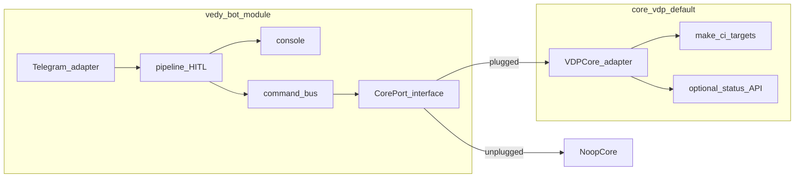
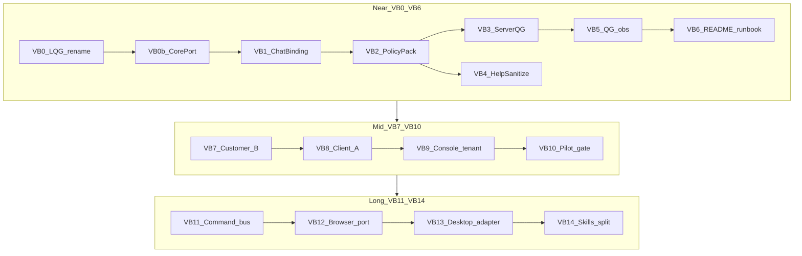

# vedy_bot: аудитории + Server QG (мастер VB)

Это **сборка планов**, не код. Модуль: [`инструменты/vedy_bot/`](инструменты/vedy_bot/) — **отдельный** от продукта [`vdp/`](vdp/) ([`workspace-карта`](.cursor/rules/workspace-карта.mdc)). Паттерн как [`intake_applied_stages_5075cc20.plan.md`](.cursor/plans/intake_applied_stages_5075cc20.plan.md): мастер-индекс + отдельные дочерние файлы. **После approve этого мастера** агент записывает все дочерние `.plan.md` (VB0, VB0b, VB1–VB14) в [`.cursor/plans/`](.cursor/plans/); закрывать мастер только когда файлы на диске и индекс сверен. Код волн — только из дочернего плана, по одному.

## Зафиксированные решения

- **Модуль ≠ ядро.** `vedy_bot` — автономный Go-модуль (свой `go.mod`, Docker project `vedy_bot`, `make test` внутри `инструменты/vedy_bot`). Не пакет внутри `vdp/`, не shared DB с core, не import `vdp/...` в коде бота.
- **Ядро сейчас = vdp.** Выбор зафиксирован; менять ядро в этой программе **не планируем**. Подключение к ядру — только через **CorePort** (интерфейс + адаптер), чтобы при необходимости модуль **отключить** (noop) или позже сменить адаптер без переписывания pipeline/HITL/console.
- **Plug:** адаптер `VDPCore` (workspace path, команды QG как `make -C <core> …`, опционально read-API статуса заявки позже). **Unplug:** `NoopCore` / `CORE_ADAPTER=off` — бот живёт как intake+HITL+console без QG/core API.
- Персоны: `client` | `customer` | `operator` | `eng`.
- До VB14: один bot-процесс + **ChatBinding registry**. Отдельные токены инстансов — VB14.
- Transport: long-poll; Server QG = async job на хосте модуля, runner зовёт **CorePort**, не хардкод путей `vdp` в pipeline.
- Канон канваса: **Local Quality Gate**; триггер `Local QG RUN` сохраняется (это gate **ядра vdp** в Cursor, не часть бинарника бота).
- Исходящие customer/client — sanitize ([`mgmt-tg-notify`](.cursor/rules/mgmt-tg-notify.mdc)); eng-команды deny вне `eng`/`operator`.
- Средний горизонт после QG Control VB0b + VB1–VB5. Дальний — после VB10.

## Граница модуль / ядро

Анти-паттерны: импорт домена form-payment в бот; общий compose-проект с vdp «навсегда»; Server QG как `cd vdp && …` размазанный по pipeline без порта; статус заявки VDP как истина внутри store бота без контракта адаптера.

## Сверка с `.cursor/rules` (MUST)

**Обязательны для программы:** `планирование-сверка-с-rules`, `базовые-правила-инструмента`, `правила-построения`, `workspace-карта` (tools ≠ vdp), `честность-готовности`, `безопасность-ролей-и-данных`, `границы-и-контексты`, `детали-как-плагины`, `screaming-architecture`, `solid` (D — ядро за портом), `use-cases`, `интеграция-и-события`, `устойчивость-и-наблюдаемость`, `поддержка-и-обратная-связь`, `mgmt-tg-notify`, `devops-культура`, `развертывание-и-доставка`, `тесты-архитектуры`, `go-testing`, `go-architecture`, `vdp-ci-local-gate` (VB0 = canvas ядра; VB3 = паритет имён команд через CorePort; полный `make ci-pr` — gate ядра, не каждой волны бота).

**Вне scope программы:** смена ядра с vdp на другое; вливание бота в `vdp/` monorepo package; ML-ядро статусов / платежный путь VDP; произвольный RPA; Ollama; stickers/voice; Nest-паритет через бота.

**Глобальный QG Control (каждый VB* наследует):**

- Gate **модуля**: `cd инструменты/vedy_bot && make test` (+ `make fe-test` / `make smoke` если трогали fe/console).
- Gate **ядра** (только если волна явно зовёт CorePort/VDP): команды через адаптер; Local Quality Gate / `make -C vdp ci-pr*` — не смешивать с «бот собрался».
- AuthZ: table-driven запрет eng-команд для `client`/`customer`.
- Honesty: нет `completed` / «бот = часть vdp» / «ядро заменим» без DoD; unplug-режим документирован.
- Server QG (с VB3): ответ в TG без секретов, `localhost`, путей планов, brand IDE.

## Карта

## Шаблон дочернего plan-файла (обязателен)

Каждый файл `.cursor/plans/vbN_….plan.md`:

- Frontmatter: `name`, `overview`, `todos`, `isProject: false`
- Секции: родитель (этот мастер), **Сверка с rules**, Цель, Работы (файлы-опоры), **Граница модуль/ядро** (если релевантно), **QG Control**, DoD, Вне scope
- **QG Control** минимум: Gate модуля; Pass; Fail/no-claim; Local Quality Gate / Server `/qg` / CorePort; AuthZ-check если есть команды
- Запрет в DoD: «влить в vdp», import `vdp/` packages, shared DB с core

Опоры кода: [`internal/router/router.go`](инструменты/vedy_bot/internal/router/router.go), [`internal/config/config.go`](инструменты/vedy_bot/internal/config/config.go), [`internal/pipeline/pipeline.go`](инструменты/vedy_bot/internal/pipeline/pipeline.go), [`internal/comms/sanitize.go`](инструменты/vedy_bot/internal/comms/sanitize.go), [`internal/console/server.go`](инструменты/vedy_bot/internal/console/server.go), [`cmd/vedy_bot/main.go`](инструменты/vedy_bot/cmd/vedy_bot/main.go), [`docker-compose.yml`](инструменты/vedy_bot/docker-compose.yml) (уже `name: vedy_bot`, отдельно от стека vdp), канвас Local Quality Gate (gate **ядра**, не бинарник бота).

---

## VB0 — Local Quality Gate: имя канваса

**Цель:** канон отображения **Local Quality Gate**; H1/footer согласованы; `Local QG RUN` сохранён как trigger.

**Работы:** правки managed canvas; не раздувать второй UI; сверить [`vdp-ci-local-gate.mdc`](.cursor/rules/vdp-ci-local-gate.mdc) (триггер RUN не ломать). Явно: canvas = DX ядра vdp в Cursor, не UI модуля `vedy_bot`.

**QG Control:** заголовок Local Quality Gate; trigger `Local QG RUN` жив. Не требует `make test` vedy_bot.

**Вне scope:** Server QG; CorePort; смена make-целей ядра.

---

## VB0b — CorePort: plug / unplug к ядру

**Цель:** ввести порт ядра внутри модуля так, чтобы vdp был **подключаемым адаптером по умолчанию**, а бот оставался работоспособным при отключении ядра.

**Работы:**

- Пакет `internal/coreport` (или `internal/core`): интерфейс узкий (например `Name()`, `RunGate(ctx, target)`, позже `LookupStatus` — заглушка).
- Адаптеры: `VDPCore` (root path / `make -C` targets, имена как у Local Quality Gate: `ci-pr`, `ci-pr-fast`, `docs`, `precommit`) и `NoopCore` (`CORE_ADAPTER=off` / empty → QG недоступен с понятной ошибкой).
- Wiring в `cmd/vedy_bot` и config; **ноль** `import` на пакеты `vdp/`.
- Unit: plugged vs unplugged; fake core в тестах pipeline/jobs.
- README: «модуль отдельно; ядро vdp подключается; отключается без переписывания HITL».

**QG Control:** `make test` в модуле; тест NoopCore; grep/CI-дисциплина «нет go-зависимости на vdp»; honesty: не claim смены ядра. VB3 без зелёного VB0b не стартует.

**Вне scope:** реализация Server QG job (VB3); HTTP API статуса заявки; смена ядра с vdp.

---

## VB1 — ChatBinding registry

**Цель:** registry `chat_id → {persona, tenant_id, capabilities[]}`. Legacy env → default **eng/operator** для существующих id.

**Опора:** `config.Load`, `router.Classify` / `Allowed`.

**QG Control:** `make test`; 4 persona; unknown → deny; legacy boot. Fail: «multi-tenant / клиентам готово».

**Граница:** registry живёт в модуле; не таблица Postgres vdp.

**Вне scope:** bot tokens; console tenant UI; CorePort API заявки.

---

## VB2 — PolicyPack AuthZ

**Цель:** deny-by-default: `/qg`, agent/Cursor, HITL, `/vvod`, publish — по persona. Capability `qg` требует CorePort plugged.

**QG Control:** unit eng-команд × client/customer → deny; eng allow; unplugged → `/qg` deny даже для eng. Без VB2 зелёный VB3 запрещён.

**Вне scope:** runner `/qg` (VB3).

---

## VB3 — Server QG MVP

**Цель:** `/qg …` в eng/operator → job queue → **`CorePort.RunGate`** → sanitize reply в TG. Паритет имён команд с Local Quality Gate. Не `release-gate` без явной команды.

**Опора:** jobs + VB0b; sanitize; PolicyPack.

**QG Control:** unit parse/ACL; fake CorePort; unplugged → явный отказ; client `/qg` deny; ответ без секретов. Не утверждать «VDP CI зелёный» без реального прогона адаптера.

**Граница:** job и очередь в модуле; исполнение make — за адаптером ядра.

**Вне scope:** browser/desktop; QG для customer/client.

---

## VB4 — Persona `/help` + sanitize profiles

**Цель:** help и sanitize по persona; eng-help упоминает CorePort plug/unplug одной строкой.

**QG Control:** unit трёх help; banned tokens; `make test`.

**Вне scope:** FAQ CMS.

---

## VB5 — Наблюдаемость Server QG

**Цель:** job/correlation id; rate-limit `/qg`; статус job; health без секретов; в статусе видно `core=vdp|off`.

**QG Control:** unit rate-limit; лог без token; `make test`.

**Вне scope:** отдельный Prometheus ядра.

---

## VB6 — README + runbooks near

**Цель:** README: модуль отдельно от vdp; plug/unplug; три аудитории roadmap; Server QG только eng+plugged; runbook своего цикла.

**QG Control:** README ↔ VB0b–VB5; `make test`/`smoke`; нет claim «часть vdp» / «выдаём клиентам».

**Вне scope:** пилот заказчика (VB7+).

---

## VB7 — Заказчик (B) tenant packaging

**Цель:** tenant + persona=`customer`; HITL → продуктовый ответ; без Cursor/QG; ядро не обязательно plugged.

**QG Control:** AuthZ регресс; sanitize; runbook выдачи бота заказчику. Pilot один tenant.

**Вне scope:** client pack (VB8); биллинг; зависимость от vdp API.

---

## VB8 — Клиенты заказчика (A) skill-pack

**Цель:** help, обращение, эскалация; self-service; ноль eng; минимум ПДн.

**QG Control:** client capabilities; `/qg`/agent deny; smoke client-чата.

**Граница:** любой будущий «статус заявки» — только через CorePort + явный контракт в отдельной волне; в VB8 **нет** вызовов vdp.

**Вне scope:** VDP status API; кабинет.

---

## VB9 — Console filter by tenant/channel

**Цель:** фильтр thread/cards в консоли модуля; не UI vdp.

**QG Control:** `make test` + `make fe-test`; smoke `:8787`.

**Вне scope:** кабинет ВЭД / BDUI.

---

## VB10 — Pilot C→B→A verification gate

**Цель:** три чата + сценарий unplug CorePort (eng без QG); закрытие mid по матрице.

**QG Control:** Pass/Fail чеклист включая plug/unplug; notify-mgmt только с продуктовым смыслом; честность %.

**Вне scope:** browser/desktop; смена ядра.

---

## VB11 — Command bus ports

**Цель:** Intent → Cursor | CorePort/QG | stubs browser/desktop. Pipeline не знает vdp.

**QG Control:** unit routing; eng-only; unplugged QG path; `make test`.

**Вне scope:** browser impl (VB12).

---

## VB12 — Browser port (whitelist)

**Цель:** 2–3 сценария + HITL; порт модуля, не сервис vdp.

**QG Control:** dry-run; HITL вне allowlist; honesty.

**Вне scope:** desktop; произвольный серфинг.

---

## VB13 — Desktop adapter whitelist

**Цель:** один IPC/app adapter в модуле; least privilege.

**QG Control:** deny вне whitelist; тесты; README gap.

**Вне scope:** полный контроль ОС; связь с vdp compose.

---

## VB14 — Skill registry + instance split

**Цель:** skills по persona; отдельные инстансы A/B/C; каждый инстанс по-прежнему **модуль**, опционально с/без CorePort.

**QG Control:** registry tests; runbook split; не «100% work OS»; не «слияние с vdp».

**Вне scope:** публичный marketplace; замена ядра.

---

## Порядок исполнения после approve

1. Записать мастер + все `vb0_…`, `vb0b_core_port.plan.md`, `vb1_…` … `vb14_….plan.md` с QG Control и секцией границы модуль/ядро где нужно.
2. Не блокировать историю intake-master; не удалять.
3. Код: **VB0 → VB0b → VB1…**; VB3 только после VB0b+VB2; mid/long по зависимостям выше.
4. Не переносить `vedy_bot` под `vdp/` и не добавлять go-module dependency на ядро.

## Расписание старта

- **Старт исполнения:** 2026-09-14 **21:00 Europe/Moscow** (одноразовый wake в этой сессии).
- До тика код/материализацию дочерних планов **не** начинать.
- На тике: выполнить этот мастер — сначала materialize всех VB*, затем VB0 по порядку.
