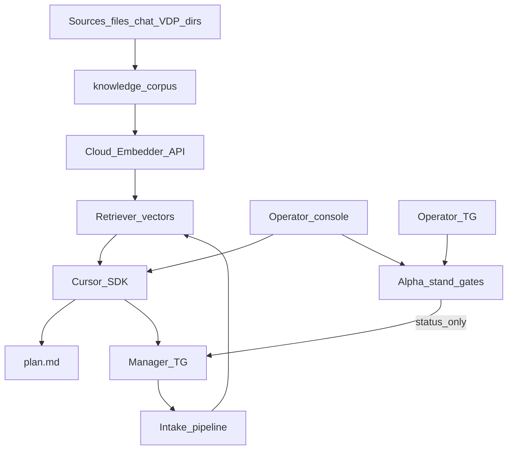

# Мастер-план: vedy_bot — агент, знания, менеджеры

Статус: **решения зафиксированы** (2026-09-17). Запуск кода — после явной команды исполнить (начни с P0).

## Быстрый указатель (все планы)

**Точка входа (удобнее чата):** canvas
[vedy-bot-plans.canvas.tsx](/Users/levpogosov/.cursor/projects/Users-levpogosov-Downloads-viletech-platform/canvases/vedy-bot-plans.canvas.tsx)
— открой рядом с чатом.

**Инструмент планирования доработок (любой проект):**
[project-planning.canvas.tsx](/Users/levpogosov/.cursor/projects/Users-levpogosov-Downloads-viletech-platform/canvases/project-planning.canvas.tsx)
— бриф → слои → QG → черновик / этапы / сверка rules / исполнение.

| Файл | Этап |
|---|---|
| [vedy_bot_master_knowledge_agent.plan.md](vedy_bot_master_knowledge_agent.plan.md) | Карта, RAG, порядок, решения |
| [vedy_bot_p0_agent_cloud.plan.md](vedy_bot_p0_agent_cloud.plan.md) | Cloud Cursor из консоли, честный fail |
| [vedy_bot_p1_knowledge_rag.plan.md](vedy_bot_p1_knowledge_rag.plan.md) | Модуль знаний: файлы + справочники + чат + VDP + cloud embeddings |
| [vedy_bot_p2_tg_cursor_auto.plan.md](vedy_bot_p2_tg_cursor_auto.plan.md) | TG intake → SDK без консоли |
| [vedy_bot_p3_hitl_cursor_primary.plan.md](vedy_bot_p3_hitl_cursor_primary.plan.md) | Rules → secondary; Cursor+KB primary |
| [vedy_bot_p4_local_cursor_agent.plan.md](vedy_bot_p4_local_cursor_agent.plan.md) | Local/cloud dual-mode |
| [vedy_bot_p5_alpha_stand_tests.plan.md](vedy_bot_p5_alpha_stand_tests.plan.md) | Тесты alpha из бота (ops) |

Папка: `.cursor/plans/`.

## Зафиксированные решения

1. **P1 со embeddings** — смысловой RAG обязателен в P1. Реализация: порт `Embedder` + **облачный** OpenAI-compatible HTTP API (env URL/key/model). Локальная LLM/Ollama для эмбеддингов **не** используются (нет ресурсов на машине). Векторный индекс хранится локально под `INTAKE_HOME/knowledge/`. Нет ключа embeddings → честный error на ingest/search (не тихий FTS-only success). Keyword/FTS — вторичный boost, не замена embeddings.
2. **P3 hybrid** — primary Cursor+KB; rule-HITL остаётся fallback; hard-delete правил вне этой программы.
3. **P5** — старт тестов alpha только из operator console / operator TG; менеджеру только sanitized статус.

## RAG / база знаний

В first-party **не было** модуля. Vendored AMG/vili RAG — только референс, не runtime.

Пакет: `инструменты/vedy_bot/internal/knowledge` — ingest → chunk → embed → store → retrieve → `ContextPack` в промпт Cursor.

## Целевая картина

## Карта этапов

| ID | Файл | Работа | Зависит |
|---|---|---|---|
| P0 | [vedy_bot_p0_agent_cloud.plan.md](vedy_bot_p0_agent_cloud.plan.md) | Cloud Cursor + честный fail | — |
| P1 | [vedy_bot_p1_knowledge_rag.plan.md](vedy_bot_p1_knowledge_rag.plan.md) | Knowledge + cloud embeddings RAG | — |
| P2 | [vedy_bot_p2_tg_cursor_auto.plan.md](vedy_bot_p2_tg_cursor_auto.plan.md) | TG → SDK + ContextPack | P0, P1 |
| P3 | [vedy_bot_p3_hitl_cursor_primary.plan.md](vedy_bot_p3_hitl_cursor_primary.plan.md) | Cursor primary, rules fallback | P2 |
| P4 | [vedy_bot_p4_local_cursor_agent.plan.md](vedy_bot_p4_local_cursor_agent.plan.md) | Local/cloud dual-mode | P0 |
| P5 | [vedy_bot_p5_alpha_stand_tests.plan.md](vedy_bot_p5_alpha_stand_tests.plan.md) | Alpha tests; start ops-only | P0 |

Порядок: **P0 ∥ P1 → P2 → P3**; **P4**, **P5** после P0 (∥ P1–P2).

## Сверка с `.cursor/rules`

**Обязательны:** `планирование-сверка-с-rules`, `базовые-правила-инструмента`, `честность-готовности`, `правила-построения`, `go-testing` / `go-architecture`, `screaming-architecture`, `детали-как-плагины`, `границы-и-контексты`, `интеграция-и-события`, `безопасность-ролей-и-данных`, `устойчивость-и-наблюдаемость`, `поддержка-и-обратная-связь`, `машинное-обучение` (RAG не меняет статусы оплаты VDP; embeddings за портом), `mgmt-tg-notify` на продуктовый done.

**P5 дополнительно:** `vdp-ci-local-gate`, `развертывание-и-доставка`, `тесты-архитектуры`.

**Вне scope** (эту программу **не** делаем сейчас — не путать с «запрещено навсегда»):

| Пункт | Простыми словами |
|---|---|
| кабинеты BDUI | Не трогаем UI кабинетов ролей ВЭД (User/CO/…) — только бот/консоль intake |
| Nest parity | Не занимаемся паритетом Nest↔vdp API |
| local Ollama / local embedding models | Не ставим локальную модель для эмбеддингов/чата; эмбеддинги — **облачный API** (уже в P1) |
| runtime-зависимость от vendored AMG | Не подключаем чужой snapshot AMG/vili как живой сервис; можно лишь подсмотреть идеи |
| hard-delete rule-HITL | Не выпиливаем старые правила из кода; они остаются fallback (P3) |
| старт stand-тестов менеджером | Менеджер заказчика **не** запускает тесты alpha; только оператор (P5) |

**QG:** vedy_bot `make test` (+ `make smoke`); при правках `vdp/**` — `check-env-parity` → `ci-pr-fast`/`ci-pr` по path-filter.

## Принципы cutover

1. P0–P2: rules HITL живы; P3: `INTAKE_HITL_MODE` hybrid→cursor + fallback rules.
2. Knowledge владеет корпусом; VDP только export/API, без shared DB.
3. Manager out → `SanitizeManager`.
4. Cursor cloud default; local — P4.
5. Embeddings: cloud API; fail честный.
