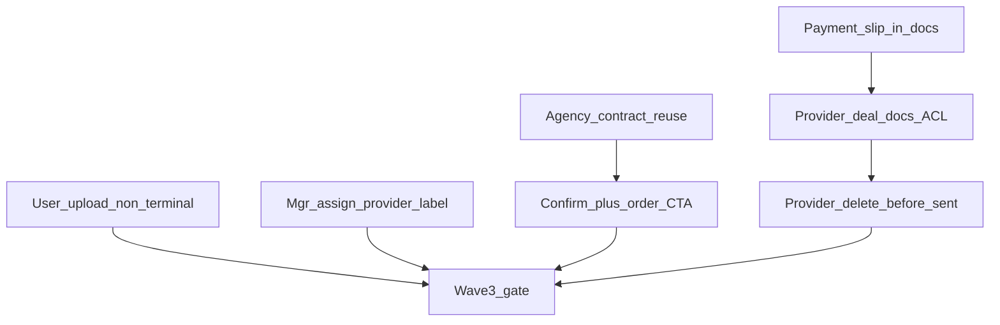

# Волна 3: Docs / provider / agency (п. 10, 12, 13, 13.1, 14–14.3)

## Сверка с `.cursor/rules`

**Обязательны:** `планирование-сверка-с-rules`, `базовые-правила-инструмента`, `правила-построения`, `честность-готовности`, `use-cases`, `безопасность-ролей-и-данных` (Provider без ПДн и без агентского договора; AuthZ на API, не только UI), `интеграция-и-события`, `чистая-архитектура` / `solid`, `ui-web-практики`, `тесты-архитектуры`, `playwright-e2e`, `go-testing`, `mgmt-tg-notify` после gate.

**Вне scope:** п. 17, 19; п. 15–16 (блокер Dasha); Wave 0–2; ICO/ECO; новый OCR-engine.

**Зафиксированные решения (из [`вводные/обратная связь после передачи на просмотр.txt`](вводные/обратная%20связь%20после%20передачи%20на%20просмотр.txt)):**
- Upload (п. 10): любой статус **кроме** `completed` / cancel*.
- Provider docs: **все deal docs кроме агентского договора**; без ПДн клиента.
- П. 12: точный лейбл «назначить платёжного провайдера» (не путать с агентом).
- П. 13/13.1: reuse принятого договора org → не просить upload снова; первая сделка — одна кнопка confirm+order, дальше только поручения.

---

## P12. Лейбл назначения провайдера

**Декомпозиция:** в [`actions.ts`](vdp/fe/src/lib/ved/actions.ts) `mgr_assign_provider.label` → «Назначить платёжного провайдера». Обновить e2e (`happy-path`, `manager-payment`, `pilot-*`), не трогать `mgr_assign_agent`.

**Отладка:** grep по старому тексту; pilot spot.

---

## P14 + P14.1 + P14.2. Платёжка + ACL документов провайдера

**Декомпозиция**

1. **П. 14:** при `SetConfirmation` / `prov_attach_proof` также писать файл в `docs_json` с `kind: "payment"` ([`form_payment_assign.go`](vdp/core/internal/service/form_payment_assign.go) или вызов `AttachFileToForm` из store после upload). Либо дублировать `confirmation_file_id` в FE mapper — **канон: и confirmation, и docs_json**, чтобы список видел файл.
2. **П. 14.1:** [`provider-acl.ts`](vdp/fe/src/lib/ved/provider-acl.ts) — показывать deal docs **кроме** agency/contract (сейчас wrongly payment-only).
3. **П. 14.2:** defense-in-depth: FE filter + **server scrub** в provider Get/view ([`GetProviderView`](vdp/core/internal/service/) / handleGetForm для provider) — убрать агентский договор из `docs_json`/refs и не отдавать client PII fields. Preview/download AuthZ по kind.

**Отладка:** unit `provider-acl` + Go provider view без contract; e2e: attach proof → виден в списке; contract не виден.

---

## P14.3. Удаление файлов провайдером до handoff

**Декомпозиция:** на карточке провайдера `DocumentList` + delete для своих/допустимых файлов, пока статус `payment_processing` (и аналоги до `provider_sent`). Использовать существующий `DELETE …/files/{fileId}` / [`deleteDocument`](vdp/fe/src/lib/ved/platform-store.ts). Если удаляют confirmation slip — чистить `confirmation_file_id` + docs ref.

**Отладка:** e2e attach → delete → re-attach; AuthZ deny после sent.

---

## P10. Upload в любом статусе кроме completed/cancel

**Декомпозиция:** в [`form-detail-page.tsx`](vdp/fe/src/components/ved/pages/form-detail-page.tsx) отвязать `canUploadDocs` от `canEditParams` (party-edit остаётся Wave 1). Разрешить user/root (и manager при необходимости для «логики с менеджером») upload если статус не terminal (`completed`, `canceled`, cancel*). BE `AttachFileToForm` — не ужесточать сверх AuthZ формы; при необходимости явный deny на terminal.

**Отладка:** unit helper `canUploadDocuments(status, role)`; e2e mid-lifecycle attach на submitted/processing.

---

## P13 + P13.1. Агентский договор once + одна CTA

**Декомпозиция**

1. **П. 13:** опереться на [`ResolveContractBranch`](vdp/core/internal/service/contract.go) (accepted org contract → reuse). FE: скрыть user `upload_contract`, если у org уже есть accepted contract / form уже с `contract_id`. Unit: вторая заявка той же org не требует upload.
2. **П. 13.1:** на `contract_verification` свернуть `mgr_contract_confirm` + order в **одну** primary CTA, когда нужен первый accept+send_order ([`manager-contract.ts`](vdp/fe/src/lib/ved/manager-contract.ts) / `planContractConfirm` уже умеет `accept_then_send_order`). После reuse/accepted — только действия поручения (`mgr_order_*`), без повторного «подтвердить договор».

**Отладка:** unit planContractConfirm branches; e2e/manager-flow: first deal one button; second deal skip contract ask.

---

## Ключевые файлы

| Зона | Файлы |
|------|--------|
| Upload gate | [`form-detail-page.tsx`](vdp/fe/src/components/ved/pages/form-detail-page.tsx), helper + unit |
| Assign label | [`actions.ts`](vdp/fe/src/lib/ved/actions.ts), e2e |
| Agency / CTA | [`contract.go`](vdp/core/internal/service/contract.go), [`manager-contract.ts`](vdp/fe/src/lib/ved/manager-contract.ts), [`actions.ts`](vdp/fe/src/lib/ved/actions.ts) |
| Provider docs | [`provider-acl.ts`](vdp/fe/src/lib/ved/provider-acl.ts), [`form_payment_assign.go`](vdp/core/internal/service/form_payment_assign.go), provider view scrub, [`mappers.ts`](vdp/fe/src/lib/api/mappers.ts), DocumentList |
| Tests | `provider-acl` / upload helper / contract resolve units; `wave3-*.spec.ts`; `make playwright-pilot` |

---

## DoD волны 3

- Upload доступен вне completed/cancel; party-edit не расширен.
- Кнопка менеджера: «Назначить платёжного провайдера».
- Вторая сделка с той же org не требует повторного агентского договора; первая — одна CTA confirm+order, далее только поручения.
- Платёжка провайдера видна в документах; deal docs видны без агентского; ПДн не в provider view; delete до отправки работает.
- Unit + Playwright spot + `make playwright-pilot` green; `notify-mgmt` после закрытия.
- Не утверждать «полный ACL 100%» без server scrub + e2e (честность готовности).
