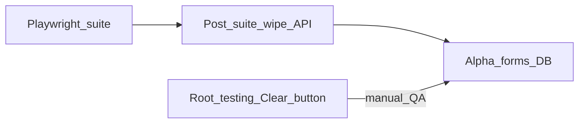

# Волна 0: Hygiene (login / alpha / sort)

## Сверка с `.cursor/rules`

**∆**

**Вне scope:** пункты клиента 1–19; ICO/ECO UI; Nest rename; wipe prod/gamma без явной политики.

**Gate:** vitest/Playwright spot на login empty; wipe policy unit; post-e2e wipe smoke; list sort unit + UI; `make playwright-pilot` не ломается.

---

## H0. Пустая форма `/login`

**Декомпозиция:** убрать hardcode seed из controlled inputs; seed-hint только local/dev.

**Реализация:** `[vdp/fe/src/routes/login.tsx](vdp/fe/src/routes/login.tsx)` — `useState("")` для email/password; блок «Seed: user@…» скрыть если не `import.meta.env.DEV` (или аналог). E2E `[login-form.spec.ts](vdp/fe/e2e/login-form.spec.ts)` / fixture — заполняют поля явно (уже так).

**Отладка:** ручной open `/login` — поля пустые; Playwright login green; autofill браузера не путать с prefill.

---

## H1. Alpha: следы тестов убирать автоматически + кнопка для ручного QA

**Зачем:** seed не создаёт forms (`[seed.go](vdp/core/internal/repository/seed/seed.go)`), но Playwright/сценарии и ручной QA оставляют заявки в БД. На alpha wipe сейчас выключен (`ShouldWipeForms` → false) → кнопка «Очистить все заявки» на Root `/testing` бесполезна, а после CI реестр засоряется.

**Декомпозиция (два канала, оба нужны):**

1. **Авто после автотестов** — по завершении Playwright (успех или fail) вызвать wipe заявок, чтобы не оставлять следы suite.
2. **Ручной QA** — root всегда может нажать «Очистить все заявки» на alpha (и local/demo/test), не дожидаясь CI.

Wipe = только `form_payments` и связанные probe-строки (`[WipeProbeData](vdp/core/internal/service/probe_wipe.go)`); учётки/орги seed **не** трогаем.

**Реализация (зафиксировано):**

1. **Политика wipe:** `ShouldWipeForms` — разрешить wipe на `alpha` (и оставить local/development/test/ci). `SEED_WIPE_FORMS=0` по-прежнему жёстко запрещает. Prod/staging/beta/gamma — без wipe по умолчанию. Unit в `[seed_test.go](vdp/core/internal/repository/seed/seed_test.go)`.
2. **API/UI:** `POST /api/v1/admin/probe-data/wipe` (`[handleProbeDataWipe](vdp/core/internal/transport/http/scenario_verify_routes.go)`) уже завязан на `ShouldWipeForms` — после п.1 кнопка в `[testing.tsx](vdp/fe/src/routes/demo/testing.tsx)` («Очистить все заявки») заработает на alpha без отдельного FE-хака. При 403 показывать понятную ошибку (уже есть `wipeError`).
3. **Teardown автотестов:** в `[compose-playwright.sh](vdp/scripts/compose-playwright.sh)` (и при необходимости host `playwright-e2e`) **после** `npx playwright test` (через `trap` / `finally`, чтобы wipe шёл и при красном suite): login root → `POST /api/v1/admin/probe-data/wipe`. Env: `E2E_WIPE_AFTER=1` по умолчанию для compose; `E2E_WIPE_AFTER=0` для отладки «оставить данные». Не wipe mid-suite (только конец прогона).
4. **Документация:** `docs/development` — когда wipe доступен; что кнопка для ручного QA; что suite чистит за собой. App не тянет demo mock store.

**Отладка:**

- Unit: `ShouldWipeForms("alpha") == true`; `SEED_WIPE_FORMS=0` → false.
- Ручной: root на alpha → «Очистить все заявки» → `wiped_forms` > 0 / реестр пуст.
- Авто: прогон `make playwright-pilot` → после exit список forms пуст (или только то, что создано вне suite); при `E2E_WIPE_AFTER=0` следы остаются (проверка флага).
- Не ломать параллельный ручной сценарий mid-run: wipe только post-suite, не `beforeAll` глобальный full wipe без нужды.

---

## H2. Сортировка таблиц

**Декомпозиция:** реестр заявок + RegistryManager; default `updatedAt`/`created` desc.

**Реализация:** sort state в `[forms-list-page.tsx](vdp/fe/src/components/ved/pages/forms-list-page.tsx)` (клик по th); default `updatedAt desc`. Postgres `ListForms` — `ORDER BY updated_at DESC` (`[store.go](vdp/core/internal/repository/postgres/)`). `[RegistryManager.tsx](vdp/fe/src/components/ved/RegistryManager.tsx)` — sortable columns; date columns default desc.

**Отладка:** unit sort helper; Playwright: после create двух forms свежая сверху; registry smoke.

---

## DoD волны 0

- Login empty.
- Alpha: wipe API разрешён; кнопка «Очистить все заявки» работает для ручного QA; Playwright/compose-playwright после suite чистит заявки (`E2E_WIPE_AFTER`).
- Tables default newest-first.
- Tests green; notify-mgmt optional после закрытия пакета волн.

