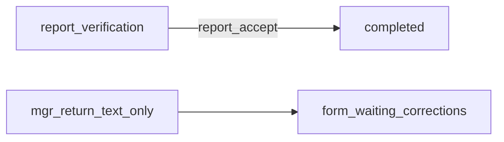

# Волна 4: Report close / corrections text (п. 17, 19)

## Сверка с `.cursor/rules`

**Обязательны:** `планирование-сверка-с-rules`, `базовые-правила-инструмента`, `правила-построения`, `честность-готовности`, `use-cases`, `интеграция-и-события` (статусная машина в домене; UI — проекция), `чистая-архитектура` / `solid`, `ui-web-практики` (одна primary CTA; копирайт кнопки), `тесты-архитектуры`, `playwright-e2e`, `go-testing`, `mgmt-tg-notify` после gate.

**Вне scope:** п. 15–16 (блокер Даши); Wave 0–3; ICO/ECO как обязательный контур (роли могут остаться в матрице, но не gate пилота); удаление статусов `shipment_*` из SM целиком (остаются для Nest/advance-ветки); intake console.

**Зафиксированные решения** ([`вводные/обратная связь после передачи на просмотр.txt`](вводные/обратная%20связь%20после%20передачи%20на%20просмотр.txt) §4–5):
- П. 17: подпись «подтвердить отчет и завершить сделку»; после accept — сразу `completed`; убрать лишнюю лестницу отгрузки после отчёта.
- П. 19: при возврате менеджером на доработку — только текст, без справочника отметок.

---

## P17. Confirm report → completed

**Декомпозиция**

1. **Domain:** в [`actions.go`](vdp/core/internal/domain/formpayment/actions.go) `TargetStatus(ActionReportAccept)` → `StatusCompleted` (сейчас `StatusReportAccepted`).
2. **Transitions:** в [`transitions.go`](vdp/core/internal/domain/formpayment/transitions.go) для `StatusReportVerification` добавить edge → `StatusCompleted`; happy-path после отчёта больше не требует `shipment_*`. Статусы `shipment_*` / `report_accepted` **не удалять** из SM (Nest/advance), но не вести туда FE happy path после accept.
3. **FE labels + nextStatus:**
   - [`actions.ts`](vdp/fe/src/lib/ved/actions.ts): `mgr_report_accept` → label «Подтвердить отчет и завершить сделку», `nextStatus: "completed"`.
   - [`app-actions.ts`](vdp/fe/src/lib/ved/app-actions.ts): то же для `report_accept`.
4. **Hints:** обновить next-step / mapper hints, если ещё зовут «отгрузку» после `report_verification` ([`mappers.ts`](vdp/fe/src/lib/api/mappers.ts) / statuses).
5. **Tests / e2e:** `machine_test.go`, `r12_verification_test` / scenario executor, [`manager-close.test.ts`](vdp/fe/src/lib/ved/manager-close.test.ts), [`integration-journey.test.ts`](vdp/fe/src/lib/ved/integration-journey.test.ts), [`pilot-matrix-full-ladder.spec.ts`](vdp/fe/e2e/pilot-matrix-full-ladder.spec.ts) — после accept сразу `completed`; убрать обязательные шаги отгрузки из ladder happy path; spot `wave4-*.spec.ts` на label + status.

**Отладка:** unit TargetStatus + IsAllowedTransition; vitest action matrix; e2e manager на `report_verification` → кнопка → `completed`.

---

## P19. Manager return: text only

**Декомпозиция**

1. В [`actions.ts`](vdp/fe/src/lib/ved/actions.ts) `continuityInjectedActions`: для manager-injected `ico_form_reject` / `eco_form_reject` выставить `requiresMark: false` (оставить `requiresReason: true`). Нативные `mgr_form_reject` уже без mark.
2. Реальные ECO/ICO в матрице могут сохранить `requiresMark` (вне пилотного gate; compliance выключен из процесса, но код-заготовка).
3. [`ActionPanel.tsx`](vdp/fe/src/components/ved/ActionPanel.tsx): Select исчезнет сам при `requiresMark !== true`; textarea остаётся.
4. Unit: manager continuity reject без mark; e2e reject-path — менеджер только textarea.

**Backend:** не менять (уже только `comment`).

**Отладка:** vitest continuity inject; Playwright manager «Вернуть на доработку/коррекцию» без Select «Отметка комплаенс».

---

## Ключевые файлы

- Domain: [`actions.go`](vdp/core/internal/domain/formpayment/actions.go), [`transitions.go`](vdp/core/internal/domain/formpayment/transitions.go)
- FE: [`actions.ts`](vdp/fe/src/lib/ved/actions.ts), [`app-actions.ts`](vdp/fe/src/lib/ved/app-actions.ts), ActionPanel (без структурной ломки)
- Tests: domain machine; manager-close / integration-journey; `wave4-close.spec.ts`; обновить ladder/pilot при регрессии
- Gate: vitest + Go domain tests + wave4 e2e + `make playwright-pilot` + `notify-mgmt`; запись в feedback «Волна 4: сделано»

## DoD волны 4

- Кнопка: «Подтвердить отчет и завершить сделку»; после нажатия статус `completed`.
- После confirm report нет обязательной лестницы отгрузки в happy path.
- Возврат менеджером на доработку — только текст причины, без справочника отметок.
- Unit + spot e2e + pilot green; `notify-mgmt` после закрытия.
- Не утверждать «shipment удалён из домена» — только выведен из happy path после отчёта.
