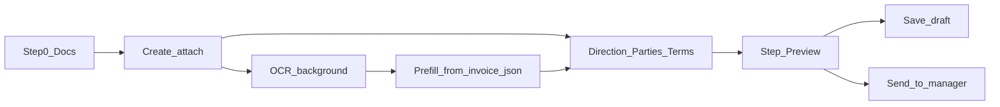

# Волна 2: Wizard / OCR / currency / submit (п. 1, 6, 7, 8, 18)

## Сверка с `.cursor/rules`

**Обязательны:** `планирование-сверка-с-rules`, `базовые-правила-инструмента`, `правила-построения`, `честность-готовности`, `use-cases`, `интеграция-и-события` (статус только через доменные команды; OCR = side-path, не auto-submit), `машинное-обучение` (OCR → HITL/prefill, не auto-pay), `чистая-архитектура` / `детали-как-плагины`, `ui-web-практики` + `ux-формы-навигация-онбординг` / `ux-взаимодействие-и-скорость` (скелетон/баннер OCR, Doherty), `тесты-архитектуры`, `playwright-e2e`, `go-testing`, `mgmt-tg-notify` после gate.

**Вне scope:** п. 10, 12–14.*, 17, 19; п. 15–16 (блокер Dasha); Wave 1 parties; ICO/ECO; provider docs ACL; собственный Ollama-engine.

**Зафиксированные решения (клиент + выбор п. 6 = полный IA):**
- Шаг 1 мастера = загрузка документов → дальше форма **пока идёт OCR** → prefill полей.
- Убрать только UI **«Валюта инвойса»**; валюты клиента/контрагента остаются.
- Документы: инвойс без контракта допустим (пара не обязательна).
- Preview: «Сохранить черновик» **или** «Отправить менеджеру» → статус как после `accept_form` / core `submit`.
- `confirmExtraction` **не** равен submit.

---

## P6. Полный IA: документы первыми + OCR параллельно + prefill

**Декомпозиция**

1. Переставить шаги в [`forms-new-page.tsx`](vdp/fe/src/components/ved/pages/forms-new-page.tsx):  
   `Документы → Направление → Стороны → Условия → Проверка`.
2. На выходе шага «Документы» (или сразу после выбора файла): **ранний** `createForm` + upload/attach (разнести логику из [`platform-store.createFormLocal`](vdp/fe/src/lib/ved/platform-store.ts)); хранить `formId` в state мастера.
3. Убрать app auto-`recognize_complete` из [`platform-create.ts`](vdp/fe/src/lib/ved/platform-create.ts) / `createFormLocal` при OCR-пути (иначе статус уезжает в `draft` до callback). Статус остаётся `creating` пока hub не применит OCR или пользователь не завершит/скипнет.
4. После attach: `startExtraction` (если не noDocuments) + **лёгкий poll** `getForm` в мастере (interval / React Query) → баннер «распознаём…» ([`create-review-copy.ts`](vdp/fe/src/lib/ved/create-review-copy.ts)).
5. Prefill черновика мастера из `invoice_json` через [`parseExtractionResult`](vdp/fe/src/lib/ved/extraction.ts) (сумма, валюта→контрагента/derived, номера); не затирать уже отредактированные пользователем поля (флаг `touched`).
6. BE: OCR enqueue надёжнее при **первом attach**, не только на Create до файлов ([`form_payment.go`](vdp/core/internal/service/form_payment.go) Create vs attach) — чтобы callback не гонял пустой payload.

**Отладка:** unit на порядок STEPS / prefill merge; e2e: invoice upload → next step без блокировки → поля prefill (fixture OCR); `platform-create.test.ts` без слепого auto-recognize на OCR-path.

---

## P7. Убрать «Валюта инвойса»

**Декомпозиция:** убрать select «Валюта инвойса» и валидацию `draft.currency` в мастере; оставить client/CP currency. На create: `currency` в core = `counterpartyCurrency` (или client при отсутствии CP) — одна derived валюта суммы, без второго UI. Синхрон [`FormParamsEditDialog`](vdp/fe/src/components/ved/FormParamsEditDialog.tsx) / review summary / OCR confirm copy.

**Отладка:** vitest create payload; UI без лейбла «Валюта инвойса»; client/CP selects видны.

---

## P8. Invoice-only OK

**Декомпозиция:** в `validateStep` снять обязательность `contractFile`; инвойс **или** «нет документов» достаточно в app. Копирайт шага/проверки: не требовать «инвойс + контракт». BE уже не требует пару.

**Отладка:** Playwright: только инвойс → create успешен; контракт опционален.

---

## P1. Условия оплаты с поставщиком

**Декомпозиция:** мастер уже имеет `condition` (advance / postPayment) на шаге направления. Persist в core: map `advance`/`postPayment` → `payment_method` (или существующее Nest-поле) через Create/PATCH [`NestPatchInput`](vdp/core/internal/service/form_payment_nest.go); показать на form-detail в блоке параметров; убрать hardcoded `condition: "advance"` в [`mappers.ts`](vdp/fe/src/lib/api/mappers.ts). Не вводить отдельный free-text «supplier terms» в этой волне.

**Отладка:** Go/FE unit round-trip condition → payment_method → UI; e2e spot на отображение после create.

---

## P18. Preview: черновик vs отправить менеджеру

**Декомпозиция:** на шаге «Проверка» две CTA:
- **Сохранить черновик** — завершить мастер на созданной заявке (`creating`→`draft` через `recognize_complete` только если OCR idle/done или noDocuments; иначе оставить `creating` + ExtractionReview на карточке).
- **Отправить менеджеру** — после готовности черновика `transitionForm(..., "submit")` (= `accept_form`) → `organization_waiting_verification` / `form_waiting_verification`.

Не смешивать с `confirmExtraction`. Обновить [`actions.ts`](vdp/fe/src/lib/ved/actions.ts) / next-step hints при необходимости.

**Отладка:** unit bridge; e2e: draft CTA → status draft*; submit CTA → waiting verification; pilot не ломается.

---

## Ключевые файлы

| Зона | Файлы |
|------|--------|
| Wizard IA | [`forms-new-page.tsx`](vdp/fe/src/components/ved/pages/forms-new-page.tsx), [`create-review-copy.ts`](vdp/fe/src/lib/ved/create-review-copy.ts) |
| Create/OCR path | [`platform-store.ts`](vdp/fe/src/lib/ved/platform-store.ts), [`platform-create.ts`](vdp/fe/src/lib/ved/platform-create.ts), [`extraction.ts`](vdp/fe/src/lib/ved/extraction.ts) |
| Submit | [`action-bridge.ts`](vdp/fe/src/lib/ved/action-bridge.ts), form-detail ActionPanel |
| BE OCR/attach | [`form_payment.go`](vdp/core/internal/service/form_payment.go), [`hub_callback.go`](vdp/core/internal/service/hub_callback.go), [`extraction_confirm.go`](vdp/core/internal/service/extraction_confirm.go) |
| Terms persist | [`form_payment_nest.go`](vdp/core/internal/service/form_payment_nest.go), [`mappers.ts`](vdp/fe/src/lib/api/mappers.ts) |
| Tests | `platform-create.test.ts`, `create-review-copy.test.ts`, `wave1-parties.spec.ts`, новый `wave2-wizard.spec.ts`, `make playwright-pilot` |

---

## DoD волны 2

- Шаг 1 = документы; можно идти дальше при OCR in-flight; prefill без потери ручных правок.
- Нет UI «Валюта инвойса»; client/CP currencies на месте.
- Invoice-only создаёт заявку.
- `condition` сохраняется и видна на карточке.
- Preview: две CTA; «Отправить менеджеру» = статус после `accept_form`.
- Unit + Playwright spot + `make playwright-pilot` green; `notify-mgmt` после закрытия волны.
- Не утверждать «OCR 100%» без fixture/e2e на async path (честность готовности).
