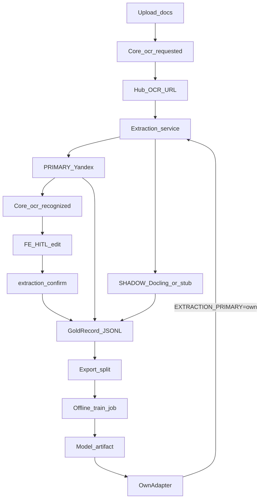

# План: Яндекс PRIMARY → своё из gold → замещение

## Сверка с `.cursor/rules`

**Обязательны:** `планирование-сверка-с-rules`, `базовые-правила-инструмента`, `машинное-обучение`, `serverless-и-faas`, `интеграция-и-события`, `устойчивость-и-наблюдаемость`, `безопасность-ролей-и-данных`, `чистая-архитектура`, `solid`, `детали-как-плагины`, `screaming-architecture`, `границы-и-контексты`, `use-cases`, `тесты-архитектуры`, `go-architecture` / `go-testing` / `go-resilience-security` / `go-observability`, `честность-готовности`, `развертывание-и-доставка`, `ui-web-практики` + `ux-*` (HITL prefill), `поддержка-и-обратная-связь`.

**Вне scope:** auto-approve / auto-pay по выходу модели; обучение **внутри** HTTP commit платежа / смены статуса; Diadoc/1C; переписывание всей Nest-parity документации; `compose-fe-refresh` без явного «да»; продакшен GPU-кластер «как у FAANG» — достаточно offline job + артефакт.

**Gate/DoD из rules:**
- OCR/IE только side-path; ручной ввод всегда; [`ApplyOCRRecognized`](vdp/core/internal/service/hub_callback.go) не двигает payment statuses.
- Порт + адаптер: hub `OCR_URL` не знает Яндекс; PRIMARY = env на extraction worker.
- Train ≠ inference path оплаты; HITL labels — топливо модели (`машинное-обучение`).
- Идемпотентность callback; unit/service тесты; нет `admin/test`.
- Нет ПДн в логах/метриках; Provider ACL не расширяется.
- Честность: без ключей — fixture; «своё готово» только после eval на held-out gold.
- Новые доки extraction **не упоминают** Nest / backend-for-ved.

## Выбранный подход (зафиксировано)

- **PRIMARY (клиент):** Yandex Vision OCR + AI Studio → `ExtractionResult` v1 в [`vdp/extraction`](vdp/extraction), контракт hub [`ocr.go`](vdp/hub/internal/adapters/ocr/ocr.go).
- **SHADOW:** тот же вход; HTTP Docling при `EXTRACTION_SHADOW_URL`; если URL пуст — deterministic stub с той же schema (для CI). Результат **не** в UI.
- **Gold flywheel (основа своего):** каждый прогон пишет `GoldRecord`; HITL confirm дописывает `human_out` (hard label). Хранилище: JSONL под `EXTRACTION_GOLD_DIR` на volume сервиса extraction (не shared DB с платежами).
- **Своё:** offline job читает gold → train/test split → артефакт `model_version` → `OwnAdapter`; canary через `EXTRACTION_PRIMARY=own` без правки core SM.
- **Форматы:** pdf, txt, docx, xlsx. FE HITL обязателен — без confirm gold почти пустой.
- **Ключи Яндекса** в env; без них PRIMARY=`fixture`.

## Своё из поступающих данных (канон)

Без этой секции коммерческий путь не даёт замещения.

**GoldRecord** (одна строка JSONL на событие; обновление human — новая строка или upsert по `gold_id`):

- `gold_id`, `form_payment_id`, `source_file_id` / content hash (не сырой dump ПДн в лог)
- `schema_version`, `created_at`
- `primary_out`: ExtractionResult (Яндекс или fixture)
- `shadow_out`: ExtractionResult
- `human_out`: ExtractionResult после confirm (пусто до HITL)
- `primary_engine`, `shadow_engine`, `event_id`

**Правила обучения (Wave 6):**

1. Hard label = только `human_out` после confirm; `primary_out` — soft teacher, не истина.
2. Split train/test по `organization_id` / `form_payment_id` (не случайные страницы одного инвойса в оба сета).
3. Метрики gate: header field exact/normalized F1; line-item F1 (description+amount+hs); correction rate vs primary.
4. Продвижение own: shadow/eval report → canary `%` / staging flag → PRIMARY=`own`; Яндекс остаётся fallback (`EXTRACTION_FALLBACK=yandex`).
5. Retrain — отдельный релизная процедура (новый `model_version`), не тихий overwrite.

## Wave 0 — контракт и политика

1. **`ExtractionResult` v1** + тип **`GoldRecord`** в [`vdp/shared/extraction`](vdp/shared/extraction).
2. Док [`vdp/docs/architecture/extraction.md`](vdp/docs/architecture/extraction.md): dual-track, gold flywheel, train offline, vendor-off; **без Nest**. Обновить D2 в [`b2-decisions.md`](vdp/docs/pilot/b2-decisions.md) под flywheel (без legacy Hybrid-строк про Nest в OCR-разделе).
3. [`staging-env.example`](vdp/docs/operations/staging-env.example) + checklist: `OCR_URL`, `YANDEX_*`, `EXTRACTION_PRIMARY`, `EXTRACTION_SHADOW_URL`, `EXTRACTION_GOLD_DIR`, `EXTRACTION_FALLBACK`.

## Wave 1 — extraction worker PRIMARY Яндекс

1. [`vdp/extraction`](vdp/extraction): cmd/api, Dockerfile, health, timeouts/retries.
2. Format router: `pdf|txt|docx|xlsx`.
3. Порты: `TextLayoutPort` → Vision OCR; `FieldExtractionPort` → AI Studio → schema v1.
4. `POST /recognize` → hub fields + `invoice_json` schema v1.
5. `EXTRACTION_PRIMARY=yandex|fixture`; без ключей — fixture.
6. Unit + httptest тесты; compose: `extraction`, hub `OCR_URL=http://extraction:…/recognize`.

## Wave 2 — core: merge + confirm

1. [`ApplyOCRRecognized`](vdp/core/internal/service/hub_callback.go): merge schema v1 в `invoice_json` + плоские поля; без payment transitions.
2. Идемпотентность по `event_id` / content hash.
3. `POST /api/v1/forms/{id}/extraction/confirm` — human ExtractionResult → `invoice_json` + history `extraction_confirmed`; AuthZ: User свои / ICO / Manager (CanAccessForm). Provider — 403.
4. Тесты: line_items merge; no status jump; AuthZ.

## Wave 3 — FE HITL

1. На draft/detail: prefill + таблица позиций + CTA «Подтвердить распознавание».
2. Low-confidence highlight; fail → manual.
3. Copy в духе [`create-review-copy.ts`](vdp/fe/src/lib/ved/create-review-copy.ts).
4. Vitest parse/confirm; узкий e2e fixture.
5. Перед `compose-fe-refresh` — спросить пользователя.

## Wave 4 — SHADOW + запись gold (сбор данных)

1. После PRIMARY (async, не блокирует callback): shadow → append `GoldRecord` в `EXTRACTION_GOLD_DIR` (primary+shadow; human пуст).
2. Confirm (Wave 2) → дописать/обновить запись с `human_out` (core шлёт gold hook на extraction `POST /gold/human` по S2S **или** extraction читает confirm из callback-расширения — **выбрано:** core после confirm делает S2S `POST {OCR_BASE}/gold/human` с form_id + human Result; extraction upsert в JSONL).
3. Метрики: primary_success, shadow_latency, primary_vs_human_diff (после confirm).
4. `testdata/golden/` + go test на fixture path.
5. `EXTRACTION_PRIMARY=own` → OwnAdapter-заглушка (тот же schema); переключение без правки core. Реальная модель — Wave 6.

## Wave 5 — ops commercial path

1. Runbook Яндекс SA/API key / model URI.
2. Staging smoke: с ключами и без (fixture).
3. known-gaps: commercial dual-track готов частично; **own model = не ready** до Wave 6 eval.

## Wave 6 — своё из gold (замещение)

Цель волны: закрыть разрыв «данные есть → своя модель может стать PRIMARY».

1. **Export:** CLI/make `extraction-export-gold` → dataset dir (train/test split JSONL + манифест версий).
2. **Train job scaffold** в `vdp/extraction/train/`: Dockerfile + entrypoint; читает export; пишет `artifacts/{model_version}/` (веса + `metrics.json` + schema_version). Первая реализация: trainable baseline (например seq2seq/IE head на тексте layout из gold); GPU вне FaaS / вне платежного пути.
3. **Eval:** сравнение predictions vs `human_out` на test split; пороги в `extraction.md` (стартовые: header F1 ≥ primary на том же split **или** явный accept report; line-item F1 зафиксирован в отчёте). Пока порог не взят — `EXTRACTION_PRIMARY=own` в prod запрещён честностью готовности.
4. **Serve own:** OwnAdapter грузит артефакт по `OWN_MODEL_PATH` / version env; staging canary; fallback Яндекс при ошибке own.
5. **Документация цикла:** «накопили N confirms → export → train → eval → canary → primary own»; N стартовый ориентир в доке: **≥ 100 confirmed** документов с line_items до первого серьёзного train (ниже — только smoke train на fixture gold).
6. Тесты: export deterministic; eval harness на синтетическом mini-gold; OwnAdapter fixture artifact.

## Вне агента (блокеры пользователя)

- Биллинг + API key / folder / model URI Яндекса.
- Согласие на `compose-fe-refresh` при смене fe deps.
- Реальные документы и операторские confirms для наполнения gold (до Wave 6 prod canary).
- GPU/машина для реального train (scaffold в репо; прогон на железе — у заказчика/CI с runner).

## DoD плана (проверяемо)

**Commercial + flywheel (waves 0–5):**
- [ ] ExtractionResult v1 + GoldRecord в коде; `extraction.md` с flywheel без Nest
- [ ] `vdp/extraction` + compose `OCR_URL`; fixture без ключей
- [ ] С `YANDEX_*`: pdf → line_items в `invoice_json`
- [ ] FE confirm пишет human gold; shadow пишет primary/shadow gold
- [ ] Switch `yandex|fixture|own`(stub) без изменения core SM
- [ ] Нет auto-pay / auto-approve
- [ ] Unit/service тесты зелёные

**Own substitution (wave 6):**
- [ ] Export gold + train job scaffold + metrics.json артефакт
- [ ] Eval harness на held-out; отчёт F1
- [ ] OwnAdapter + fallback Яндекс; staging canary path
- [ ] В known-gaps / readiness: own = ready **только** после прохождения порогов eval (иначе явно «частично / stub»)
