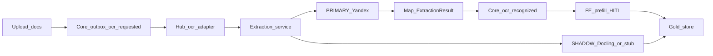

# План: Яндекс PRIMARY → своё замещение

## Сверка с `.cursor/rules`

**Обязательны:** `планирование-сверка-с-rules`, `базовые-правила-инструмента`, `машинное-обучение`, `serverless-и-faas`, `интеграция-и-события`, `устойчивость-и-наблюдаемость`, `безопасность-ролей-и-данных`, `чистая-архитектура`, `solid`, `детали-как-плагины`, `screaming-architecture`, `границы-и-контексты`, `use-cases`, `тесты-архитектуры`, `go-architecture` / `go-testing` / `go-resilience-security` / `go-observability`, `честность-готовности`, `развертывание-и-доставка`, `ui-web-практики` + `ux-*` (HITL prefill), `поддержка-и-обратная-связь` (честный copy про фон/ошибку).

**Вне scope этого плана:** ML auto-approve/auto-pay; полный train GPU pipeline в проде; замена всех вендоров сразу; Diadoc/1C; переписывание всей Nest-parity документации; `compose-fe-refresh` без явного «да».

**Gate/DoD из rules:**
- OCR/IE только side-path; ручной ввод всегда; callback не двигает payment statuses ([`ApplyOCRRecognized`](vdp/core/internal/service/hub_callback.go)).
- Порт + адаптер: hub `OCR_URL` не знает Яндекс; смена PRIMARY = env/flag на worker.
- Идемпотентность callback по `event_id` / form+file+engine_version.
- Unit на маппинг ExtractionResult ↔ form fields; service-тест worker с httptest; нет публичных `admin/test`.
- Нет ПДн в логах worker/hub; Provider ACL не расширяется.
- Честность: без ключей Яндекса — fixture/disabled PRIMARY, не «100% OCR».
- Новые доки по extraction **не упоминают** Nest / backend-for-ved.

## Выбранный подход (зафиксировано)

- **PRIMARY:** Yandex Vision OCR + AI Studio (JSON header + `line_items[]`) в отдельном сервисе [`vdp/extraction`](vdp/extraction) (аналог паттерна [`vdp/docs-service`](vdp/docs-service)): HTTP `POST /recognize`, контракт совместим с тем, что ждёт [`vdp/hub/internal/adapters/ocr/ocr.go`](vdp/hub/internal/adapters/ocr/ocr.go).
- **SHADOW:** тот же вход → open ingest (Docling-контейнер или stub-адаптер с тем же `ExtractionResult`); результат **не** в UI, только в gold/metrics.
- **Замещение:** `EXTRACTION_PRIMARY=yandex|own` (+ shadow always-on в staging); own появляется после eval, не «в тот же день».
- **Форматы wave 1–2:** pdf, txt, docx, xlsx (router в extraction); FE HITL — таблица позиций + подтверждение.
- **Ключи Яндекса** — вне репо (env); без них CI/local = fixture PRIMARY + рабочий контракт (как сейчас hub без `OCR_URL`).

## Wave 0 — контракт и политика (агент)

1. Ввести канон **`ExtractionResult` schema v1** (shared Go types + JSON schema в `vdp/shared/extraction` или `vdp/extraction/internal/schema`):
   - document: `doc_type`, `language`, `confidence`
   - header: contract/invoice numbers & dates, amounts, currency, parties, bank fields, `hs_codes[]`
   - `line_items[]`: description, qty, unit, unit_price, line_amount, currency, hs_code, confidence
   - meta: `engine_id`, `model_version`, `schema_version`, `warnings[]`, `source_file_id`
2. Зафиксировать D2 в [`vdp/docs/pilot/b2-decisions.md`](vdp/docs/pilot/b2-decisions.md) / короткий [`vdp/docs/architecture/extraction.md`](vdp/docs/architecture/extraction.md): dual-track, side-path, HITL, vendor-off flag; **без Nest**.
3. Обновить [`vdp/docs/operations/staging-checklist.md`](vdp/docs/operations/staging-checklist.md) + `staging-env.example`: `OCR_URL`, `YANDEX_*`, `EXTRACTION_PRIMARY`, `EXTRACTION_SHADOW`.

## Wave 1 — extraction worker PRIMARY Яндекс (агент)

1. Скелет `vdp/extraction`: `cmd/api`, Dockerfile, health, timeouts/retries ([`go-resilience-security`](.cursor/rules/go-resilience-security.mdc)).
2. Format router: sniff mime/ext → ветки `pdf|txt|docx|xlsx` (xlsx/docx — библиотечный text/tables extract; pdf — text-layer если есть, иначе Vision OCR async).
3. Адаптеры за портами:
   - `TextLayoutPort` → Yandex Vision OCR
   - `FieldExtractionPort` → AI Studio (vision/generate → строгий JSON schema v1)
4. `POST /recognize`: принять payload hub → PRIMARY → ответ `{status, fields, mode}` где `fields`/`invoice_json` несут schema v1 (в т.ч. line_items); callback делает существующий hub.
5. Feature flags: `EXTRACTION_PRIMARY=yandex|fixture`; без ключей — fixture с валидной schema (расширить нынешние fixture fields).
6. Unit-тесты table-driven: router, JSON parse/validate, map to hub fields; httptest на Vision/FM.
7. Compose: сервис `extraction`, `OCR_URL=http://extraction:…` в [`vdp` compose](vdp) (не ломая dev без ключей).

## Wave 2 — core: принять полный результат + idempotency (агент)

1. Расширить [`ApplyOCRRecognized`](vdp/core/internal/service/hub_callback.go): мержить schema v1 в `invoice_json` (header + `line_items`), сохранять плоские `contract_*` / `invoice_amount` / `currency` как сейчас для совместимости; **не** трогать payment transitions.
2. Идемпотентность: повтор `event_id` / тот же snapshot не дублирует history spam (минимум — skip duplicate apply если hash совпал).
3. Новый/расширенный endpoint подтверждения оператором: `POST …/extraction/confirm` (или действие формы) — тело = human-edited ExtractionResult → сохранить gold marker на форме + history; AuthZ: User свои / Internal CO / Manager по матрице видимости заявки.
4. Unit/service tests на merge line_items и запрет status jump.

## Wave 3 — FE HITL (агент)

1. После `ocr_recognized` / при открытии draft: блок «Распознанные данные» + **редактируемая таблица позиций** (один primary CTA «Подтвердить распознавание»).
2. Low-confidence подсветка; disabled CTA с причиной если extraction failed → manual fields.
3. Copy согласован с [`create-review-copy.ts`](vdp/fe/src/lib/ved/create-review-copy.ts): фон, ошибка → статус в кабинете; без ложного «vendor always on».
4. Unit/vitest на parse `invoice_json` line_items; точечный e2e только happy prefill→confirm при fixture OCR (пирамида: не дублировать всю матрицу в браузере).
5. Перед любым `compose-fe-refresh` — **спросить** пользователя ([`vdp-fe-docker-пересборка`](.cursor/rules/vdp-fe-docker-пересборка.mdc)).

## Wave 4 — SHADOW + gold flywheel (агент)

1. Порт `ShadowExtractor`; реализация stub сразу + опциональный HTTP к Docling-контейнеру (`EXTRACTION_SHADOW_URL`).
2. После PRIMARY: async shadow (не блокирует callback); писать pair `(input_ref, primary_out, shadow_out, human_out?)` в store (файл/таблица extraction_gold в hub DB или отдельный volume — без ПДн в логах; ACL только internal).
3. Метрики: `extraction_primary_success`, `extraction_shadow_latency`, field/line diff rate (низкая cardinality).
4. Документ eval harness: каталог `vdp/extraction/testdata/golden/` + `go test` сравнивает PRIMARY fixture path; слот под later own model.
5. Flag path `EXTRACTION_PRIMARY=own` вызывает Shadow/Own адаптер как primary (canary готовность) — реализация own модели **заглушка**, DoD = переключение без правки core.

## Wave 5 — ops и честный DoD (агент + внешние ключи)

1. Runbook: выдача SA/API key Яндекса, scopes Vision + Foundation Models, model URI в env.
2. Staging smoke: с ключами — 1 pdf → fields+line_items → FE confirm; без ключей — fixture path зелёный.
3. Не утверждать «своё готово» / «паритет 100%» до golden eval ([`честность-готовности`](.cursor/rules/честность-готовности.mdc)).

## Вне агента (блокер пользователя, не опции плана)

- Биллинг + API key / folder id Яндекса + выбранный model URI AI Studio.
- Согласие на `compose-fe-refresh` при смене fe deps.
- Реальные документы для пополнения `testdata/golden` (можно позже).

## DoD плана (проверяемо)

- [ ] `ExtractionResult` v1 в коде + док `extraction.md` без Nest
- [ ] `vdp/extraction` отвечает hub-контракту; compose `OCR_URL` указывает на него
- [ ] С `YANDEX_*`: pdf проходит Vision→FM→callback с line_items в `invoice_json`
- [ ] Без ключей: fixture schema v1, ручной путь и `recognize_complete` живы
- [ ] FE: edit+confirm позиций пишет confirm/gold
- [ ] Shadow вызывается в staging; primary switch `yandex|fixture|own` без изменения core SM
- [ ] Unit/service тесты wave 1–2 зелёные; e2e fixture узкий
- [ ] Нет auto-pay / auto-approve от extraction
