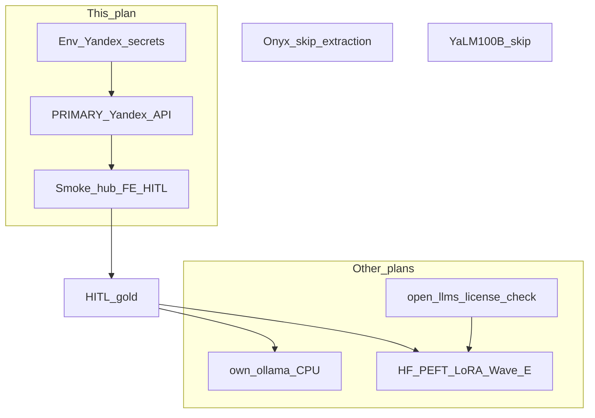

# План: Yandex wire + прикладное расширение (отдельно от Ollama-own)

## Секрет (сразу)

Вы прислали API key в чат. **В этот plan-файл, git, docs и compose defaults ключ не попадает.**

1. Считать ключ скомпрометированным: **ротация** в Yandex Cloud (отозвать старый, выпустить новый).
2. Класть только в локальный/staging secret store: `vdp/.env` (gitignored) или shell export — поля `YANDEX_API_KEY`, плюс обязательные `YANDEX_FOLDER_ID`, `YANDEX_MODEL_URI`.
3. Smoke без печати ключа в логах/PR.

Без **folder id** и **model URI** одного API key недостаточно — это blocker до исполнения wire.

## Сверка с `.cursor/rules`

**Обязательны:** `планирование-сверка-с-rules`, `безопасность-ролей-и-данных`, `машинное-обучение`, `устойчивость-и-наблюдаемость`, `честность-готовности`, `развертывание-и-доставка`, `интеграция-и-события`, `детали-как-плагины`, `go-testing` / `тесты-архитектуры`.

**Вне scope этого плана:** реализация Ollama-own (уже [own_ollama_cpu](own_ollama_cpu_bb7b13ee.plan.md)); LoRA/Wave E; внедрение Onyx как продукта; self-host YaLM 100B; коммит секретов; Nest в OCR-доках; auto-pay.

**Gate:** side-path only; hub `OCR_URL` без знания Яндекса; fallback fixture при сбое; нет ПДн в логах ответа модели.

## Часть 1 — Включить Yandex PRIMARY (исполнение)

Опираться на уже существующие [`YandexPrimary`](vdp/extraction/internal/engine/engines.go), [runbook](vdp/docs/operations/extraction-yandex-runbook.md), compose service `extraction`.

1. **Собрать env (локально, не в git):**
   - `YANDEX_API_KEY` (новый после ротации)
   - `YANDEX_FOLDER_ID`
   - `YANDEX_MODEL_URI` (например `gpt://<folder>/yandexgpt-lite` или актуальный URI AI Studio)
2. **Compose / restart extraction:** `EXTRACTION_PRIMARY=yandex`, `EXTRACTION_FALLBACK=fixture` (пока own/Ollama не готов как fallback).
3. **Smoke:**
   - text payload → `mode` содержит yandex; `fields.invoice_json` schema v1 + line_items
   - pdf/scan (если Vision) или осознанный skip с записью в known-gaps
   - без ключей / с неверным ключом → fallback fixture, не 500 каскад на core SM
4. **E2E через hub:** один документ на seed-форме → core `ocr_recognized` → FE HITL panel виден; confirm пишет gold (уже wired).
5. **Docs honesty:** staging checklist — commercial path «жив с ключами»; latency/cost note; ключ не в example values.
6. **Makefile helper (опционально):** `extraction-yandex-smoke` читает env, не принимает key аргументом CLI.

## Часть 2 — Прикладной разбор ссылок (расширение возможностей, узко)

Цель: что **реально взять** в VDP extraction dual-track, что **не тащить**.

| Источник | Прикладной вывод для VDP | Действие |
|---|---|---|
| [Hugging Face](https://huggingface.co) | Hub + Transformers / [PEFT](https://huggingface.co) / TRL — стандартный путь **Wave E LoRA** на Qwen; datasets для версионирования export gold (опционально private dataset). Inference Endpoints = снова вендор-API, не «своё». | Зафиксировать в `extraction.md`: HF = train/tooling source, не PRIMARY runtime сейчас. Ollama остаётся serve на CPU. |
| [YaLM 100B (Yandex OSS, 2022)](https://yandex.com/company/news/2022-23-06) | RU/EN, Apache 2.0, **100B** — нереалистично на CPU-пилоте и дорого self-host. Устарело относительно Qwen2.5/YandexGPT API для IE. | **Не** брать в dual-track. Интерес только как исторический OSS; runtime = Yandex API сейчас + Qwen later. |
| [Onyx](https://github.com/onyx-dot-app/onyx) | Open-source AI chat/RAG «с любым LLM», коннекторы к корп. источникам — **не** invoice IE / не замена hub OCR. | **Не** внедрять Onyx в extraction. Позже (вне этого плана): идеи портов/коннекторов для help/RAG саппорта кабинетов — отдельный RFC, не платежный путь. |
| [open-llms](https://github.com/eugeneyan/open-llms) | Чеклист **коммерческих лицензий** open LLM. | Использовать при выборе base для Wave E (Qwen и аналоги с явной commercial-ok лицензией). Добавить 5–10 строк в extraction.md / lora_recipe: «license gate before train». |

**Итог applied:** расширение = (1) живой Yandex commercial path; (2) HF+open-llms как дисциплина train/license для своей модели; (3) явный reject YaLM-100B self-host и Onyx-as-OCR.

## Связь с планом Ollama-own

- Этот план **не** блокирует и **не** дублирует [own_ollama_cpu](own_ollama_cpu_bb7b13ee.plan.md).
- После Yandex smoke: PRIMARY=yandex, own остаётся canary/dev.
- Fallback цепочка целевая: `own → yandex → fixture` (после появления Ollama); до того: `yandex → fixture`.

## Вне агента

- Ротация ключа; `YANDEX_FOLDER_ID` + `YANDEX_MODEL_URI`.
- Биллинг Vision + Foundation Models в облаке.
- Не коммитить `.env`.

## DoD

- [ ] Ключ только в env; ротация после утечки в чат; нет секрета в git/plan body
- [ ] `EXTRACTION_PRIMARY=yandex` → recognize возвращает schema v1 не-fixture (или честный fallback + лог)
- [ ] Один путь hub → core → FE HITL без status jump
- [ ] extraction.md / known-gaps: applied table HF / YaLM skip / Onyx skip / open-llms license
- [ ] Unit/существующие тесты зелёные без сетевого Yandex в CI (httptest как сейчас)