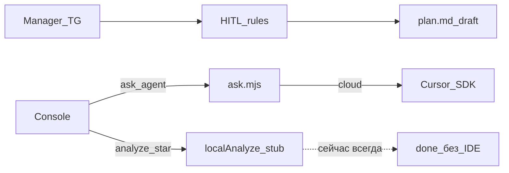

# SUPERSEDED

Содержимое перенесено в:

- мастер: [vedy_bot_master_knowledge_agent.plan.md](vedy_bot_master_knowledge_agent.plan.md)
- этап P0: [vedy_bot_p0_agent_cloud.plan.md](vedy_bot_p0_agent_cloud.plan.md)

Ниже — исходный диагноз (архив).

## Диагноз (факты)

Корневые причины, уже подтверждённые по коду и среде:

1. **Процесс не жив** — `vedy_bot` не запущен → консоль/poller/agent API недоступны.
2. **Env не в каноническом месте** — нет `~/.vedy_bot/env`; данные/секреты в legacy `~/.vdp-intake/`. Compose читает `${HOME}/.vedy_bot/env` ([docker-compose.yml](инструменты/vedy_bot/docker-compose.yml)).
3. **Host-путь без deps** — при `go run` на хосте `agent-bridge/node_modules` отсутствует (`@cursor/sdk`). В Docker образе deps ставятся (`RUN npm install` в [Dockerfile](инструменты/vedy_bot/Dockerfile)); на хосте — нет.
4. **Код: «анализ» ≠ Cursor** — в [runner.go](инструменты/vedy_bot/internal/agent/runner.go) только `ask_agent` зовёт SDK; `analyze_selected` / `analyze_chat` всегда `localAnalyze` (stub «Локальный разбор»).
5. **Ложный успех** — при ошибке Cursor job помечается `done` + fallback stub → UI выглядит «обработано», хотя агент упал.
6. **Runtime** — Docker уже default `INTAKE_AGENT_CLOUD=1` (без локального LLM). Local Cursor Agent на этой машине **вне scope** (нет ресурсов).

Существующий HITL (эвристики, proposal, plan draft, reminders) **не удаляем** — остаётся fallback и основной intake без IDE.

**Выбранный runtime:** Cloud Cursor Agent (`INTAKE_AGENT_CLOUD=1`), ключ `CURSOR_API_KEY` в env / поле консоли.

## Сверка с `.cursor/rules`

**Обязательны:** `планирование-сверка-с-rules`, `базовые-правила-инструмента`, `честность-готовности`, `правила-построения`, `go-testing`, `поддержка-и-обратная-связь` (ясный статус оператору), `mgmt-tg-notify` только если закрываем волну продуктовым done для менеджмента (иначе вне DoD).

**Вне scope:** `vdp-ci-local-gate` / `ci-pr` (это `инструменты/vedy_bot`, не `vdp/`), кабинетные UX/BDUI, local LLM/Ollama, тесты alpha из бота, переписывание HITL-эвристик, удаление текущего функционала.

**Gate/DoD-чеки:** из каталога `инструменты/vedy_bot`: `make test` → `make smoke`; ручной repro: консоль → «Спросить у агента» с ключом → ответ Cursor в thread без текста «Локальный разбор» как единственного результата. Не заявлять «агент работает» при stub/fallback.

## Слои

| Слой | В плане |
|---|---|
| UI / IA | Консоль: явный статус job `error` vs `done`; копирайт при отсутствии ключа/cloud fail (не маскировать stub’ом) |
| Компонент / FE | Минимально: отображение `job.Error` / failed state в agent panel ([fe](инструменты/vedy_bot/fe) + fallback [app.js](инструменты/vedy_bot/internal/console/ui/app.js) если трогаем) |
| Домен | HITL-карточки/статусы TG **без изменений**; agent job — отдельный контур |
| API | `POST /api/agent`, `GET /api/agent/{id}` — контракт status=`error` при провале SDK |
| Unit | Go: runner — analyze_* вызывает Cursor-path при ключе; fail → status error; обновить [runner_test.go](инструменты/vedy_bot/internal/agent/runner_test.go) |
| E2E / journey | Не Playwright VDP; smoke + ручной console journey agent |
| Compose / repro | `~/.vedy_bot/env` + `CURSOR_API_KEY` + `make up` (или документированный host run) |
| Docs / notify | Коротко обновить Honesty gaps в [README.md](инструменты/vedy_bot/README.md); mgmt-notify — только по явному закрытию волны |

## Работы

### W1 — Ops: поднять канонический runtime (без удаления HITL)

- Создать/заполнить `~/.vedy_bot/env`: перенести токены из `~/.vdp-intake/env`, добавить `CURSOR_API_KEY`, `INTAKE_CONSOLE_TOKEN`, `INTAKE_AGENT_CLOUD=1`.
- Поднять стек: из `инструменты/vedy_bot` — `make up` (образ уже ставит `@cursor/sdk`).
- Проверка: `GET /health`, `GET /api/status` с Bearer; в status видно agent configured.
- Host-dev (если нужен `go run`): Makefile-цель `bridge-npm-install` → `npm install` в `agent-bridge/`; `INTAKE_AGENT_BRIDGE` на `ask.mjs`.

### W2 — Код: реальная обработка = Cursor для всех agent modes

В [internal/agent/runner.go](инструменты/vedy_bot/internal/agent/runner.go):

- `analyze_selected` / `analyze_chat` / `ask_agent` → один путь `runCursorAgent` при наличии ключа.
- Без ключа → status=`error`, сообщение «нужен CURSOR_API_KEY» (без маскировки под успешный разбор); опционально отдельно оставить кнопку/mode «локальный разбор» только если явно запрошен — **не** подменять silent’ом.
- При ошибке SDK: `job.Status = "error"`, `Error` заполнен, `Result` пустой или краткий tech для оператора; **не** `done` + stub.
- Сохранить `localAnalyze` как явный fallback mode `local_analyze` для офлайна/тестов unit без сети.

### W3 — UI честности

- Консоль: при `error` показать ошибку агента; не показывать stub как успех.
- Header уже различает Bearer vs `key_…` — оставить; при cloud fail текст без IDE-брендов в manager TG (агент-ответ в thread оператора — ок с техдеталью).

### W4 — Тесты и DoD gate

- Unit: table-driven — с mock/fake exec или stub Runner dependency: (a) нет ключа → error; (b) analyze_* идёт в Cursor-path; (c) fail SDK → error не done.
- Обновить существующий `TestStartJobAnalyzeLocal` под новый mode `local_analyze` или явный флаг.
- `make test` + `make smoke` из `инструменты/vedy_bot`.
- Ручной DoD: один `ask_agent` / analyze с ключом → cloud ответ в ленте; без ключа → явная ошибка.

## Вне этой волны

- Автозапуск Cursor из TG без консоли (intake → сразу SDK).
- Alpha stand tests из бота.
- Local Cursor Agent (`INTAKE_AGENT_CLOUD=0`).
- Удаление/замена rule-based HITL.
