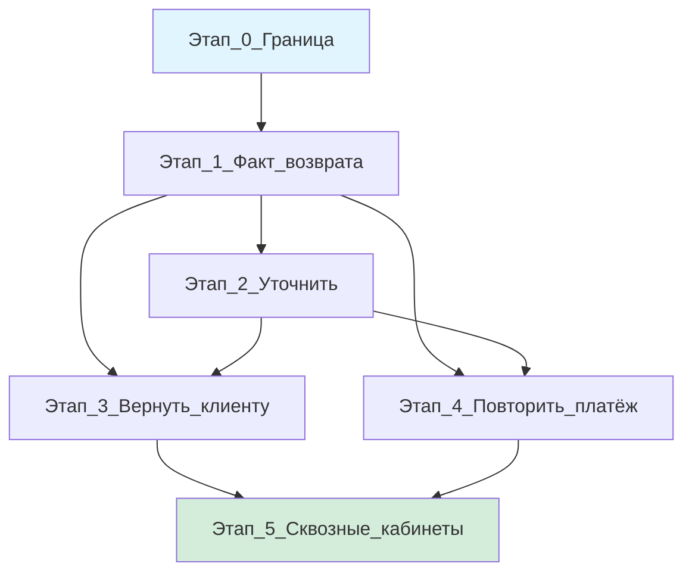

# Мастер-план: возврат после исполнения платежа

## Контекст

Заказчик прислал новый процесс возврата (`вводные/Процесс возврата.txt`). Это **не** замена пилотного возврата удержанных средств (Phase 7, `payment_refund_*`, казначей, инвариант cancel). Это отдельный контур: платёж уже ушёл, деньги вернулись на счёт провайдера.

Сейчас в VDP:
- Пилотный refund: [vdp/docs/domain/form-lifecycle.md](vdp/docs/domain/form-lifecycle.md) §Ветка refund — менеджер инициирует до/вокруг исполнения, казначей участвует
- [`vdp/core/internal/domain/formpayment/refund.go`](vdp/core/internal/domain/formpayment/refund.go): `mgr_refund_*`, `FundsHeld`, `FundsRefunded`, инвариант cancel
- E2E [`vdp/fe/e2e/pilot-matrix-refund.spec.ts`](vdp/fe/e2e/pilot-matrix-refund.spec.ts)

Новый контур не расширяет `mgr_refund_*` и не переиспользует поля `FundsHeld`/`FundsRefunded`. Новый префикс действий, например `prov_return_*`.

## Зафиксированные правила (из ответов заказчика)

1. Старт: провайдер после исполнения (`payment_sent` и далее, включая `report_accepted`/`completed`)
2. Доступ: только назначенный провайдер; менеджер выбирает ветку; клиент не инициирует, не меняет сумму
3. Один активный возврат на заявку
4. Три ветки менеджера: вернуть клиенту / повторить платёж / уточнить у клиента
5. Вернуть клиенту: курс менеджера → письмо-согласие клиента (обязательно) → рублёвая платёжка менеджера. Подтверждения получения нет
6. Повторить: комментарий менеджера (клиент не видит) → новое исполнение провайдера → старая платёжка в истории. Контрагент заново не проверяется
7. Уточнить: промежуточный шаг, не терминал. После ответа клиента снова к менеджеру за решением
8. Только импорт (аванс и постоплата). Экспорт вне scope
9. Казначей не участвует
10. Частичный возврат — не отдельная ветка: менеджер разбирает с клиентом вручную

## Структура этапов

Каждый этап = отдельный plan.md. Зависимости жёсткие: нельзя начать этап N+1, пока N не закрыт.

## Этапы (краткий обзор)

### Этап 0: Граница (без кода)
**Файл:** `.cursor/plans/return_after_execution_0_boundary.plan.md`

Зафиксировать два возврата (пилот vs новый), инварианты, что вне scope. Текст в заметки или `form-lifecycle.md`. Без домена/API/UI/тестов.

**DoD:** запись «не трогаем Phase 7 и `prov_payment_return`».

---

### Этап 1: Факт возврата у менеджера
**Файл:** `.cursor/plans/return_after_execution_1_fact.plan.md`

Провайдер сообщает сумму → менеджер видит. Три кнопки ещё не работают.

**Слои:**
- Domain: поля на `Form`, вход только после исполнения, один активный, только импорт
- Unit: до исполнения → отказ; экспорт → отказ; второй активный → отказ; идемпотентность
- HTTP: команда провайдера + AuthZ
- FE: CTA провайдера, блок факта у менеджера (без трёх кнопок)
- E2E: провайдер сообщает → менеджер видит сумму

**DoD:** unit зелёный, `make ci-pr-pilot` зелёный, `pilot-matrix-refund.spec.ts` регресс.

---

### Этап 2: Уточнить у клиента
**Файл:** `.cursor/plans/return_after_execution_2_clarify.plan.md`

Промежуточный круг. После ответа клиента снова менеджер.

**Слои:**
- Domain: цикл менеджер→клиент→менеджер, запрет завершения эпизода этим шагом
- Unit: клиент не выбирает ветку; уточнение не терминал
- HTTP: два действия (менеджер спросил, клиент ответил)
- FE: форма вопроса + форма ответа, `FilePickButton` shared
- E2E: менеджер → клиент → менеджер (факт живой)

**DoD:** `make ci-pr-pilot` зелёный.

---

### Этап 3: Вернуть клиенту
**Файл:** `.cursor/plans/return_after_execution_3_return_client.plan.md`

Курс → письмо → рублёвая платёжка.

**Слои:**
- Domain: курс менеджера, обязательное письмо клиента, рублёвая платёжка менеджера. Без письма нет выплаты
- Unit: отказ клиента → снова менеджер; казначей 403; провайдер не видит письмо
- HTTP + AuthZ
- FE: курс не placeholder; ошибка «приложите письмо»
- E2E: жест письмо + жест рублёвая платёжка

**DoD:** выплата без письма невозможна. `make ci-pr-pilot` зелёный.

---

### Этап 4: Повторить платёж
**Файл:** `.cursor/plans/return_after_execution_4_repeat.plan.md`

Комментарий менеджера → новое исполнение → старая платёжка в истории.

**Слои:**
- Domain: комментарий обязателен; клиент не видит; контрагент не проверяется заново; новая заявка не создаётся
- Unit: клиент не читает комментарий; повтор исполнения идемпотентен
- HTTP + AuthZ
- FE: комментарий до отправки; смена организации/счёта явная
- E2E: повтор без второй заявки; после нового исполнения снова «сообщить о возврате»

**DoD:** `make ci-pr-pilot` зелёный.

---

### Этап 5: Сквозные кабинеты
**Файл:** `.cursor/plans/return_after_execution_5_e2e_journeys.plan.md`

Два маршрута E2E + регресс + копирайт.

**Слои:**
- Маршрут А: сообщить → уточнить → вернуть клиенту
- Маршрут Б: сообщить → повторить → новая платёжка → снова сообщить
- Регресс: `pilot-matrix-refund.spec.ts` зелёный; платформенные панели на месте
- Копирайт, иерархия, пустые состояния

**DoD:** оба маршрута зелёные в `make ci-pr-pilot` после `make check-env-parity`.

---

## Сверка с rules (обязательны для каждого этапа)

Из [`.cursor/rules/планирование-сверка-с-rules.mdc`](.cursor/rules/планирование-сверка-с-rules.mdc):
- Слои (UI, FE, domain, API, unit, E2E, compose repro) с первой версии плана
- QG в DoD: `check-env-parity` → unit → `precommit-gate` → `ci-pr-pilot` (не `ci-pr` без pilot)

Обязательные rules каждому этапу:
- [`планирование-сверка-с-rules`](.cursor/rules/планирование-сверка-с-rules.mdc), [`use-cases`](.cursor/rules/use-cases.mdc), [`чистая-архитектура`](.cursor/rules/чистая-архитектура.mdc), [`solid`](.cursor/rules/solid.mdc)
- [`безопасность-ролей-и-данных`](.cursor/rules/безопасность-ролей-и-данных.mdc): провайдер без ПДн клиента
- [`интеграция-и-события`](.cursor/rules/интеграция-и-события.mdc): идемпотентность, не source истины в UI
- [`границы-и-контексты`](.cursor/rules/границы-и-контексты.mdc): контракт vs внутренности
- [`тесты-архитектуры`](.cursor/rules/тесты-архитектуры.mdc): пирамида, CDC
- [`go-testing`](.cursor/rules/go-testing.mdc): table-driven
- [`честность-готовности`](.cursor/rules/честность-готовности.mdc): не «100% готово» без зелёного gate
- [`vdp-ci-local-gate`](.cursor/rules/vdp-ci-local-gate.mdc): `ci-pr-pilot`, не `ci-pr`
- [`алгоритмы-и-сложность`](.cursor/rules/алгоритмы-и-сложность.mdc): курс и деньги не float

Для экранов (этапы 1-5):
- [`ui-web-практики`](.cursor/rules/ui-web-практики.mdc), [`ux-взаимодействие-и-скорость`](.cursor/rules/ux-взаимодействие-и-скорость.mdc), [`ux-когнитивная-нагрузка`](.cursor/rules/ux-когнитивная-нагрузка.mdc), [`ux-формы-навигация-онбординг`](.cursor/rules/ux-формы-навигация-онбординг.mdc)
- [`fe-interaction-contracts`](.cursor/rules/fe-interaction-contracts.mdc): файлы через `FilePickButton`
- [`fe-platform-mounts`](.cursor/rules/fe-platform-mounts.mdc): обязательные вставки в реестр
- [`playwright-e2e`](.cursor/rules/playwright-e2e.mdc): жест файла — `filechooser`

Вне scope всех этапов:
- Экспорт
- Казначей в новом контуре
- Новая заявка при повторе
- Роль «суперадмин» в кабинете
- Учёт остатка при частичной сумме
- Подтверждение «клиент получил рубли»
- Повторная проверка контрагента
- ML/FaaS/serverless
- Смена статусов через фон
- Замена пилотного refund
- `release-gate`
- Уведомление менеджмента до закрытия волны
- Тихий `compose-fe-refresh`

## Имена статусов (рабочие, не контракт)

Точные имена определятся в этапе 1. Пример префиксов:
- `prov_return_reported` (провайдер сообщил)
- `mgr_return_decision` (менеджер выбирает)
- `mgr_return_clarify_client` (уточнение)
- `mgr_return_to_client_rate` (курс)
- `client_return_consent` (письмо)
- `mgr_return_to_client_sent` (рубли)
- `mgr_return_repeat` (повтор)

Не использовать: `payment_refund_*`, `mgr_refund_*`, `prov_payment_return`.

## Порядок исполнения

1. **Этап 0** — граница (текст, без кода)
2. **Этап 1** — факт у менеджера (домен + HTTP + UI + unit + E2E базовый)
3. **Этапы 2, 3, 4** — параллельно невозможны (общие поля на заявке); строго последовательно
4. **Этап 5** — после 1-4 (сквозные маршруты)

## QG: после каждого этапа и по готовности серии

Команды из каталога `vdp`. Имя gate — `make ci-pr-pilot` (карточка заявки, действия роли, `vdp/fe/e2e/**`). `make ci-pr` серию не закрывает: GitHub path-filter гоняет `playwright-pilot-matrix`. `make release-gate` — только по явной просьбе handover, не часть этой серии.

Перед любым прогоном первым: `make check-env-parity`. Красный parity — стоп, тесты не гонять.

- Этап 0 (нет кода): `make docs-format-check`, только если правили `vdp/docs/**`. `ci-pr-pilot` не требуется.
- После этапа 1: `check-env-parity`, затем `ci-pr-pilot`. Зелёные unit/HTTP факта и регресс `pilot-matrix-refund.spec.ts`. Без зелёного этап 2 не начинать.
- После этапа 2: тот же gate. Цикл уточнения плюс регресс этапа 1 и пилотного refund.
- После этапа 3: тот же gate. Выплата без письма невозможна плюс регресс этапов 1–2 и пилотного refund.
- После этапа 4: тот же gate. Повтор без второй заявки плюс регресс этапов 1–3 и пилотного refund.
- Готовность серии, после этапа 5: ещё один полный `check-env-parity`, затем `ci-pr-pilot`. В одном прогоне оба сквозных маршрута (уточнить → вернуть клиенту; повторить → снова сообщить) и регресс пилотного refund. Это QG серии, не сумма когда-то зелёных промежуточных прогонов.

Промежуточный зелёный gate на серию не переносится. Уведомление менеджмента — только после финального зелёного прогона. «CI ок / серия готова» без него не заявлять.

## Артефакты

После создания всех планов в `.cursor/plans/`:
- `return_after_execution_master.plan.md` (этот файл)
- `return_after_execution_0_boundary.plan.md`
- `return_after_execution_1_fact.plan.md`
- `return_after_execution_2_clarify.plan.md`
- `return_after_execution_3_return_client.plan.md`
- `return_after_execution_4_repeat.plan.md`
- `return_after_execution_5_e2e_journeys.plan.md`

Каждый подплан содержит:
- Сверку с релевантными rules (явный список)
- Слои (domain, unit, HTTP, FE, E2E) с первой версии
- QG в DoD (`check-env-parity` → `ci-pr-pilot`)
- Что вне scope
- Mermaid-диаграммы переходов/слоёв где уместно

## Риски

1. **Смешение с Phase 7**: жёсткая граница (этап 0) снижает риск
2. **Регресс пилотного refund**: обязательный gate на каждом этапе
3. **Расхождение полей**: новые поля, не `FundsHeld`/`FundsRefunded`
4. **ПДн провайдеру**: явная проверка в unit и AuthZ-тестах