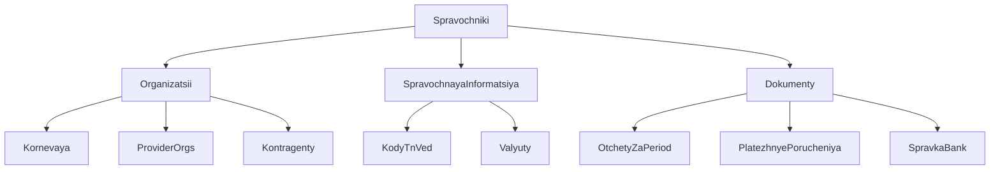

# Иерархия справочников (реанимация)

Ранее все todo были `cancelled`, кода по плану нет. Блокер (профиль root) закрыт. Возвращаем scope без изменений смысла; исполнение с чистого `pending`.

Сейчас плоский [`REFERENCE_NAV`](vdp/fe/src/lib/ved/nav-config.ts): Документы, Организации, Платёжные агенты, Контрагенты, Коды ТН ВЭД, Валюты (+ хвост root). Группа рисуется одним уровнем в [`VedAppShell.tsx`](vdp/fe/src/components/ved/VedAppShell.tsx) (`refsOpen`). У сид-менеджера нет `organizationId` ([`app-seed-accounts.ts`](vdp/fe/src/lib/ved/app-seed-accounts.ts)).

Неоткатывать незакоммиченное упрощение CTA «Создать» в `VedAppShell` — вложенность справочников добавлять рядом.

## 1. Организации

- Корневая — организация менеджера (`Account.OrganizationID`): карточка название / ИНН / статус. В сиде завести организацию агента и привязать менеджеру. Root: текст «Вне учётных записей» (как в профиле), без чужой карточки.
- Организации провайдеров — тип `provider` ([`OrgTypeProvider`](vdp/core/internal/domain/organization.go)), не каталог агентов и не учётки кабинета. Пусто: «Нет организаций провайдеров».
- Контрагенты — текущий экран, только перенос пункта меню.
- `/organizations` («Организации клиентов») из меню менеджера убрать. Проверка организаций у комплаенса в основном меню остаётся.
- Пункт «Платёжные агенты» в эту тройку не входит (уже верная подпись).

## 2. Справочная информация

Без смены данных: `/codes`, `/currencies`.

## 3. Документы

У менеджера и root убрать общий каталог файлов заявок (`/documents` из REFERENCE). У клиента и провайдера пункт «Документы» сохранить.

Новые экраны (без генераторов PDF):

- Отчёты: обязательный период + «Показать»; уже сформированные `agent_report` по дате заявки; пусто — «За этот период отчётов нет».
- Платёжные поручения: список `payment_order` + блок «Шаблоны» со статусом «Шаблонов пока нет» (без сохранения).
- Справка банка: пустой список «Справок от банка пока нет».

Пункты root вне тройки (Пользователи, Роли процесса, …) — плоский хвост под «Справочники».

## Слои

- UI: вложенные группы в сайдбаре; карточка корневой org; три экрана документов; пустые состояния с первым шагом.
- FE: `nav-config.ts`, `VedAppShell.tsx`, маршруты веток. Поля контрагентов/кодов/валют не менять.
- Домен: тип `provider` уже есть; статусы заявок не трогать; root к org не привязывать.
- API: чтение org менеджера и список org типа provider. Новых команд генерации нет.
- Unit: фильтр меню менеджера (три группы, нет каталога файлов); root на корневой org; период отчётов.
- E2E: менеджер раскрывает «Организации» → корневая; в меню нет общего списка документов заявок; отчёт вне дат не виден. Жест — клик по группе и пункту.
- Repro: localhost под менеджером.

## Сверка с rules

Обязательны: `ui-web-практики`, `ux-когнитивная-нагрузка`, `ux-формы-навигация-онбординг`, `безопасность-ролей-и-данных`, `screaming-architecture`, `use-cases`, `playwright-e2e`, `честность-готовности`, `vdp-ci-local-gate`, `планирование-сверка-с-rules`.

Вне scope: карточка профиля root (уже done), инвойс/агент vs провайдер, загрузка шаблонов поручений, PDF справки банка, снятие «Документы» у клиента/провайдера, docs, Telegram.

## DoD

1. `make -C vdp check-env-parity` до прогонов.
2. Unit FE на меню и период отчётов.
3. `make -C vdp ci-main` — спека сайдбара вне узкого PR-smoke.
4. На localhost: три группы у менеджера; корневая org из сида; общего каталога файлов заявок в меню нет.

При старте исполнения: в файле [`.cursor/plans/иерархия_справочников_697974b3.plan.md`](.cursor/plans/иерархия_справочников_697974b3.plan.md) вернуть todo из `cancelled` в `pending` (или синхронизировать с этим планом).
