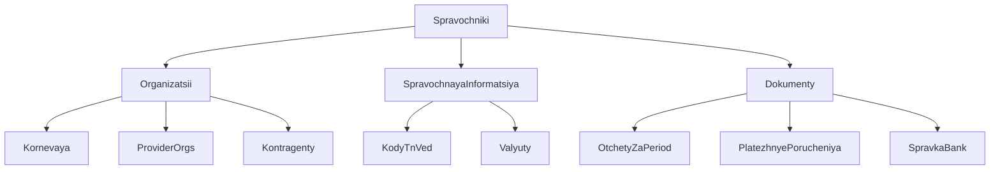

# Иерархия справочников

Плоский список в [nav-config.ts](vdp/fe/src/lib/ved/nav-config.ts) у менеджера сейчас такой: Документы, Организации, Провайдеры, Контрагенты, Коды ТН ВЭД, Валюты. Группа рисуется одним уровнем в [VedAppShell.tsx](vdp/fe/src/components/ved/VedAppShell.tsx).

Новая группа «Справочники» для менеджера и root — три ветки. Пункты root вне этой тройки (Пользователи, Роли процесса, Разрешения разделов, Страны и риски, Инструменты комплаенс, Проверка сценариев) остаются плоским хвостом под «Справочники». Клиент, провайдер и комплаенс это дерево не получают: у клиента и провайдера текущий пункт «Документы» (файлы их заявок) сохраняется.

## 1. Организации

Три разных списка. Каталог платёжных агентов из плана инвойса сюда не входит: пункт «Провайдеры» сейчас открывает агентов ([registry.ts](vdp/fe/src/lib/ved/registry.ts), `providers`). Его не подписывать как организации провайдеров.

- Корневая организация — одна, та, к которой привязан менеджер (`Account.OrganizationID`). Экран карточки: название, ИНН, статус. Не таблица и не прочерк. У сид-менеджера организации нет: в сиде завести организацию агента и проставить её менеджеру, чтобы экран был виден на localhost. Root эту карточку менеджера не подменяет своей: у root организации нет, на этом экране текст «Вне учётных записей».
- Организации провайдеров — организации с типом `provider`, не каталог агентов и не учётки кабинета `provider`. Пустой список: «Нет организаций провайдеров».
- Организации контрагентов — текущий экран [counterparties](vdp/fe/src/routes/demo/documents.tsx) не трогать по полям, только перенести пункт меню. Страница контрагентов остаётся.

Текущий экран «Организации клиентов» (`/organizations`) из меню менеджера убрать. Проверка организаций у комплаенса в основном меню остаётся.

## 2. Справочная информация

Перегруппировка без смены данных.

- Коды ТН ВЭД — текущий `/codes`.
- Валюты — текущий `/currencies`.

## 3. Документы

Менеджеру отдельный каталог файлов заявок не нужен. Пункт, который сейчас собирает договоры и инвойсы со всех заявок ([documents.tsx](vdp/fe/src/routes/demo/documents.tsx)), из меню менеджера и root убрать. Файлы заявки остаются на карточке заявки.

Вместо него три экрана:

- Отчёты. Период обязателен: дата начала и дата конца, кнопка «Показать». В диапазоне — уже сформированные отчёты агента (`agent_report`) по дате заявки. Пусто: «За этот период отчётов нет». Новый генератор отчётов не писать.
- Платёжные поручения. Список уже сформированных поручений (`payment_order`) и блок «Шаблоны». Шаблона в домене нет: в этом срезе блок показывает «Шаблонов пока нет» и не сохраняет файл. Загрузка шаблона — следующий срез.
- Справка о совершении сделки, заверенная банком. Отдельный экран с тем же смыслом в заголовке. Источника заверения банком нет: список пустой с текстом «Справок от банка пока нет». Генерацию PDF не имитировать.

## Слои

- UI: вложенные группы в сайдбаре; карточка корневой организации; три экрана документов; пустые состояния с первым шагом.
- FE: [nav-config.ts](vdp/fe/src/lib/ved/nav-config.ts), [VedAppShell.tsx](vdp/fe/src/components/ved/VedAppShell.tsx), маршруты трёх веток. Поля контрагентов, кодов и валют не менять.
- Домен: тип организации `provider` уже есть. Привязка менеджера к одной организации — `organization_id` учётки. Статусы заявок не меняются. Root к организации не привязывать.
- API: чтение организации менеджера и список организаций типа provider. Новых команд генерации документов нет.
- Unit: фильтр меню менеджера (три группы, нет каталога файлов заявок), root на корневой организации без привязки, период отчётов отсекает чужие даты.
- E2E: менеджер раскрывает «Организации» и открывает корневую; в меню нет общего списка документов заявок; отчёт за период вне дат не показывается. Жест — клик по группе и по пункту.
- Локальный repro: localhost под менеджером.

## Сверка с rules

Обязательны: `ui-web-практики`, `ux-когнитивная-нагрузка` (три группы вместо плоского списка), `ux-формы-навигация-онбординг`, `безопасность-ролей-и-данных` (root вне организации; провайдерский контур без ПДн клиента), `screaming-architecture`, `use-cases`, `playwright-e2e`, `честность-готовности`, `vdp-ci-local-gate`.

Вне scope: карточка профиля root, инвойс и разведение агента с провайдером исполнения, загрузка шаблонов поручений, PDF справки банка, снятие «Документы» у клиента и провайдера, документация, Telegram.

## DoD

1. `make -C vdp check-env-parity` до прогонов.
2. Unit FE на меню и период отчётов.
3. `make -C vdp ci-main` — спека сайдбара вне узкого PR-smoke. `ci-pr` этот прогон не закрывает.
4. На localhost менеджер видит три группы; корневая организация — та, что в сиде; общего каталога файлов заявок в меню нет.
