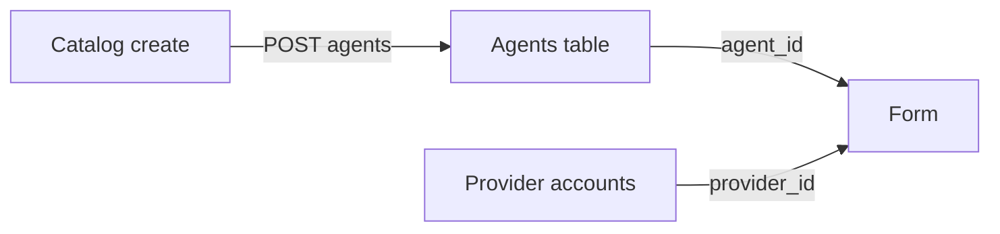

# Карточка: инвойс, агент и провайдер

Один объём работ. План [provider_and_contract](.cursor/plans/provider_and_contract_e5b8e56e.plan.md) сюда влит и отдельно не исполняется. Пункт 14 виджета «Участники» остаётся в плане карточки без прочерков.

Две разные сущности. Их нельзя слить в один список: на договоре выбирают агента, на платеже — провайдера исполнения.

Сейчас кнопка «Добавить провайдера» на экране «Провайдеры платежей» пишет `POST /api/v1/agents` ([catalog-mutations.ts](vdp/fe/src/lib/api/catalog-mutations.ts)). Те же `For test` и `Test` открываются в «Назначить платёжного агента». В «Назначить платёжного провайдера» их нет: туда нужны учётки `provider`, а менеджер их не видит и получает сид `Provider Seed · —`.

## 1. Не подтверждать заявку без инвойса

На проверке при 0 документах кнопка «Подтвердить заявку» активна. Заказчик: даже для знакомого клиента нужен как минимум инвойс. Контракт необязателен.

Кнопка — `eco_form_accept` → `eco_accept`. Чеклист в [review-checklist.ts](vdp/fe/src/lib/ved/review-checklist.ts) только пишет, что инвойса нет. «Следующий шаг» менеджера в [form-detail-page.tsx](vdp/fe/src/components/ved/pages/form-detail-page.tsx) не получает замок. [form_payment.go](vdp/core/internal/service/form_payment.go) проводит переход без `docs_json`.

- Подтвердить (`eco_accept` и `manager_form_accept`) можно только если есть файл вида `invoice`. Сумма, номер договора и файл другого вида не заменяют инвойс.
- «Вернуть», «Приостановить» и «Отклонить» остаются. Кнопка подтверждения недоступна, причина: «Нужен инвойс — без него заявку не подтвердить». Замок и у менеджера, и у комплаенса.
- Тот же запрет в Go до `Apply`: ошибка политики, не 500.
- «Загрузить документы» на карточке вызывает `addDocuments` без вида. По умолчанию вид `invoice`, чтобы PDF снимал замок. Однозначное имя файла по-прежнему может стать контрактом или платёжкой через `detectDocumentKind`.
- Тесты с `no_documents` и сразу `eco_accept` сначала прикладывают инвойс или ждут отказ.

## 2. Убрать путаницу агента и провайдера

Не переименовывать данные и не писать агента в `provider_id`. Выровнять подписи и списки.

- Справочник в [registry.ts](vdp/fe/src/lib/ved/registry.ts) (`providers.title` «Провайдеры платежей», кнопка «Добавить провайдера», пункт меню «Провайдеры») называется платёжными агентами. Создание по-прежнему `POST /api/v1/agents`. Эти записи только в «Назначить платёжного агента».
- «Назначить платёжного провайдера» берёт учётки кабинета `provider` / `senior_provider`, не каталог агентов. Узкий список для manager и root: `id` и имя, без почты и прочих ПДн. Сид в app-режиме не подставлять. Пусто — «нет активных провайдеров», подтвердить нельзя. Прочерк в пункте списка не рисовать: нет страны — не дописывать `· —`.
- Пустые страна, коридоры и контакт в таблице агента — «не указано», не черта. Так строка `For test` не выглядит сломанной.
- Если `provider_id` уже есть, `mgr_assign_provider` с карточки и из очереди убрать. На карточке имя провайдера, не uuid. Повторное назначение в эту волну не делать.
- `POST /api/v1/forms/{id}/provider` по-прежнему принимает только учётку провайдера ([form_payment_assign.go](vdp/core/internal/service/form_payment_assign.go)).

## 3. Агентский договор один раз на организацию

Повтор уже есть: принятый договор в `contracts`, `ResolveContractBranch` в [contract.go](vdp/core/internal/service/contract.go) ведёт следующую заявку в `signing_order`. Дыра: без `contract_id` подтверждение в [manager-contract.ts](vdp/fe/src/lib/ved/manager-contract.ts) шлёт поручение и не создаёт договор организации.

- Первое подтверждение без `contract_id` создаёт принятый агентский договор организации из загруженного файла, связывает с заявкой, затем поручение.
- `user_upload_contract` отклонять, если у организации уже есть принятый агентский или субагентский договор.
- Фильтр загрузки — и на карточке, и в очередях. На `contract_waiting_correction` файл по-прежнему просят.

## Слои

- UI: замок подтверждения, подписи агент/провайдер, пустые поля агента без черты, имя провайдера на карточке.
- FE: `ActionPanel`, `form-detail-page`, `registry.ts`, `manager-payment`, `agency-contract-ux`, `manager-contract`, `platform-store`, маппер имени.
- Домен: отказ подтверждения без инвойса; договор организации при первом подтверждении. Статусы не переписываются. Агент и провайдер остаются разными id.
- API: узкий список учёток провайдера. Контракт `POST …/provider` и `POST …/agent` не меняется.
- Unit: FE и Go по трём пунктам. Чужая роль не читает полный список учёток и не подтверждает без инвойса.
- E2E: без инвойса подтвердить нельзя; после инвойса можно; в назначении провайдера нет сида и нет `For test`; после назначения кнопки нет; вторая заявка организации не просит агентский договор. Загрузку PDF проверять через filechooser.
- Локальный repro: карточка менеджера на localhost.

## Сверка с rules

Обязательны: `use-cases`, `безопасность-ролей-и-данных` (запрет на сервисе; список провайдера без ПДн), `границы-и-контексты` (агент не равен провайдеру), `ui-web-практики` и `ux-*` (недоступная основная кнопка с причиной; один термин на сущность), `fe-interaction-contracts`, `playwright-e2e`, `go-testing`, `тесты-архитектуры`, `честность-готовности`, `vdp-ci-local-gate`.

Вне scope: слияние агента и провайдера в одну таблицу, переназначение провайдера, проверка контрагента, обязательный контракт, пункт 14 виджета «Участники», документация, Telegram, `compose-fe-refresh`.

## DoD

1. `make -C vdp check-env-parity` до прогонов.
2. Unit Go и FE по пунктам 1–3.
3. `make -C vdp ci-pr-pilot` — ActionPanel, form-payment и e2e. Одного `ci-pr` недостаточно.
4. На localhost: без инвойса заявку не подтвердить; созданный агент виден только в назначении агента; в назначении провайдера нет сида и нет прочерка; вторая заявка организации не просит агентский договор.

Готовность пунктов 1–3 — после зелёного `ci-pr-pilot`. Пункт 4 (профиль root) — отдельный DoD ниже; его браузерный гейт — `ci-main`.

## 4. Карточка профиля суперадмина

Только вошедший root, только чтение. Цель среза — показать каркас, по которому потом соберём карточки остальных ролей.

Порядок на экране (сначала суть, потом уже существующие уведомления):

- Имя: Root Admin
- Роль: Суперадмин
- Email: `root@vdp.local`
- Строка места: «Вне учётных записей»

Организацию не рисуем: ни селекта, ни прочерка. Прочерк выглядел бы как забытая привязка, а root вне учётных записей по правилу.

Telegram и SMS остаются ниже карточки. Подзаголовок страницы для root — «Суперадмин», не «Привязка Telegram и уведомления».

Для любой другой роли страница остаётся как сейчас (только уведомления). Карточку клиента, менеджера и провайдера и обязательную привязку к организации в этот срез не делаем.

«Настройки» по-прежнему открывают тот же `/profile`. Разведение профиля и настроек — следующий срез, не этот.

Домен и API не меняются. Root нельзя привязать к организации с этой страницы: `UpdateSelf` организацию и так не пишет.

Слои: UI-карточка в [profile-page.tsx](vdp/fe/src/components/ved/pages/profile-page.tsx); FE-функция `buildRootProfileCard`; unit на root/не-root; e2e `root-profile.spec.ts` (вне узкого PR-smoke).

DoD пункта 4: `check-env-parity` → unit FE → `make -C vdp ci-main` → на localhost root видит имя, роль, email и «Вне учётных записей».
