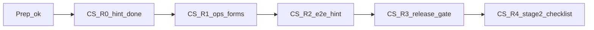

# Конструктор сценариев — планы реализации

Опора подготовки (уже есть): [заметки/конструктор-сценариев/](заметки/конструктор-сценариев/) — схема, решение (ок), тексты, проверка-среды (частично), бриф. Программный план подготовки: [конструктор_сценариев_42bb2cf9.plan.md](.cursor/plans/конструктор_сценариев_42bb2cf9.plan.md) (todos completed).

Скрин с «код ждёт приёмку» — снимок **до** «ок». После «ок» уже сделано: [`ManagerRouteHintPanel`](vdp/fe/src/components/ved/ManagerRouteHintPanel.tsx) + [`manager-route-hint.ts`](vdp/fe/src/lib/ved/manager-route-hint.ts) + unit; `make ci-pr` зелёный. BPM / process-roles менеджеру / смена статусной машины — **вне scope** и дальше.

## Карта волн (отдельные plan-файлы при исполнении)

| ID | Файл (создать при старте волны) | Что | Статус сейчас |
|---|---|---|---|
| CS-R0 | `cs_r0_manager_hint.plan.md` | Подсказка «Как собрать путь» на form detail | **Сделано** — только зафиксировать DoD в plan-файле |
| CS-R1 | `cs_r1_ops_forms_cta.plan.md` | Дозакрыть [проверка-среды.txt](заметки/конструктор-сценариев/проверка-среды.txt): живые заявки + CTA лестниц/веток | К исполнению |
| CS-R2 | `cs_r2_e2e_route_hint.plan.md` | Playwright: manager видит `manager-route-hint` | К исполнению |
| CS-R3 | `cs_r3_release_handover.plan.md` | `make release-gate` + при done — `notify-mgmt` | К исполнению после R1–R2 |
| CS-R4 | `cs_r4_stage2_vedy_bot_gate.plan.md` | Чеклист «когда этап 2»; ссылка на [vedy_bot_master](.cursor/plans/vedy_bot_master_knowledge_agent.plan.md); **без** кода статусов VDP | После R3 или параллельно с текстом |

Порядок: **R0 (закрыть записью) → R1 → R2 → R3**; **R4** не блокирует R1–R2.

## CS-R0 — подсказка (закрытие учёта)

**Слои:** UI / FE / Unit (уже).  
**DoD:** панель только для manager/root; язык без BPM; unit зелёный; `ci-pr` уже был зелёный.  
**Итог волны:** короткий plan-файл со статусом done + ссылки на файлы кода (без нового diff, если ничего не ломалось).

## CS-R1 — проверка среды на живых заявках

**Слои:** Compose / repro; Docs (обновить `проверка-среды.txt`). Без смены домена.  
**Шаги:** поднять/использовать localhost; создать или посеять заявки; пройти пункты 4–6 из проверки-среды (лестницы advance/postpay/export, corrections/refund/shipment CTA, mid-flight process-roles).  
**DoD:** в `проверка-среды.txt` итоговый статус **прошло** или явный fail с «что смотреть»; главная приёмка — человек по отчёту.  
**Gate:** без make обязателен; при правках только заметок — `docs-format-check` не нужен (папка `заметки/`, не `vdp/docs`).

## CS-R2 — E2E на подсказку

**Слои:** E2E / journey; Unit уже есть.  
**Шаги:** spec: login manager → открыть form detail → `getByTestId('manager-route-hint')` visible; user/provider — не видят (или null).  
**DoD:** зелёный прогон; т.к. `vdp/fe/e2e/**` — **`make check-env-parity` → `make ci-pr-pilot`** (не только `ci-pr`).  
**Не трогать:** ActionPanel логику статусов, process-roles API.

## CS-R3 — сдача

**Слои:** Compose + полный browser.  
**Шаги:** `cd vdp && make release-gate`; при продуктовом закрытии волны — `notify-mgmt` kind=done языком для менеджмента (сборка маршрута из рычагов, не «конструктор всего»).  
**DoD:** release-gate зелёный; notify только по правилам `mgmt-tg-notify`.

## CS-R4 — вход в этап 2 (не разработка статусов)

**Слои:** Docs / тексты в `заметки/конструктор-сценариев/`.  
**Шаги:** файл чеклиста «запрос закрыт рычагами? → иначе vedy_bot»; без изменений form-payment.  
**DoD:** текст принят человеком; кастом = отдельная программа бота, не эта волна кода кабинетов.

## Сверка с rules

**Обязательны:** `планирование-сверка-с-rules`, `честность-готовности`, `vdp-ci-local-gate`, `playwright-e2e` (R2), `поддержка-и-обратная-связь`, `use-cases` / `интеграция-и-события` (не ломать статусы), `безопасность-ролей-и-данных`, `mgmt-tg-notify` (R3).  
**Вне scope:** BPM-редактор, передача process-roles менеджеру, Nest-паритет, ML, runtime-смена статусов ботом.

## Вне scope реализации

- Свободный граф статусов / выключение обязательных gates из админки.
- Новый участник-актор с переходами в этой программе.
- Переписывание машины статусов «под конструктор».
