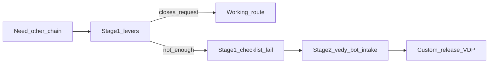

# Конструктор сценариев (кабинеты vdp)

Опора: [заметки/конструктор-сценариев/вывод-исследование-анализ.txt](заметки/конструктор-сценариев/вывод-исследование-анализ.txt). Исследование и анализ уже выполнены — в этом плане их не переоткрываем, а переводим в схему, тексты, решение, проверку и (после «ок») разработку.

## Цель

Менеджер самостоятельно собирает рабочий путь заявки, когда нужна другая логика цепочки — **из уже разрешённых рычагов платформы**, без заказа новой разработки на каждый типовой запрос.

Рабочее определение (этап 1): сборка маршрута из process-roles, continuity, денежных лестниц и веток corrections / refund / shipment / provider return + именованные сценарии каталога. **Не** свободный BPM и не произвольный граф статусов.

Этап 2 ([инструменты/vedy_bot](инструменты/vedy_bot)): кастом вне рычагов — только если чеклист этапа 1 не закрывает запрос; бот не подменяет статусную машину кабинетов.

## Виды работы

| Вид | Итог этой программы |
|---|---|
| Проектирование / схема | Схема устройства этапа 1 / этапа 2 и границ |
| Решение / согласование | Варианты + рекомендация + список «что утвердить» |
| Документы / тексты | Текст для менеджмента без лишнего жаргона |
| Запуск / проверка среды | Статус прошло / не прошло по чеклисту рычагов |
| Разработка / доработка кода | Работающий код + проверки — **только после** главной приёмки схемы/решения; слои кода в этой волне не отмечены |

## Уже решено (не переоткрывать)

- Этап 1 → затем этап 2 (последовательно).
- Не ломаем созданное: источник истины статусов — домен form-payment; process policy запрещает BPM-редактор этапов и выключение обязательных gates из админки.
- Каталог сценариев = согласование и тесты, не runtime-конструктор.

## Сверка с `.cursor/rules`

**Обязательны:** `планирование-сверка-с-rules`, `базовые-правила-инструмента`, `честность-готовности`, `use-cases`, `интеграция-и-события`, `безопасность-ролей-и-данных`, `чистая-архитектура`, `детали-как-плагины`, `поддержка-и-обратная-связь`, `ui-web-практики` (только если позже трогаем UI подсказки), `vdp-ci-local-gate`, `mgmt-tg-notify` при продуктовом done.

**Вне scope правил для этой программы:** `машинное-обучение`, `serverless-и-faas`, Nest-паритет, свободный BPM в админке.

**Части системы:** все слои (UI/FE/домен/API/unit/E2E/compose/docs) сейчас **OUT** — в плане нет кода и нет правок кабинетов до утверждения. Перед стартом разработки — отдельное включение слоёв под выбранный объём (см. шаг 5).

## Шаги (порядок жёсткий)

### 1. Проектирование — схема устройства

Зафиксировать одну схему «как менеджер собирает путь»:

Рычаги этапа 1 (кратко, канон из исследования):

- **Роли процесса** — root, API process-roles; не менеджер сделки.
- **Маршрут оплаты** — advance / postpay / export и ветки уже в машине статусов.
- **Операции менеджера** — continuity, reject, payment, assign, report, опционально shipment.
- **Каталог** — язык приёмки, не конструктор runtime.

Граница «нельзя конфигом»: новый участник-актор с переходами; произвольный порядок этапов; runtime из бота без релиза.

Артефакт: короткая схема/описание в той же папке заметок или доработка вывода — без кода.

### 2. Решение / согласование — что утвердить

Зафиксированная рекомендация (не развилка в исполнении):

1. **Определение этапа 1** — сборка из рычагов, не BPM — утвердить как продуктовую формулировку.
2. **Владение process-roles** — остаётся у **root** (суперадмин). Передача subset менеджеру в этой программе **не** делается (иначе отдельный product decision + код и риск mid-flight).
3. **Чеклист перехода к этапу 2** — в этап 2 только если запрос не закрыт комбинацией: process-roles + существующий денежный маршрут + существующие ветки + continuity.
4. **Язык для менеджмента** — не «конструктор всего», а «сборка маршрута из готовых ролей / лестниц / веток».

Итог шага: список «утвердить / отклонить» для человека. Главная приёмка = «ок» / правки.

### 3. Документы / тексты

После «ок» по шагу 2 (или параллельно черновиком до «ок», правка после):

- Текст для менеджмента: что можно собрать самому, чего ждать от разработки / vedy_bot.
- Явная таблица «желание → уже есть / только этап 2» на базе раздела 4 вывода-исследования.
- Без DoD-жаргона и без обещания свободного редактора статусов.

Куда: [заметки/конструктор-сценариев/](заметки/конструктор-сценариев/) (и при необходимости ссылка из оглавления согласования сценариев — без переписывания всего каталога).

### 4. Запуск / проверка среды

Ручной чеклист на живом (или локальном) контуре кабинетов — **без** новых фич:

- Пилот: ICO/ECO выкл., continuity менеджера на тех же статусах.
- Смена денежного маршрута в рамках готовых лестниц.
- Ветка corrections / refund (и shipment, если включена) — CTA есть, переход допустим.
- process-roles: только root меняет слоты; mid-flight заявки не мигрируют статусы из-за смены конфига.

Итог: **прошло / не прошло** + что смотреть. Слой compose в плане OUT — поднятие стека не часть объёма разработки; при отсутствии среды — честно «не прошло: среда не поднята».

### 5. Разработка — только после главной приёмки шагов 1–2

Триггер: человек сказал «ок» определению и пунктам утверждения.

Объём разработки в этой программе (узкий, «не ломаем созданное»):

- **Делаем:** продуктовые подсказки / тексты в кабинете или help-контексте «какой рычаг выбрать» (guided actions), плюс при необходимости синхронизация формулировок с каталогом сценариев — **без** BPM-редактора и без передачи process-roles менеджеру.
- **Не делаем в этой программе:** свободный граф статусов; выключение обязательных gates; runtime-автоматизация из vedy_bot; новый участник-актор с переходами.

Перед кодом: включить нужные слои (минимум docs + при UI — ui/fe/unit; при journey — e2e) и целевой gate ниже `release-gate` для итераций (`ci-pr` / `ci-pr-pilot` по path-filter). Полная приёмка перед передачей — `cd vdp && make release-gate`.

Этап 2 (vedy_bot): отдельный запуск по чеклисту; ссылка на [vedy_bot_master_knowledge_agent.plan.md](.cursor/plans/vedy_bot_master_knowledge_agent.plan.md) — не смешивать с доработкой статусной машины в одном diff.

## Критерии готово

| Критерий | Как принимаем |
|---|---|
| Главная приёмка | Человек читает схему + решение + тексты → «ок» / правки. Без «ок» программа не «готова» и код не стартует. |
| Документ | Есть готовый текст для менеджмента без ложного «полный конструктор». |
| Среда | Есть статус прошло / не прошло по чеклисту рычагов. |
| Разработка (если открыта после «ок») | Код + проверки по включённым слоям; перед передачей — `make release-gate`. |
| Честность | Не утверждать паритет BPM или «менеджер сам рисует статусы». |

## Вне scope

- Ломать или переписывать фиксированную машину статусов «под конструктор».
- Обещать менеджеру свободный BPM / выключение обязательных gates из админки.
- Смешивать каталог scenario-verify с продуктовым runtime-конструктором.
- Подмена статусов VDP ботом «на лету».
- Передача process-roles менеджеру в этой программе.
- Коммиты и notify без явной просьбы / без продуктового done.
- Nest-паритет, ML, serverless как часть конструктора.
