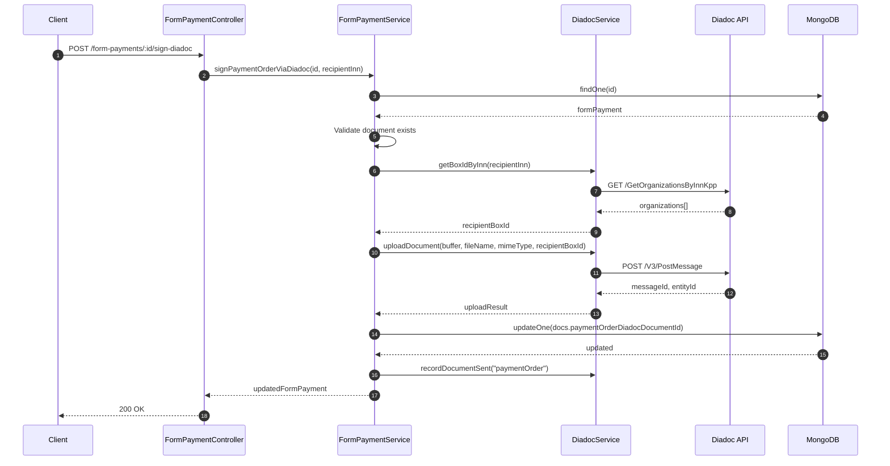
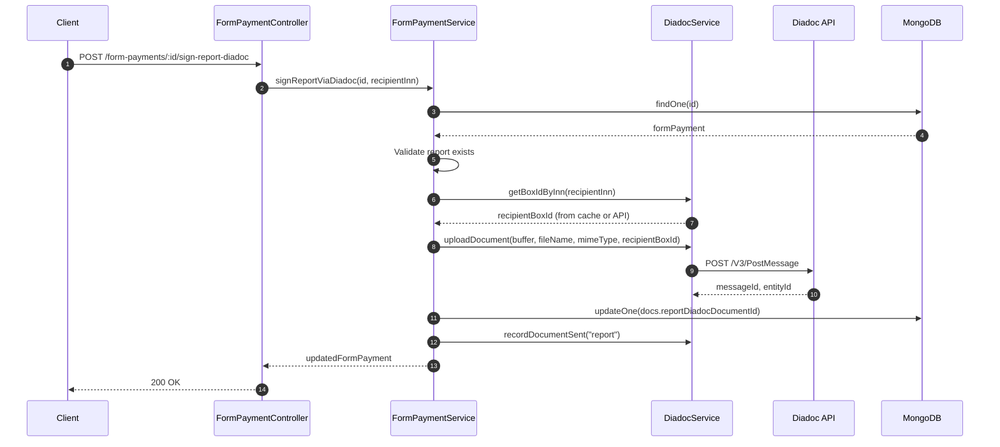
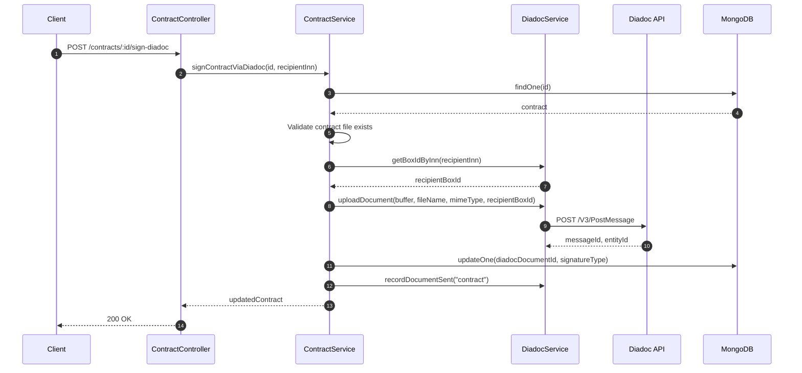
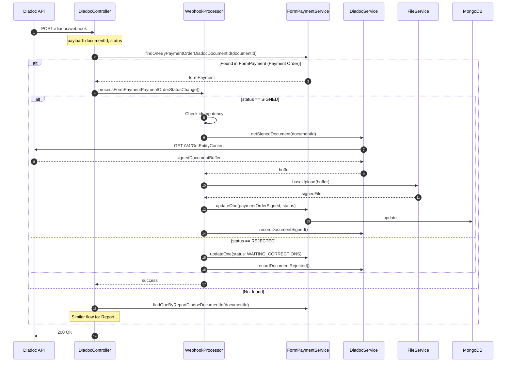
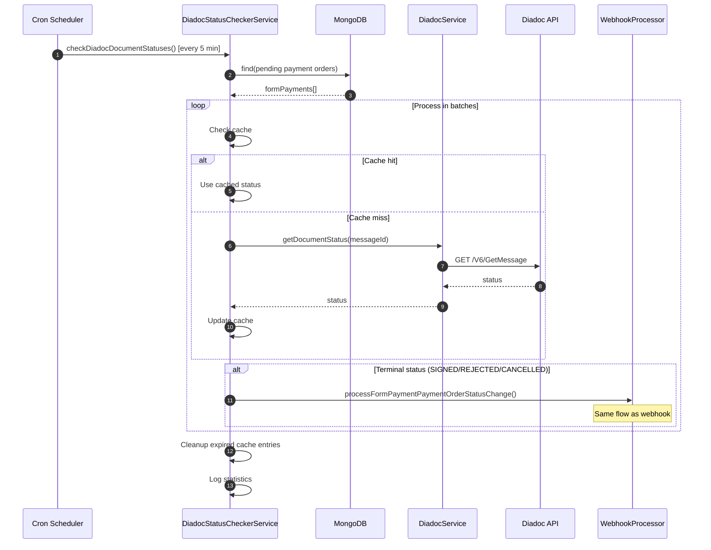
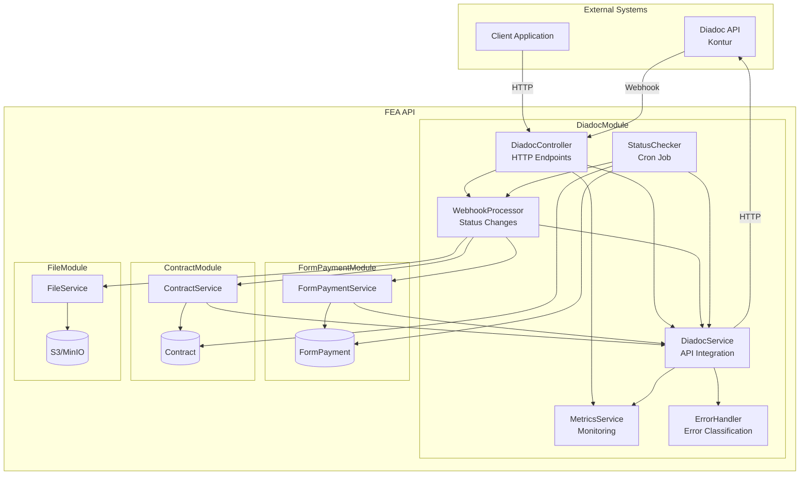
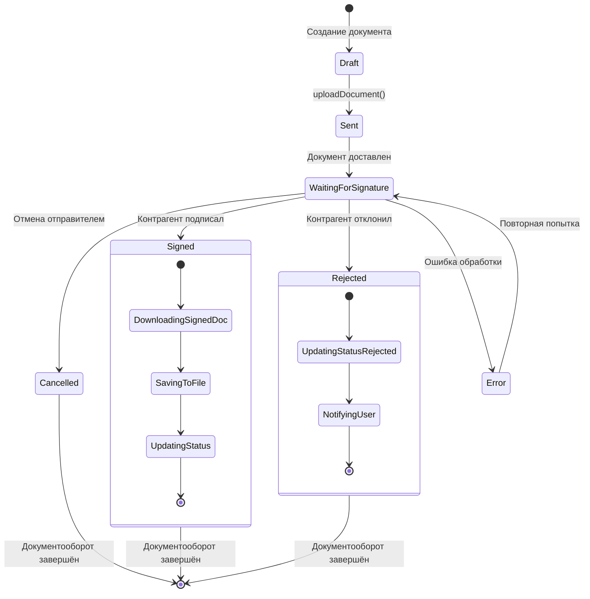
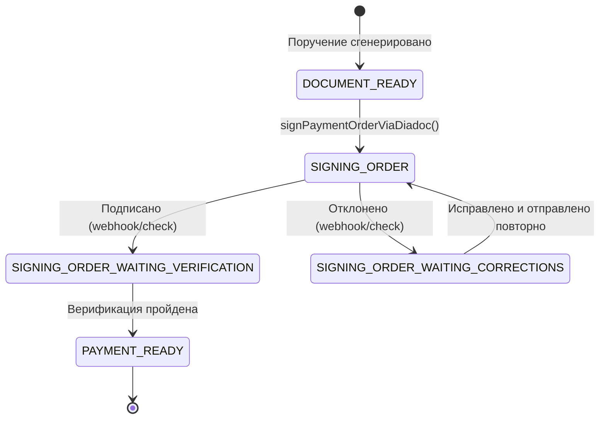
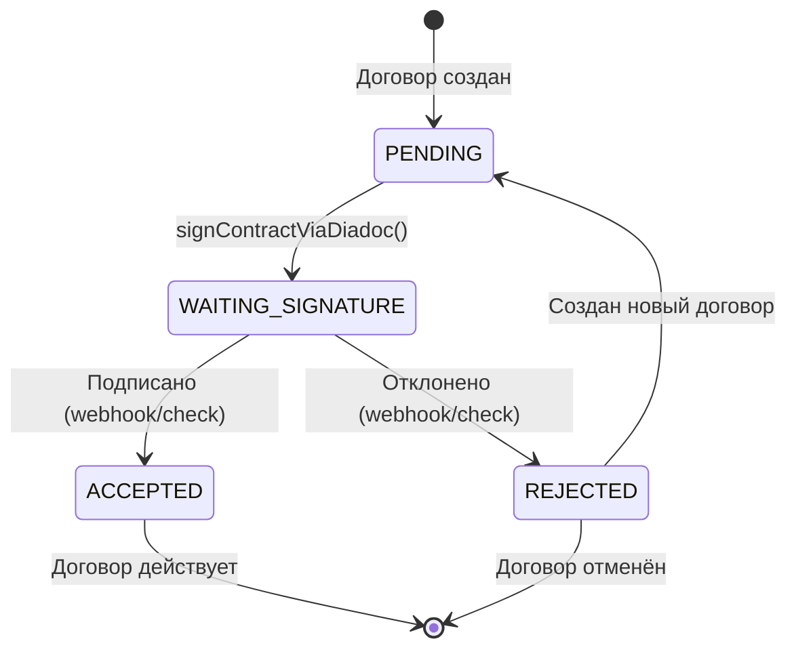
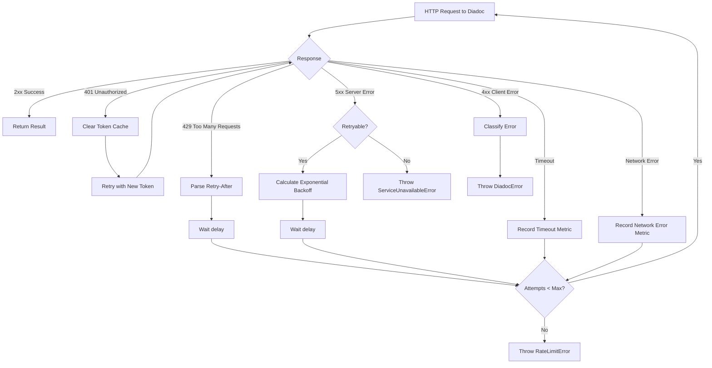

# Диаграммы модуля Diadoc

## Содержание

- [Sequence Diagrams](#sequence-diagrams)
  - [Отправка поручения на оплату](#отправка-поручения-на-оплату)
  - [Отправка отчёта](#отправка-отчёта)
  - [Отправка договора](#отправка-договора)
  - [Обработка Webhook](#обработка-webhook)
  - [Периодическая проверка статусов](#периодическая-проверка-статусов)
- [Component Diagram](#component-diagram)
- [State Diagram](#state-diagram)

---

## Sequence Diagrams

### Отправка поручения на оплату

### Отправка отчёта

### Отправка договора

### Обработка Webhook

### Периодическая проверка статусов

---

## Component Diagram

---

## State Diagram

### Статусы документа в Diadoc

### Статусы FormPayment при работе с Diadoc

### Статусы Contract при работе с Diadoc

---

## Диаграмма обработки ошибок

---

**Автор**: Специалист оператор + Ассистент [бот коммерческий]

**Интеллектуальные права** принадлежат ООО «Иннотек Лабс»
