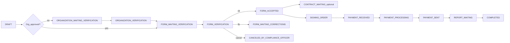

# Gap-анализ: backend-for-ved (Fea360) ↔ вводные

**Дата:** 2026-08-25  
**Источник требований:** `вводные/вводные от ви.txt`  
**Источник кода:** `кастомные модули для адаптации и переиспользования/backend-for-ved`  
**Расположение:** `заметки/gap-analysis-backend.md`  
**Назначение:** объём доработок для переноса в `vdp/core` (п.2)

### Легенда вердиктов

| Вердикт | Смысл |
|---------|--------|
| `есть` | Реализовано и соответствует смыслу вводных |
| `частично` | Есть, но неполное / отличается от ТЗ |
| `нет` | Требуется по ТЗ, в коде отсутствует |
| `маппинг` | Смысл есть, имена/модель другие |
| `нет в ТЗ` | Есть только в коде; рекомендация для п.2 |
| `лишнее` | В коде есть, для MVP по ТЗ можно не тащить (с обоснованием) |

### Риск

`блокер MVP` / `средний` / `низкий`

---

## 1. Роли и AuthZ

**Код:** `src/lib/enums/models/account.enums.ts` → `AccountRole`  
**Guards:** `src/lib/guards/roles.guard.ts`, `auth.guard.ts` (APP_GUARD)  
**Декораторы:** `src/lib/decorators/*-method.decorator.ts`

| ID | Требование | Код | Вердикт | Доработка для п.2 | Риск |
|----|------------|-----|---------|-------------------|------|
| ROLE-USER | User — только свои заявки | `AccountRole.USER` + site controllers | `есть` | Перенести as-is; проверить фильтры по `account` | низкий |
| ROLE-ICO | Internal CO — РФ-орг, первая заявка | `INTERNAL_COMPLIANCE_OFFICER` + ICO controllers | `есть` | Перенести as-is | низкий |
| ROLE-ECO | External CO — иностранные орг / заявки после ICO | `COMPLIANCE_OFFICER` (имя ≠ «External») | `маппинг` | В доках/API зафиксировать alias External = `compliance_officer`; опционально переименовать в коде | средний |
| ROLE-MGR | Manager — все заявки, оркестрация | `MANAGER` (+ иногда TREASURER в `@ManagerMethod`) | `есть` | Перенести; уточнить пересечение с Treasurer | низкий |
| ROLE-PROV | Provider — свои заявки, без ПДн клиента | `PROVIDER` + provider controllers | `частично` | **Нет фильтрации ПДн:** `GET` отдаёт полный `account`; ввести DTO без ПДн | **блокер MVP** |
| ROLE-TREAS | нет в ТЗ — казначей / PAY_FROM_EXPORT | `TREASURER` + treasurer controllers + статусы `*_TREASURER` | `нет в ТЗ` | Перенести as-is как зависимость экспортного контура | средний |
| ROLE-SENIOR | нет в ТЗ — CRUD org провайдера | `SENIOR_PROVIDER` + `@SeniorProviderMethod` на org | `нет в ТЗ` | Перенести as-is (узкий scope) | низкий |
| ROLE-REP | нет в ТЗ | `REPORTER` — **нет controllers/decorators** | `лишнее` | Не переносить enum-мёртвый код или оставить заглушку до появления ТЗ | низкий |
| ROLE-ROOT | нет в ТЗ — супер-админ | `ROOT` bypass в RolesGuard + admin controllers | `нет в ТЗ` | Перенести для админки/миграций | низкий |
| ROLE-1C | нет в ТЗ — интеграция 1С | `ONE_C` + `1c/*` controllers | `нет в ТЗ` | Перенести как границу платежей/файлов | средний |
| ROLE-AUTHZ | RBAC по ролям, без permission-matrix | role decorators only | `частично` | Для Provider/зоны видимости — явные DTO/политики, не только роль | средний |

---

## 2. Статусы клиента / организации

**Код:** `OrganizationStatus` = `NOT_APPROVED` \| `APPROVED` \| `BLOCKED`  
Файлы: `organization.enums.ts`, `organization.schema.ts`, ICO `organization-internal-compliance-officer.controller.ts`  
Также: `Account.blocked`, `Organization.isActive`, subaccount statuses

| ID | Требование | Код | Вердикт | Доработка для п.2 | Риск |
|----|------------|-----|---------|-------------------|------|
| STAT-NEW | Новый клиент (только зарегистрировался) | `NOT_APPROVED` (+ default) | `маппинг` | Документировать маппинг; UI-лейблы «Новый» | низкий |
| STAT-ACTIVE | Активный после ICO | `APPROVED` + `isActive` | `маппинг` | Явная композиция Active = APPROVED ∧ isActive ∧ !account.blocked | низкий |
| STAT-BLOCKED | Заблокированный | `OrganizationStatus.BLOCKED` и/или `Account.blocked` | `частично` | Унифицировать два слоя блокировки в доменной модели/API | средний |
| STAT-AWAIT | Ожидающий обработки (рейтинг красный/жёлтый → менеджер) | Нет enum; нет rating | `нет` | Добавить рейтинг клиента/заявки **или** явный статус «ожидает менеджера»; очередь по рейтингу | **блокер MVP** |
| STAT-UNBLOCK | Запрос на разблокировку | Нет endpoint | `нет` | Endpoint запроса + workflow (ICO/Manager) | средний |
| STAT-ICO-ACT | ICO: approve / block / на уточнение | `approve`, `un-approve`, `block`; form `reject` → corrections | `частично` | `un-approve` ≠ unblock; нет reverse от BLOCKED; уточнение org через form reject | средний |

---

## 3. State machine заявки

**Код:** `FormPaymentStatus` / `FormPaymentStage` в `form-payment.enums.ts`  
**Переходы:** `form-payment.constants.ts` (`transitionsImportForm`, export/postpay variants)  
**Enforcement:** `form-payment.service.ts` → `checkTransit()`

### Наложение флоу вводных → статусы кода



| ID | Требование | Код | Вердикт | Доработка для п.2 | Риск |
|----|------------|-----|---------|-------------------|------|
| SM-USER-SUBMIT | Отправка → compliance | `DRAFT` → `ORGANIZATION_*` или `FORM_WAITING_VERIFICATION` | `есть` | — | низкий |
| SM-ECO-WAIT | `FORM_WAITING_VERIFICATION` | тот же статус | `есть` | — | низкий |
| SM-ECO-CORR | `FORM_WAITING_CORRECTIONS` | тот же | `есть` | — | низкий |
| SM-ECO-OK | `FORM_ACCEPTED` | тот же | `есть` | — | низкий |
| SM-ECO-CANCEL | `CANCELED_BY_COMPLIANCE_OFFICER` | тот же | `есть` | — | низкий |
| SM-MGR-WAIT-PAY | «Ожидание исполнения платежа» | `PAYMENT_PROCESSING` / `PAYMENT_RECEIVED` / stage `SENDING_PAYMENT_*` | `маппинг` | Согласовать UI-лейбл со статусом/stage | низкий |
| SM-PROV-RETURN | Провайдер → менеджер | `MANAGER_CHECKING` | `есть` | — | низкий |
| SM-DONE | `COMPLETED` | тот же | `есть` | — | низкий |
| SM-CONTRACT | Агентский договор на первой сделке | `CONTRACT_WAITING*` + module `contract` | `есть` | Сверить порядок: ТЗ — после ECO; код — stage `AGENCY_CONTRACT` | средний |
| SM-SHIPMENT | Отгрузка при авансе/товар | `SHIPMENT_*` | `нет в ТЗ` как отдельный флоу | Перенести (нужен для аванс+товар) | средний |
| SM-REFUND | Возврат | `PAYMENT_REFUND_*` | `нет в ТЗ` | Перенести as-is | низкий |
| SM-TREAS | Ветки казначея | `*_TREASURER`, `OVERPAYMENT_*`, `EQUAL` | `нет в ТЗ` | Перенести с TreasurerTask | средний |
| SM-ADVANCE-ORDER | Доп. поручение | `ADVANCE_SIGNING_ORDER_*` | `нет в ТЗ` | Перенести (постпей/аванс) | средний |
| SM-DIADOC-REP | Отчёт в ЭДО | `REPORT_WAITING_DIADOC` | `нет в ТЗ` (ТЗ — ручная подпись) | Перенести как опцию sign-method | низкий |
| SM-TODO-ORDER | Авто-передача поручения | TODO в `form-payment.service.ts:3497` отключён | `частично` | Решить: оставить manual или дописать логику | средний |

**Оценка размера SM:** ~50 статусов, 3 таблицы переходов (import / export / postpay rate-on-provider), монолитный `form-payment.service.ts` (~9k LOC).

---

## 4. Флоу по ролям (endpoint-level)

### 4.1 User — шаги оформления заявки (вводные 1–8)

| ID | Требование | Код | Вердикт | Доработка | Риск |
|----|------------|-----|---------|-----------|------|
| FLOW-U-01 | Оставить заявку | `POST site/form-payment` | `есть` | — | низкий |
| FLOW-U-02 | Загрузка инвойс+контракт PDF ≤15МБ | invoices CRUD + `contract` file; file module | `частично` | Проверить лимит 15 МБ в file config | низкий |
| FLOW-U-02b | «У меня нет документов» — номер/дата контракта вручную | invoice `contractNumber`/`contractDate`; без файла | `частично` | Явный UX-флаг/ветка «без документов» если нужна в API | средний |
| FLOW-U-03 | Тип import/export, валюты, сумма, аванс/постоплата, товар/услуга, ТН ВЭД, дата отгрузки | `FormPaymentDirection/Condition/Kind`, `hsCodes`, `deadlineShipment` | `есть` | — | низкий |
| FLOW-U-04 | Отправка на compliance | `PUT .../form/accept` | `есть` | — | низкий |
| FLOW-U-05 | Подпись агентского договора + поручения | contract site + order upload / Diadoc | `есть` | — | низкий |
| FLOW-U-06 | Оплата агенту + подтверждение (опционально) | `PUT .../payments` | `есть` | — | низкий |
| FLOW-U-07 | Просмотр подтверждения от провайдера | docs/swift/transactions на GET form | `частично` | Убедиться в visibility для USER | низкий |
| FLOW-U-08 | Подпись отчёта агента → COMPLETED | report upload + manager accept → COMPLETED | `есть` | — | низкий |

### 4.2 Internal Compliance Officer

| ID | Требование | Код | Вердикт | Доработка | Риск |
|----|------------|-----|---------|-----------|------|
| FLOW-ICO-LIST | Таблица орг на проверке | org ICO list + form ICO list | `есть` | — | низкий |
| FLOW-ICO-CARD | Карточка: ИНН, форма, документы | GET org + organization-card | `есть` | — | низкий |
| FLOW-ICO-START | Начать проверку | `PUT .../form/start` | `есть` | — | низкий |
| FLOW-ICO-OK | Подтвердить организацию | `PUT org/.../approve` + form accept | `есть` | — | низкий |
| FLOW-ICO-BLOCK | Заблокировать | `PUT org/.../block` | `есть` | — | низкий |
| FLOW-ICO-CLARIFY | Отправить на уточнение | `PUT .../form/reject` → corrections | `маппинг` | Семантика reject = clarification; при необходимости разделить API | средний |
| FLOW-ICO-LOCK | После решения клиент не редактирует ключевые поля org | логика в org/form services | `частично` | Явно проверить/зафиксировать immutable fields после APPROVED/BLOCKED | средний |

### 4.3 External Compliance Officer

| ID | Требование | Код | Вердикт | Доработка | Риск |
|----|------------|-----|---------|-----------|------|
| FLOW-ECO-QUEUE | Вкладка «Ожидает проверки» | list + `FORM_WAITING_VERIFICATION` | `есть` | — | низкий |
| FLOW-ECO-CHECK | Контракт, инвойс, валюта, категория, условия, реквизиты, назначение | GET + PATCH form | `есть` | — | низкий |
| FLOW-ECO-CORR | Возврат + комментарий → `FORM_WAITING_CORRECTIONS` | `form/reject` + Comment module | `есть` | — | низкий |
| FLOW-ECO-OK | Одобрить → `FORM_ACCEPTED` | `form/accept` | `есть` | — | низкий |
| FLOW-ECO-CANCEL | Отклонить → `CANCELED_BY_COMPLIANCE_OFFICER` | `cancel` | `есть` | — | низкий |
| FLOW-ECO-AI | Анализ контрагента (нет в ТЗ) | `POST .../analyze-counterparty` | `нет в ТЗ` | Перенести как опцию | низкий |

### 4.4 Manager

| ID | Требование | Код | Вердикт | Доработка | Риск |
|----|------------|-----|---------|-----------|------|
| FLOW-MGR-ACTIVE | Заявки `FORM_ACCEPTED` во «Активные» | manager list/filter | `есть` | — | низкий |
| FLOW-MGR-RETURN | Возврат клиенту с комментарием | form reject / corrections | `есть` | — | низкий |
| FLOW-MGR-DOCS | Формирование договора, поручения, отчёта | order/generate, generate-agent-report, contract | `есть` | — | низкий |
| FLOW-MGR-AGENT | Выбор платёжного агента | `FormPayment.agent` + Agent module; PATCH | `частично` | Явный endpoint/валидация «согласован с клиентом» | средний |
| FLOW-MGR-PROV | Выбор провайдера | `PATCH ...` field `provider` | `частично` | Выделить assign-provider; доступ провайдера после назначения | средний |
| FLOW-MGR-DEADLINE | Крайний срок исполнения для провайдера | **нет поля** (есть `deadlineShipment` на invoice) | `нет` | Добавить `executionDeadline` (или аналог) + уведомления | **блокер MVP** |
| FLOW-MGR-CTRL | Контроль хеш/файл от провайдера → отчёт | payment + report flow | `есть` | — | низкий |
| FLOW-MGR-DONE | → `COMPLETED` | `PUT .../completed` / shipment/report accept | `есть` | — | низкий |

### 4.5 Provider

| ID | Требование | Код | Вердикт | Доработка | Риск |
|----|------------|-----|---------|-----------|------|
| FLOW-PROV-VIEW | Суммы, курс, комиссия, org name+ИНН, поручение PDF, docs | GET form provider | `частично` | Убрать ПДн account; оставить name/ИНН org по ТЗ | **блокер MVP** |
| FLOW-PROV-START | Начать исполнение | `PUT .../payment/start` | `есть` | — | низкий |
| FLOW-PROV-RETURN | Вернуть менеджеру | `PUT .../form/manager` → `MANAGER_CHECKING` | `есть` | — | низкий |
| FLOW-PROV-FIAT | Файл подтверждения | PATCH docs/swift + `payment/sent` | `частично` | Явная семантика «файл подтверждения» | средний |
| FLOW-PROV-CRYPTO | Хеш транзакции | `addTransactions` hash+chain | `частично` | Явный обязательный hash XOR file по типу валюты | средний |
| FLOW-PROV-SENT | Исполнить платёж | `payment/sent` | `есть` | — | низкий |

### 4.6 Treasurer / Senior Provider / ONE_C / ROOT / REPORTER

| ID | Требование | Код | Вердикт | Доработка | Риск |
|----|------------|-----|---------|-----------|------|
| FLOW-TREAS | нет в ТЗ — поручения/задачи казначея | `admin/treasurer/*`, `treasurer-task` | `нет в ТЗ` | Перенести as-is с form-payment treasurer statuses | средний |
| FLOW-SENIOR | нет в ТЗ — CRUD provider org | `organization-provider` SeniorProviderMethod | `нет в ТЗ` | Перенести as-is | низкий |
| FLOW-1C | нет в ТЗ — ingest платежей, list forms/agents/files | `1c/*` | `нет в ТЗ` | Перенести; сохранить идемпотентность `externalId` | средний |
| FLOW-ROOT | нет в ТЗ — admin CRUD | `@RootMethod` admin controllers | `нет в ТЗ` | Перенести | низкий |
| FLOW-REP | нет в ТЗ | enum only | `лишнее` | Не переносить без ТЗ | низкий |

---

## 5. Документы и поля

| ID | Документ ТЗ | Код | Вердикт | Доработка | Риск |
|----|-------------|-----|---------|-----------|------|
| DOC-AGENCY | Агентский договор авто при новой компании | `contract` module + template; статусы `CONTRACT_*` | `частично` | Проверить автогенерацию при create org; поля подписанта/печати vs ТЗ | средний |
| DOC-ORDER | Поручение принципала авто при готовности к переводу | `generate-docs` + DOCX `SIGNING_ORDER`; Diadoc optional | `есть` | Закрыть TODO статусов генерации; курс/% в шаблоне | средний |
| DOC-REPORT | Отчёт агента после платежа | `GENERATE_AGENT_REPORT` + DOCX `AGENT_REPORT` | `есть` | Поля: курс вручную, факт. сумма, дата платежа — сверить с шаблоном | средний |
| DOC-INVOICE | Инвойс от клиента | `FormInvoice` + recognition OCR | `есть` | — | низкий |
| DOC-CP-CONTRACT | Контракт клиент↔контрагент | `FormPayment.contract` file + meta на invoice | `частично` | Развести naming agency vs counterparty; ветка без файла | средний |
| DOC-PAY-CONF | Подтверждение оплаты | `docs.payments[]` + OCR + Payment/1C | `частично` | Унифицировать модель «подтверждение» для отчёта агента | средний |
| DOC-DIADOC | нет в ТЗ как обязательное — ЭДО | `diadoc` module, feature flag | `нет в ТЗ` | Перенести as-is (preproduction-ready, сильные тесты) | низкий |
| DOC-TEMPLATE-XLS | Excel import templates | `TemplateModule` ≠ юр. шаблоны | `нет в ТЗ` | Не путать с agency docs; перенести для import flow | низкий |

---

## 6. Расширенные модули

| ID | Модуль | Назначение | Связь с заявкой | Вердикт | Рекомендация п.2 | Риск |
|----|--------|------------|-----------------|---------|------------------|------|
| MOD-TG | Telegram | Уведомления по событиям заявки | NATS sender → account.telegram | `нет в ТЗ` | **перенести as-is** (канал нотификаций) | низкий |
| MOD-LIQ | Liquidity | Стакан ликвидности import/export | статусы form-payment, providers | `нет в ТЗ` | **перенести as-is** (зависимость менеджер/провайдер UI) | средний |
| MOD-VA | VirtualAccount | Балансы fiat/crypto | Account; read-only site | `нет в ТЗ` | **перенести as-is**; оценить нужность для MVP оплаты | средний |
| MOD-REC | Recognition | OCR инвойсов/платежек | CREATING→DRAFT, invoices | `нет в ТЗ` | **перенести as-is** (ускоряет шаг 2 ТЗ) | низкий |
| MOD-RATE | Rate | Курс сделки | totals/currency.rate | `нет в ТЗ` | **перенести** — нужен для поручения/отчёта | **блокер** как зависимость |
| MOD-COMM | CommissionCalculation | Комиссия агента | totals.fee* | `нет в ТЗ` | **перенести** — поля отчёта/поручения | **блокер** как зависимость |
| MOD-PAY | Payment + 1C | Cover/fee из 1С, queue | статусы form | `нет в ТЗ` | **перенести as-is** | средний |
| MOD-TT | TreasurerTask | Refund/export overpay tasks | form.task, treasurer statuses | `нет в ТЗ` | **перенести** вместе с Treasurer | средний |
| MOD-POG | PaymentOrderGeneration | Async PDF поручения после fix rate | docs.paymentOrder | `нет в ТЗ` | **перенести**; свести дубли с GenerateDocs | средний |
| MOD-DIA | Diadoc | ЭДО подпись | contract/order/report | `нет в ТЗ` | **перенести as-is** | низкий |
| MOD-HS | HsCode | ТН ВЭД + loyalty | invoice goods | частично в ТЗ (код товара) | **перенести**; loyalty/rating ≠ клиентский рейтинг ТЗ | средний |
| MOD-AGENT | Agent | Платёжный агент | form.agent, docs | косвенно в ТЗ (менеджер выбирает агента) | **перенести as-is** | низкий |
| MOD-DUP-VA | VirtualAccountModule ×2 в app.module | баг wiring | — | `частично` | Убрать дубль при переносе | низкий |

---

## 7. Сводка объёма для п.2

### Must-have (блокеры соответствия вводным)

1. **Provider без ПДн** — response DTO / projection без персональных данных клиента (`ROLE-PROV`, `FLOW-PROV-VIEW`).
2. **Дедлайн исполнения для провайдера** — поле + назначение менеджером (`FLOW-MGR-DEADLINE`).
3. **Статус/очередь «Ожидающий обработки» + рейтинг** красный/жёлтый (`STAT-AWAIT`) — в коде отсутствует.
4. **Rate + Commission** — перенести как обязательные зависимости документов поручения/отчёта (`MOD-RATE`, `MOD-COMM`).

### Should-have

1. Маппинг/алиас External CO ↔ `COMPLIANCE_OFFICER`; UI-лейблы статусов клиента.
2. Явный assign провайдера/агента (не только generic PATCH); опционально «согласовано с клиентом».
3. Хеш XOR файл подтверждения у провайдера по типу валюты.
4. Unblock workflow для `BLOCKED`; унификация `Account.blocked` vs `OrganizationStatus.BLOCKED`.
5. Ветка «нет документов» на создании заявки — явный контракт API.
6. Закрыть TODO авто-передачи поручения / статусов генерации.
7. Immutable поля организации после ICO-решения.
8. Убрать дубль `VirtualAccountModule`; не переносить мёртвый `REPORTER`.

### Перенести as-is

- Ядро: Auth, Account, Organization, FormPayment (+ transitions), Contract, Counterparty, Comment, File, ComplianceHistory, Socket, Configuration, Currency, Mail, Code, Token.
- Расширенный контур: Diadoc, Telegram, Liquidity, Recognition, Payment/1C, Treasurer + TreasurerTask, Agent, HsCode, VirtualAccount, PaymentOrderGeneration, Template (Excel), Rate, CommissionCalculation.

### Вырезать / отложить (только с обоснованием)

| Что | Почему |
|-----|--------|
| `AccountRole.REPORTER` | Нет controllers/decorators/использования |
| Прочее | **Не вырезать** без отдельного решения после п.2 planning — расширенный контур включён в scope переноса |

### Грубая оценка размера

| Метрика | Оценка |
|---------|--------|
| Nest-модулей к переносу | ~25 (из `app.module` + вложенные rate/commission/payment-order) |
| Статусов заявки | ~50 + 3 таблицы переходов |
| Gap Must-have | 4 |
| Gap Should-have | ~8 |
| Gap документов (частично) | 4 из 6 типов документов требуют полевой сверки шаблонов |
| Крупнейший риск переноса | монолит `form-payment.service.ts` + связность Liquidity/Treasurer/1C |

---

## 8. Критерий закрытия п.1

Артефакт готов. После подтверждения матрицы — планирование п.2 (перенос/доработка в `vdp/core`).

### Ключевые пути кода (якоря)

```
src/lib/enums/models/account.enums.ts
src/lib/enums/models/organization.enums.ts
src/lib/enums/models/form-payment.enums.ts
src/modules/form-payment/form-payment.constants.ts
src/modules/form-payment/service/form-payment.service.ts
src/modules/form-payment/web/{site,manager,provider,compliance-officer,internal-compliance-officer,treasurer,one-c}/
src/modules/organization/web/internal-compliance-officer/
src/modules/contract/
src/modules/diadoc/
src/modules/{telegram,liquidity,virtual-account,recognition,payment,treasurer-task,rate,commission-calculation,payment-order-generation,agent,hs-code}/
src/app.module.ts
```
