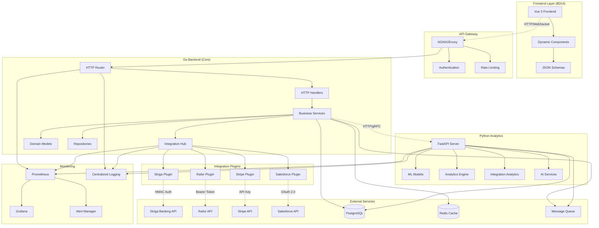
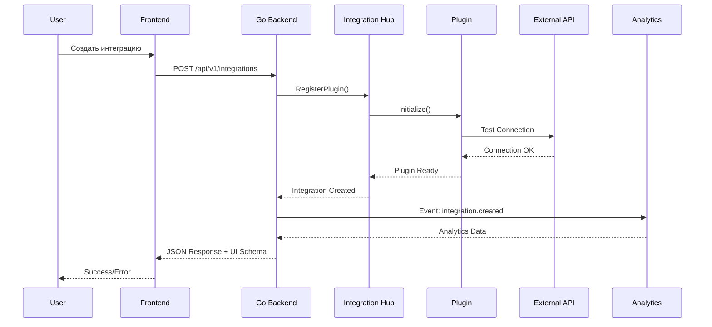
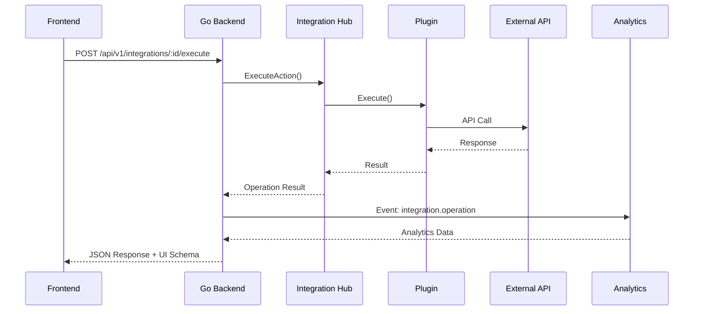
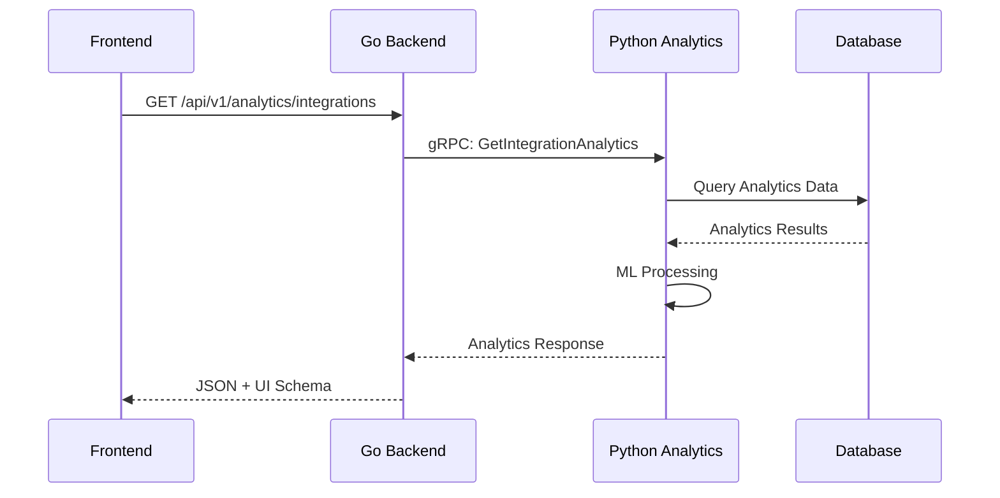

# Архитектура AMG Integration Bus

## Принципы архитектуры

1. **Разделение ответственности**: Go (ядро), Python (аналитика), Vue (рендер)
2. **Backend-Driven UI**: Frontend получает JSON-схемы от backend
3. **Микросервисная архитектура**: Независимые сервисы с четкими границами
4. **Event-Driven**: Асинхронная обработка через шину событий
5. **Plugin Architecture**: Расширяемая система интеграций

## Диаграмма архитектуры



## Компоненты системы

### 1. Go Backend (Ядро)

**Ответственность**: Бизнес-логика, валидация, управление состоянием, управление интеграциями

**Структура**:
- `transport/http` - HTTP обработчики
- `service` - Бизнес-логика
- `integration` - Модули интеграций
- `domain` - Доменные модели
- `data-access` - Репозитории

**Принципы**:
- Тонкие контроллеры
- Вся логика в сервисах
- Строгая типизация
- Централизованная обработка ошибок
- Plugin архитектура для интеграций

### 2. Integration Hub

**Ответственность**: Централизованное управление всеми интеграциями

**Функции**:
- Регистрация и управление плагинами
- Маршрутизация запросов к интеграциям
- Мониторинг состояния интеграций
- Кэширование результатов
- Обработка ошибок и retry логика

**Plugin Interface**:
```go
type IntegrationPlugin interface {
    Name() string
    Version() string
    Initialize(config map[string]interface{}) error
    Execute(action string, params map[string]interface{}) (interface{}, error)
    HealthCheck() error
    GetMetrics() map[string]interface{}
}
```

### 3. Python Analytics

**Ответственность**: Аналитика, ML, AI-интеграции, мониторинг интеграций

**Структура**:
- `app/api` - FastAPI endpoints
- `services` - Аналитические сервисы
- `integrations` - Аналитика интеграций
- `models` - ML модели
- `utils` - Утилиты

**Принципы**:
- Только аналитические задачи
- Pydantic для валидации
- Асинхронная обработка
- Изоляция от бизнес-логики
- Специализация на аналитике интеграций

### 4. Vue Frontend (BDUI)

**Ответственность**: Рендер UI по схемам от backend

**Структура**:
- `components` - Динамические компоненты
- `views` - Страницы приложения
- `stores` - Pinia stores для состояния
- `services` - API клиенты
- `types` - TypeScript типы

**Принципы**:
- Нет бизнес-логики
- Динамический рендер
- Универсальные компоненты
- Легкое тестирование
- Реактивность через Pinia

## Поток данных

### 1. Создание интеграции



### 2. Выполнение операции интеграции



### 3. Мониторинг и аналитика



## Безопасность

### 1. Аутентификация
- **Внутренние API**: JWT токены
- **Внешние интеграции**: OAuth 2.0, API ключи, HMAC
- **Frontend**: HTTP-only cookies

### 2. Авторизация
- RBAC (Role-Based Access Control)
- Middleware для проверки прав
- Контекстные разрешения для интеграций

### 3. Валидация
- Pydantic для Python
- Struct tags для Go
- JSON Schema для Frontend
- Валидация конфигураций интеграций

### 4. Шифрование
- TLS для всех соединений
- Шифрование чувствительных данных в БД
- Ротация API ключей

## Масштабируемость

### 1. Горизонтальное масштабирование
- Stateless сервисы
- Load balancing
- Database sharding
- Plugin изоляция

### 2. Кэширование
- Redis для сессий и кэша
- Application-level кэш
- CDN для статики
- Кэширование результатов интеграций

### 3. Асинхронная обработка
- Message queues для интеграций
- Event sourcing
- CQRS pattern
- Retry механизмы

## Мониторинг

### 1. Метрики
- Prometheus для сбора метрик
- Grafana для визуализации
- Custom dashboards для интеграций
- Метрики производительности плагинов

### 2. Логирование
- Structured logging (JSON)
- Centralized collection
- Log aggregation
- Корреляция логов интеграций

### 3. Трейсинг
- Distributed tracing
- Request correlation
- Performance monitoring
- Интеграционный мониторинг

### 4. Алерты
- Health checks для всех интеграций
- Алерты при ошибках
- SLA мониторинг
- Автоматическое восстановление

## Развертывание

### 1. Docker
- Multi-stage builds
- Health checks
- Resource limits
- Plugin контейнеры

### 2. Kubernetes
- Helm charts
- ConfigMaps/Secrets
- Auto-scaling
- Plugin deployment

### 3. CI/CD
- GitOps workflow
- Automated testing
- Blue-green deployment
- Plugin versioning

## Планы развития

### Краткосрочные (1-3 месяца)
1. Базовая архитектура и core функциональность
2. Интеграция с Striga и Railsr
3. Мониторинг и логирование
4. Базовые тесты

### Среднесрочные (3-6 месяцев)
1. Дополнительные интеграции (Stripe, Salesforce)
2. ML аналитика интеграций
3. Автоматическое масштабирование
4. Расширенный мониторинг

### Долгосрочные (6+ месяцев)
1. Marketplace плагинов
2. AI-powered оптимизация интеграций
3. Multi-tenant архитектура
4. Глобальное развертывание
