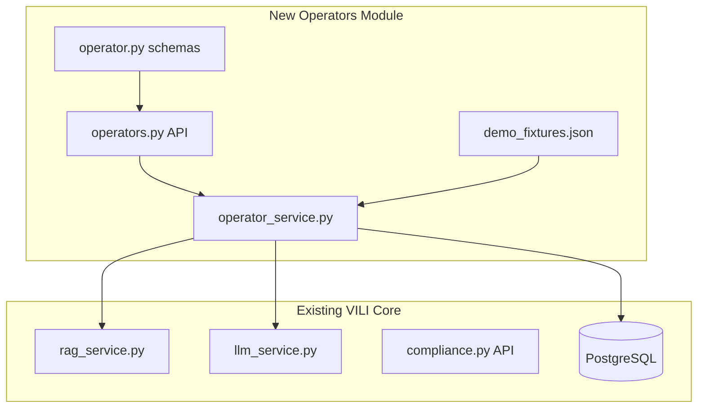

# Прототип модуля оценки операционистов для VILI

**Название:** Operator Analytics Module  
**Статус:** Завершён ✅  
**Дата создания:** 2 января 2026

---

## Обзор

Создание нового модуля оценки операционистов для VILI как изолированного расширения, которое не затрагивает существующий код. Модуль использует RAG и LLM для анализа эффективности сотрудников с учетом compliance-контекста.

---

## Статус задач

| ID | Задача | Статус |
|----|--------|--------|
| schemas | Создать Pydantic-схемы оператора (operator.py) | ✅ Завершено |
| demo-data | Подготовить демо-данные 3 менеджеров (demo_operators.json) | ✅ Завершено |
| service | Реализовать OperatorService с интеграцией RAG/LLM | ✅ Завершено |
| api | Создать API endpoints (operators.py) | ✅ Завершено |
| connect | Подключить модуль в main.py (1 строка) | ✅ Завершено |
| ui | Создать демо-dashboard для презентации | ✅ Завершено |
| tests | Написать тесты и документацию | ✅ Завершено |

---

## Архитектура решения

Новый модуль создан как **изолированное расширение** существующего VILI, следуя паттернам проекта.



---

## Принцип безопасности

**Правило: ни один существующий файл не модифицируется напрямую.**

| Действие | Как реализуем |
|----------|---------------|
| Добавление роутера | Новая строка в `main.py` через append |
| Новые таблицы БД | Отдельный migration-файл |
| Общие зависимости | Используем существующие из `core/` |

---

## Структура новых файлов

```
backend/app/
├── api/v1/
│   └── operators.py          # API endpoints
├── database/schemas/
│   └── operator.py           # Pydantic schemas
├── services/
│   └── operator_service.py   # Business logic
├── static/operators/
│   ├── index.html            # Dashboard UI
│   ├── css/operators.css
│   └── js/operators.js
└── tests/
    ├── fixtures/
    │   └── demo_operators.json  # Demo data
    ├── unit/
    │   └── test_operator_service.py
    └── integration/
        └── test_api_operators.py
```

---

## Этапы реализации

### Этап 1: Создание схем данных (День 1-2) ✅

Pydantic-схемы в `backend/app/database/schemas/operator.py`:

- `OperatorProfile` - профиль оператора (опыт, сертификаты, стаж)
- `OperatorMetrics` - метрики производительности
- `OperatorComplianceScore` - compliance-оценка
- `OperatorAnalyticsRequest` - запрос на анализ
- `OperatorAnalyticsResponse` - результат анализа с прогнозом

**Ключевые поля:**

```python
class OperatorMetrics(BaseModel):
    applications_processed: int
    avg_processing_time_min: float
    success_rate: float           # % успешных заявок
    compliance_score: float       # 0-1, учет 115-ФЗ
    red_flags_detected: int       # выявленные подозрительные операции
    false_negative_rate: float    # пропущенные red flags
```

---

### Этап 2: Демо-данные (День 2-3) ✅

Создан `backend/tests/fixtures/demo_operators.json`:

- 3 менеджера с разными профилями (junior, middle, senior)
- История обработки заявок за 30 дней
- Compliance-события (выявленные нарушения, пропуски)
- Сертификаты и обучение

---

### Этап 3: Сервисный слой (День 3-6) ✅

Создан `backend/app/services/operator_service.py`:

**Ключевые методы:**

1. `get_operator_analytics()` - агрегация метрик
2. `calculate_compliance_score()` - оценка с учетом 115-ФЗ
3. `generate_performance_forecast()` - прогноз через LLM
4. `get_recommendations()` - рекомендации через RAG

**Интеграция с существующими сервисами:**

```python
from app.services.rag_service import RAGService
from app.services.llm_service import LLMService

class OperatorService:
    def __init__(self, db: Session):
        self.rag = RAGService(db)
        self.llm = LLMService()
```

---

### Этап 4: API Endpoints (День 6-8) ✅

Создан `backend/app/api/v1/operators.py`:

| Endpoint | Метод | Описание |
|----------|-------|----------|
| `/operators` | GET | Список операторов с метриками |
| `/operators/{id}/analytics` | GET | Детальная аналитика |
| `/operators/{id}/forecast` | POST | Прогноз производительности |
| `/operators/{id}/compliance` | GET | Compliance-оценка с 115-ФЗ |
| `/operators/compare` | POST | Сравнение операторов |
| `/operators/recommendations` | POST | Рекомендации через RAG+LLM |

---

### Этап 5: Подключение модуля (День 8) ✅

Единственное изменение в существующем коде - добавление в `backend/app/main.py`:

```python
from app.api.v1 import operators
# ...
app.include_router(operators.router, prefix="/api/v1/operators", tags=["operators"])
```

---

### Этап 6: UI для демонстрации (День 9-10) ✅

Создан `backend/app/static/operators/`:

- Dashboard с метриками операторов
- Графики производительности
- Compliance-индикаторы
- Прогнозы и рекомендации

---

### Этап 7: Тестирование и документация (День 11-12) ✅

- Unit-тесты для `operator_service.py`
- Integration-тесты для API
- Docstrings по стандарту Google

---

## Compliance-контекст (115-ФЗ)

Модуль учитывает:

1. **Compliance Score** - % операций без нарушений
2. **Red Flags Detection Rate** - эффективность выявления подозрительных операций
3. **False Negative Rate** - пропущенные сигналы (критично для 115-ФЗ)
4. **Время реакции на алерты** - соответствие регламентам

---

## Интеграция с RAG

Используем существующий `rag_service.py` для:

1. Поиска документов сотрудников (резюме, сертификаты)
2. Контекста правил 115-ФЗ для рекомендаций
3. Исторических кейсов для обучения

---

## Переход к реальным данным

После демонстрации:

1. Создаем адаптер для внешнего софта заказчика
2. Добавляем таблицы в PostgreSQL (migration)
3. Заменяем демо-fixtures на реальные источники

---

## Критерии успеха демонстрации

За 2 недели показываем:

- ✅ Анализ 3 операторов с разными профилями
- ✅ Прогноз производительности на следующий месяц
- ✅ Compliance-оценка с учетом 115-ФЗ
- ✅ Рекомендации по обучению/перераспределению
