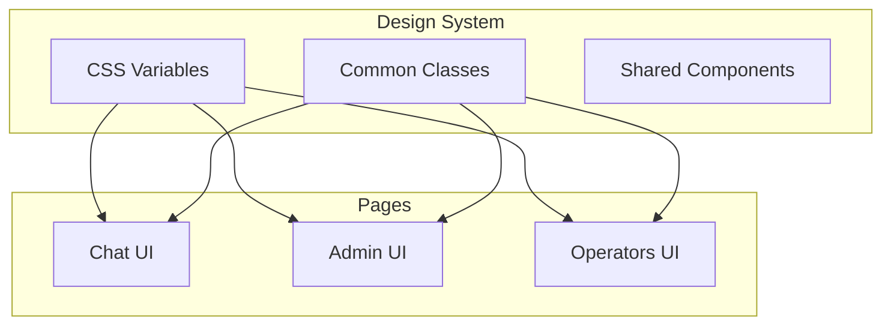

# План редизайна UI VILI с Glassmorphism

## Анализ текущего состояния

Три интерфейса с разными стилями:

- **Chat** ([backend/app/static/chat/css/chat.css](backend/app/static/chat/css/chat.css)) — светлая тема, градиенты
- **Admin** ([backend/app/static/admin/css/admin.css](backend/app/static/admin/css/admin.css)) — светлая тема, CSS-переменные
- **Operators** ([backend/app/static/operators/css/operators.css](backend/app/static/operators/css/operators.css)) — темная тема, JetBrains Mono

Основная проблема: отсутствие единой дизайн-системы.

---

## Архитектура новой дизайн-системы



---

## Фаза 1: Создание базовой дизайн-системы

### 1.1 Создать общий CSS-файл `common.css`

Расположение: `backend/app/static/css/common.css`

Содержимое:

- CSS-переменные для светлой/темной темы
- Glassmorphism-миксины
- Базовые компоненты (кнопки, карточки, инпуты)
```css
:root {
  /* Glassmorphism */
  --glass-bg: rgba(255, 255, 255, 0.1);
  --glass-border: rgba(255, 255, 255, 0.2);
  --glass-blur: 16px;
  
  /* Dark theme (default) */
  --bg-primary: #0a0a0f;
  --bg-secondary: #12121a;
  --bg-card: rgba(30, 30, 45, 0.7);
  --text-primary: #f1f5f9;
  --text-secondary: #94a3b8;
  --accent: #6366f1;
  --accent-glow: rgba(99, 102, 241, 0.4);
}

.glass-card {
  background: var(--glass-bg);
  backdrop-filter: blur(var(--glass-blur));
  -webkit-backdrop-filter: blur(var(--glass-blur));
  border: 1px solid var(--glass-border);
  border-radius: 16px;
}
```


### 1.2 Переключатель темы

Добавить JS-логику для переключения `data-theme="light"` / `data-theme="dark"` на `<html>`.

---

## Фаза 2: Редизайн Chat UI

### 2.1 Glassmorphism для сообщений

Файл: [backend/app/static/chat/css/chat.css](backend/app/static/chat/css/chat.css)

Изменения:

- Тёмный gradient-фон вместо светлого
- Сообщения как glass-карточки
- Glow-эффекты для кнопок
- Skeleton loading вместо точек
```css
body {
  background: linear-gradient(135deg, #0a0a0f 0%, #1a1a2e 50%, #16213e 100%);
}

.message-content {
  background: rgba(255, 255, 255, 0.08);
  backdrop-filter: blur(12px);
  border: 1px solid rgba(255, 255, 255, 0.1);
}

.btn-primary {
  background: linear-gradient(135deg, #6366f1 0%, #8b5cf6 100%);
  box-shadow: 0 0 20px var(--accent-glow);
}
```


### 2.2 Анимации и микро-взаимодействия

- Hover-эффект с glow для карточек
- Появление сообщений с blur-in анимацией
- Pulse-эффект для typing indicator

---

## Фаза 3: Редизайн Admin UI

### 3.1 Карточки источников с glassmorphism

Файл: [backend/app/static/admin/css/admin.css](backend/app/static/admin/css/admin.css)

Изменения:

- Тёмный фон
- Карточки источников как glass-элементы
- Цветовая индикация типа источника (glow)
- Модальные окна с blur-фоном

### 3.2 Улучшенная форма добавления

- Floating labels
- Glass-стиль для инпутов
- Прогресс-индикатор загрузки файлов

---

## Фаза 4: Адаптация Operators UI

Файл: [backend/app/static/operators/css/operators.css](backend/app/static/operators/css/operators.css)

Операторская панель уже тёмная — нужны минимальные изменения:

- Добавить glassmorphism для карточек операторов
- Унифицировать CSS-переменные с `common.css`
- Добавить glow-эффекты для метрик

---

## Фаза 5: Дополнительные улучшения

### 5.1 Новые компоненты

- **Toast notifications** — glass-стиль с slide-in анимацией
- **Skeleton loaders** — для асинхронной загрузки
- **Progress bars** — с gradient и glow

### 5.2 Респонсивность

- Проверить все breakpoints
- Mobile-first подход для стеклянных эффектов (отключение blur на слабых устройствах)

---

## Структура файлов после изменений

```
backend/app/static/
├── css/
│   └── common.css          # NEW: Общая дизайн-система
├── chat/
│   ├── css/chat.css        # MODIFY: Glassmorphism
│   └── js/chat.js          # MODIFY: Theme toggle
├── admin/
│   ├── css/admin.css       # MODIFY: Glassmorphism
│   └── js/admin.js
└── operators/
    ├── css/operators.css   # MODIFY: Унификация
    └── js/operators.js
```

---

## Технические ограничения

- `backdrop-filter` не поддерживается в Firefox < 103
- Fallback: полупрозрачный фон без blur
- Производительность: ограничить количество blur-элементов на экране