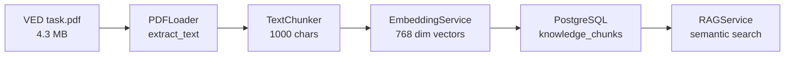

# Импорт VED task.pdf в базу знаний

## Текущее состояние

Система RAG уже реализована:

- [pdf_loader.py](backend/app/integrations/knowledge/loaders/pdf_loader.py) - извлечение текста из PDF
- [text_chunker.py](backend/app/integrations/knowledge/chunkers/text_chunker.py) - разбивка на chunks (1000 символов, overlap 200)
- [knowledge_source_service.py](backend/app/services/knowledge_source_service.py) - сервис управления источниками
- API endpoint `POST /api/v1/knowledge-sources/upload`

## Архитектура импорта



## План работ

### 1. Создать скрипт импорта

Создать скрипт [backend/scripts/import_ved_knowledge.py](backend/scripts/import_ved_knowledge.py) для импорта PDF с расширенными метаданными:

```python
# Метаданные для ВЭД источника
metadata = {
    "category": "ved",
    "domain": "compliance", 
    "document_type": "methodology",
    "source_name": "Методология ВЭД"
}
```

### 2. Расширить схему метаданных (опционально)

Добавить категорию в [knowledge_source.py](backend/app/database/schemas/knowledge_source.py) для фильтрации:

```python
class KnowledgeSourceCreate(BaseModel):
    category: Optional[str] = None  # "ved", "compliance", "sanctions"
```

### 3. Выполнить импорт

- Загрузить `VED task.pdf` через скрипт или API
- Проверить количество созданных chunks
- Протестировать поиск по ВЭД-терминам

### 4. Интегрировать в чат-ассистента

Обновить [chat.py](backend/app/api/v1/chat.py) для автоматического использования RAG при запросах по ВЭД:

```python
# При обнаружении intent "ved_question" - искать в базе знаний
if intent in ["ved_question", "compliance_question"]:
    context = await rag_service.search_knowledge(query, source_ids=[ved_source_id])
```

## Ожидаемый результат

- PDF разбит на ~200-500 chunks (зависит от плотности текста)
- Каждый chunk имеет embedding 768 размерности
- Ассистент может отвечать на вопросы по ВЭД с опорой на методологию
- Фильтрация по категории "ved/compliance" для точного поиска
